#### **本周工作情况：**

##### **1.Dapper学习及使用**（完成）

##### **2.MQTT学习及使用**（完成）

##### **3.Dapper&MQTT保证数据一致性Demo（批量增、删、改）**（完成）

##### 4.跨服务事务一致性学习（saga)（未完成）

#### 计划下阶段任务：

##### 1.了解oes各个模块业务逻辑，上层：王锐师兄，下层：丽俊师兄，App：子若姐，重点了解流程，不慌搭建微服务

##### 2.继续学习微服务划分原则和示例，根据领域驱动设计（DDD）及师兄师姐的理解划分各模块构建微服务蓝图

##### 3.了解数据池化技术，斟酌数据库选用

### Dapper入门及使用

##### ORM（对象关系映射）轻量级框架：数据库持久化技术，池化技术

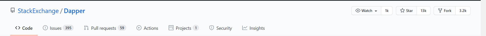

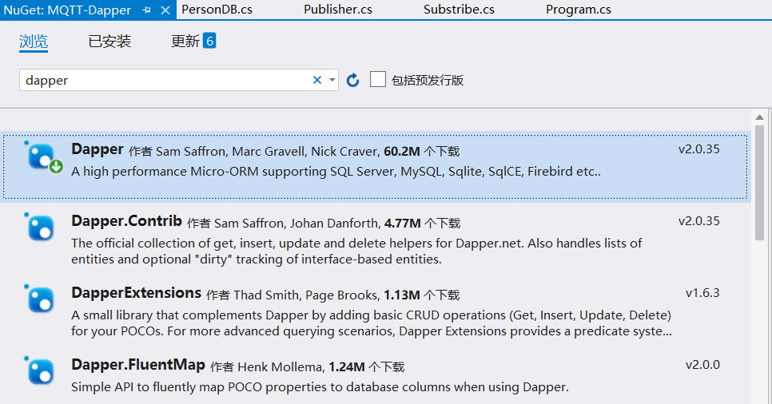

##### EF框架加载树：

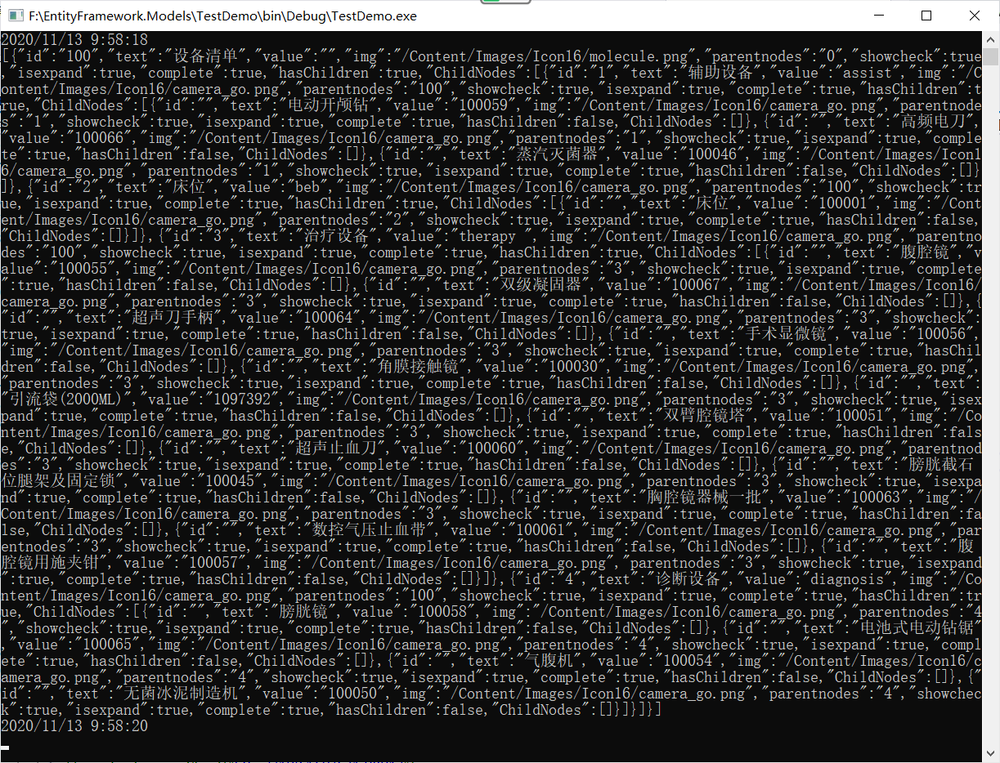

##### Dapper加载树：

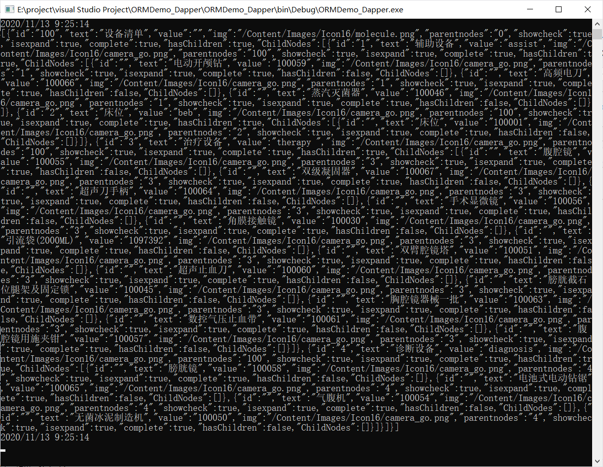

### MQTT学习及使用

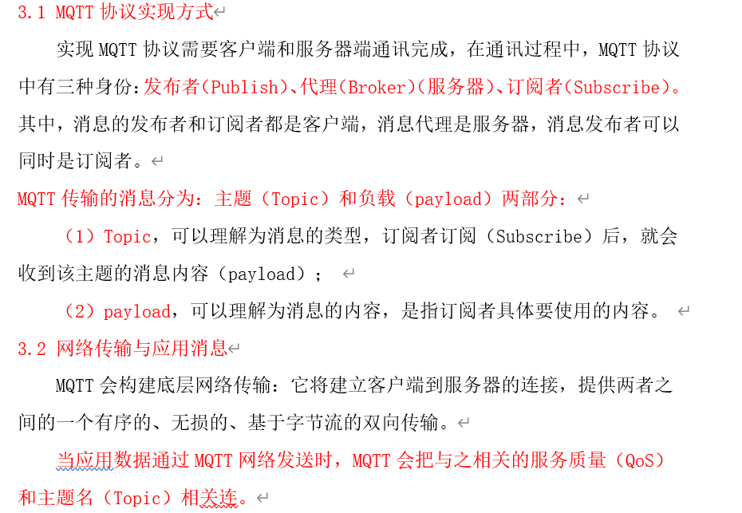

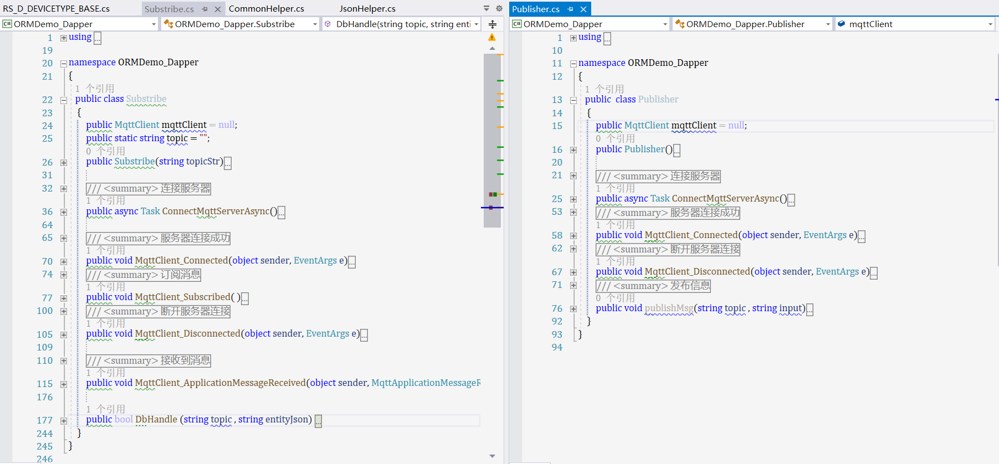

### MQTT&Dapper保证跨数据库的数据一致性

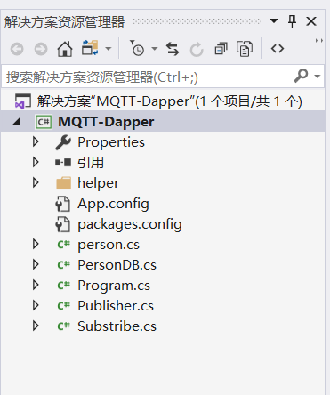

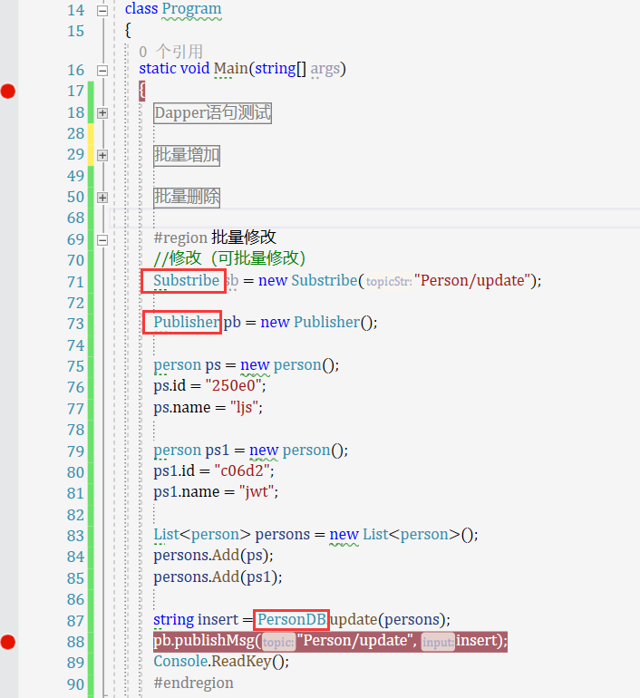

##### 使用EMQ可视化界面作为代理来管理mqTT的客户端及主题、订阅、发布

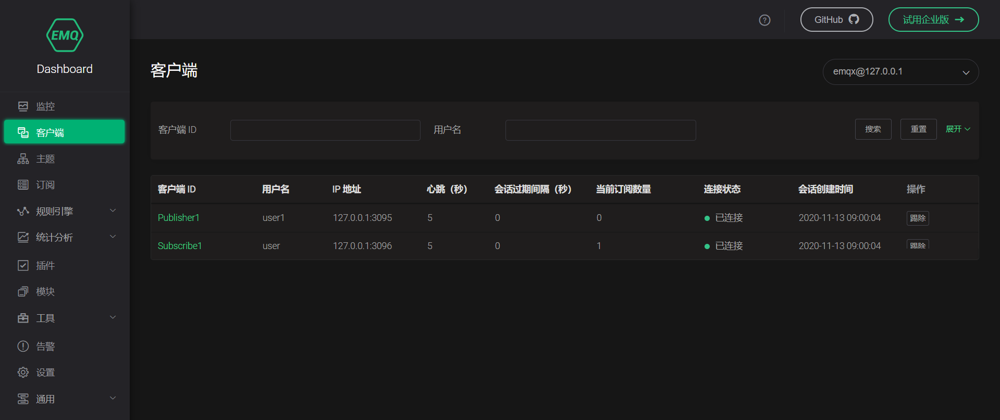

##### 批量增加

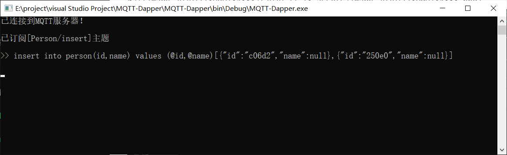

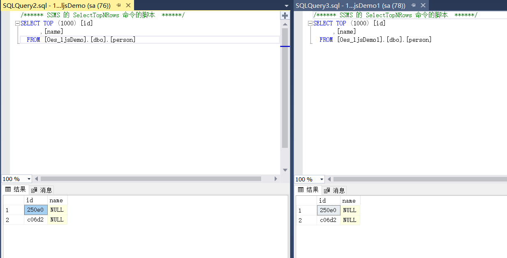

##### 批量修改

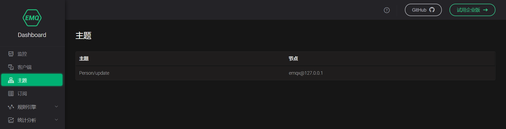

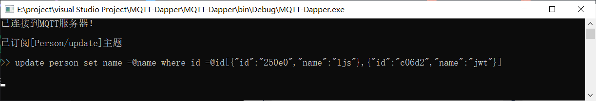

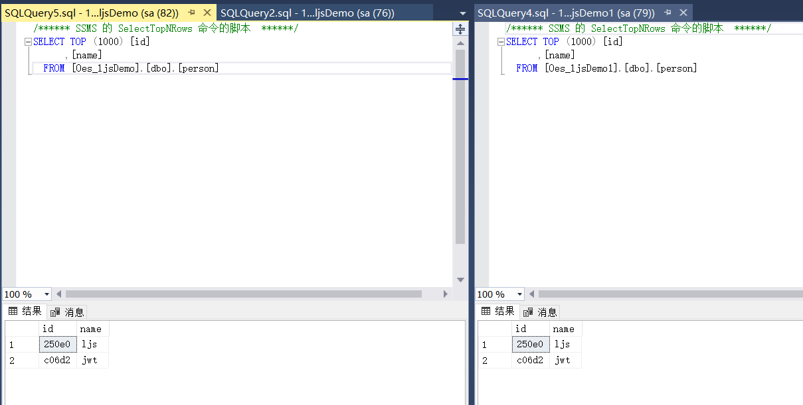

##### 批量删除

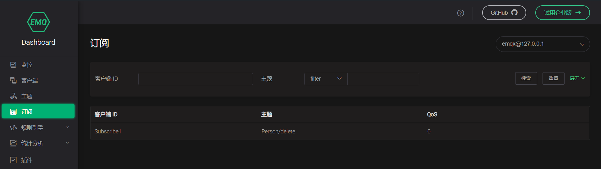

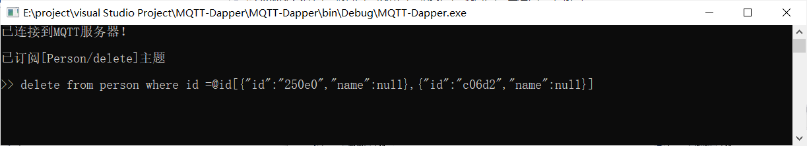

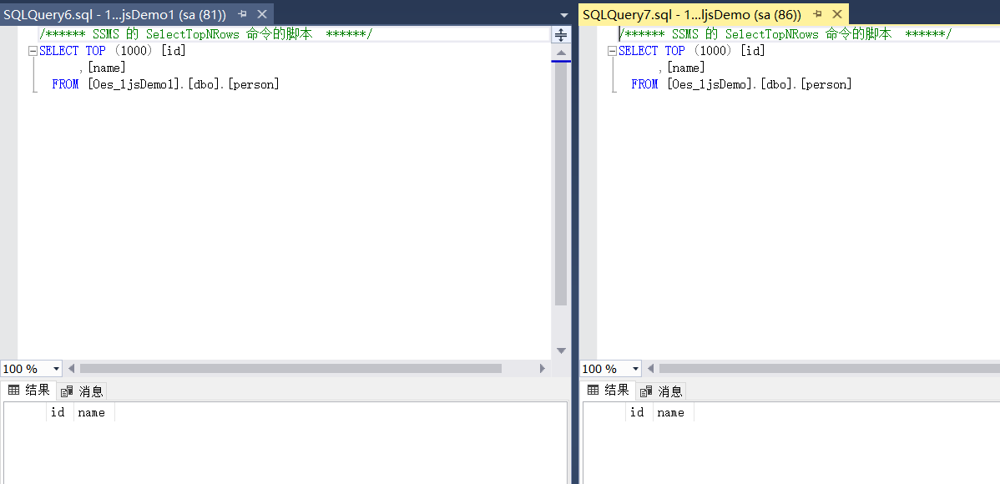