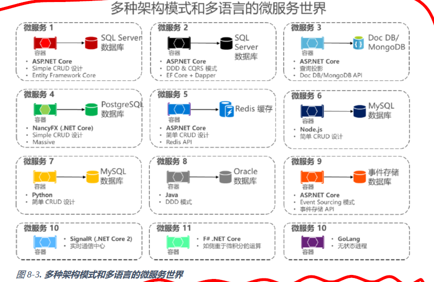
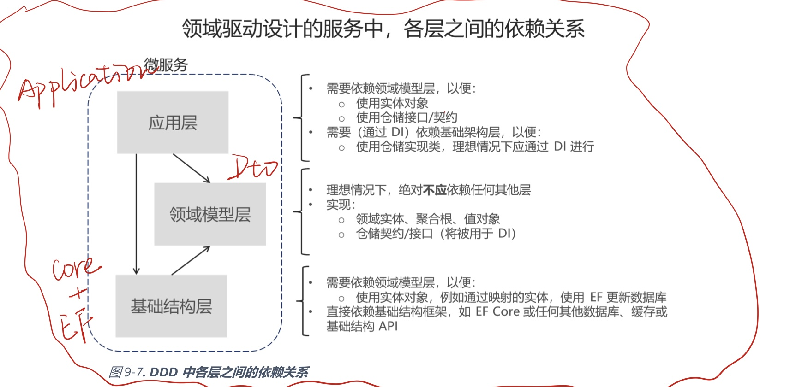

### 2020.11.16微服务继续学习

##### Docker数据卷技术

数据卷是指从主机操作系统映射到容器的目录。当容器中的代码访问这些目录时，实际上是在访问主机操作系统中的文件夹。这些目录并没有绑定到容器本身的生命周期中，它们能被直接运行在主机操作系统中的代码访问，或被其他同样映射了该目录的容器访问。因此，数据卷按照设计可独立于容器生命周期来实现数据的持久存储。如果从docker主机删除容器或镜像，数据卷中的数据并不会被删除，其中的数据依然能从主机操作系统访问。

##### 微服务架构

每个微服务负责实现一个特定的端到端领域，或有着确定边界的业务逻辑，并且每个微服务必须能独立开发和部署。每个微服务应该拥有自己特定的领域数据模型和领域逻辑（自治和去中心化的数据管理），它们是基于不同数据存储技术（SQL、NoSQL）和不同编程语言实现的。

**重点是要创建低耦合的服务**，只要它们之间没有太多直接依赖，就应该使它们尽可能地小。

微服务架构提供了长期的敏捷性，微服务可以基于多个独立部署的服务来创建应用。

微服务另一个优势在于能够独立地进行横向扩展。而不是一起将本不需要扩展的其他功能区域也进行扩展。难点：如何在多个层级设计并实现安全性：认证、授权、密文密码管理和安全通信等。

##### 微服务的数据自治

A与B子系统都会调用C实体的属性和数据，而它们是隶属于不同上下文边界的。这样的原则在DDD里也是类似的，每个限界上下文、自治的子系统或服务必须拥有自己的领域模型（数据+逻辑+行为）。

中心化数据库：同一张地图满足徒步旅行、长途汽车旅行和学习地理知识的需求；都支持ACID原则和SQL语言。

当业务流程跨越多个微服务时，最终一致性是唯一的办法，这比写一个简单的SQl连接要复杂的多，同理，很多其他关系型数据库功能也不支持跨微服务使用。

基于微服务的应用通常会混合使用SQL和NoSQL数据库，这种做法有时会被称为混合数据持久化。

##### 微服务和限界上下文模式的关系

每个BC必须有自己的模型和数据库。

##### 逻辑架构和物理架构

确定了业务微服务或限界上下文，但不意味这最佳实现方式就是为每个业务微服务创建单独的服务（例如作为一个ASP.NET Web API）或单独的Docker容器。

业务微服务或限界上下文必须自主地进行代码和状态的独立版本控制、部署和扩展。

##### 分布式数据管理的挑战和解决方案

###### 定义微服务边界：

关注应用的逻辑领域模型和相关数据

###### 创建从多个微服务获取数据的查询：

需要一种方式来聚合信息；

API网关、CQRS查询/读取表：此时复杂的查询将变成巨大的挑战，为此可以使用CQRS方案：在不同数据库中创建一个只用作查询的非规范表，这种方式不仅解决了最初的问题（如何跨微服务查询和联接），与复杂的SQL联接语句相比还能进一步提升性能，因为应用所需的数据已经在查询表里了；

中心数据库的“冷数据”：将“热数据”导出为“冷数据”储存到报表专用的大型数据库中。为了同步数据，可以采用事件驱动通信，如果使用事件驱动通信的方式，整合流程将与上文提到的使用CQRS查询表获取数据的方式相似。

然而，在设计上需要不断从多个微服务里进行聚合数据并进行复杂查询，那么通常在遇到此类问题后，我们也许会考虑合并微服务。

###### 在多个微服务之间实现一致性

使用基于异步通信，如集成事件（消息和基于事件的通信）的最终一致性。根据CAP理论，我们需要在可用性和强ACID一致性之间做出选。大多数微服务场景要求高可用性和高扩展性，而非强一致性。开发人员可以使用弱一致性或最终一致性的技术来做到强一致性。这也是大多数基于微服务的架构所采取的方法。

此外，ACID风格或两步式提交事务违背了微服务原则，跨服务和数据库维护数据的一致性非常重要。需要在微服务之间使用事件驱动通信和发布订阅系统来实现最终一致性。

###### 在多个微服务之间通信

在多个微服务间创建了长串的同步HTTP调用，应用最终将会碰到问题：阻塞和性能低下。

因为这可能会产生一种争议：这实际上是一种单体式应用，它的进程间是基于HTTP的，而没有使用进程内通信机制。

为了促进微服务的自治并获得更高的弹性，应该减少使用跨服务的链式请求/响应通信。建议微服务间的通信只使用异步交互，例如使用基于消息或时间的异步通信。

###### 识别微服务的领域模型边界

虽然微服务应该尽可能地趋向于小型化，但识别每个微服务的模型边界不是为了尽可能拆成细粒度，而是根据领域知识来进行最有意义的划分。重点不在于大小，而在于业务需要。另外，如果因为存在庞大复杂的依赖关系而要求应用的某个领域有清晰的一致性的需求，这也就表明该领域应该是一个独立的微服务。

因此，BC会帮助澄清哪里需要特定的领域术语，以及哪里需要把系统拆分成额外的不同领域BC。

然而也有些具有不同形态但却共用相同标识的实体，它们存在于多个微服务所包含的多个领域模型中。例如会议管理微服务中有一个用户实体，该实体所对应的同一个用户，在订单微服务里被称为买家，在支付微服务里名为付款方，而在客户服务微服务里称作客户。这是因为基于每个领域专家使用的通用语言，会对同一个用户有不同视角，甚至包含不同属性。会议管理微服务里的用户实体应该包含最多的个人数据属性，但是同一个用户在支付微服务里的买家标识和客户服务里的客户标识就不需要那么多属性了。 

每个领域模型里的用户实体可能有不同的补充细节。因此需要某种方式把一个领域的用户实体映射到另一个领域中。

##### 客户端微服务直连和API网关模式

直连有弊端：如何处理跨界限问题，例如授权、数据传输和动态请求派发：为每个微服务实现安全和界限问题，例如安全性和授权机制，一种可能的方法是把这些服务放进Docker主机或内部集群中，再通过一个中间位置，例如API网关来解决跨界限问题。

有时要从响应中去掉移动端不需要的数据，还要压缩数据，所以这样的场景下，在移动端和微服务之间使用外观模式或API就变得很方便了。

使用API网关：

我们可以使用单一的自定义API网关服务来面对多个不同客户端应用，但这会造成巨大的风险，因为API网关服务会随着客户端应用需求的变化而增长并演化，最终它会因为需求的变化而变得臃肿，在效果上将会等同于单体应用或服务。因此我们极力推荐将API网关拆分成多个服务或者小型的API网关，每个API网关都有自己的形式。

我们应该创建多个API网关，以便为每种客户端需求实现不同外观，略有差异的API，甚至可能基于客户端展现形式或设备来实现特定的适配代码，这些代码在底层调用多个内部的微服务。

通常来说，使用一个API网关将应用中所有内部微服务聚合在一起，这种做法并不明智。因此，API网关应该基于业务边界来拆分，而不是作为整个应用的一个聚合器。

在这单独的一层中，我们也可以过滤内部微服务的API，或者在已发布的API上添加授权。

网关模式的不足之处：如果API网关包含自定义逻辑和数据集成，就会要求额外的开发成本和未来的维护成本。如果API网关只使用了安全性、日志管理和版本管理功能，这些额外的开发工作便不会发生。

##### 微服务之间的通信

###### 通信类型

客户端代码或消息发送者通常不需要等待响应，只要把消息发送给RabbitMQ队列或其他消息代理即可。

例如事件驱动架构里的发布/订阅机制。

###### 异步整合方式增强微服务自治

**微服务间的交互越少越好，核心规则是微服务间的交互需要异步**，微服务间通过异步传输来通信，但不要依赖于其他内部微服务作为自己HTTP请求/响应的一部分。

每个微服务应以自治以及对客户端可用为目标，即使作为端到端应用一部分的其他服务发生故障或不稳定也应如此。如果需要从一个微服务调用其他微服务（如发起HTTP请求来查询数据）为客户端应用提供响应结果，那么这样的架构在其它微服务发生故障时就变得不稳定。

如果最初的微服务需要原本在别的微服务里拥有的数据，不要依靠同步请求来获取数据。而是通过最终一致性（通常通过集成事件）方式来复制或传输这些数据到最初的微服务的数据库中。

为了获得最终一致性，可以使用任何协议在微服务之间异步地通信来获取数据。重点在于：不要在微服务间创建同步依赖。

##### 异步消息通信

跨越多个微服务以及相关领域模型传送变化时，使用异步消息和事件驱动的通信至关重要。一种解决方案是基于异步消息传递和事件驱动的最终一致性。

尽可能遵循另一个规则：只在内部服务间使用异步消息传递，只在从客户端应用到前端服务（API网关 

加上第一级微服务）间使用同步通信。

多接受者消息通信

使用发布/订阅机制；异步事件驱动通信；

##### 创建、改进和控制微服务API的版本和契约

**即便初始版本的契约已经考虑的很周全了，随着时间发展，服务的API也可能需要改变。如果发生了变化，尤其是被多个客户端应用调用的公共API，通常无法强制所有客户端升级到新的API契约。通常这需要增量部署服务的新版本，同时也要让老版本和新版本服务契约同时运行。因此，服务的版本策略很重要。**

**有时我们需要对服务API进行不兼容的大版本更新。因为不能强制客户端应用或服务立刻升级到新版，服务端必须支持老版本继续运行一段时间。如果使用基于HTTP的机制，一种方式是把API的版本号嵌入URL或HTTP头部。然后可以决定是在一个服务里同时实现两个版本的API，或是部署不同的服务来各自处理一个版本的API。此时一种较好的方法是采用中介者模式如MediaR库将不同版本的实现用不同的处理器来处理。Hypermedia是用来进行服务版本化和改进的最佳选择。**

##### 微服务的可发现性和服务注册

使用Marathon和Kubernetes和DC/Os处理服务实例的注册和撤销。另一个例子是Service Fabric，它也提供了开箱机用的命名服务来实现服务注册。

##### 创建基于多个微服务组合界面，其中包括由微服务生成的可视化UI外观和布局

微服务架构通常始于服务端的数据处理和逻辑。但一种更先进的方式是设计基于微服务的应用界面，这以为这我们拥有一个由多个微服务生成的组合界面，而不是由一个单体客户端应用来调用服务器上的微服务。采用这种方式的微服务能够完整地包括逻辑和可视化展现。

单体客户单调用多个微服务的过程，这些微服务仅仅关注逻辑和数据，而不关注界面展现。

##### 微服务的适应性和高可用性

意外故障的处理是个大难题。云端系统必须能够接受故障并尝试自动从故障中恢复。通过策略重新发送消息或重新发起请求，使用诸如Polly库的断路器。

##### 微服务的运行状况管理和诊断

微服务必须报告他的运行状态和诊断信息，采用同意的统一日志格式。使用healthchecks库，以便微服务能向监控服务报告状态来执行合适的操作。

##### 编排引擎管理运行状况和诊断信息

稳定的协作系统，不仅要创建微服务架构，还需要具备高可用性、可寻址能力、适应性、运行状况和诊断机制等。

##### 编排高扩展和高可用的多容器微服务

必须使用编排引擎。组合应用的负载均衡、路由和编排。我们需要一个能按需自动启动、挂起或关闭容器的管理平台，理想情况下还要能控制资源的访问（例如网络和数据存储）。

集群和编排引擎；调度器；Docker Swarm

##### 第六章

**应该通过功能来划分微服务：微服务应该彼此独立，如果不能交付独立的应用程序功能块，那么划分只能增加复杂性。**

我们可以先创建一个单体应用程序，以后再划分成若干功能，开发并部署成微服务。

把应用程序划分成多个离散的进程还会带来开销方面的问题。而把功能划分成多个不同进程会进一步增加复杂性，通信协议也会变得更复杂，必须在服务间使用异步通信，事件总线处理、弹性消息和重试，最终一致性等。

##### Docker支持

右键项目，点击Add，然后选择docker support即可。这个模版会给项目添加一个dockerfile，同时还会添加一个新的docker-compose项目，它提供了初始的docker-compose.yml文件。

##### 第七章 将传统的单体.NET Framework应用程序迁移到Windows容器中

##### 开发环境和生产环境

大多数情况下，我们通常希望应用程序依赖的微服务也运行在同一台Docker主机或Swarm上，这样可以让开发工作变得更容易一些，同时可以降低网络延迟。在这样的配置中，微服务实例与用户持久化数据存储的高可用服务器之间的通信成本是唯一的通信成本。

##### 第八章 

##### 应用规范

返回HTML /JSON / XML响应为请求提供服务。应用程序支持各种客户端，包括桌面浏览器、web应用程序、移动web应用程序和原生移动应用程序。该应用程序可能会暴露API供第三方使用，他还能异步集成微服务或外部应用程序，以便在局部故障的情况下让微服务顺利恢复。

应用程序由下列类型的组件组成：

- 展示组件
- 应用程序业务逻辑
- 数据库访问逻辑
- 应用集成逻辑 主要基于消息代理的消息通道

应用程序需要具备较高的可扩展性，同时允许其垂直子系统自动扩展，必须能够部署在多种基础设施环境中，并且最好应该是跨平台的。

##### 选择架构

尽可能使用异步方式

微服务开发和部署为彼此独立的容器。这意味着开发团队可以在不影响其他子系统的情况下开发和部署某个微服务。

每个微服务有自己的数据库，并与其他微服务完全解耦。必要时，使用应用程序级集成事件（通过逻辑事件总线），如命令查询职责分离（CQRS）实现来自不同微服务的数据库间一致性。因此，业务约束必须包含多个微服务和相关数据库之间的最终一致性。

##### 通信架构

- 客户端与微服务的直接通信
- 异步事件通信

如果需要，每个微服务可使用不同TCP端口，在生产模式中，该URL将映射到微服务的负载均衡器，负载均衡器将请求分发到可用的微服务实例。

不打算创建可能影响微服务自动部署的单体API网关，但如果要设计包含数十个微服务的大型微服务应用，强烈将以考虑API网关模式。

##### 每个微服务的数据主权

每个微服务拥有自己的数据库或数据源，每个数据库或者数据源会部署一个为单独的容器，这种设计只是为了让开发人员能够轻松获取和克隆github代码，使用数据源容器都可以让开发人员在几分钟内构建并部署，数据库应该是基于云端数据库服务器或本地数据库服务器，而不是容器中。

##### 基于微服务的解决方案的优点

- 每个微服务相对较小-易于管理和改进
- 可以扩展应用程序的各个区域
- 可以将多个团队间的开发工作分开
- 问题的隔离程度更高
- 更方便使用最新技术

##### 微服务解决方案的缺点

- 分布式应用 开发人员必须使用诸如http或amqp等协议实现内部服务通信，这增加了测试和异常处理的复杂性，还增加了系统的延迟
- 部署的复杂性 需要能为每个服务创建多个实例
- 原子事务 多个微服务间的原子事务通常是不可能实现的，业务需求必须包含多个微服务间的最终一致性。
- 全局资源需求增加
- 客户端与微服务的直连通信问题 在某些情况下，客户端应用程序可能需要通过大量单独的请求来组成用户界面，这在互联网上可能是低效的，客户端应用程序对后端系统的请求应尽可能最少。微服务可能使用了非标的Web协议或者二进制协议或者AMQP消息，这些协议通常会被防火墙屏蔽，因此最好只在内部使用。可能会考虑使用多个细粒度的API网关。
- 分割微服务 我们需要确定应用程序与其他区域解耦并具有低数量硬依赖的区域。这与应用与类的单一职责原则类似，即：只能处于一个原因更改某个特定的类。最重要的是：微服务必须完全自治、端到端，有自己的数据源。

##### 外部与内部架构和设计模式

**每个微服务可以基于不同设计模式具有不同内部架构。并非所有微服务都应使用先进的DDD模式来实现，因为这可能导致过度设计。**

##### 新世界：多种架构模式和多语言微服务

软件架构师和开发人员会使用不同的架构模式，例如混合架构风格和架构模式：

- 简单的CRUD，单层
- 传统N层
- 领域驱动设计N层
- 干净架构
- 命令和查询职责分离（CQRS）
- 事件驱动架构（EDA）

重点在于：没有任何一种架构模式或风格，以及任何一种特定技术，能够适用于所有情况。

可以用不同方式实现每个微服务，每个微服务可能具有不同架构模式，并根据应用程序的性质、业务需求和优先级使用不同的语言和数据库。

可以用不同方式实现每个微服务，每个微服务可能具有不同架构模式，并根据应用程序的性质、业务需求和优先级使用不同的语言和数据库。因为每个子系统的上下文边界和要求通常是不同的。

**对于简单的CRUD维护应用程序，设计和实现DDD模式可能没什么意义。但对于核心领域或核心业务，可能需要应用更先进的模式来应对业务规则不断变化的业务复杂性。**

**我们不可能用“一种架构模式来解决所有问题”。根据优先级，必须为每个微服务选择不同方法。**

##### ASP.NET Core和Web API控制器中的依赖注入

在ASP.NET Core中，我们可以使用开箱即用的依赖注入DI。此时不需要设置第三方控制反转容器IOC，但如果需要，可以将首选Ioc容器插入到ASP.NET Core基础架构中，在这种情况下，这意味着可以通过控制器的构造函数直接诸如所需的EF DBContext或其他仓储库。

将DbContext类注册到服务的Ioc容器中，通常可以在startup类中通过configureservices方法调用service.addDbcontext<Dbcontext>（）方法执行此操作。

##### 在ASP.NET Web API中实现版本控制

**更新webapi以处理新的需求是一个相对简单的过程，但是必须考虑这种更改对调用web api的客户端应用程序产生的影响，虽然设计和实现web api的开发人员可以完全控制该api，但开发人员对可能由第三方组织远程构建的客户端应用程序没有相同程序的控制权。**

**版本控制使Web api能够指示其暴露的功能和资源。然后，客户端应用程序便可想特定版本的功能或资源提交请求。实现版本控制有几种方法：**

- **URi版本控制**
- **查询字符串版本控制**
- **Header版本**

**因为URL版本是最简单明确的，使用URI版本控制的话，可以向每个资源的URI添加一个版本号。现有URI应该向以前一样继续运行，返回与请求的版本相匹配的模式的资源。**

**可以使用web api中的Route属性来设置版本[Route("api/v1/[controller]")]**

##### 在微服务（集成事件）之间实现基于事件的通信

事件总线可以设计为一个接口，包括订阅和取消订阅事件以及发布事件所需的API，还可以具有基于任何进程间或消息通信的一个或多个实现，如消息队列或支持异步通信以及发布/订阅模型的服务总线。

使用事件来实现跨服务的业务事务，借此在服务间保持最终一致性。

一旦要决定进行异步和事件驱动的通信，应该选择最符合生产环境需求的服务总线产品。

##### 集成事件

不建议在多个微服务间共享一个通用的集成事件库，这样做会将这些微服务与单个事件定义数据库相结合。不这样做的原因与不建议在多个微服务中共享通用的领域模型相同：微服务必须完全自治。

在微服务中共享的应该是：最终的应用程序块，nuget组件共享的工具库，例如json序列化程序。

##### 在发布到事件总线时设计原子性和弹性

这两个操作一定要以原子性的方式执行，CAP定理任务，我们无法构建同时满足持续可用、强一致，并且能容忍任何分区这三个特征的数据库，此时只能从这三个特征中选择两个来实现。

如果服务在数据库更新后崩溃，可以使用一下方式来处理此问题：

- 使用完整的事件溯源模式
- 使用事务日志挖掘
- 使用发件箱模式

可能无法完全实现完整的ES系统，ES意味着只将领域时间存储在事务数据库中，而非存储当前的状态数据。然而实施完整的ES系统需要重新构建系统的大部分内容，并引入很多其他复杂性和要求。但并非最简单的解决方案，除非已经溯溪事件溯源模式。

使用事务日志挖掘的方案，必须将微服务耦合到RDBMS事务日志。

一个折中的办法是将事务数据库表和简化的ES模式组合使用。尝试将事件发布到事件总线，如果发布操作成功，将在原始服务中启动另一个事务。

如果事件总线中的发布事件操作失败，数据在原始微服务中不会不一致。

如果已经在使用关系型数据库，则可以使用事务表来存储集成时间。要在应用程序中实现原子性，可以使用基于本地事务的两步过程。基本上我们需要在存储领域实体的数据库中有一个integrationevent表，该表用作实现原子性的保证，以便将持久集成事件包括在提交领域数据的相同事务中。

因此循序渐进的步骤如下：应用程序开始本地数据库事务，然后更新领域实体状态，并将事件插入集成事件表中，最后提交事务，即实现所需的原子性。

在提交事务后立即发布集成事件，并使用另一个本地事务将表中的事件标记为已发布。

##### 通过事件总线发布集成事件时实现原子性

事件日志表与原始数据库操作进行原子更新，对同一数据库使用本地事务。如果有任何操作失败，将抛出异常，并对所有已完成的操作执行事务回滚，从而保持领域操作与发送的事件消息间的一致性。

##### 更新消息事件中的幂等性

幂等性意味着可以多次执行操作而不改变结果。在消息传递环境中传播事件时，如果可以多次传送事件而不改变接收者微服务的结果，则事件是幂等的。

重要的是，即使同一订单完成事件有重复的消息事件，也只需要在其他系统中更新订单信息一次。

让每个事件具有某种类型的标识是种方便的做法，我们可以创建强制每个接收者对每个事件只处理一次的逻辑。

##### 删除重复的集成事件消息

方法之一是使用正在用的消息架构提供的重复数据删除功能，另一种方法是在目标微服务中自定义逻辑。在传输层面和应用层面进行验证是最好的选择。

##### 使用Rabbitmq时删除重复消息

消息接收者必须准备好处理这些重复的消息。如果可能，接收方应以幂等的方式处理消息，这比用删除重复数据的方式直接处理消息更好。

Rabbitmq会在再次传送时将其设置为“redelivered"标志，因此只有在消息中设置了”redelivered“标志时，接收方才需要以幂等方式对消息进行重复数据删除或处理消息。

##### 在微服务中运用简化的CQRS和DDD模式

- 查询：返回结果且不改变系统状态，即查询是没有副作用的
- 命令：改变系统状态

CQRS例如用一个物理数据库来读取，一个物理数据库用来写入（更新）。

CQRS的分离是指将查询操作组合在一层，而命令组合到另一层的做法。这两层可以包含在相同物理层级或微服务里，也可以在不同微服务或进程中实现，以便单独优化和独立地横向扩展，避免彼此干扰。

毕竟我们的目标是让查询来的更灵活，而不是像聚合那样通过DDD模式的约束对查询进行限制。

##### 将CQRS和CQS方式应用到DDD微服务中

DDD模式不是普遍适用的，它们会为设计引入约束，这些约束提供了诸如随着时间推移进一步提高质量等好处，特别是会改变系统状态的命令和其他代码可以从中获益中。但是这些约束增加了读取和查询数据的复杂性。

本书建议仅在微服务的事务/更新区域使用DDD模式，查询可以遵循更简单的方法，并且应按照CQRS方法与命令分离。

为实现查询层，有多种方式可以选择，例如使用EF Core/AutoMapper映射、存储过程、视图、物化视图等全面的ORM，或者使用微型ORM。

我们使用Dapper这样的微型ORM来实现直接查询。

##### CQRS和DDD模式不是顶级架构

值得强调的是，每种情况强行使用相同模式将导致失败，不要在任何地方都使用CQRS和DDD。很多子系统、限界上下文或微服务都比较简单，很容易用简单的CRUD服务或其他方式来实现。

##### 在CQRS微服务中实现读取/查询

订单微服务的查询是独立于DDD模型和事务实现的。写入执行的事务必须符合领域逻辑，另一方面，查询是幂等的，可从领域规则中分离出来。

只需简单地查询数据库以获取UI所需数据，然后返回一个动态ViewModel，而不需要在任何位置明确定义，但SQL语句除外。

实际上，ViewModel类就是Dto呗。

##### 使用独立于领域模型约束且专为客户端应用创建的ViewModel

因此可以根据查询返回的数据为客户端专门创建返回类型，这些模型或数据传输对象（DTO）成为ViewModel。

返回的数据（ViewModel）可以是连接数据库中多个实体或表的数据结果，也可以是事务领域模型中定义的多个聚合结果。这种情况下，因为正在创建独立于领域模型的查询，所以聚合的边界和约束可以彻底忽略，我们可以自由的查询需要的任何表和列。这种方法为开发人员创建或更新查询提供了极大的灵活性和生产力。

ViewModel可以是在类中定义的静态类型，或者可根据执行的查询来动态创建，这对开发人员来说非常的灵活。

##### 动态与静态的ViewModel

大部分情况下，可汇总来自多个领域实体的数据，并根据客户端应用需要的数据精确组合ViewModel。

优点：敏捷、直截了当快速响应未来变化

缺点：动态类型会降低清晰度甚至影响服务和客户端应用的兼容性。

##### 预先定义的DTO类作为ViewModel

经验之谈：起初使用动态ViewModel开发，因为开发非常敏捷。然而一旦开发稳定了，基于前面描述的原因，我们选择重构这个主题，并为ViewModel使用静态的或预先确定的DTO类。

##### 设计面向DDD的微服务

领域驱动设计（DDD）主张根据和用例相关的实际业务来建模。它也提出了多种技术概念和模式来支持其内部实现，例如丰富模型领域实体、值对象、聚合根规则。

在实现DDD方法时有陡峭的学习曲线。以便划清业务问题并使用相同的业务术语（统一语言）。此外DDD方式应该只用于实现拥有重要业务规则的复杂微服务。诸如CRUD服务等简单的任务可使用更简单的方法管理。

如何确定边界是设计和定义微服务的关键任务。DDD模式可以帮助我们理解领域的复杂性。识别和定义用来模型化该领域的实体、值对象和聚合。构建并提炼在一个定义上下文边界的领域模型。

##### 保持相对较小的微服务上下文边界

最开始需要创建尽可能小的微服务，其次需要避免微服务间无谓的通信。这两个目标相互制约，需要权衡。尽可能将系统拆分成多个小型的微服务，直到尝试拆分新的界限上下文而出现快速增长的边界通信时即可停止拆分。内聚是独立界限上下文的关键。

如果两个微服务需要很多协作，它们应该成为同一个微服务。

另一种看待这种情况的方法是自主权。如果一个微服务必须依靠其他服务来直接处理请求，那么就不是真正的自治。

##### DDD微服务中的分层

领域实体包含在领域模型层内部，并且不应传送到不属于它的区域，比如表现层。

ViewModel是一个仅为满足表现层需要的数据模型。领域实体不直属于ViewModel，相反，需要在ViewModel和领域实体之间互相转换。

##### 领域模型层

说白了感觉就是Core，也就是poco。负责表达业务概念、业务状态信息及业务规则。但反映业务情况的状态是由本层控制并使用的，领域模型层是业务软件的核心。

这意味着一个重要的规则：领域模型实体类应该就是POCO。

领域实体不应对任何数据访问基础框架如EF有任何直接的依赖。理想情况下，领域实体不应该继承自或实现任何基础框架里的任何类型。

理解数据的物理模型和如何映射到实体对象模型依然很重要。

##### 应用层

定义软件要完成的任务，并只会表达领域概念的对象来解决问题。应用层要尽量简单，不包含业务规则或知识，只为下一层中的领域对象协调任务，分配工作，使它们相互协作。即为用户或程序显示某个任务的进度。

表示应用层必须不包含业务规则或领域知识，这些内容应该有领域模型类库所拥有。应用层必仅协调任务而不能保留或定义任何领域状态（领域模型）。

应用层将业务规则的执行委托给领域模型类本身，最终在那些领域实体中更新数据。

##### 基础架构层

基础架构层用于将最初保留在内存中的领域实体汇总的数据持久化到数据库或其他持久存储中。

在绝对不产生框架强依赖的前提下确保领域模型实体类和用来持久化数据的基础架构无关。即仅有实现软件核心的POCO实现类，并且与基础架构技术完全解耦。

因此层或类库以及项目应该最终依赖与领域模型层（库）。

每个微服务的基础架构层设计应该是独立的，如前所述，可以按照DDD模式实现复杂微服务，而用更简单的方法实现简单数据驱动微服务（单层的简单CRUD）。