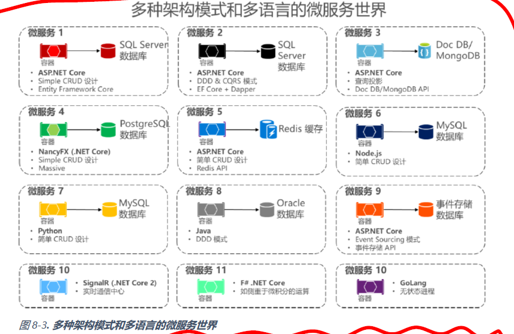
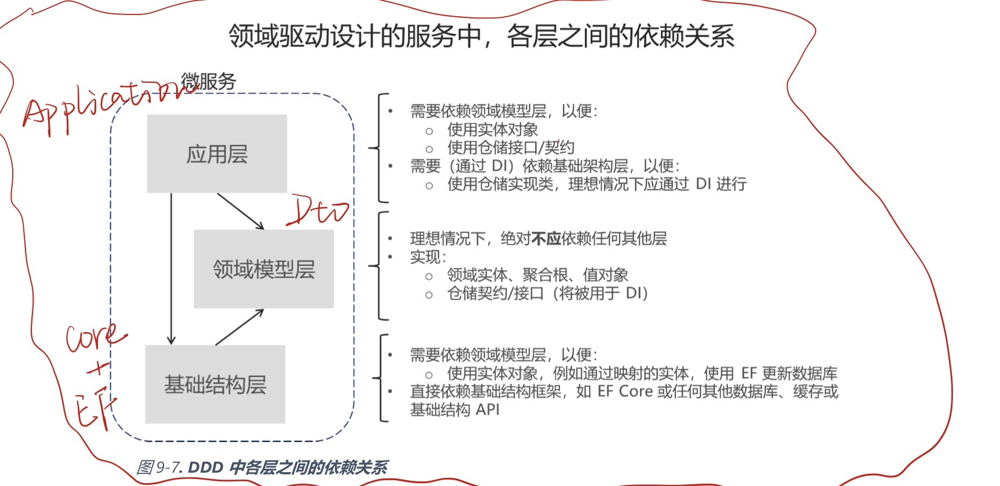

### 2020.11.17微服务划分原则

- ##### 独立运行、独立部署和持续交付

  - **应该通过功能来划分微服务：微服务应该彼此独立，如果不能交付独立的应用程序功能块，那么划分只能增加复杂性。**
  - 划分微服务的目标应该是每个微服务可以单独的运行，单独的测试，不依赖其他的微服务，以便在大型项目开发中达到持续交付的目的，否则拆分微服务就失去意义了。  
  - 例如：子若姐的设备点检模块部分的微服务，**划分为点检项配置和点检计划自动制定两个微服务，两个微服务可以单独的运行，只要无参调用或者给参数调用就能跑。**

- ##### 每个微服务对应一个数据库（也可以没有数据库）

  - **每个微服务有自己的数据库，并与其他微服务完全解耦。**
  - 为每个微服务分配数据库，保证该微服务对其下数据库的支配权，数据库中的表应该包括微服务用到的所有表结构和实体，并且在其他微服务出现次数尽可能少（可以出现，如此就需要用MQTT或Rabbitmq保证数据的最终一致性）。
  - 例如：**点检项配置微服务有4个表，点检计划自动指定微服务有4个表，有一个表相同，但另外的表只有对应微服务在使用，其他微服务无法干涉**。

- ##### 微服务划分粒度

  - 没有标准定义，个人认为：1.**可以按照数据库的独立性来划分微服务**（即：被剥离出来的a数据库，理论上只有A微服务可以调用，其他微服务不行）2.**可以按照实现的功能层面来划分微服务**（根据简单的CRUD构成了一个复杂/简单的功能，即：点检项的配置和点检计划的制定）3.在满足以上的情况下，**不建议划分过小的微服务**，例如简单的C、R、U、D划分为四个，那么在微服务调用时就会因为进程间调用造成极大的通信成本，另外微服务的搭建也十分繁琐，这是不合适的）

- ##### 关于DDD原则划分微服务

  - 书中建议我们，并不是所有的微服务都需要使用DDD原则来划分和构建。**每个微服务可以基于不同设计模式具有不同内部架构。并非所有微服务都应使用先进的DDD模式来实现，因为这可能导致过度设计。对于简单的CRUD维护应用程序，设计和实现DDD模式可能没什么意义。但对于核心领域或核心业务，可能需要应用更先进的模式来应对业务规则不断变化的业务复杂性。**我们不可能用“一种架构模式来解决所有问题”。根据优先级，必须为每个微服务选择不同方法。

  

  - 个人理解：**我们使用的ABP四层框架实际上就是按照DDD原则进行CRUD和构建复杂功能的框架。**

  

  - 在拆分的过程中，**我们还应该考虑，是否有一些被拆分出去的微服务，它用不上DDD**，诸如简单的CRUD，以及不涉及聚合数据、提取表中特定数据的Dto构造，我们就可以使用简单的单层或其他形式来进行该微服务的构建，以达到最适合该微服务搭建的目的。

- ##### 低耦合

  - 重点是构建低耦合的微服务，如果我们发现A微服务在运行的过程中会**频繁的调用B微服务**，那么我们**可能会考虑将A微服务和B微服务进行组合**。以解耦提高内聚，降低通信成本，降低出现故障的可能。
  - **微服务间的交互越少越好**，核心规则是微服务间的交互需要异步