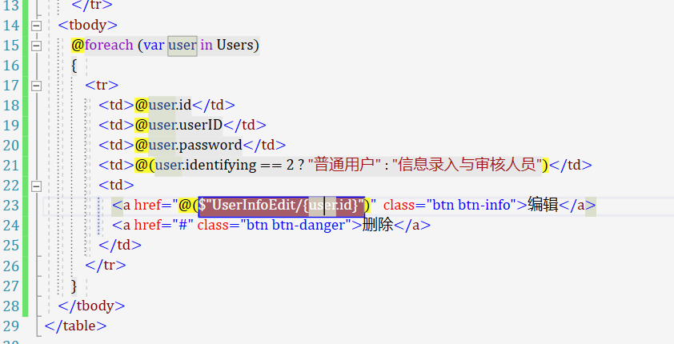
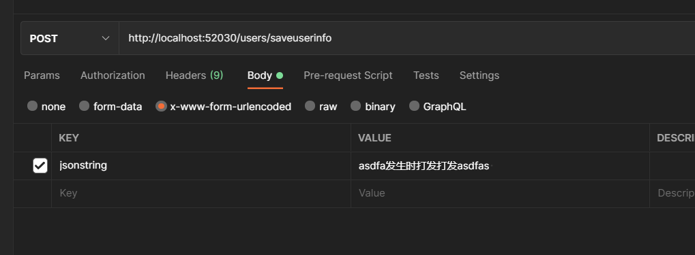
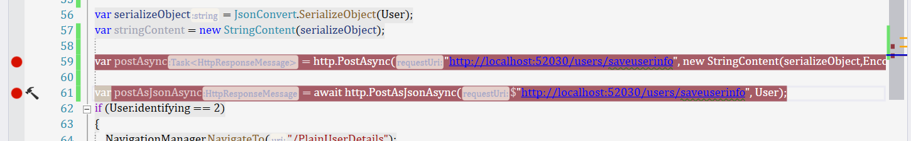
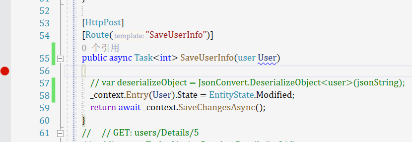

###  Blazor学习文档

调用webapi

- httpclient
- ihttpclientfactory

数据绑定

- 单项绑定

- 双向绑定

  - ```html
    <input @bind = "CurrentValue" />
    
    <input @bind = "CurrentValue" @bind:event  = "oninput"
    ```

```html
<h1>单向绑定</h1>
<div>
    <h2>@Apsdetail.ProductBornCode</h2>
    <h2>@Apsdetail.ProcedureCode</h2>
</div>

<div>
    <h3>@Apsdetail.ProductBornCode</h3>
    <h3>@Apsdetail.ProcedureCode</h3>
</div>

<hr />

<h1>双向绑定</h1>
<div>
    <h3>产品出生证</h3>
    <input @bind="@Apsdetail.ProductBornCode" />
    <h3>工序编号</h3>
    <input @bind="@Apsdetail.ProcedureCode" />
</div>

<h2>不同的触发event:</h2>
<div>
    <h3>产品出生证</h3>
    <input  @bind="@Apsdetail.ProductBornCode" @bind:event="oninput"/>
    <h3>工序编号</h3>
    <input @bind="@Apsdetail.ProcedureCode" @bind:event="oninput" />
</div>

<div>
    <button @onclick="@button_click">click</button>
</div>

```

EditForm

- input组件
  - inputtext
  - inputtextarea
  - inputnumber
  - inputselect
  - inputdate
  - inputcheckbox
- 数据绑定
- 数据验证


界面携值跳转




在webapi中

记得指定route属性

如果没有fromform的话  post优先为从url传过来的数据

如果指定了fromform的话 


blazor通过post传过来的东西



在webapi中直接通过实体来接收就好了!!!



