### docker学习

- docker概述

- docker安装

- docker命令
  - 镜像命令
  - 容器命令
  - 操作命令
  - ...
- docker镜像
- 容器数据卷
- dockerfile
- docker网络原理
- idea整合docker

以上单机版本docker

- 集群 docker compose
- docker swarm  简化版k8s
- ci/cd jenkins


docker概述

开发--上线 两套环境 应用环境，应用配置

开发人员   运维人员

开发即运维！

环境配置麻烦，每个机器都要部署环境（集群redis、es、hadoop...）费事费力

发布项目 jar（redis mysql jdk es） war 


jar带上环境进行发布，项目能不能带上环境安装打包

之前在服务器配置一个应用的环境 redis mysql jdk es hadoop ，配置超麻烦，不能跨平台

windows与linux

传统：开发提供jar 运维部署环境

现在：开发打包部署上线，一套流程做完


docker给以上的问题，提出解决方案


java---apk---发布（应用商店） ---张三使用apk ---安装即可用

java---jar（环境）---打包项目带上环境（镜像） ----docker仓库：商店 ---- 下载我们发布的镜像 --直接运行即可


docker思想就来自于集装箱！

jre---多个应用 （端口冲突）---原来都是交叉的

隔离：Docker核心思想，打包装箱！每个箱子都是互相隔离的！


docker通过隔离机制，可以将服务器利用到极致


本质：所有的技术都是因为出现了一些问题，我们需要去解决，才去学习。


docker历史

容器化技术命名就是docker

刚刚诞生的时候没有引起行业注意！dotcloud，开源

开源，docker优点


在容器技术出来之前，我们都是使用虚拟机技术，

虚拟机：在windows中装一个虚拟机软件vmware，通过这个软件我们可以虚拟出来一台或者多台电脑！笨重！

虚拟机：也是属于虚拟化技术，docker容器技术，也是一种虚拟化技术


```shell
vm：linux centos 原生镜像（一个电脑） 隔离：需要开启多个虚拟机  几分钟
docker：隔离  镜像机制（最核心的环境 4m +jdk+mysql）十分小巧，运行镜像就可以了 几M 几s
```


docker是基于go语言开发的！开源

docker的文档超级详细

仓库地址：pull push


docker能干嘛

之前的虚拟机技术！

从内核到库函数到app

虚拟机技术缺点：

1.资源占用十分多

2.冗余步骤多

3.启动很慢


容器化技术

容器化技术不是模拟一个完整的操作系统


比较docker和虚拟机技术的不同：

- 传统虚拟机，虚拟出一个硬件，运行一个完整的操作系统，然后再这个系统上安装和运行软件
- 容器内的应用直接运行在宿主机的内，容器是没有自己的内核的，也没有虚拟我们的硬件，所以就轻便了
- 每个容器间互相隔离，每个容器内都有一个属于自己的文件系统，互不影响


devops

更快速的交付和部署

传统：一堆帮助文档，安装程序

docker：一键运行，打包镜像，发布测试

更便捷的升级和扩缩容

使用了docker之后，我们部署应用就和搭积木一样


springboot1.5  redis5 tomcat8


项目打包为一个镜像，扩展，服务器A！开服务器B，做扩展

更简单的系统运维

在容器化之后，我们的开发，测试环境高度一致

更高效的利用计算资源：

1核 2g的服务器！

docker是内核级别的虚拟化，可以在一个物理机上可以运行很多的容器实例，服务器的性能可以运行到极致


docker的基本组成

镜像：image  就是一个类，好比一个模版，可以通过这个模版来创建容器服务，tomcat镜像-->run----->tomcat01容器（提供服务） 通过这个镜像可以创建多个容器（最终服务或者项目运行就是在容器中）

容器：container   docker利用容器技术，独立运行一个或者一个组应用，通过镜像来创建的。启动、停止、删除、基本命令！目前就可以吧容器理解为就是一个简易的linux系统

仓库：respository  仓库就是存放镜像的地方 仓库分为公有仓库和私有仓库！ dockerhub 阿里云 都有容器服务器（配置镜像加速）！


安装docker

1.需要linux基础

2.centos7 

3.使用xshell连接远程服务器进行操作


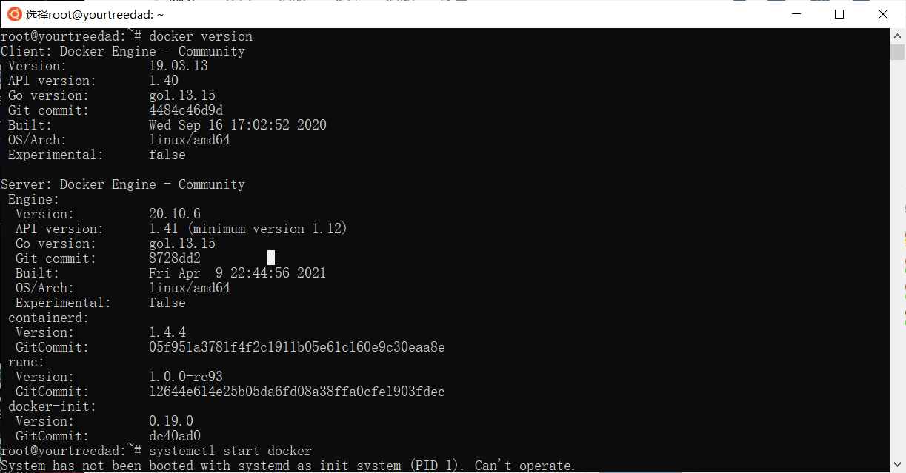


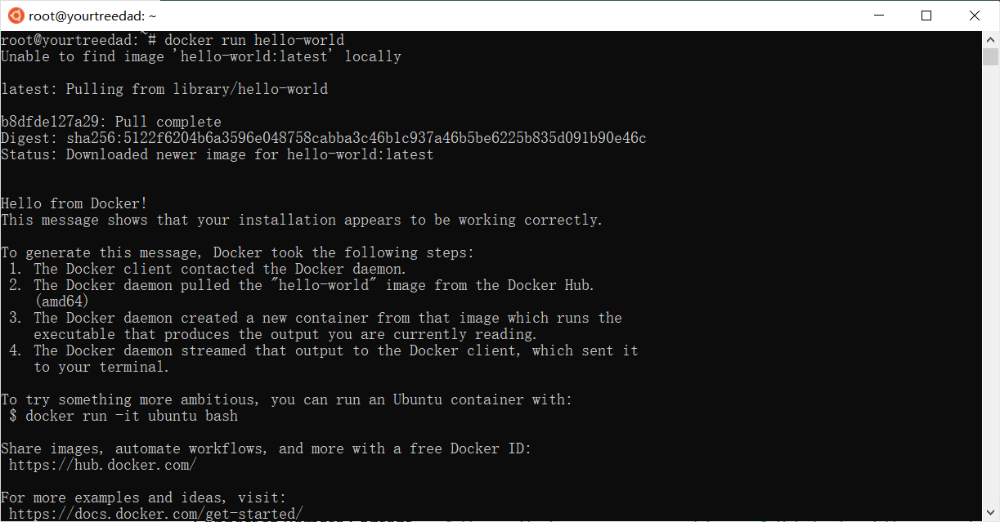


查看一下下载的这个hello-world镜像

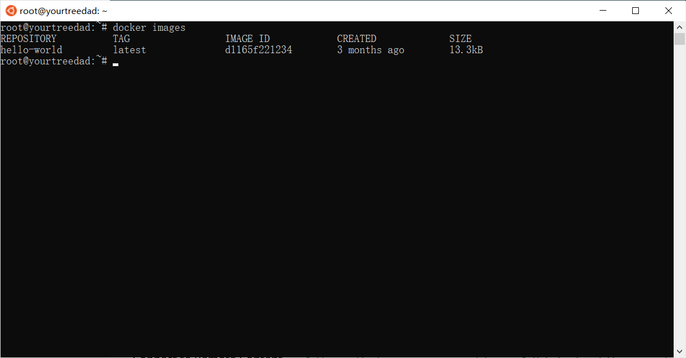


阿里云镜像加速

1.登陆阿里云

2.容器镜像服务

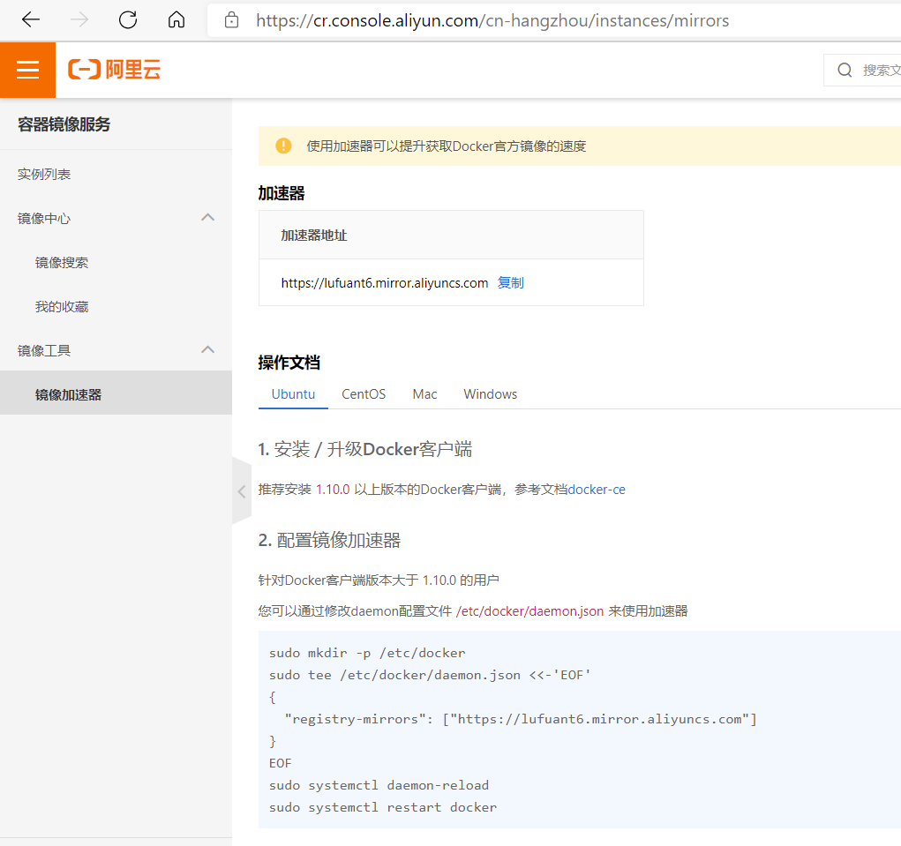


3.配置使用

```shell
sudo mkdir -p /etc/docker
sudo tee /etc/docker/daemon.json <<-'EOF'
{
  "registry-mirrors": ["https://lufuant6.mirror.aliyuncs.com"]
}
EOF
sudo systemctl daemon-reload
sudo systemctl restart docker
```


回顾helloworld流程

开始-->本地寻找镜像-->如果有就使用这个镜像运行，如果没有就去仓库下载pull


底层原理

docker怎么工作的

docker是一个client--server结构的系统，docker的守护进程运行在主机上，通过socket从客户端访问

dockerserver接收到docker-client的指令，就会执行这个命令


docker为什么比vm快

1.docker有着比虚拟机更少的抽象层

2.docker利用的是宿主机的内核，vm需要guest OS

所以新建一个容器的时候， docker不需要像虚拟机一样重新加载一个操作系统内核，避免引导。虚拟机是加载guestOS，分钟级别的，而docker是利用宿主；机加的操作系统，省略了这个复杂的过程，妙级的


docker的常用命令

帮助命令

docker version

docker info

docker 命令 --help


镜像命令

```shell
docker images
docker search 
docker pull
docker rmi 
```

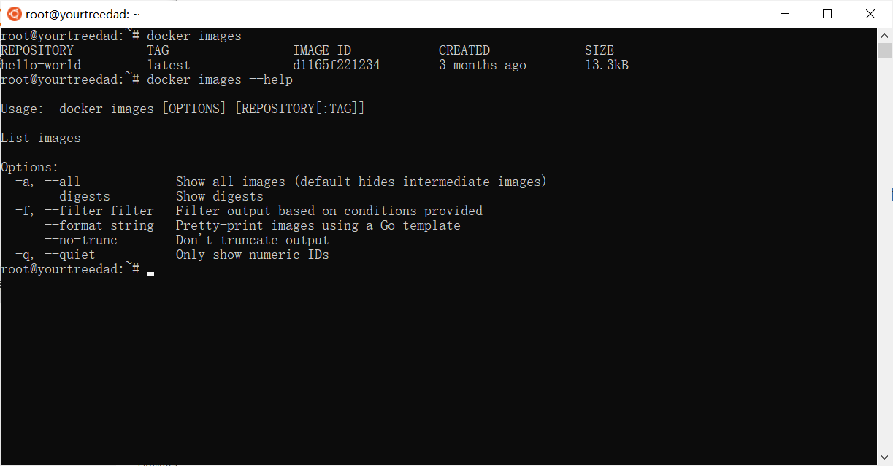


容器命令

```shell
docker pull centos
```


新建容器并启动

```shell	
docker run [] image
--name ="" 容器名字

-d 后台方式运行
-i  使用交互方式运行， 进入容器查看内容 
-t
-p 指定容器的端口-p 8080:8080

主机端口：容器端口
-p 容器端口
-p ip：主机端口：容器端口

exit 从容器中退回主机
docker ps 列出所有运行容器
-a 所有正在运行的容器+运行过的容器
-n=? 显示最近创建的容器
docker ps -q 只显示容器的编号

```


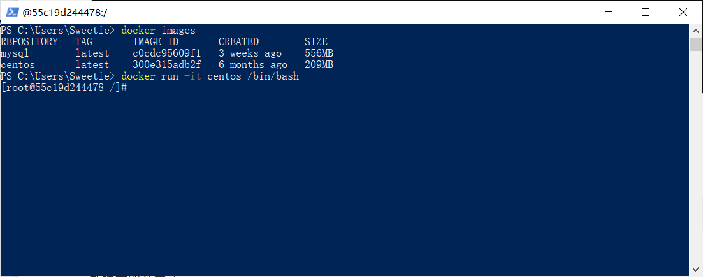


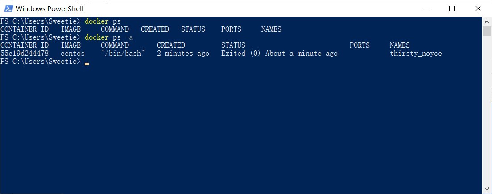


退出容器

```shell
exit 退出容器，并停止
ctrl+P+Q
```


删除容器

```shell	
docker rm 容器id		
docker rm -f $(docker ps -aq)

```

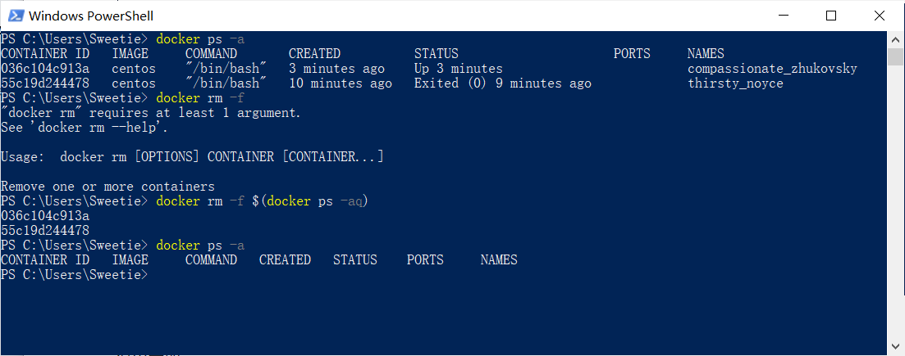


启动停止容器

```shell
docker start 容器id
docker restart 容器id
docker stop 容器id
docker kill 容器id
 
```

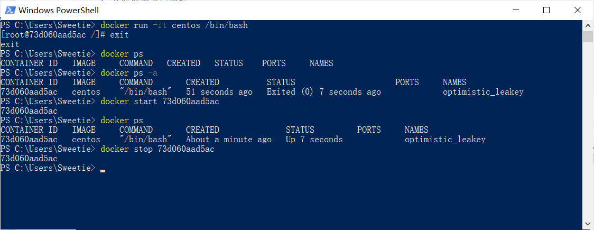


常用其他命令


后台启动

```shell
docker run -d centos 
docker容器使用后台运行，就必须要有一个前台进程，docker发现没有应用，就会自动停止

dockerlogs 
```


查看容器当中的进程信息

```shell
docker top 命令
docker inspect 容器id 查看容器信息
```

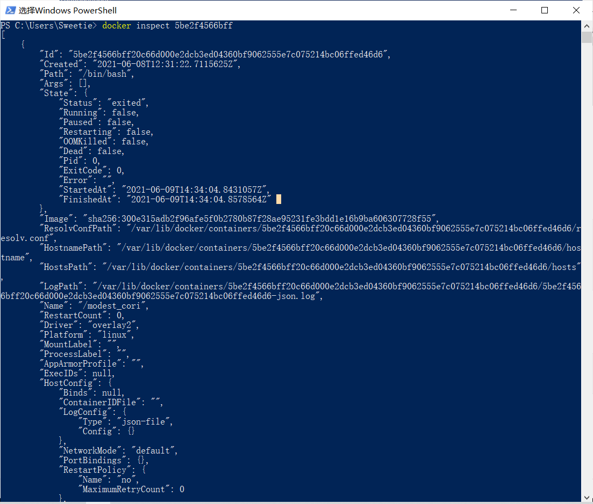


进入当前正在进行的容器

```shell
我们通常容器都是使用后台方式运行的，需要进入容器，修改一些配置
docker exec -it 容器id 
docker attach 容器id
正在执行当前的代码


exec进入容器后开启一个新的终端，可以在里面操作（常用）
attach 进入容器正在执行的终端，不会启动新的进程
```

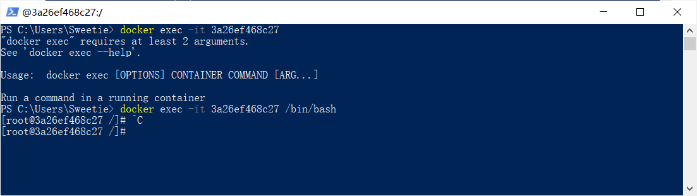


从容器内拷贝文件到主机上

```shell
docker cp 容器id ：容器内路径  目的的主机路径 
```

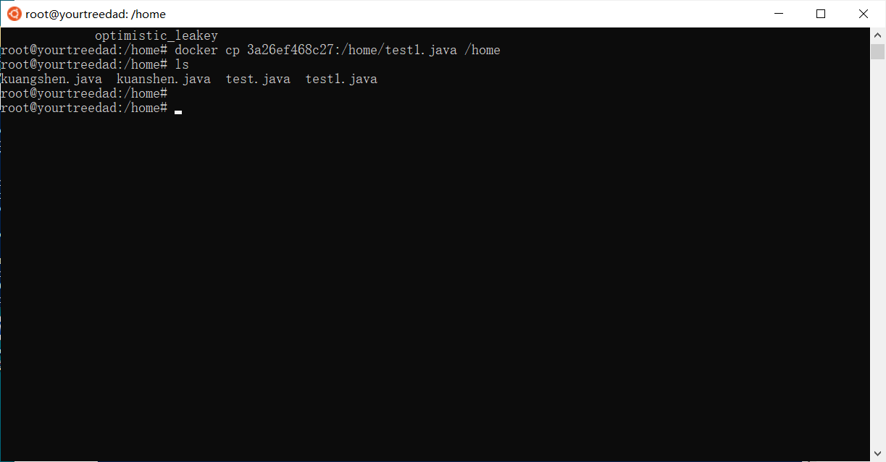

```shell
当前主机目录
root@yourtreedad:~# cd /home
root@yourtreedad:/home#  ls
kuanshen.java  test.java
root@yourtreedad:/home# touch kuangshen.java
root@yourtreedad:/home#  ls
kuangshen.java  kuanshen.java  test.java

进入容器内部
root@yourtreedad:/home# docker attach 3a26ef468c27
[root@3a26ef468c27 /]# cd /home
bash: cd: $'\343/home': No such file or directory
[root@3a26ef468c27 /]# ls
bin  dev  etc  home  lib  lib64  lost+found  media  mnt  opt  proc  root  run  sbin  srv  sys  tmp  usr  var
[root@3a26ef468c27 /]# cd /home
[root@3a26ef468c27 home]# ls
创建文件
[root@3a26ef468c27 home]# touch test1.java
[root@3a26ef468c27 home]# ls
test1.java
退出容器
[root@3a26ef468c27 home]# exit
exit
root@yourtreedad:/home# docker ps
CONTAINER ID        IMAGE               COMMAND             CREATED             STATUS              PORTS               NAMES
root@yourtreedad:/home# docker ps -a
CONTAINER ID        IMAGE               COMMAND             CREATED             STATUS                           PORTS               NAMES
3a26ef468c27        centos              "/bin/bash"         20 minutes ago      Exited (0) 16 seconds ago                            suspicious_wilbur
cee72dcd9187        centos              "-it /bin/bash"     21 minutes ago      Created                                              eager_einstein
73d060aad5ac        centos              "/bin/bash"         27 hours ago        Exited (255) About an hour ago                       optimistic_leakey
从容器内拷贝文件至主机
root@yourtreedad:/home# docker cp 3a26ef468c27:/home/test1.java /home
root@yourtreedad:/home# ls
kuangshen.java  kuanshen.java  test.java  test1.java
拷贝是一个手动过程，未来我们使用 -v 卷的技术，可以实现自动同步
```


docker命令很多，以上是最常用的


docker安装nginx

1.搜索镜像

2.下载镜像

3.启动镜像

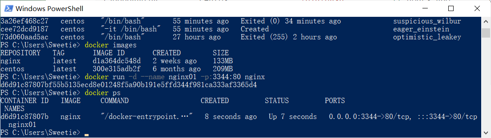

测试

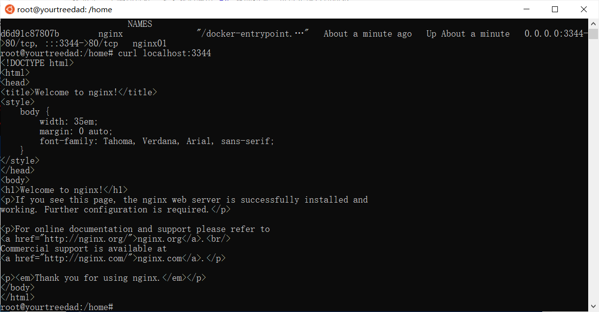

端口映射


进入容器，查看文件

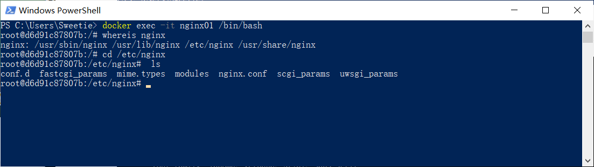


思考问题：每次改动nignx配置文件，都需要进入容器内部？都十分麻烦，我要是可以在容器外部提供一个映射路径，达到在容器外部修改文件，容器内部就可以自动修改？  -v 数据卷技术


docker装一个tomcat

```shell
docker run -it --rm tomcat:9.0
之前的启动都是后台，停止了容器之后，容器还是可以查到
docker run -it --rm 一般用来测试，用完就删除

进入容器
PS C:\Users\Sweetie> docker run -d -p 3355:8080 --name tomcat01 tomcat
c42f39b1590834eb3720faa3cee74b79a909550fe02bc2ed383676908c3accf2
PS C:\Users\Sweetie> docker exec -it tomcat01 /bin/bash
root@c42f39b15908:/usr/local/tomcat# ls
linux命令少了
没有webapps
阿里云镜像原因，默认是最小的镜像，所有的不必要的都剔除了。
保证最小可运行的环境


root@c42f39b15908:/usr/local/tomcat/webapps# cd ..
root@c42f39b15908:/usr/local/tomcat# ls
BUILDING.txt     LICENSE  README.md      RUNNING.txt  conf  logs            temp     webapps.dist
CONTRIBUTING.md  NOTICE   RELEASE-NOTES  bin          lib   native-jni-lib  webapps  work
root@c42f39b15908:/usr/local/tomcat# cd webapps.dist
root@c42f39b15908:/usr/local/tomcat/webapps.dist# ls
ROOT  docs  examples  host-manager  manager
root@c42f39b15908:/usr/local/tomcat/webapps.dist# cd ..
root@c42f39b15908:/usr/local/tomcat# cp -r webapps.dist/* webapps
root@c42f39b15908:/usr/local/tomcat# cd webapps
root@c42f39b15908:/usr/local/tomcat/webapps# ls
ROOT  docs  examples  host-manager  manager

```

以后要部署项目，如果每次都要进入容器是不是十分麻烦，要是可以在容器外部提供一个映射路径，达到在容器修改文件名，容器内部就可以自动修改？ -v 数据卷技术

webapps，在外部放置项目，就自动同步到内部就好了！！！


docker容器 tomcat+网站 docker+mysql


部署es+kibana

```shell
es暴露的端口很多
es十分耗内存
es的数据一般需要放置在安全目录！挂载

--net somenetwork ? 网络配置

下载启动
docker run -d --name elasticsearch  -p 9200:9200 -p 9300:9300 -e "discovery.type=single-node"
elasticsearch:7.6.2

一启动就顶不住了，很好内存
docker statuc 查看cpu的状态

赶紧关闭，增加内存的限制，修改配置文件 -e 配置修改
docker run -d --name elasticsearch -p 9200:9200 -p 9300:9300 -e "discovery.type=single-node" -e ES_JAVA_OPTS="-Xms64m -Xmx512m" elasticsearch:7.6.2
环境配置
```

作业：使用kibana 连接elasticsearch

因为相互隔离，所以直接localhost来连不现实，可以使用linux内网ip来搞，需要了解docker网络原理，网络的基本知识


可视化

- portainer先用这个


- rancher（CI、CD再用）


什么是portainer

docker图形化界面管理工具！提供一个后台面板，供我们操作！

```shell
docker run -d -p 8088:9000 --restart=always -v /var/run/docker.sock:/var/run/docker.sock --privileged=true portainer/portainer

访问测试 外网8088端口
通过它来访问

可视化面板，我们平时不会使用，测试玩玩即可
```


docker镜像讲解

镜像是什么

镜像是一种轻量级、可执行的独立软件包，用来打包软件运行环境和基于运行环境开发的软件，它包含运行某个软件所需的所有内容，包括代码、运行时、库、环境变量和配置文件

所有的应用，直接打包docker镜像，就可以直接跑起来

如何得到镜像：

- 从远程仓库下载
- 朋友拷贝给你
- 自己制作一个镜像 dockerfile


unionFS联合文件系统

我们下载的时候看到的一层层的就是这个


unionfs联合文件系统，是一种分层、轻量级并且高性能的文件系统，它支持对文件系统的修改，作为一次提交来一层层叠加，同时可以将不同目录挂在到同一个虚拟文件系统下unite several directories into a single virtual filesystem 。union文件系统是docker 镜像的基础，镜像可以通过分层来进行继承，基于基础镜像（没有父镜像），可以制作各种具体的应用镜像

特性：一次同时加载多个文件系统，但从外面看起来，只能看到一个文件系统，联合加载会把各层文件系统叠加起来，这样最终的文件系统会包含所有底层的文件和目录


docker镜像加载原理

docker的镜像实际上是由一层一层的文件系统组成，这种层级的文件系统UnionFS

bootfs （boot file system ） 主要包含bootloader 和 kernel ，bootloader 主要是引导加载kernel ， linux 刚启动时会加载 bootfs 文件系统，在docker 镜像的最底层是bootfs。这一层与我们典型的linu/unix系统是一样的，包含boot加载器和内核。当boot加载完成之后整个内核就都在内存中了，此时内存的使用权已由bootfs转交给内核，此时系统也会卸载bootfs


rootfs（root file system），在bootfs之上，包含的就是典型linux系统中的 /dev , /proc / bin , /etc等标准目录和文件。rootfs就是各种不同的操作系统发行版，比如ubuntu，centos等等


平时我们安装进虚拟机的centos都是好几个G，为什么docker这里才200M


对于一个精简的OS，rootfs可以很小，只需要包含最基本的命令，工具和程序库就可以了，因为底层直接用host的kernel，自己只需要提供rootfs就可以了，由此可见对于不同的linux发行版，bootfs基本是一致的，rootfs会有差别，因此不同的发行版本可以共用bootfs


分层理解

```shell
PS C:\Users\Sweetie> docker pull redis
Using default tag: latest
latest: Pulling from library/redis
69692152171a: Already exists
a4a46f2fd7e0: Pull complete
bcdf6fddc3bd: Pull complete
2902e41faefa: Pull complete
df3e1d63cdb1: Pull complete
fa57f005a60d: Pull complete


```

我们可以去下载一个镜像，注意观察下载的日志输出，可以看到是一层一层在下载的！


思考：为什么docker镜像要采用这种分层的结构呢？

最大的好处，我觉得莫过于是资源共享！比如有多个镜像都从相同的base镜像构建而来，那么宿主机只需要在磁盘上保留一份base镜像，同时内存中也只需要加载一份base镜像，这样就可以为所有的容器服务了，而且镜像的每一层都可以被共享


```shell
     },
        "RootFS": {
            "Type": "layers",
            "Layers": [
                "sha256:02c055ef67f5904019f43a41ea5f099996d8e7633749b6e606c400526b2c4b33",
                "sha256:ec5652c3523d96657d66169c0eb71b572ff065711c705a15ec02f60a21c212c3",
                "sha256:76d3e24d63f60e6a73af70be15959eb4021dd7a5a09da6925037d3b4a1673fca",
                "sha256:f06719b0aa43029f32c821c8f14f9f5941a8be6d3b61dcd9f3f884b39e9a4f23",
                "sha256:b896f490f2edc62cc9d190465bbeab871619590d1e9beeffb92e4ca9cc08116d",
                "sha256:e3f4077f577bf07c0940d6345ddd17014ff824d3f4f7f3effc9a8c4dae3e527b"
            ]
        },
        "Metadata": {
            "LastTagTime": "0001-01-01T00:00:00Z"
        }
```


理解：

所有的docker镜像都起始于一个基础镜像层，当进行修改或者增加新的内容时，就会在当前镜像层之上，创建新的镜像层。举一个简单的例子，假如基于ubuntu linux 16.04 创建一个新的镜像，这就是新镜像的第一层；如果在该镜像中添加python包，该镜像就会在基础镜像层之上创建第二个镜像层，如果继续添加一个安全不定，就会创建第三个镜像层。


在添加额外的镜像层的同时，镜像始终保持是当前所有镜像的组合，理解这一点非常重要。

这种情况下，上层镜像层中的文件覆盖了底层镜像层中的文件。这样就使得文件的更新版本作为一个新镜像层添加到镜像中。docker通过存储引擎（新版本采用快照机制）的方式来实现惊险层堆栈，并保证多镜像层对外展示为统一的文件系统。

linux上可用的存储引擎有AUFS、Overlay2、Device Mapper、Btrfs以及ZFS。顾名思义，每种存储引擎都基于Linux中对应的文件系统或者块设备技术，并且每种引擎都有其独有的性能特点。

Docker在windows上仅支持windowsfilter一种存储引擎，该引擎基于NTFS文件系统之上实现了分层和cow


docker镜像都是只读的，一个新的刻写层被加载到镜像的顶部！

这一层就是我们通常说的容器层，容器之下的都叫镜像


如何提交一个自己的镜像

commit镜像


```shell
docker commit 提交容器成为一个新的副本
docker commit -m="提交的描述信息" -a="作者" 容器id 目标镜像名:[TAG]  
```


测试

- 启动默认tomcat
- 没有文件的webapps

```shell
root@e7c2f9ef26e4:/usr/local/tomcat# cp -r webapps.dist/* webapps
root@e7c2f9ef26e4:/usr/local/tomcat# ls
BUILDING.txt     LICENSE  README.md      RUNNING.txt  conf  logs            temp     webapps.dist
CONTRIBUTING.md  NOTICE   RELEASE-NOTES  bin          lib   native-jni-lib  webapps  work
root@e7c2f9ef26e4:/usr/local/tomcat# cd webapps
root@e7c2f9ef26e4:/usr/local/tomcat/webapps# ls
ROOT  docs  examples  host-manager  manager
```

- cp命令拷贝进webapps

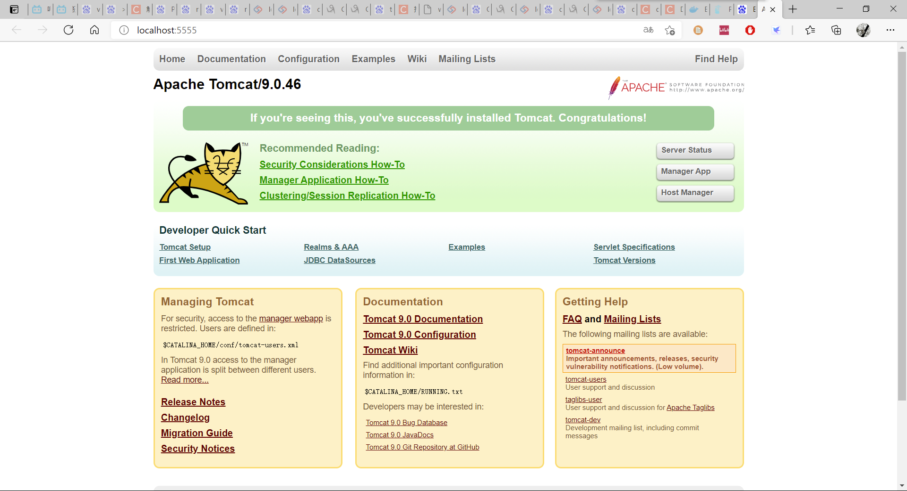

- 浏览器可以访问
- commit提交为一个新的镜像，我们以后就使用我们修改过的镜像即可，这就是我们自己的一个修改过的镜像

```shell
PS C:\Users\Sweetie> docker commit -m="add webapps app" -a="ljs" e7c2f9ef26e4  tomcatupdate1.0
sha256:2a308d5b7f5a2b5b471a193c596369ee1ec2168d04221397ced9c9201a94075e
PS C:\Users\Sweetie> docker images
REPOSITORY            TAG       IMAGE ID       CREATED         SIZE
tomcatupdate1.0       latest    2a308d5b7f5a   8 seconds ago   672MB
redis                 latest    fad0ee7e917a   10 days ago     105MB
nginx                 latest    d1a364dc548d   2 weeks ago     133MB
tomcat                latest    c43a65faae57   4 weeks ago     667MB
portainer/portainer   latest    580c0e4e98b0   2 months ago    79.1MB
centos                latest    300e315adb2f   6 months ago    209MB
elasticsearch         7.6.2     f29a1ee41030   14 months ago   791MB
elasticsearch         latest    5acf0e8da90b   2 years ago     486MB

```

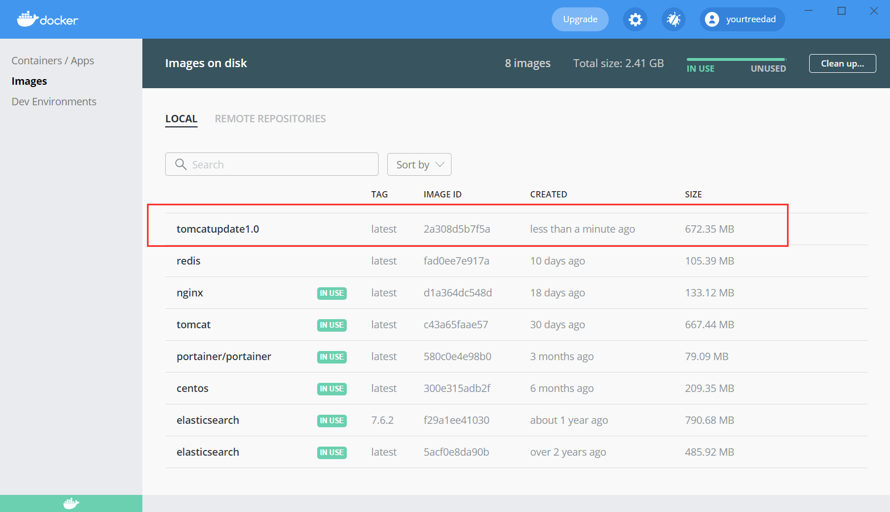


如果你想要保存当前容器的状态，就可以通过commit来提交，获得一个镜像。

就好比以前我们学习VM的时候，快照


到这里才算入门


容器数据卷、dockerfile、docker网络：docker精髓


企业实战

docker compose

docker swarm


ci 、 cd  jenkins 流水线


容器数据卷

什么是容器数据卷

docker的理念回顾：

将应用和环境打包成一个镜像！

数据？如果数据都在容器中，那么我们把容器删除，数据就会丢失！

需求：数据可以持久化

MYsql，容器删了，删库跑路!

需求：MYsql的数据可以存储在本地！


容器之间可以有一个容器共享的技术！docker容器中产生的数据，同步到本地！

这就是数据卷技术！目录的挂载，将容器内的目录挂载linux上


总结一句话：容器的持久化和同步操作！容器间也是可以数据共享的！


使用数据卷

```shell
方式一：直接使用命令挂载
-v 
docker run -it -v 主机目录地址：容器内目录地址 -p 主机端口：容器端口


root@yourtreedad:~# cd /home
root@yourtreedad:/home# ls
kuangshen.java  kuanshen.java  test.java  test1.java
root@yourtreedad:/home# cd ..
root@yourtreedad:/# docker run -it -v /home/ceshi:/home centos /bin/bash
```


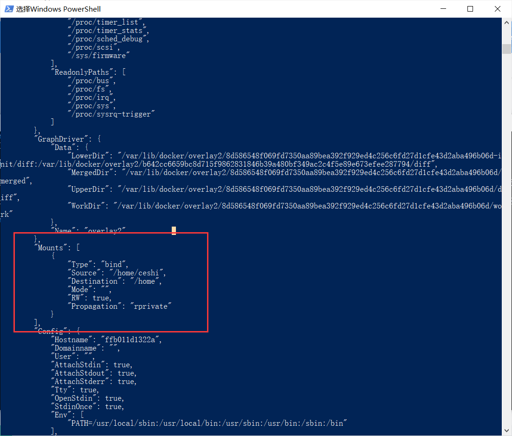

使用 docker inspect 容器id 查看具体信息


在外面建立文件，可以看到里面也有

```shell
[root@ffb011d1322a /]# cd home
[root@ffb011d1322a home]# ls
outtoint.txt
```

在里面见文件，可以看到里面也有

```shell
[root@ffb011d1322a home]# touch intoout.java
[root@ffb011d1322a home]# ls
intoout.java  outtoint.txt
[root@ffb011d1322a home]# exit
exit
root@yourtreedad:/# docker ps
CONTAINER ID        IMAGE                 COMMAND             CREATED             STATUS              PORTS                                       NAMES
ffb011d1322a        centos                "/bin/bash"         12 minutes ago      Up 10 minutes                                                   eager_heyrovsky
e7c2f9ef26e4        tomcat:latest         "catalina.sh run"   34 minutes ago      Up 34 minutes       0.0.0.0:5555->8080/tcp                      sweet_ramanujan
b90d3528ae04        portainer/portainer   "/portainer"        6 hours ago         Up 37 minutes       0.0.0.0:8088->9000/tcp, :::8088->9000/tcp   confident_villani
root@yourtreedad:/# cd home
root@yourtreedad:/home# cd ceshi
root@yourtreedad:/home/ceshi# ls
intoout.java  outtoint.txt
root@yourtreedad:/home/ceshi#
```


容器停止了，但是只要容器还在，就能实现同步数据，类似双向绑定

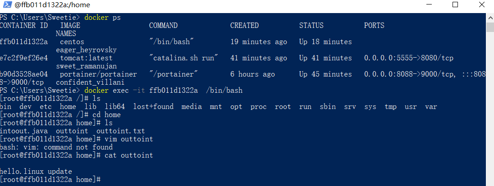

好处：我们以后修改只需要在本地修改即可，容器内会自动同步！


实战：安装mysql

思考：mysql的数据持久化的问题！


```shell
获取镜像
docker pull mysql
运行容器，需要做数据挂载，需要配置密码，这需要注意
官方测试：docker run --name some-mysql -e MYSQL_ROOT_PASSWORD=my-secret-pw -d mysql:tag

-d 后台运行
-p 端口映射
-v 数据卷挂在
-e 环境配置
--name
docker run -d -p 3310:3306 -v /home/mysql/conf:/etc/mysql/conf.d -v /home/mysql/data:/var/lib/mysql -e MYSQL_ROOT_PASSWORD=123456 --name mysql01 mysql:5.7

启动成功之后，我们在本地使用 sqlyog 来测试一下
sqlyog --h -u -p 连接到服务器的3310 ----3310 和容器内的3306进行映射，这个时候我们就可以连接上了 

在本地测试创建一个数据库，查看一下映射的路径是否ok
假设我们将容器删除，发现我们挂载到本地的数据卷依旧没有丢失，这就实现了容器数据持久化功能

```


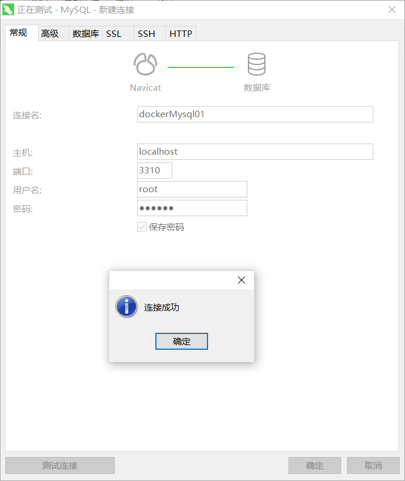


具名挂载和匿名挂载

```shell
匿名挂载
-v 容器内路径   相当于不指定主机的地址，直接指定容器地址

root@yourtreedad:/# docker run -d -P --name nginx01 -v /etc/nginx nginx

查看所有卷的情况
docker volume ls
这里发现 
DRIVER              VOLUME NAME
local               0faef3ffc2187555023c9a8e5dca5c11e47f0b436657e48f95e972e33c951c49

这种就是匿名挂载，我们-v的时候只写了容器的路径，没有写容器外的路径！

通过-v 卷名：容器内路径
这就是具名挂载
root@yourtreedad:/# docker run -d -P --name nginx02 -v juming-nginx:/etc/nginx nginx
11c306e0a80402c0c235042326f5db9da58570e01abac55379414d9d53abc797
root@yourtreedad:/# docker volume ls
DRIVER              VOLUME NAME
local               0faef3ffc2187555023c9a8e5dca5c11e47f0b436657e48f95e972e33c951c49
local               3c63eeef73128b24bbf1830f9cec7d383aae8413e232a857f1216456fb07fedf
local               941b4501fa7cefd9a341366fbe18cfeddd0f2d223c1eb87addf1a77a42c2ace8
local               3826373b692739fc44eac10a00d8ddada7b0200c5833963c459d6db001384a70
local               8440372a24dc57f1bcf100c1ef256abbff5713f1c96c2bd65276aea10f54864d
local               cb64d53be430f816088a1f1bbd1f5aea8885a1be33ddd98a5fb98a9d452fa03c
local               juming-nginx

查看一下这个卷挂载在主机的哪个位置了呢
root@yourtreedad:/# docker volume inspect juming-nginx
[
    {
        "CreatedAt": "2021-06-13T02:11:30Z",
        "Driver": "local",
        "Labels": null,
        "Mountpoint": "/var/lib/docker/volumes/juming-nginx/_data",
        "Name": "juming-nginx",
        "Options": null,
        "Scope": "local"
    }
]
所有docker容器内的卷，如果没有指定目录的情况下，都是在/var/lib/docker/volumes/xxxx下
我们通过具名挂载可以方便的找到我们的一个卷，大多数情况下使用的是具名挂载

```

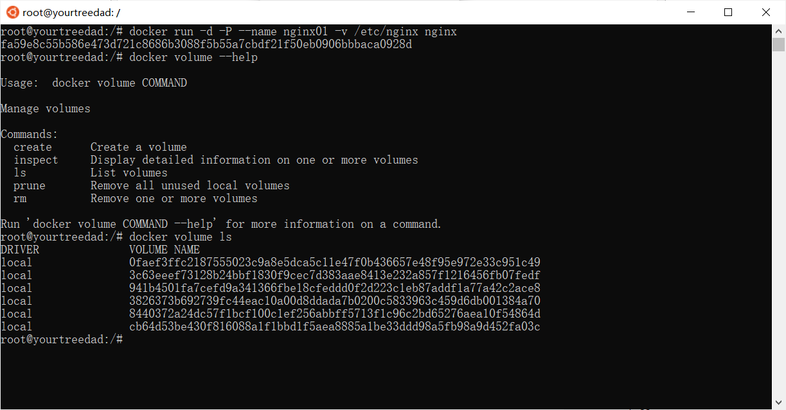

```shell
如何确定是具名挂载还是匿名挂载 ，还是指定路径挂载
-v 容器内路径 这就是匿名挂载
-v 卷名：容器内路径 这就是具名挂载
-v /宿主机路径：/容器内路径 这就是指定路径挂载
拓展：

通过 -v 容器内路径，ro 、 rw 改变读写权限
docker run -d -P --name nginx02 -v juming-nginx:/etc/nginx:ro nginx
docker run -d -P --name nginx02 -v juming-nginx:/etc/nginx:rw nginx
只读ro readonly
可读可写rw readwrite

一旦设置了ro 容器对我们挂载出来的内容就有限定了！

ro只要看到ro，就说明这个路径只能通过宿主机来操作，容器内部是无法操作的


```


初识dockerfile

方式二：

dockerfile就是用来构建docker镜像的构建文件！命令脚本！先体验一下！

```shell
ctrl+U 删除当前命令
mkdir 生成文件夹
rm -rf 文件夹名字 强制删除文件夹名字
pwd  查看当前在那个目录中
进入文件后 esc 再：wq就是保存并退出
vim 使用文本编辑器进入文件
a后就可以编辑
通过脚本可以生成镜像，镜像是一层一层的 
touch 创建一个文件

##创建一个dockerfile文件，名字可以随机，建议 dockerfile
##文件中的内容 指令都是大写  参数
##这里的每个命令，都是镜像的一层
FROM centos

VOLUME["volume01","volume02"]

CMD echo "-----end-----"
CMD /bin/bash
好像要空行！！！！

通过dockerfile 去构建镜像
root@yourtreedad:/home/docker-test-volume# docker build -f /home/docker-test-volume/dockerfile1 -t kuangshen/centos:1.0 .
```


启动一下自己的生成的容器

```shell
root@yourtreedad:/# docker images
REPOSITORY               TAG                 IMAGE ID            CREATED             SIZE
tomcatupdate             1.0                 ee149e8cdc20        5 hours ago         672MB
portainer/portainer-ce   latest              45be17a5903a        2 weeks ago         209MB
nginx                    latest              d1a364dc548d        2 weeks ago         133MB
tomcat                   latest              c43a65faae57        4 weeks ago         667MB
mysql                    latest              c0cdc95609f1        4 weeks ago         556MB
portainer/portainer      latest              580c0e4e98b0        2 months ago        79.1MB
kuangshen/centos         1.0                 f75a47123694        6 months ago        209MB
root@yourtreedad:/# docker run -it f75a47123694 /bin/bash

但是这个地方报错了，好象是说现在的destination 不能为相对路径 
docker: Error response from daemon: OCI runtime create failed: invalid mount {Destination:volume01 Type:bind Source:/var/lib/docker/volumes/67cb8e440bfc475a6b8e0f091779f2c56fed443d1ca4e6edd10ca37f37d09e05/_data Options:[rbind]}: mount destination volume01 not absolute: unknown.
ERRO[0000] error waiting for container: context canceled


```

查看一下卷挂载的路径

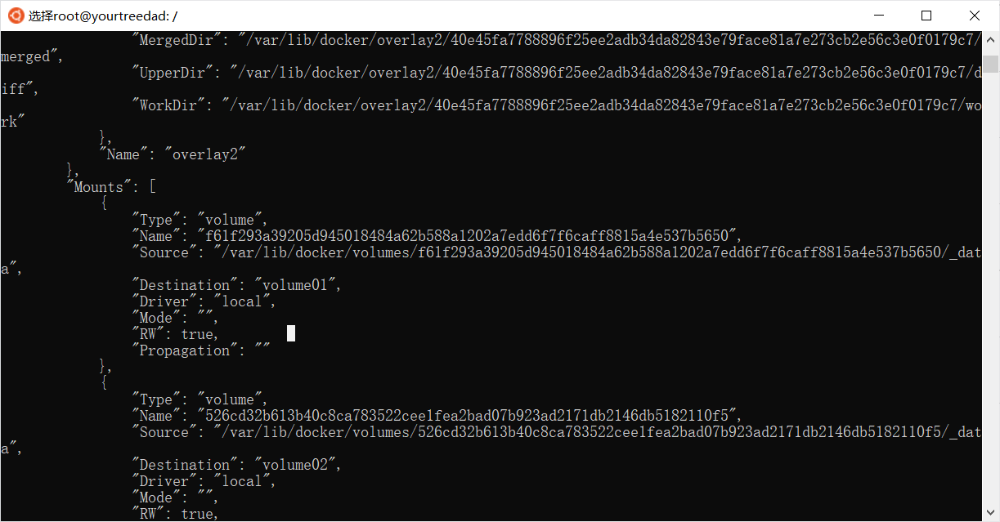

测试一下刚才的文件是否同步出去了，可以在卷里写个文件，在宿主机的挂载位置处查看是否有这个文件就可以辣


这种方式我们未来使用的十分多，因为我们通常会构建自己的镜像！

假设构建镜像的时候没有挂载卷，要手动镜像挂载 -v卷名：容器内路径


数据卷容器：多个容器之间同步数据

两个mysql同步数据！


```shell
主从复制之类的就可能使用这个技术
使用 --volumes-from
docker run -it --name docker02 --volumes-from docker01 centos
docker run -it --name docker03 --volumes-from docker01 centos
很像继承
启动3个容器，通过我们刚才自己写的镜像启动
```

启动完了就测试，测试的时候在主docker01中创建文件看看docker0203中会不会有就好了

```shell
root@yourtreedad:/# docker ps
CONTAINER ID        IMAGE               COMMAND             CREATED             STATUS              PORTS               NAMES
dfb328e8f37f        centos              "/bin/bash"         3 minutes ago       Up 2 minutes                            docker03
5787d6ea92e4        centos              "/bin/bash"         5 minutes ago       Up 3 minutes                            docker02
c8ba46a34155        centos              "/bin/bash"         13 minutes ago      Up 12 minutes                           docker01
root@yourtreedad:/# docker attach c8ba46a34155
[root@c8ba46a34155 /]# cd bin
[root@c8ba46a34155 bin]# cd bash
bash: cd: bash: Not a directory
[root@c8ba46a34155 bin]# cd ..
[root@c8ba46a34155 /]# ls
bin  dev  etc  home  lib  lib64  lost+found  media  mnt  opt  proc  root  run  sbin  srv  sys  tmp  usr  var
[root@c8ba46a34155 /]# mkdir ceshi
[root@c8ba46a34155 /]# ls
bin  ceshi  dev  etc  home  lib  lib64  lost+found  media  mnt  opt  proc  root  run  sbin  srv  sys  tmp  usr  var
[root@c8ba46a34155 /]# cd ceshi
[root@c8ba46a34155 ceshi]# ls
[root@c8ba46a34155 ceshi]# touch ceshi.java
[root@c8ba46a34155 ceshi]# ls
ceshi.java
[root@c8ba46a34155 ceshi]# cd ..
[root@c8ba46a34155 /]# cd ..
[root@c8ba46a34155 /]# exit
exit
```

没问题

```shell
oot@yourtreedad:/# docker ps
CONTAINER ID        IMAGE               COMMAND             CREATED             STATUS              PORTS               NAMES
dfb328e8f37f        centos              "/bin/bash"         6 minutes ago       Up 6 minutes                            docker03
5787d6ea92e4        centos              "/bin/bash"         8 minutes ago       Up 7 minutes                            docker02
c8ba46a34155        centos              "/bin/bash"         17 minutes ago      Up 41 seconds                           docker01
root@yourtreedad:/# docker attach c8ba46a34155
[root@c8ba46a34155 /]# ls
bin  ceshi  dev  etc  home  lib  lib64  lost+found  media  mnt  opt  proc  root  run  sbin  srv  sys  tmp  usr  var
[root@c8ba46a34155 /]# cd ceshi
[root@c8ba46a34155 ceshi]# ls
ceshi.java
[root@c8ba46a34155 ceshi]#
```


问题：如果docker01 删除了，那么数据还有在docker02和docker03上有吗

有的，它是一种拷贝的概念 ，可能是链接吧


结论：容器之间配置信息的传递，数据卷的生命周期一直持续到没有容器使用为止

但是一旦你持久化到了本地，那么数据就可以持久化保存了，本地的数据是不会删除的


dockerfile

dockerfile核心是用来构建docker images 的文件！命令参数脚本！

构建步骤：

1.编写一个dockerfile文件

2.docker build 构建一个镜像

3.docker run 运行镜像

4.docker push 发布镜像（dockerhub 、 阿里云镜像仓库）


查看一下官方是怎么做的

很多官方镜像都是基础包，很多功能没有，我们通常会自己搭建自己的镜像！


官方既然可以制作镜像，我们也可以！


dockerfile构建过程

很多指令：

基础知识：

1.每个保留关键字（指令） 都必须是大写字母

2.执行从上到下顺序执行

3.#表示注释

4.每个指令都会创建提交一个新的镜像层，并提交


dockerfile 是面向开发的，我们以后要发布项目，做镜像，就需要编写dockerfile文件，这个文件十分简单

docker 镜像 例如构建一个springboot 微服务 镜像

docker镜像主键成为企业交付的标准，必须要掌握


步骤：开发运维上线部署

dockerfile：构建文件，这个文件定义了一切的步骤，源代码

dockerimages：通过dockerfile构建生成的镜像，这就是最终发布和运行的产品

dockercontainer：容器就是镜像运行起来提供服务的


dockerfile的指令：

以前的话我们都是使用别人的，现在我们知道了这些指令后，我们来练习自己写一个镜像！

```shell
FROM 基础镜像 一切从这里开始构建
MAINTAINER 镜像是谁写的，有你的姓名+邮箱
RUN docker镜像构建的时候需要运行的命令
ADD  步骤：tomcat镜像，这个tomcat压缩包坑定要被添加进去嘛
WORKDIR 镜像的工作目录 
VOLUME 容器卷，要挂载的目录
EXPOSE 指定暴露端口
CMD 指定这个容器启动的时候要运行的命令 只有最后一个会生效，可被替代
ENTRYPOINT 指定这个容器启动的时候要运行的命令，可以追加的命令
ONBUILD  当构建一个被继承的dockerfile时候 就会运行onbuild指令，触发指令
COPY 类似ADD,将我们的文件拷贝到镜像中
ENV	构建的时候设置环境变量
```


实战测试！

docker hub 中 99% 都是从这个基础镜像过来的 FROM scratch ， 然后配置需要的软件和配置来进行的构建

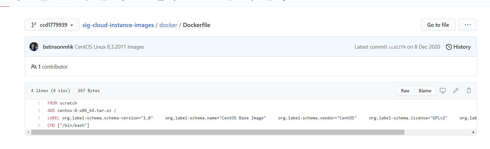

创建一个自己的centos

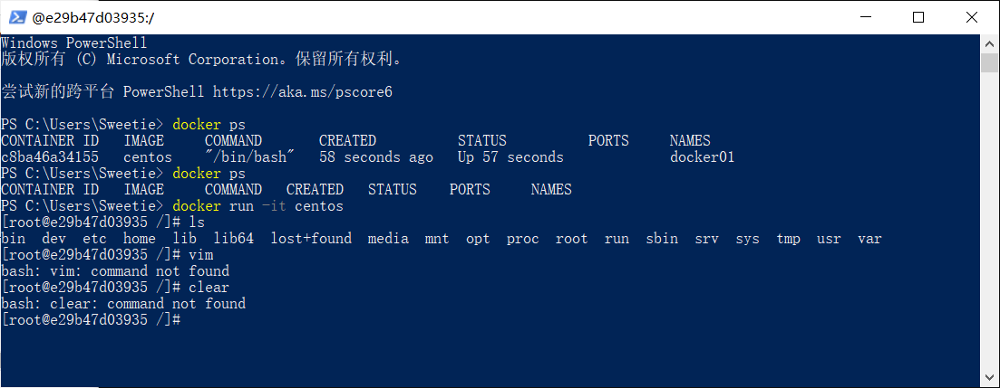

问题：vim clear 等命令都不支持，我们可以在此镜像的基础上在加一点完善一下

```shell
1.编写dockerdile的文件
root@yourtreedad:/# cd home
root@yourtreedad:/home# ls
docker-test-volume  mysql  nginx  tomcat
root@yourtreedad:/home# mkdir dockerfile
root@yourtreedad:/home# ls
docker-test-volume  dockerfile  mysql  nginx  tomcat
root@yourtreedad:/home# cd dockerfile
root@yourtreedad:/home/dockerfile# ls
root@yourtreedad:/home/dockerfile# vim mydockerfile
root@yourtreedad:/home/dockerfile# cat mydockerfile
FROM centos
MAINTAINER ljs<1018814650@qq.com>
ENV MYPATH /uer/local
WORKDIR $MYPATH
RUN yum -y install vim
RUN yum -y install clear
RUM yum -y install net-tools
EXPOSE 80
CMD echo $MYPATH
CMD echo "-----end-----"
CMD /bin/bash

root@yourtreedad:/home/dockerfile#

2.通过这个文件构建镜像
docker build  -f dockerfile文件路径 -t 镜像名：[tag] 

root@yourtreedad:/home/dockerfile# docker build -f mydockerfile -t mycentos:0.1 .
[+] Building 2.2s (8/8) FINISHED
 => [internal] load build definition from mydockerfile                                                                 0.0s
 => => transferring dockerfile: 245B                                                                                   0.0s
 => [internal] load .dockerignore                                                                                      0.0s
 => => transferring context: 2B                                                                                        0.0s
 => [internal] load metadata for docker.io/library/centos:latest                                                       0.0s
 => [1/4] FROM docker.io/library/centos                                                                                0.0s
 => CACHED [2/4] WORKDIR /uer/local                                                                                    0.0s
 => CACHED [3/4] RUN yum -y install vim                                                                                0.0s
 => [4/4] RUN yum -y install net-tools                                                                                 1.8s
 => exporting to image                                                                                                 0.3s
 => => exporting layers                                                                                                0.3s
 => => writing image sha256:2734e41a96b14a3e45a820363638a9f62dfd2c7d901757ea5e2a9ba25ababf50                           0.0s
 => => naming to docker.io/library/mycentos:0.1	
 
 3.测试
 root@yourtreedad:/home/dockerfile# docker run -it --name mycentosdemo mycentos:0.1
[root@51e42c44c78d local]# pwd
/uer/local
[root@51e42c44c78d local]# ifconfig
eth0: flags=4163<UP,BROADCAST,RUNNING,MULTICAST>  mtu 1500
        inet 172.17.0.4  netmask 255.255.0.0  broadcast 172.17.255.255
        ether 02:42:ac:11:00:04  txqueuelen 0  (Ethernet)
        RX packets 9  bytes 726 (726.0 B)
        RX errors 0  dropped 0  overruns 0  frame 0
        TX packets 0  bytes 0 (0.0 B)
        TX errors 0  dropped 0 overruns 0  carrier 0  collisions 0

lo: flags=73<UP,LOOPBACK,RUNNING>  mtu 65536
        inet 127.0.0.1  netmask 255.0.0.0
        loop  txqueuelen 1000  (Local Loopback)
        RX packets 0  bytes 0 (0.0 B)
        RX errors 0  dropped 0  overruns 0  frame 0
        TX packets 0  bytes 0 (0.0 B)
        TX errors 0  dropped 0 overruns 0  carrier 0  collisions 0
        
```

对比:之前的原生的centos，工作目录默认根目录，没有vim ifconfig 命令

现在：基于原生centos，添加了这些命令


我们可以列出本地镜像的变更历史

```shell
docker history imageId

```

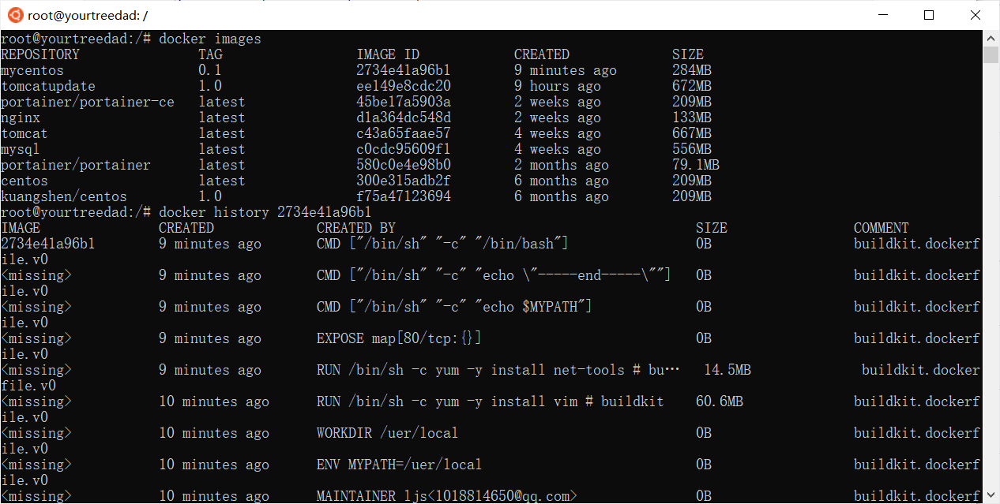

所以我们平时拿到一个镜像，可以研究一下他是怎么做的了


CMD 和 ENTRYPOINT 的区别

```shell
CMD  指定这个容器启动的时候需要运行的命令，只有最后一个会生效，可被替代

cmd的情况下 -l 替换了CMD的["ls","-a"]命令，-l 不是命令所以报错

ENTRYPOINT  指定这个容器启动的时候需要运行的命令你，可以追加命令

```

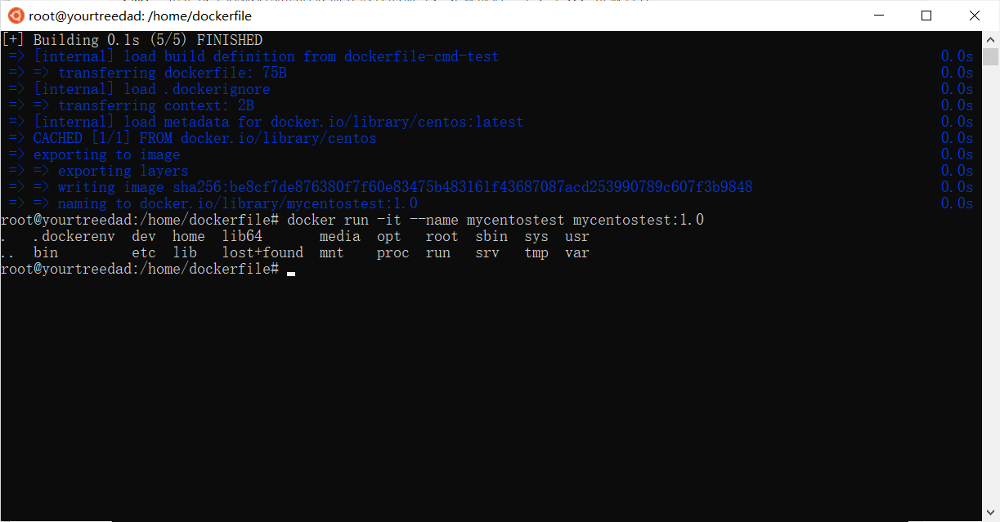


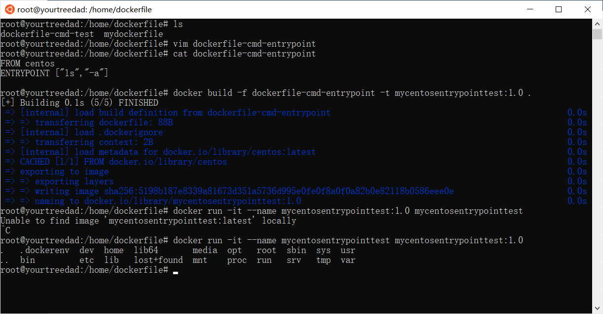

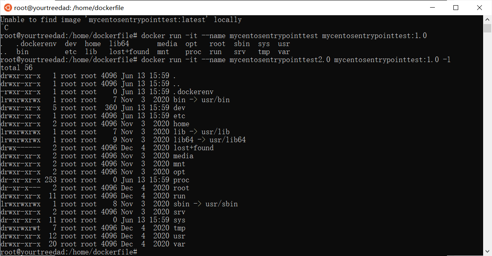

不会替换人家的命令

我们的追加命令，是直接凭借在我们的ENTRYPOINT 命令的后面！

dockerfile中很多命令都十分相似，我们需要了解她们的区别，我们最好的学习就是对比她们然后测试效果


实战：

tomcat镜像

1.准备镜像文件 tomcat压缩表，jdk的压缩包！

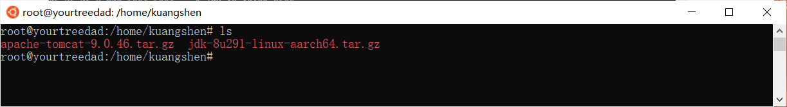

2.编写dockerfile文件 ， 官方命名Dockerfile ，build会自动寻找这个文件，就不需要-f 指定了

```shell
root@yourtreedad:/home/kuangshen# cat Dockerfile
FROM centos
MAINTAINER ljs<1018814650@qq.com>
COPY readme.txt /usr/local/readme.txt
ADD jdk-8u291-linux-aarch64.tar.gz /usr/local/
ADD apache-tomcat-9.0.46.tar.gz /usr/local/
RUN yum -y install vim
ENV MYPATH /usr/local
WORKDIR $MYPATH
ENV JAVA_HOME /usr/local/jdk1.8.0_291
ENV CLASSPATH $JAVA_HOME/lib/dt.jar:$JAVA_HOME/lib/tools.jar
ENV CATALINA_HOME /usr/local/apache-tomcat-9.0.46
ENV CATALINA_BASH /usr/local/apache-tomcat-9.0.46
ENV PATH $PATH:$JAVA_HOME/bin:$CATALINA_HOME/lib:$CATALINA_HOME/bin
EXPOSE 8080
CMD /usr/local/apache-tomcat-9.0.46/bin/startup.sh && tail -F /usr/local/apache-tomcat-9.0.46/bin/logs/catalina.out
root@yourtreedad:/home/kuangshen#
```


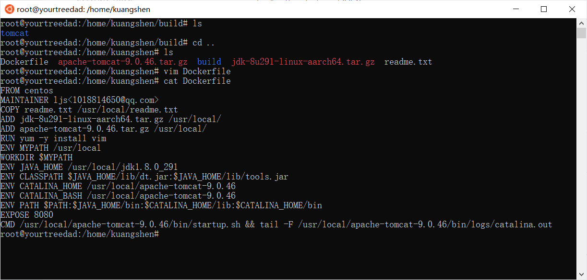

3.构建镜像

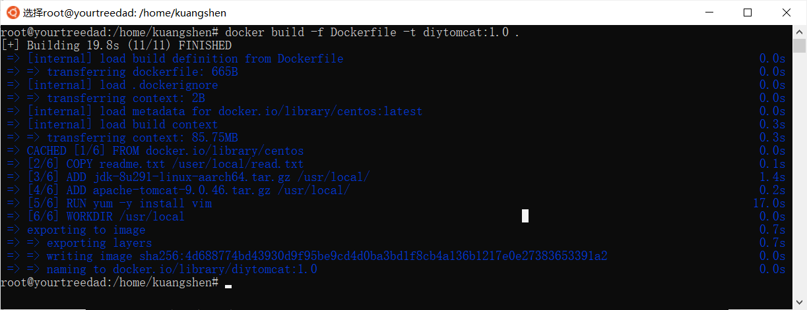

```shell
root@yourtreedad:/home/kuangshen# docker build -f Dockerfile -t diytomcat .
[+] Building 0.1s (11/11) FINISHED
 => [internal] load build definition from Dockerfile                                                               0.0s
 => => transferring dockerfile: 670B                                                                               0.0s
 => [internal] load .dockerignore                                                                                  0.0s
 => => transferring context: 2B                                                                                    0.0s
 => [internal] load metadata for docker.io/library/centos:latest                                                   0.0s
 => [1/6] FROM docker.io/library/centos                                                                            0.0s
 => [internal] load build context                                                                                  0.0s
 => => transferring context: 130B                                                                                  0.0s
 => CACHED [2/6] COPY readme.txt /usr/local/readme.txt                                                             0.0s
 => CACHED [3/6] ADD jdk-8u291-linux-aarch64.tar.gz /usr/local/                                                    0.0s
 => CACHED [4/6] ADD apache-tomcat-9.0.46.tar.gz /usr/local/                                                       0.0s
 => CACHED [5/6] RUN yum -y install vim                                                                            0.0s
 => CACHED [6/6] WORKDIR /usr/local                                                                                0.0s
 => exporting to image                                                                                             0.0s
 => => exporting layers                                                                                            0.0s
 => => writing image sha256:d65fc7234bf254fb93a262a640dcfb543b6f4780fa36ef881bb9992d9705359f                       0.0s
 => => naming to docker.io/library/diytomcat
```


```shell
启动容器 分配端口 使用挂载 指定镜像
root@yourtreedad:/home/kuangshen# docker run -d -p 9090:8080 --name kuangshendiytomcat -v /home/kuangshen/build/tomcat/test:/usr/local/apache-tomcat-9.0.46/webapps/test -v /home/kuangshen/build/tomcat/tomcatlogs:/usr/local/apache-tomcat-9.0.46/logs diytomcat:1.0
```


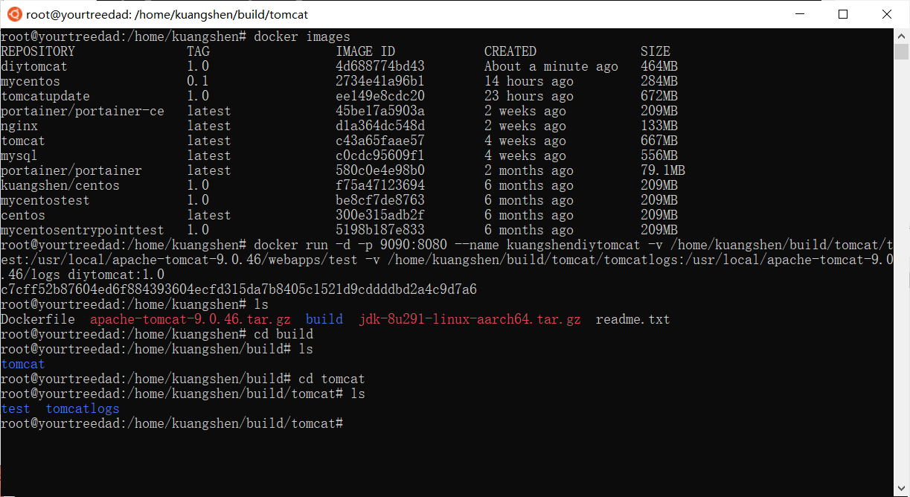

```shell
root@yourtreedad:/home/kuangshen# docker images
REPOSITORY               TAG                 IMAGE ID            CREATED             SIZE
diytomcat                latest              d65fc7234bf2        4 hours ago         464MB
mycentos                 0.1                 2734e41a96b1        20 hours ago        284MB
tomcatupdate             1.0                 ee149e8cdc20        28 hours ago        672MB
portainer/portainer-ce   latest              45be17a5903a        2 weeks ago         209MB
nginx                    latest              d1a364dc548d        2 weeks ago         133MB
tomcat                   latest              c43a65faae57        4 weeks ago         667MB
mysql                    latest              c0cdc95609f1        4 weeks ago         556MB
portainer/portainer      latest              580c0e4e98b0        2 months ago        79.1MB
mycentosentrypointtest   1.0                 5198b187e833        6 months ago        209MB
mycentostest             1.0                 be8cf7de8763        6 months ago        209MB
kuangshen/centos         1.0                 f75a47123694        6 months ago        209MB
centos                   latest              300e315adb2f        6 months ago        209MB
root@yourtreedad:/home/kuangshen# docker run --name diytomcat01 -d -p 9090:8080 -v /home/kuangshen/build/tomcat/test:/usr/local/apache-tomcat-9.0.46/webapps/test -v /home/kuangshen/build/tomcat/tomcatlogs:/usr/local/apache-tomcat-9.0.46/logs diytomcat
174cd08dab23fce852cae1ac5e721c985b377d1ff85a1e769384cb9dd369bde0
```


进入容器查看

```shell
root@yourtreedad:/home/kuangshen/build/tomcat# docker exec -it c7cff52b8760  /bin/bash
这里的bin/bash就会自动跳转到我们设定好的usr/local目录之下
```

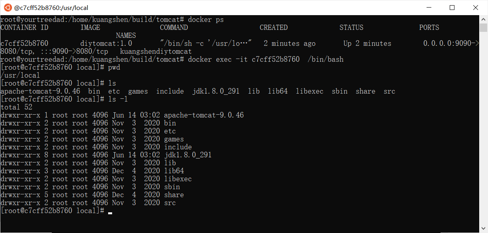

4.启动镜像

5.访问测试

6.发布项目（由于做了卷挂载，我们直接在本地编写项目就可以直接发布了！）

发现项目部署成功，可以直接访问！

我们以后开发的步骤：需要掌握dockerfile的编写！我们之后的一切都是使用docker镜像来发布运行！！！


发布镜像

dockerhub

1.地址 注册自己的账号

2.确定这个账号可以登陆

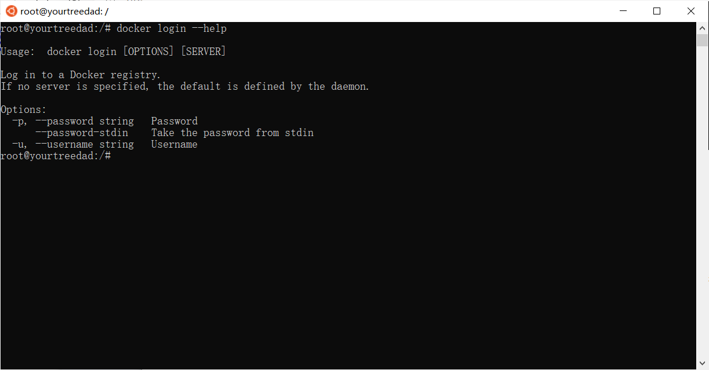

3.在服务器上提交自己的镜像

在此之前需要打tag

```shell
root@yourtreedad:/# docker tag --help

Usage:  docker tag SOURCE_IMAGE[:TAG] TARGET_IMAGE[:TAG]

Create a tag TARGET_IMAGE that refers to SOURCE_IMAGE
root@yourtreedad:/# docker tag tomcatupdate:1.0 yourtreedad/tomcatupdate:2.0


```

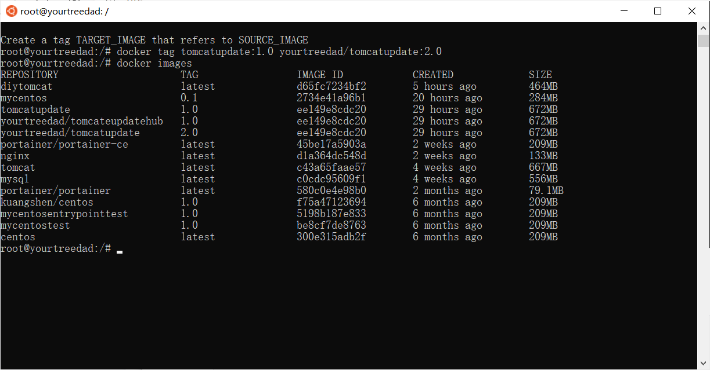

```shell
root@yourtreedad:/# docker push yourtreedad/tomcateupdatehub:1.0
```

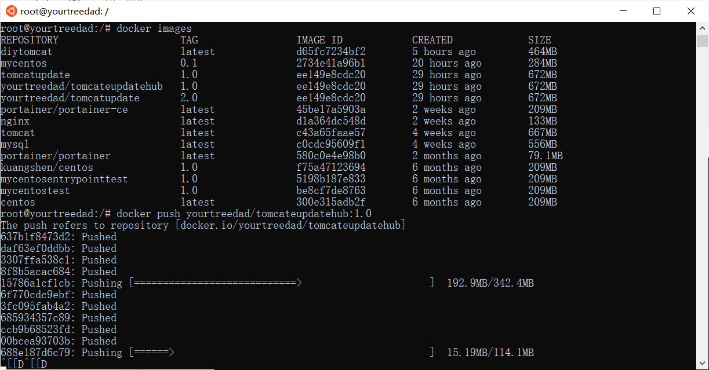

提交的时候也是按照镜像的层级一层一层提交的


可以发布到阿里云镜像服务上嘻嘻

1.登陆阿里云

2.找到容器镜像服务

3.创建命名空间  为了隔离

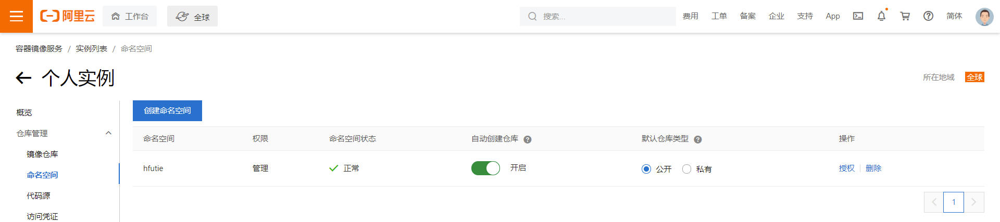

4.创建容器镜像

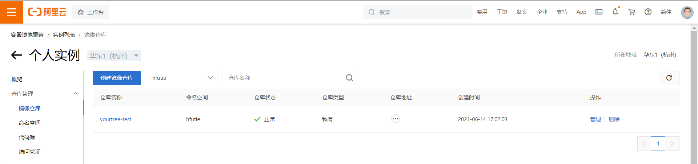

5.浏览阿里云

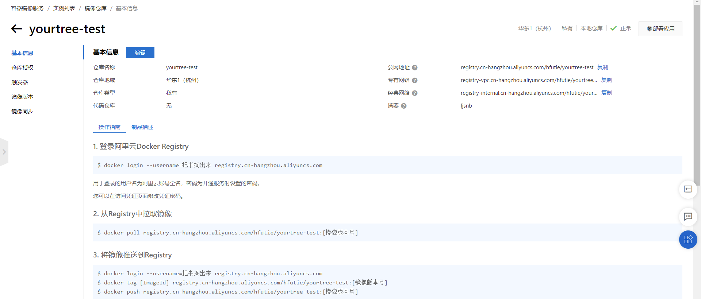

```shell
root@yourtreedad:/# docker login --username=把书掏出来 registry.cn-hangzhou.aliyuncs.com
Password:
Login Succeeded	
```

登陆

```shell
root@yourtreedad:/# docker tag ee149e8cdc20 registry.cn-hangzhou.aliyuncs.com/hfutie/yourtree-test:1.0
```

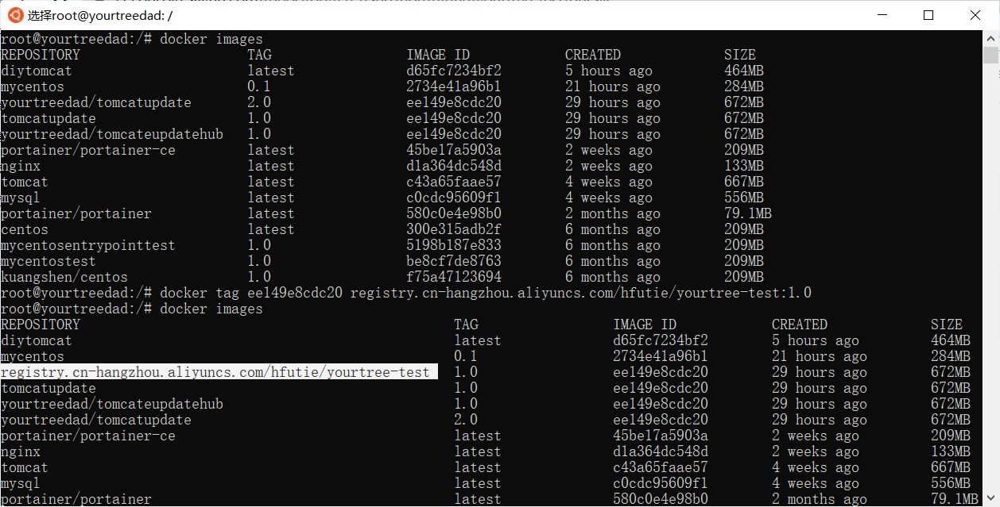


上传

```shell
root@yourtreedad:/# docker push registry.cn-hangzhou.aliyuncs.com/hfutie/yourtree-test:1.0
```

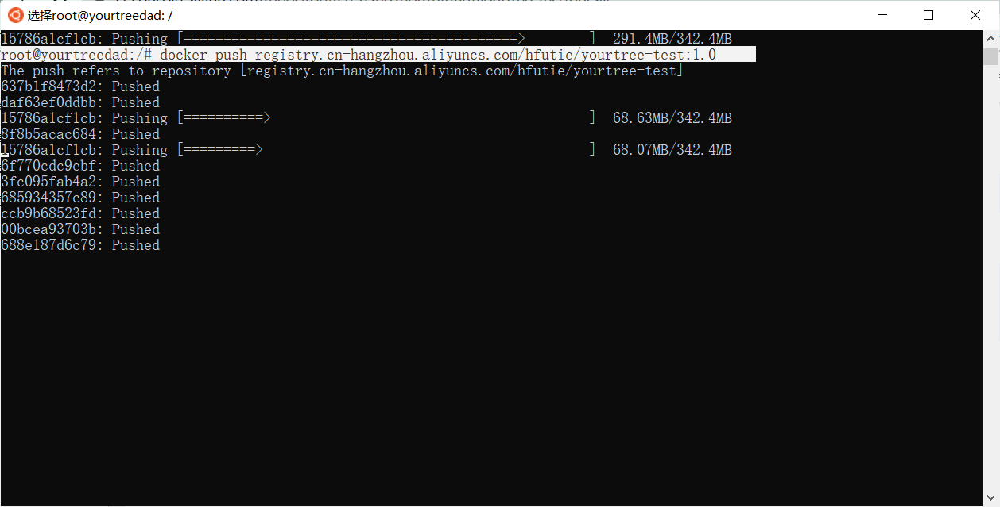


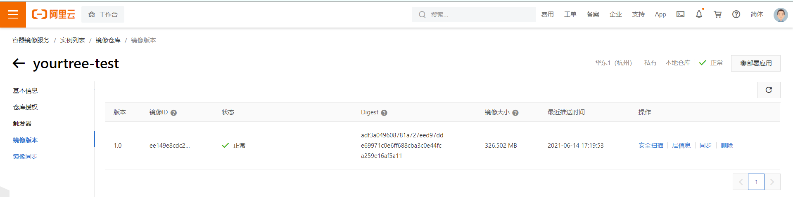


docker小结

dockerfile build

images tag、run/push/pull/save/load

containers stop/kill/start/restart/commit

dockerrepository

backup.tar

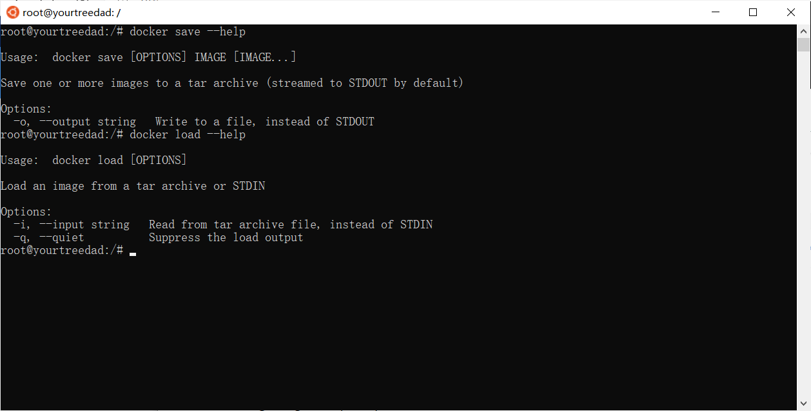


精通的话需要学会docker网络（铺垫、容器编排、集群部署）

docker网络

理解docker网络 docker0


清空所有环境

测试

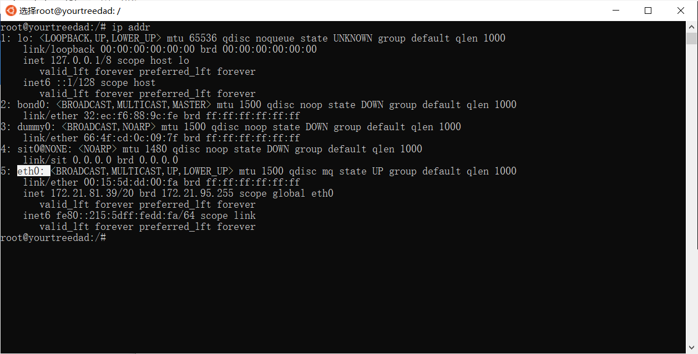

好多个网络，docker是如何处理容器网络访问的？

ES之前的问题


```shell
root@yourtreedad:/# docker run -d -P --name tomcat01 tomcat

查看容器的内部网络地址 ip addr,发现容器启动的时候会得到一个eth0@if22 ip地址，docker分配的

root@yourtreedad:~# docker exec -it tomcat01 ip addr
1: lo: <LOOPBACK,UP,LOWER_UP> mtu 65536 qdisc noqueue state UNKNOWN group default qlen 1000
    link/loopback 00:00:00:00:00:00 brd 00:00:00:00:00:00
    inet 127.0.0.1/8 scope host lo
       valid_lft forever preferred_lft forever
2: sit0@NONE: <NOARP> mtu 1480 qdisc noop state DOWN group default qlen 1000
    link/sit 0.0.0.0 brd 0.0.0.0
21: eth0@if22: <BROADCAST,MULTICAST,UP,LOWER_UP> mtu 1500 qdisc noqueue state UP group default
    link/ether 02:42:ac:11:00:02 brd ff:ff:ff:ff:ff:ff link-netnsid 0
    inet 172.17.0.2/16 brd 172.17.255.255 scope global eth0
       valid_lft forever preferred_lft forever
       
发现windows好像ping不通啊  
linux可以ping通 docker容器内部
```

原理

192.168.0.1路由器

192.168.0.3 同一个网段是能ping通的

1.我们每安装一个docker容器 ， docker就会给docker容器分配一个ip，我们只要安装了docker，就会有一个网卡docker0，（windows for docker好像咩有） ， 桥接模式，使用的技术是evth-pair技术！

再次测试 ip addr之后

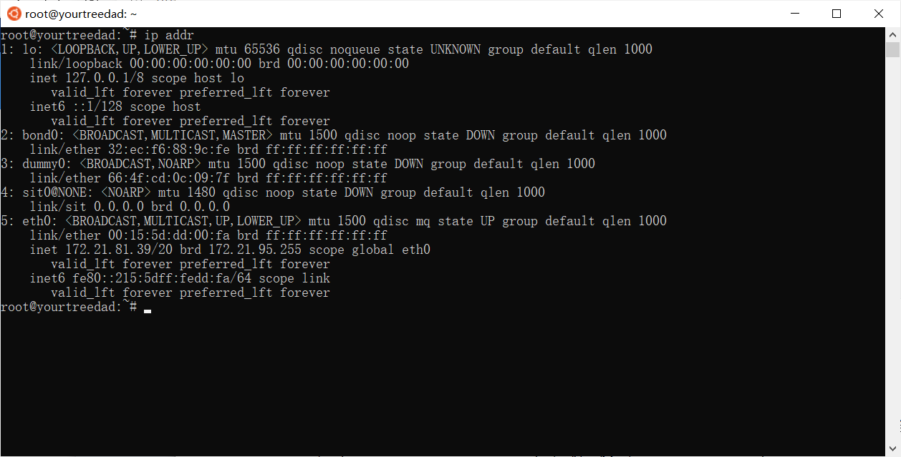

网课里说的是又多了一个，但windows中没有发现

2.在启动一个容器测试

网课里说的是又多了一个，但windows中没有

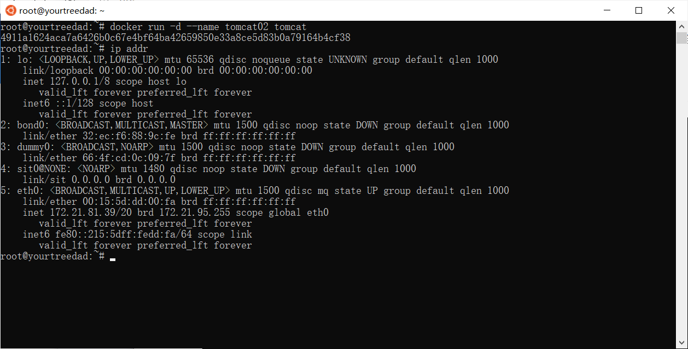

```shell
我们发现这个容器带来的网卡，都是一对一对的
veth-pair 就是一对的虚拟设备接口，她们都是成对出现的，一端连着协议，一端彼此相连
正因为有这个特性 我们就使用veth-pair 充当一个桥梁，连接各种虚拟网络设备的
OpenStac，Docker容器之间的链接，OVS的连接，都是使用 veth-pair技术

```

3.我们来测试一下tomca01 和 tomcat02 是否可以ping通

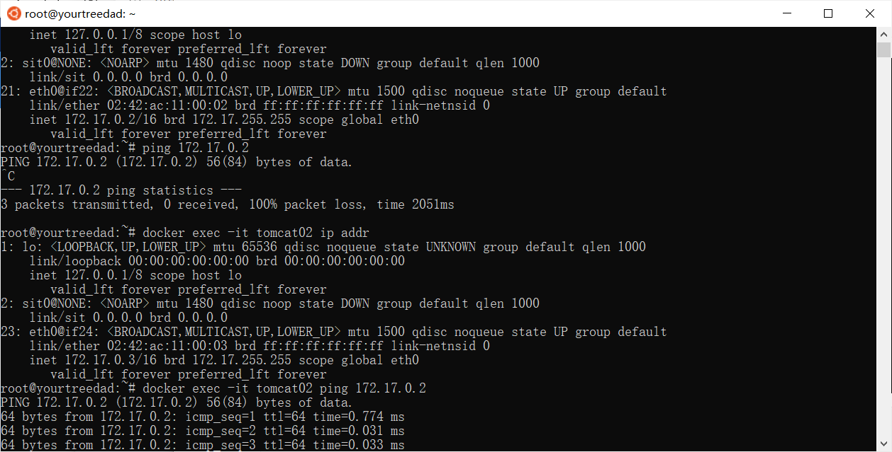

在linux中，tomcat01和宿主机和tomcat02可以相互ping通

在windows for docker中，tomcat01和tomcat02可以通，但是不能和宿主机ping通

结论：容器和容器之间是可以互相ping通的

在linux中，tomcat01和tomcat02是共用的一个路由器，即docker0

所有的容器不指定网络的情况下，都是docker0路由的，docker会给我们的容器分配一个默认的可用IP

0-255  A   B   C 

255.255.0.1/16  域

00000000.00000000.00000000.00000000

> 小结

docker使用的是linux桥接，宿主机中是一个docker容器的网桥，docker0

docker中的所有的网络接口都是虚拟的，虚拟的转发效率高！内网传递文件！

只要容器删除了，对应的网桥就没了


--link

> 思考一个场景，我们编写了一个微服务，database url = ip：

项目不重启，数据库ip换掉了，我们希望可以处理这个问题，可以通过名字来进行访问容器？

```shell
直接ping服务名是不行的
root@yourtreedad:~# docker exec -it tomcat02 ping tomcat01
ping: tomcat01: Name or service not known
解决？

通过--link 就可以解决了网络连通
root@yourtreedad:~# docker run -d --name tomcat03 --link tomcat02 tomcat
832afb5618b02262a5f9cbe48072941cc4784c009d0f91962b371c218afa31c0
root@yourtreedad:~# docker exec -it tomcat02 ping tomcat03
ping: tomcat03: Name or service not known
root@yourtreedad:~# docker exec -it tomcat03 ping tomcat02
```


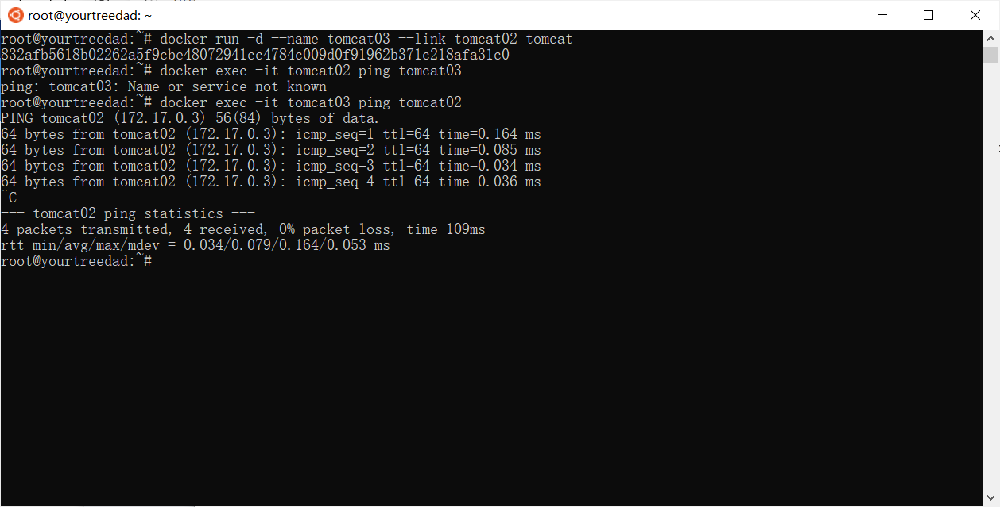


默认网关docker0 ，就是这里的172.17.0.1

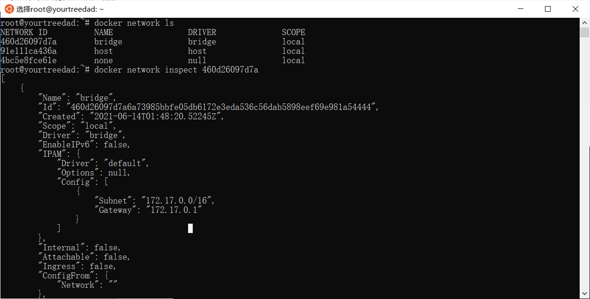


探究：inspect 容器id

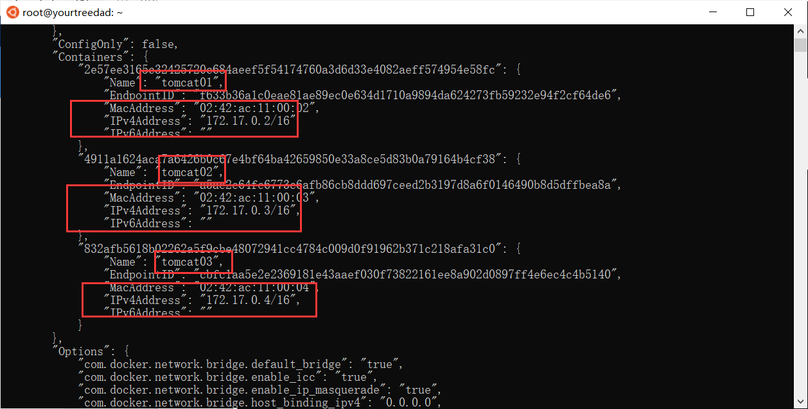


```shell
link的本质
查看hosts配置，在这里原理发现
root@yourtreedad:~# docker exec -it tomcat03 cat /etc/hosts
```

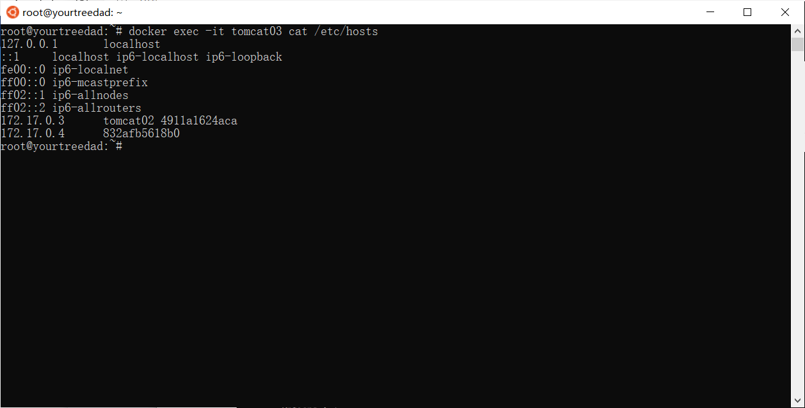

--link 就是我们在hosts配置中，增加了一个172.18.0.3 tomcat02 的映射

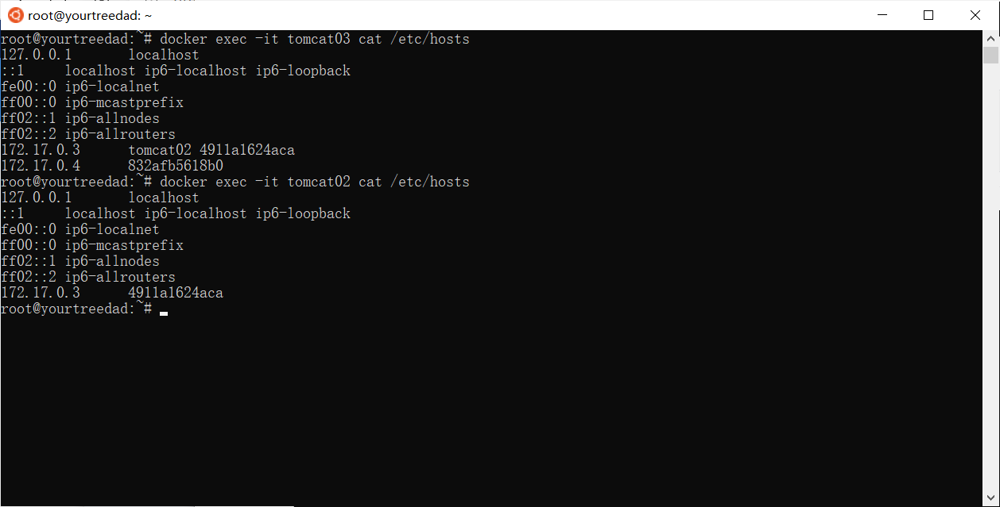

由于02没有使用--link，所以不能直接使用 服务名字来跳转

实际上就是host映射

我们现在使用docker已经不建议使用--link了！

需要自定义网络！不适用docker0！

docker0问题：他不支持容器名连接访问！


自定义网络

容器互联：

```shell
查看所有的docker网络
docker network ls

```

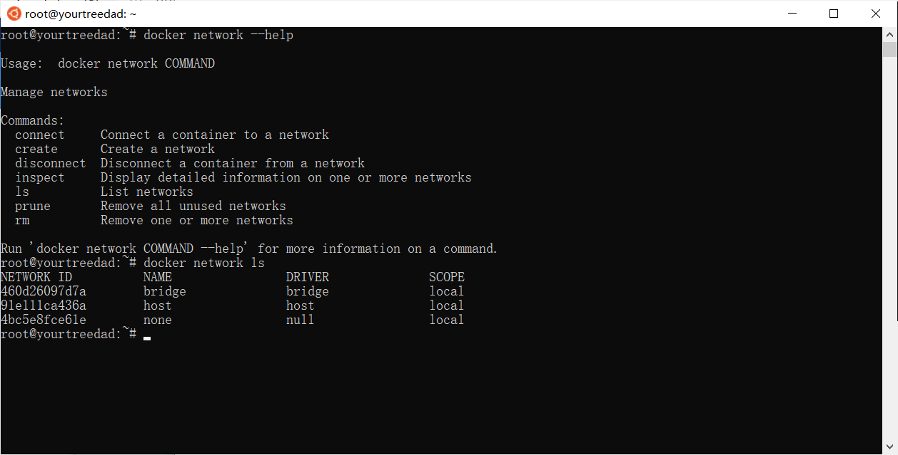

网络模式

bridge 网络桥接模式 搭桥：（默认，自己创建的推荐使用bridge模式）

none ：不配置网络

host：和宿主机共享网络

container：容器内网络连通！（用得少，局限很大）


测试

```shell
我们直接启动的命令 默认，这个我们看了就是我们的docker0
root@yourtreedad:~# docker run -d -P --name tomcat01 --net bridge tomcat
实际上不写--net也是默认的

docker0 特点，默认，域名不能访问 --link 可以打通连接！

我们可以自定义一个网络！

```

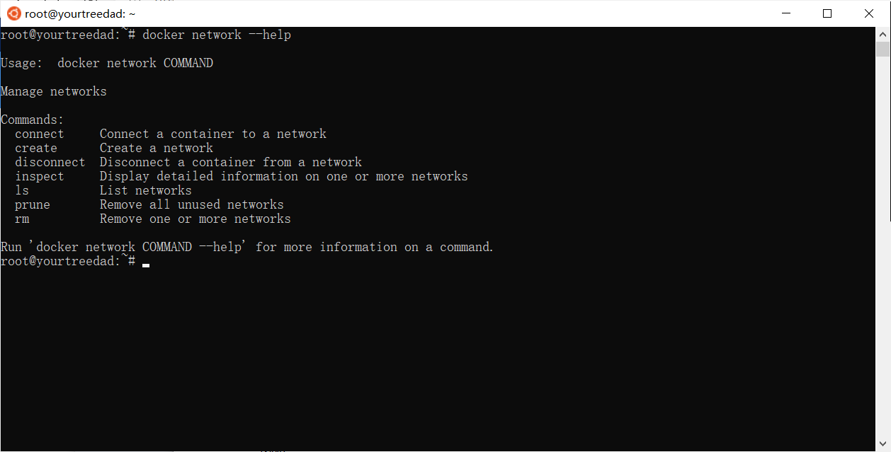

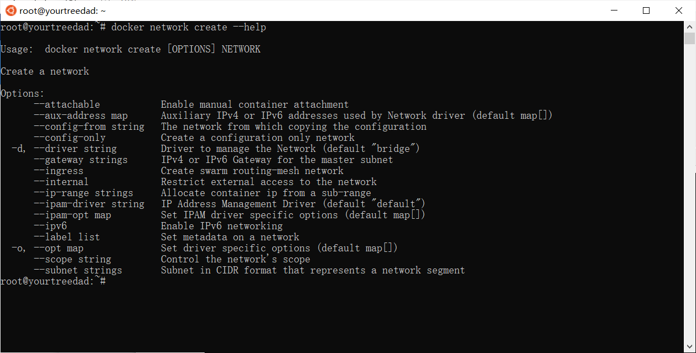

```shell
创建一个自定义网络
docker network create --driver bridge --subnet 192.168.0.0/16 --gateway 192.168.0.1 mynet 
桥接、子网、网关设置
我们自己的网络就创建好了！
```

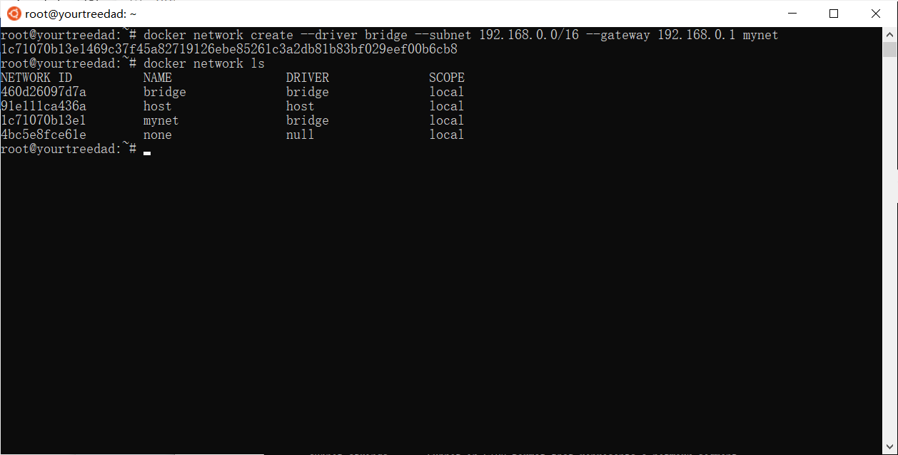

```shell
使用自己构建的网络来创建容器，塞进去
root@yourtreedad:~# docker run -d -P --name tomcat-net-01 --net mynet tomcat
8d24df7fb899de77db6b600aedbfacc32fdd161836dd638b56666ca2014ff5bf
root@yourtreedad:~# docker run -d -P --name tomcat-net-02 --net mynet tomcat
eee0d29dbed8e780487fcc4bf93f1b3a9ab5ad8ffac194861a3c2ee948d8ea9e
查看网络情况
root@yourtreedad:~# docker inspect mynet
```

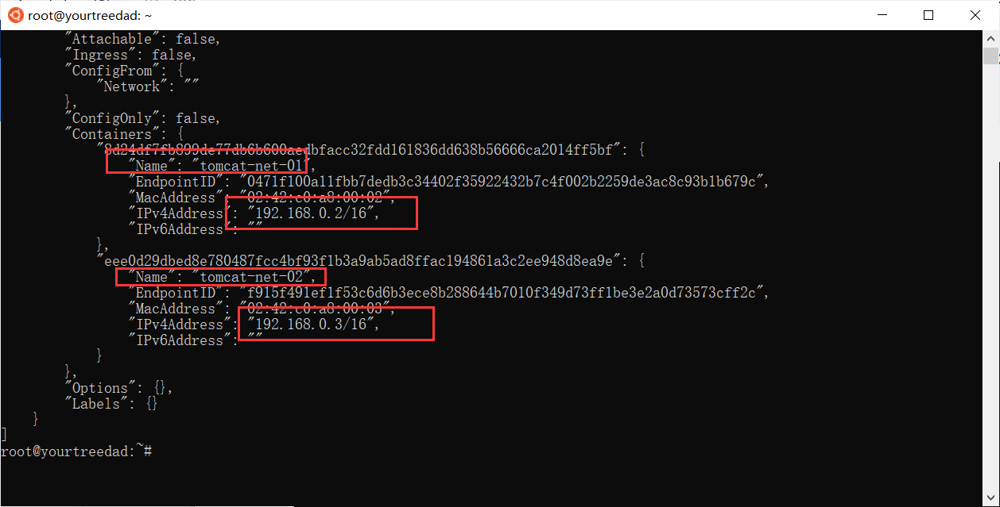

看看能不能ping通

```shell
现在不使用 --link也可以ping名字了！
root@yourtreedad:~# docker exec -it tomcat-net-01 ping 192.168.0.3

root@yourtreedad:~# docker exec -it tomcat-net-01 ping tomcat-net-02
```

我们自定义的网络docker都已经帮我们维护好了对应的关系，推荐我们平时这样使用网络！

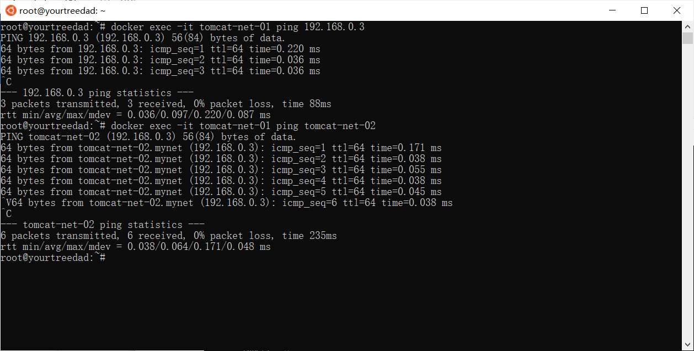


好处：

redis - 保证不同的集群使用不同的网络，保证集群是安全和健康的

mysql 


网络连通 

没有确保两个集群网络连通的情况下 ， 两个子网是无法相连的

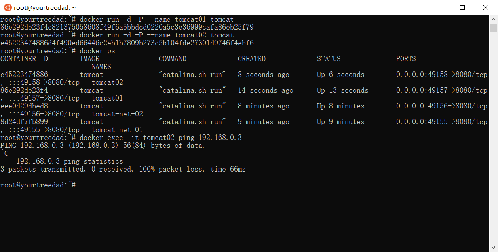

```shell
构建两个tomcat 但是默认是docker0网络下的
root@yourtreedad:~# docker run -d -P --name tomcat01 tomcat
86e292de23f4c821375058608f49f6a5bbdcd0220a5c3e36999cafa86eb25f79
root@yourtreedad:~# docker run -d -P --name tomcat02 tomcat
e45223474886d4f490ed66446c2eb1b7809b273c5b104fde27301d9746f4ebf6
而tomcat-net-01是在mynet下的，所以连不通
root@yourtreedad:~# docker exec -it tomcat02 ping 192.168.0.3

不能让docker0和mynet连通，这样不安全，要单独让tomcat01 和mynet连通
如何操作
docker network connect
测试打通 tomcat01 到 mynet

```

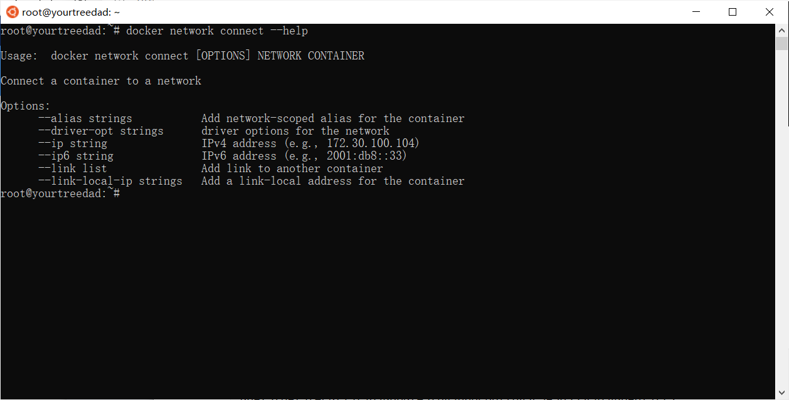

```shell
root@yourtreedad:~# docker network connect mynet tomcat01
root@yourtreedad:~# docker network inspect mynet
连通之后就是将tomcat01 放置到了 mynet 网络下？

一个容器两个ip地址！ 阿里云服务，公网ip 和 私网ip
```


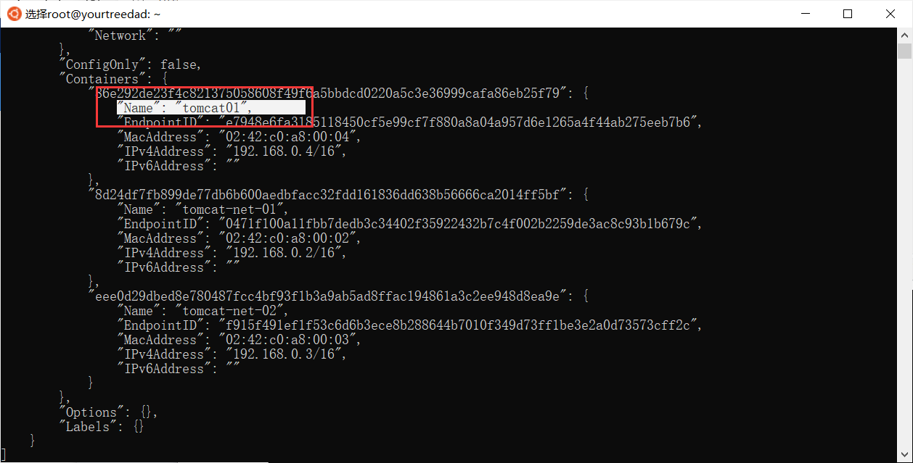

再试试

```shell
root@yourtreedad:~# docker exec -it tomcat01 ping tomcat-net-01
```

0102好像都可以打通

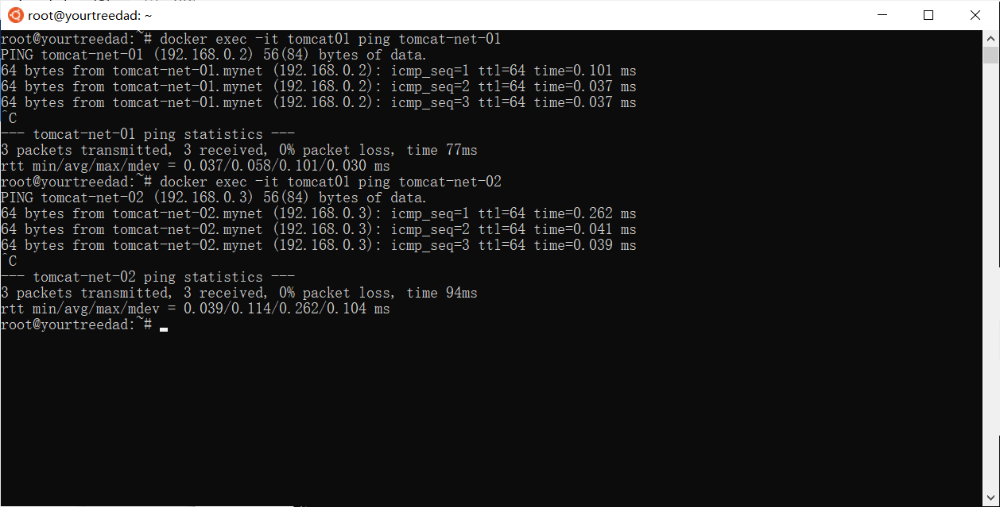

结论：假设要跨网络操作别人，就需要使用docker network connect 连通！


实战：部署redis集群

分片+高可用+负载均衡

shell脚本建立！

3主3从


1.建立网络

```shell
root@yourtreedad:/# docker network create redisnet --subnet 172.38.0.0/16


root@yourtreedad:/# docker network ls

root@yourtreedad:/# docker network inspect redisnet
```

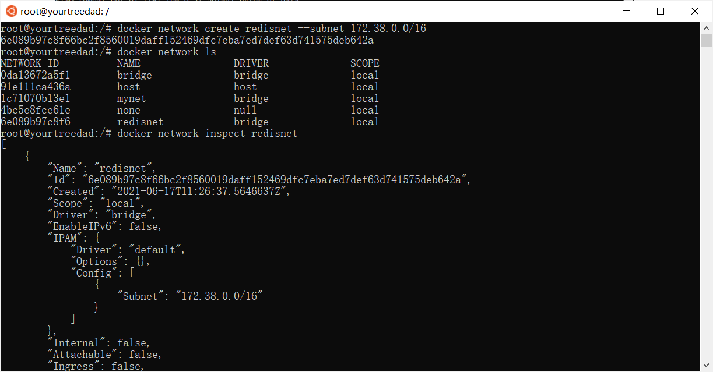

2.通过脚本创建六个redis配置

```shell
root@yourtreedad:/# 
for port in $(seq 1 6);
do
mkdir -p /mydata/redis/node-${port}/conf
touch /mydata/redis/node-${port}/conf/redis.conf
cat << EOF >>/mydata/redis/node-${port}/conf/redis.conf
port 6379
bind 0.0.0.0
cluster-enabled yes
cluster-config-file nodes.conf
cluster-node-timeout 5000
cluster-announce-ip 172.38.0.1${port}
cluster-announce-port 6379
cluster-announce-bus-port 16379
appendonly yes 
EOF
done
```

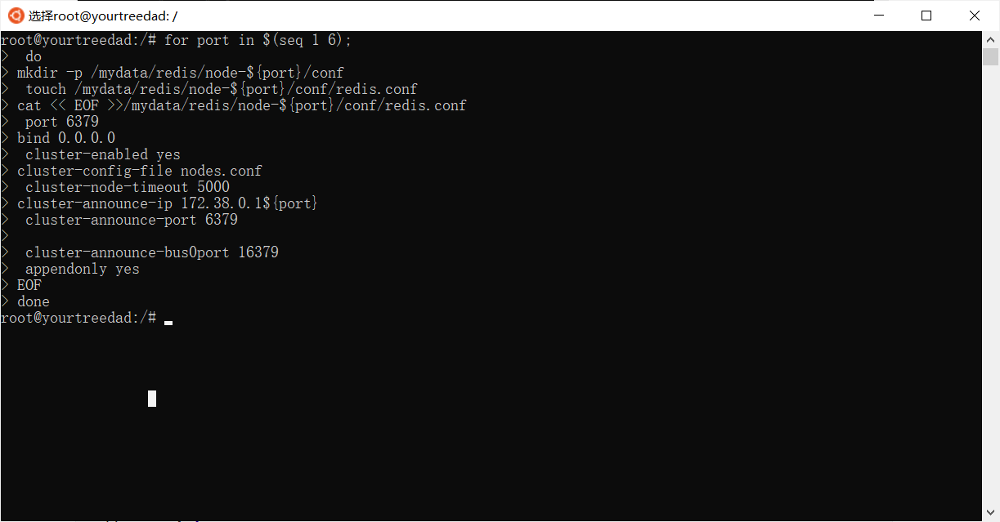


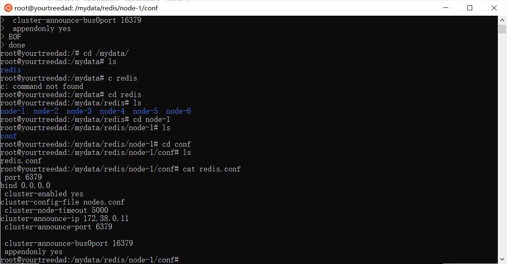


3.拉取镜像，启动容器，分配端口，数据卷映射

```shell
root@yourtreedad:/# docker run -p 6371:6379 -p 16371:16379 --name redis-1 -v /mydata/redis/node-1/data:/data -v /mydata/redis/node-1/conf/redis.conf:/etc/redis/redis.conf -d --net redisnet --ip 172.38.0.11 redis:5.0.9-alpine3.11 redis-server /etc/redis/redis.conf

docker run -p 6372:6379 -p 16372:16379 --name redis-2 -v /mydata/redis/node-2/data:/data -v /mydata/redis/node-2/conf/redis.conf:/etc/redis/redis.conf -d --net redisnet --ip 172.38.0.12 redis:5.0.9-alpine3.11 redis-server /etc/redis/redis.conf

docker run -p 6373:6379 -p 16373:16379 --name redis-3 -v /mydata/redis/node-3/data:/data -v /mydata/redis/node-3/conf/redis.conf:/etc/redis/redis.conf -d --net redisnet --ip 172.38.0.13 redis:5.0.9-alpine3.11 redis-server /etc/redis/redis.conf

docker run -p 6374:6379 -p 16374:16379 --name redis-4 -v /mydata/redis/node-4/data:/data -v /mydata/redis/node-4/conf/redis.conf:/etc/redis/redis.conf -d --net redisnet --ip 172.38.0.14 redis:5.0.9-alpine3.11 redis-server /etc/redis/redis.conf

docker run -p 6375:6379 -p 16375:16379 --name redis-5 -v /mydata/redis/node-5/data:/data -v /mydata/redis/node-5/conf/redis.conf:/etc/redis/redis.conf -d --net redisnet --ip 172.38.0.15 redis:5.0.9-alpine3.11 redis-server /etc/redis/redis.conf

docker run -p 6376:6379 -p 16376:16379 --name redis-6 -v /mydata/redis/node-6/data:/data -v /mydata/redis/node-6/conf/redis.conf:/etc/redis/redis.conf -d --net redisnet --ip 172.38.0.16 redis:5.0.9-alpine3.11 redis-server /etc/redis/redis.conf
```

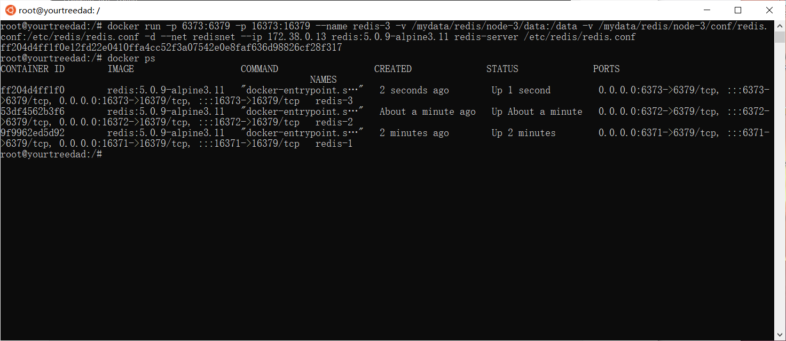

进入容器内部

```shell
root@yourtreedad:/# docker exec -it redis-1 /bin/sh
```

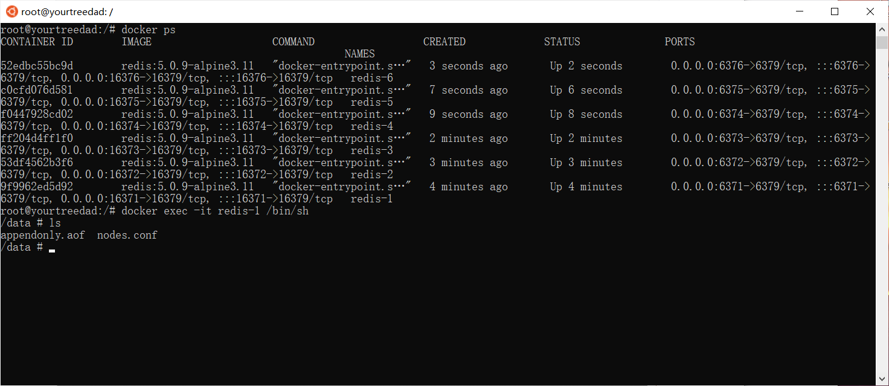

建立集群 切片

```shell
/data # redis-cli --cluster create 172.38.0.11:6379 172.38.0.12:6379 172.38.0.13:6379 172.38.0.14:6379 172.38.0.15:6379 172.38.0.16:6379 --clust
er-replicas 1
```

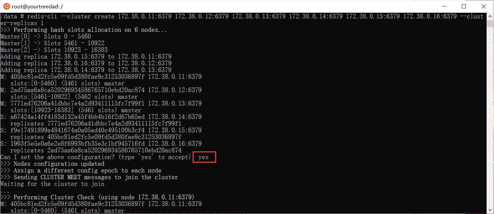

查看集群信息

```shell
/data # redis-cli -c
127.0.0.1:6379> cluster info


127.0.0.1:6379> cluster nodes


127.0.0.1:6379> set a b
```


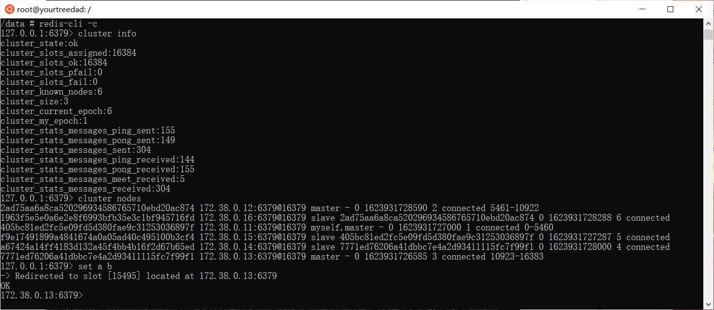

测试，停掉一个master主机redis会不会使用备机来顶替主机

```shell
root@yourtreedad:/# docker stop redis-3


root@yourtreedad:/# docker exec -it redis-1 /bin/sh

/data # redis-cli -c
127.0.0.1:6379> cluster info
127.0.0.1:6379> get a

```


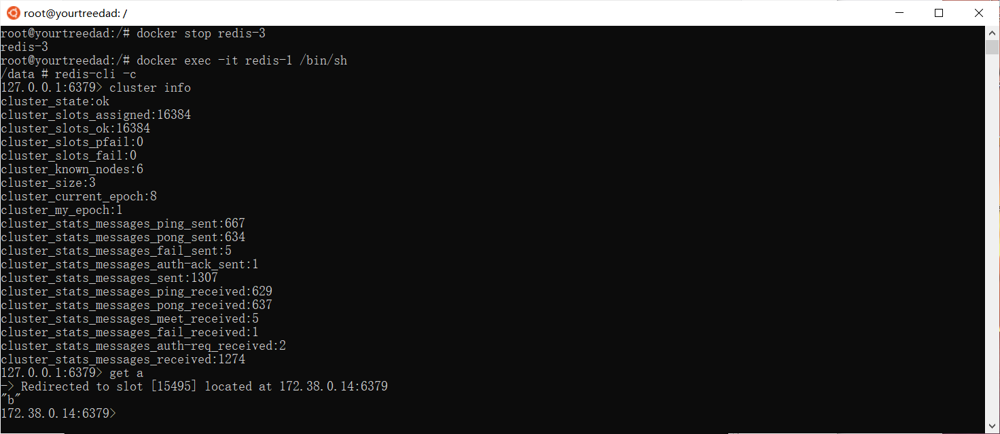


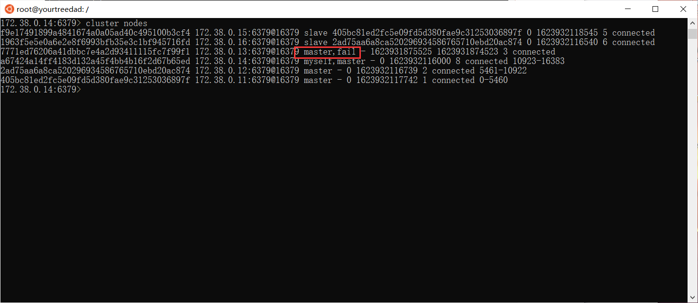


docker 搭建 redis集群完成！

我们使用了docker之后，所有的技术都会慢慢变得简单起来


springboot 微服务打包docker镜像

1.架构springboot项目

2.打包应用

3.编写dockerfile

4.构建镜像

5.发布运行！

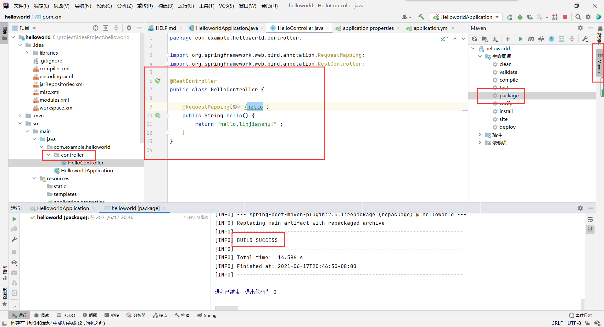


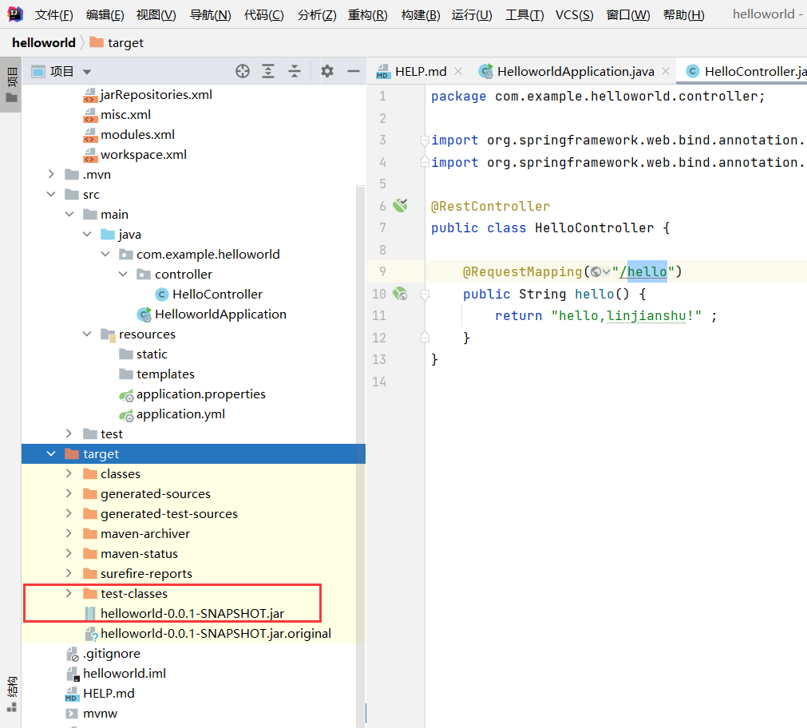


cmd测试

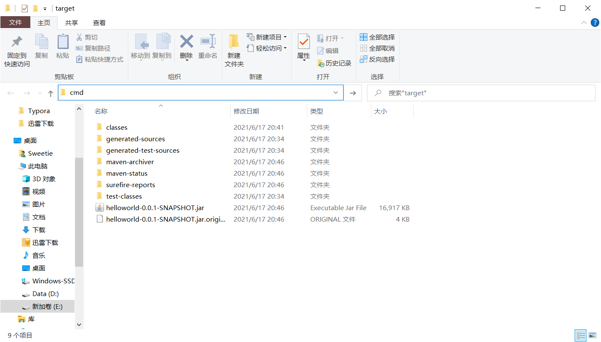


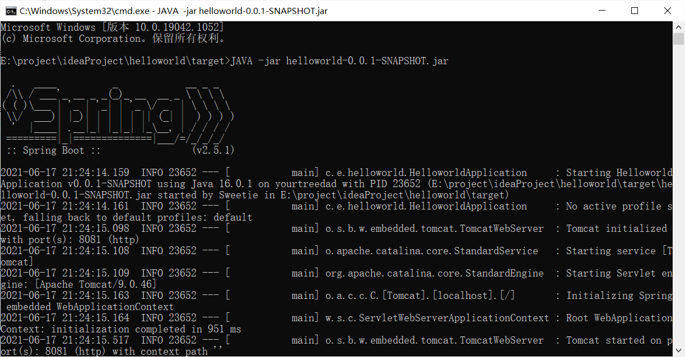


回到idea中编写dockerfile

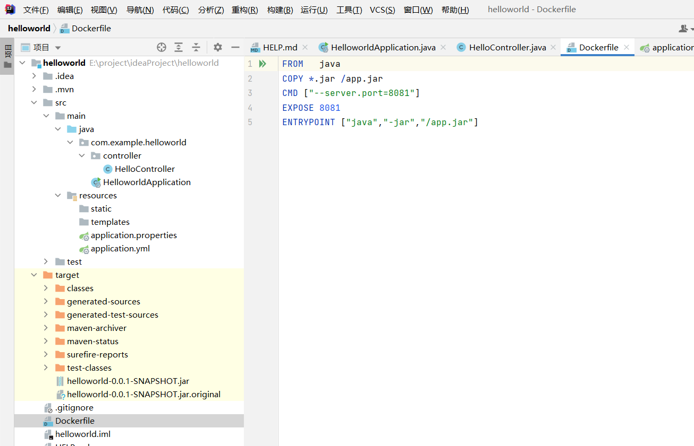


弄好之后连接linux ， 吧windows上的dockerfile和jar包传到linux服务器上，需要使用filezilla软件传输

linux服务器ip地址指令   ifconfig

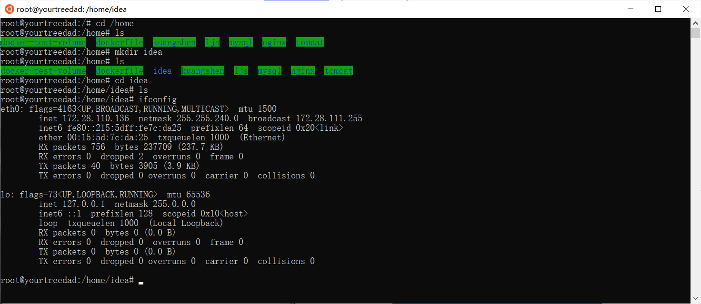

切换用户

把文件传到linux上

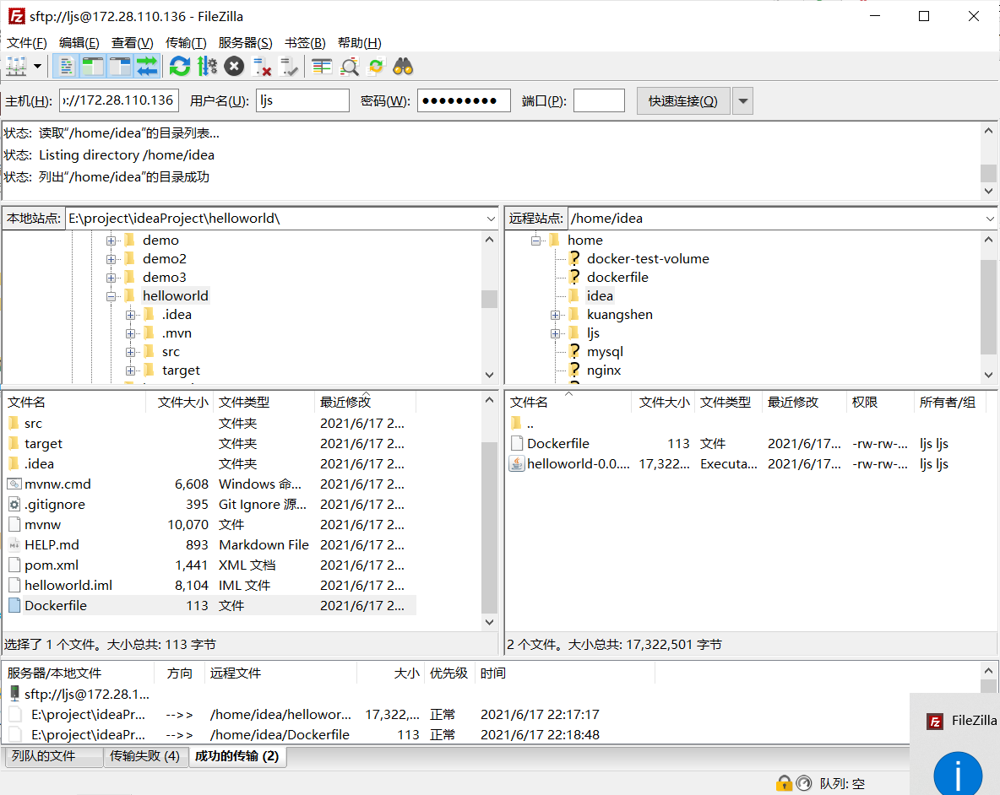


坑死了 ENTRYPOINT 与[]之间有个打空格

通过build 构建镜像

```shell
root@yourtreedad:/home/idea# docker build -f Dockerfile -t kuangshen666 .
```


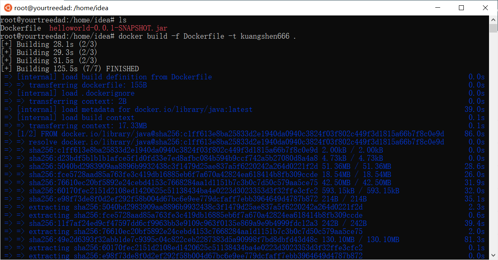


测试

```shell
root@yourtreedad:/home/idea# docker run -d --name kuangshen-springboot-web -P kuangshen666

root@yourtreedad:/home/idea# curl localhost:49158/hello
```


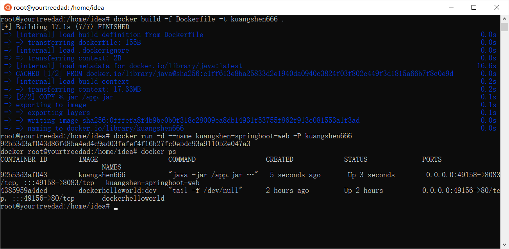


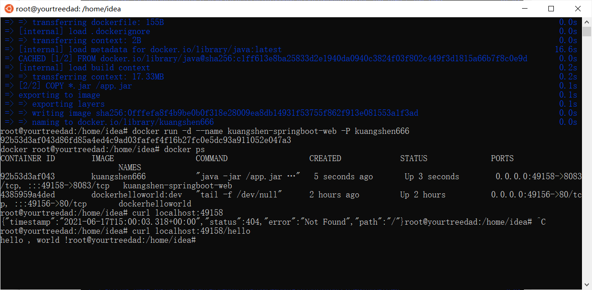


以后我们使用了Docker之后，给别人交付的就是一个镜像即可

预告：如果我们有很多镜像？100个


还要学


Docker Compost  


Docker Swarm


K8s


CI/CD 之 Jenkins


尝试基于ECS快速搭建docker环境

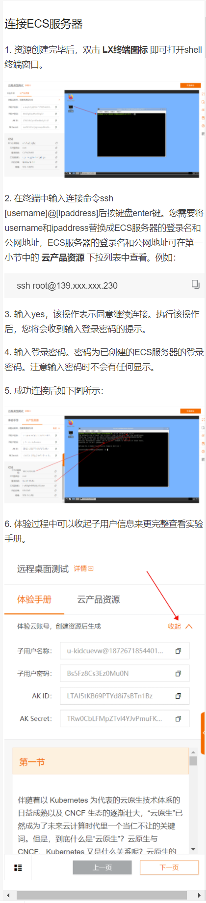

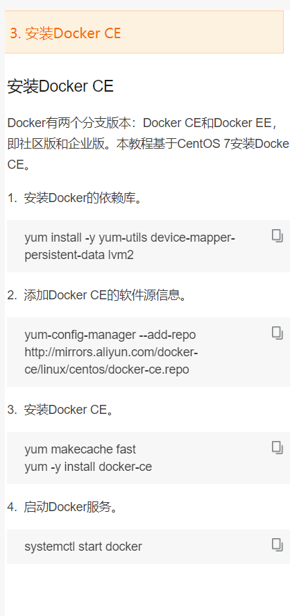

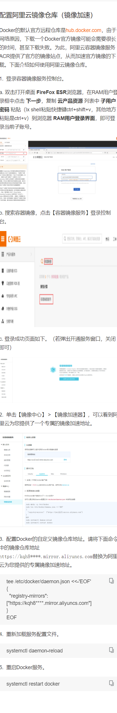

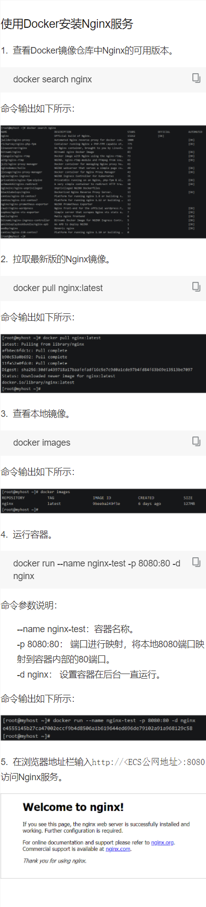


ECS云服务器新手上路

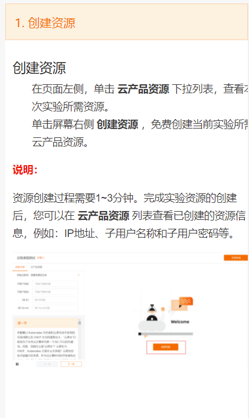


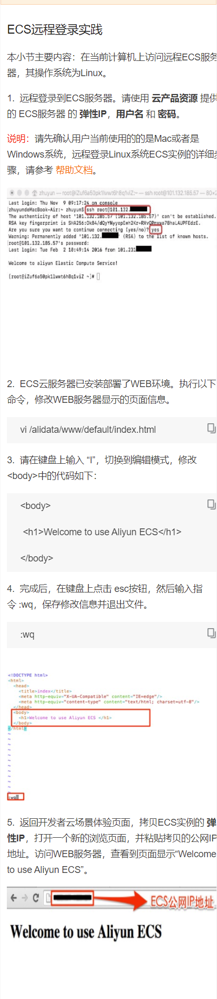


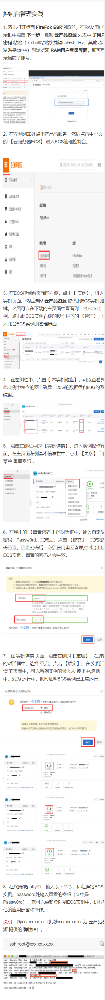


下面尝试部署了一下继恩的vue和nginx 

nginx使用挂载的方式-v 来实现对容器内部nginx配置文件的替换，

利用docker cp 来把dist文件拷贝进去

使用-p 的方式替换端口

```shell
root@yourtreedad:~# docker pull nginx
Using default tag: latest

latest: Pulling from library/nginx
b4d181a07f80: Already exists
66b1c490df3f: Pull complete
d0f91ae9b44c: Pull complete
baf987068537: Pull complete
6bbc76cbebeb: Pull complete
32b766478bc2: Pull complete
Digest: sha256:353c20f74d9b6aee359f30e8e4f69c3d7eaea2f610681c4a95849a2fd7c497f9
Status: Downloaded newer image for nginx:latest
docker.io/library/nginx:latest
root@yourtreedad:~#
root@yourtreedad:~# docker images
REPOSITORY               TAG                 IMAGE ID            CREATED             SIZE
nginx                    latest              4cdc5dd7eaad        10 days ago         133MB
yourtreedad/blazordemo   latest              aa1397c0af05        2 weeks ago         207MB
mysql                    latest              5c62e459e087        3 weeks ago         556MB


root@yourtreedad:~# cd ..
root@yourtreedad:/# pwd
/
root@yourtreedad:/# cd home
root@yourtreedad:/home# ls
blazortest    haierDemo  ljs      mvcwindowstest  nginx      tomcat
consoletest1  kuangshen  mvctest  mysql           nginxdemo  webapitest
root@yourtreedad:/home# cd nginxdemo
root@yourtreedad:/home/nginxdemo# ls
nginx-1.14.2  nginx-1.14.2.zip
root@yourtreedad:/home/nginxdemo# cd nginx-1.14.2
root@yourtreedad:/home/nginxdemo/nginx-1.14.2# ls
conf  contrib  dist  docs  html  logs  nginx.exe  temp

root@yourtreedad:/home/nginxdemo/nginx-1.14.2/conf# docker run --name nginxdemo2 -p 8889:8765 -v /home/nginxdemo/nginx-1
.14.2/conf/myconf1.conf:/etc/nginx/nginx.conf:ro -d nginx
6bed1ace8c9942f62e61ea18f7f632973fa1d7536ac3a6d1ada11e3d2c093b6e
root@yourtreedad:/home/nginxdemo/nginx-1.14.2/conf# docker cp /home/nginxdemo/nginx-1.14.2/dist 6bed1ace8c9942f62e:/etc/nginx
root@yourtreedad:/home/nginxdemo/nginx-1.14.2/conf# docker exec -it 6bed1ace8c9942f62e61ea18f7f632973fa1d7536ac3a6d1ada11e3d2c093b6e /bin/bash
ls
ls
root@6bed1ace8c99:/# ls
bin   docker-entrypoint.d   home   media  proc  sbin  tmp
boot  docker-entrypoint.sh  lib    mnt    root  srv   usr
dev   etc                   lib64  opt    run   sys   var
root@6bed1ace8c99:/# cd /etc
root@6bed1ace8c99:/etc# cd nginx
root@6bed1ace8c99:/etc/nginx# ls
conf.d  dist  fastcgi_params  mime.types  modules  nginx.conf  scgi_params  uwsgi_params
root@6bed1ace8c99:/etc/nginx# cat nginx.conf

#user  nobody;
c553c6ba5f13: Pushed

#error_log  logs/error.log;
#error_log  logs/error.log  notice;
Head https://registry-1.docker.io/v2/yourtreedad/nginxcontaindist/blobs/sha256:4d7903a7ce4bdf92461e0dd87d1fb712facb6881df3cbce68f55f4ec54791546: dial tcp: lookup registry-1.docker.io on 192.168.65.5:53: no such host
root@yourtreedad:/home/nginxdemo/nginx-1.14.2/conf#


events {
    worker_connections  1024;
}


http {
    include       mime.types;
    default_type  application/octet-stream;

    #log_format  main  '$remote_addr - $remote_user [$time_local] "$request" '
    #                  '$status $body_bytes_sent "$http_referer" '
    #                  '"$http_user_agent" "$http_x_forwarded_for"';

    #access_log  logs/access.log  main;

    # server {
    #     listen 8765;
    #     listen localhost;
    #     location / {
    #         root dist;
    #         index index.html index.htm;
    #     }
    # }

    sendfile        on;
    #tcp_nopush     on;

    #keepalive_timeout  0;
    keepalive_timeout  65;

    #gzip  on;

    server {
        listen       8765;
        server_name  localhost;

        #charset koi8-r;

        #access_log  logs/host.access.log  main;

        location / {
            root   dist;
            index  index.html index.htm;
        }

        #error_page  404              /404.html;

        # redirect server error pages to the static page /50x.html
        #
        error_page   500 502 503 504  /50x.html;
        location = /50x.html {
            root   html;
        }

        # proxy the PHP scripts to Apache listening on 127.0.0.1:80
        #
        #location ~ \.php$ {
        #    proxy_pass   http://127.0.0.1;
        #}

        # pass the PHP scripts to FastCGI server listening on 127.0.0.1:9000
        #
        #location ~ \.php$ {
        #    root           html;
        #    fastcgi_pass   127.0.0.1:9000;
        #    fastcgi_index  index.php;
        #    fastcgi_param  SCRIPT_FILENAME  /scripts$fastcgi_script_name;
        #    include        fastcgi_params;
        #}

67f2e8eb8c87: Pushing [>                                                  ]  77.82kB/4.758MB
        # concurs with nginx's one
        #
        #location ~ /\.ht {
        #    deny  all;
        #}
    }


    # another virtual host using mix of IP-, name-, and port-based configuration
    #
    #server {
    #    listen       8000;
    #    listen       somename:8080;
    #    server_name  somename  alias  another.alias;

    #    location / {
    #        root   html;
    #        index  index.html index.htm;
    #    }
    #}


    # HTTPS server
    #
    #server {
    #    listen       443 ssl;
    #    server_name  localhost;

    #    ssl_certificate      cert.pem;
    #    ssl_certificate_key  cert.key;

    #    ssl_session_cache    shared:SSL:1m;
    #    ssl_session_timeout  5m;

    #    ssl_ciphers  HIGH:!aNULL:!MD5;
    #    ssl_prefer_server_ciphers  on;

    #    location / {
    #        root   html;
    #        index  index.html index.htm;
    #    }
    #}

}

root@6bed1ace8c99:/etc/nginx# exit
exit

root@yourtreedad:/home/nginxdemo/nginx-1.14.2/conf# docker commit -a="yourtreedad" -m="jien's ui add ljs's deploy new nginx that contains dist" 6bed1ace8c nginx:1.0
sha256:4d7903a7ce4bdf92461e0dd87d1fb712facb6881df3cbce68f55f4ec54791546
root@yourtreedad:/home/nginxdemo/nginx-1.14.2/conf# docker push yourtreedad/nginx:1.0
The push refers to repository [docker.io/yourtreedad/nginx]
An image does not exist locally with the tag: yourtreedad/nginx
root@yourtreedad:/home/nginxdemo/nginx-1.14.2/conf# docker tag nginx:1.0 yourtreedad/nginxcontaindist:1.0
root@yourtreedad:/home/nginxdemo/nginx-1.14.2/conf# docker push yourtreedad/nginxcontaindist:1.0
The push refers to repository [docker.io/yourtreedad/nginxcontaindist]
67f2e8eb8c87: Preparing
9d1af766c818: Preparing
d97733c0a3b6: Preparing
c553c6ba5f13: Preparing
48b4a40de359: Preparing
ace9ed9bcfaf: Waiting
764055ebc9a7: Waiting
```

这是部署在本地 ， 现在开始演示部署到云服务器上


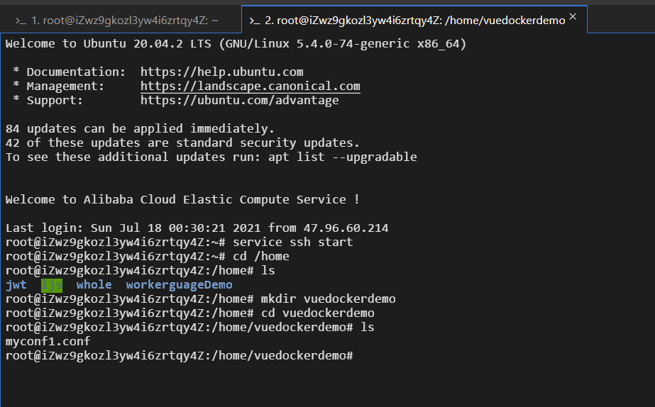

通过ssh把配置文件传进去

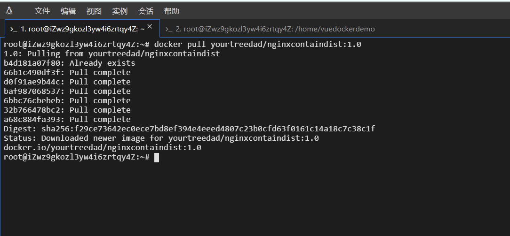

从dockerhub上拉取镜像


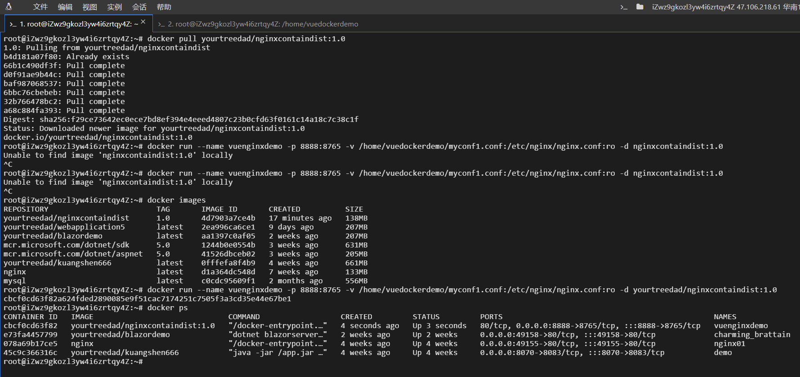


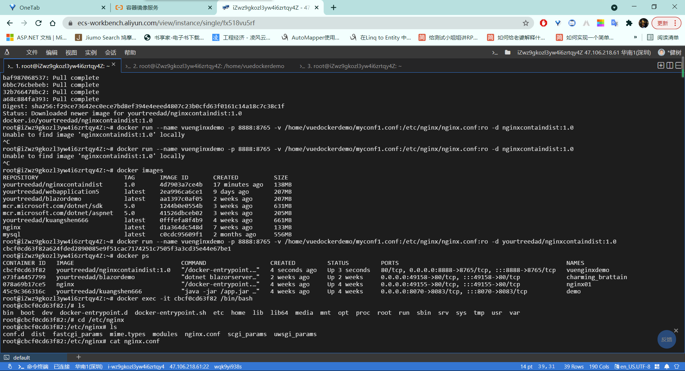

http://47.106.218.61:8888/

