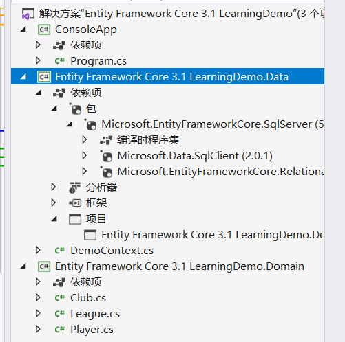
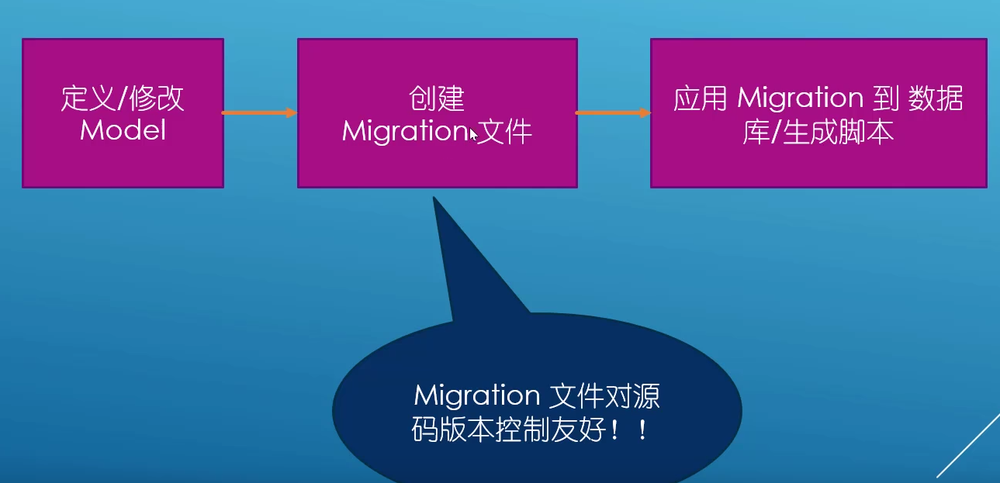
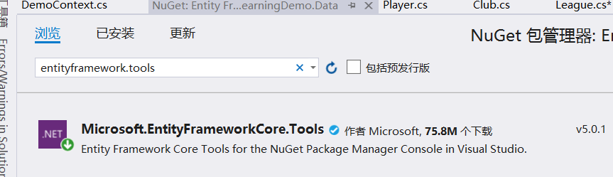
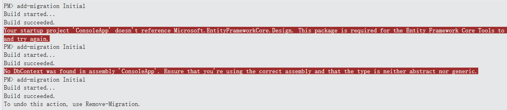
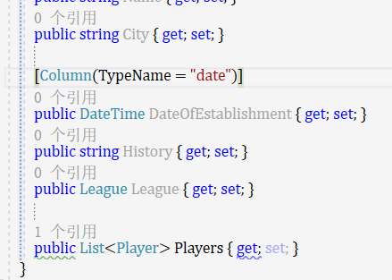
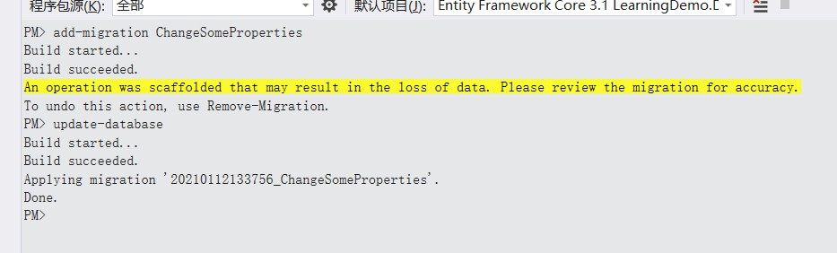
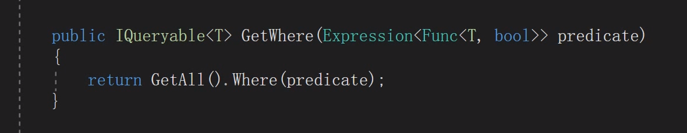
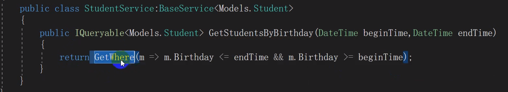

## Entity Framework Core 3.1 学习文档

- by 软件工艺师
- 写model类



- 安装.netcore sqlserver包 继承dbcontext 作映射

```c#
   public DbSet<League> Leagues { get; set; }
        public DbSet<Club> Clubs { get; set; }
        public DbSet<Player> Players { get; set; }
```

- 重载方法，指定数据库连接字符串

```c#
  protected override void OnConfiguring(DbContextOptionsBuilder optionsBuilder)
        {
            optionsBuilder.UseSqlServer(
                "data source = .; initial catalog = Entity Framework Core 3.1 LearningDemo; persist security info = True; user id = sa; password = 123456; MultipleActiveResultSets = True; "); 
        }
```



- 安装nuget包，便于生成migration文件



- 程序包管理器控制台



修改操作

基于注解



修改数据库






**通过where 的expression委托表达式,传进来这个就好了,这样会方便很多啊**


asnotracking这样直接就成游离态了


在seed方法中 添加 addorupdate可以直接往数据库里直接添加测试数据




