## Git学习文档

学习git之前，我们需要先明白一个概念，版本控制！

#### 版本控制

> 什么是版本控制 版本迭代 版本管理器

版本控制（revision control）是一种在开发的过程中用于管理我们对文件、目录或工程等内容的修改历史，方便查看更改历史记录，备份一遍恢复以前的版本的软件工程技术。

- 实现跨区域多人协同开发
- 追踪和记载一个或者多个文件的历史记录
- 组织和保护你的源代码和文档
- 统计工作量
- 并行开发、提高开发效率
- 跟踪记录整个软件的开发过程
- 减轻开发人员的负担，节省时间，同时降低人为错误

简单说就是用于管理多人协同开发项目的技术。

没有进行版本控制或者版本控制本身缺乏正确的流程管理，在软件开发过程中将引入很多问题，如关键代码的冗余，软件过程的事物性，软件开发过程中的并发性、软件源代码的安全性，以及软件的整合等问题。


多人开发就必须要使用版本控制，否则代价比较大


> 常见的版本控制工具

主流的版本控制器有如下这些：

- Git
- SVN(subversion)
- CVS(concurrent versions system)
- VSS(Microsoft Visual SourceSafe)
- TFS(team Foundation Server)
- Visual Studio Online

版本控制产品非常的多（preforce 、 rational clearcase 、 rcs 、serena dimention 、 svk 、bitkeeper、 monotone 、 bazaar 、 mercurial 、 sourcegear vault），现在影响力最大且使用最广泛的是git和svn

> 版本控制分类

1. 本地版本控制

   记录文件每次的更新，可以对每个版本做一个快照，或者记录补丁文件，适合个人用，如RCS

   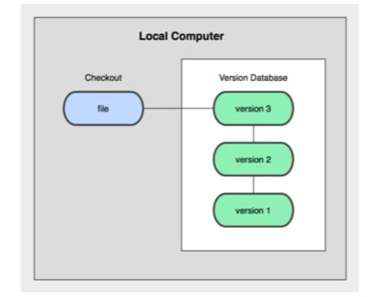

2. 集中版本控制

   所有的版本数据都保存在服务器上，协同开发者从服务器上同步更新或上传自己的修改

   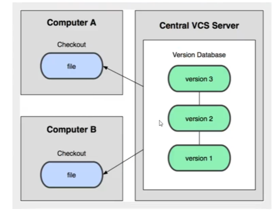

   所有的版本数据都存在服务器上，用户的本地只有自己以前所同步的版本，如果不连网的话，用户就看不到历史版本，也无法切换版本验证问题，或在不同分支工作。而且，所有数据都保存在单一的服务器上，有很大风险这个服务器会损坏，这样就会丢失所有的数据，当然可以定期备份。代表产品有：SVN、CVS、VSS

3. 分布版本控制 “GIT”

每个人都拥有全部的代码 安全隐患

所有版本信息仓库全部同步到本地的每个用户，这样就可以在本地查看所有版本历史，可以离线在本地提交，只需在连网时push到相应的服务器或其他用户那里。由于每个用户那里保存的都是所有的版本数据，只要有一个用户的设备没有问题，就可以恢复所有的数据，但这增加了本地存储空间的占用

不会因为服务器损坏或者网络问题，造成不能工作的情况！

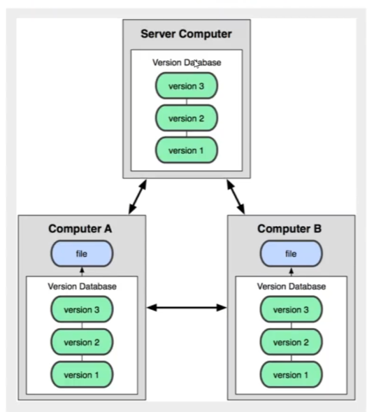

> git和svn最主要区别

svn是集中式版本控制系统，版本库是集中放在中央服务器的，而工作的时候，用的都是自己的电脑，所有首先要从中央服务器得到最新的版本，然后工作，完成工作后，需要吧自己做完的推送到中央服务器。集中式版本控制是必须连网才能工作，对网络带宽要求较高。

git是分布式版本控制系统，没有中央服务器，每个人的电脑就是一个完整的版本库，工作的时候不需要联网了，因为版本都在自己的电脑上，协同的方法是这样的：比如说自己在电脑上修改了文件A，其他人也在电脑上修改了文件A，这时，你们俩之间只需要吧各自的修改推送给对方，就可以相互看到对方的修改了。git可以直接看到更新了那些代码和文件！！

Git是目前世界上最先进的分布式版本控制系统。

 

### 聊聊git的历史

同生活中的许多伟大事物一样，git诞生于一个极富纷争大举创新的时代。

linux内核开源项目有着为数众多的参与者，绝大多数的linux内核维护工作都花在了提交补丁和保存归档的繁琐事务上1991-2002年，到了2002年，整个项目组开始启用一个专有的分布式版本控制系统bitkeeper来管理和维护代码。

到了2005年，开发bitkeeper的商业公司通linux内核开源社区的合作关系结束，她们收回了linux内核社区免费使用bitkeeper的权力。这就迫使linux开源社区（特别是linux的缔造者linux torvalds）基于使用bitkeeper时的经验教训，开发出了自己的版本系统。也就是后来的git！

git是目前世界上最先进的分布式版本控制系统。

git开源、免费，最初git是为了辅助linux内核开发的，来替代bitkeeper。


### git环境配置

> 软件下载

打开git，下载对应操作系统的版本

所有东西下载慢的话就去找镜像！

官网下载太慢，我们可以使用淘宝镜像下载

卸载

直接反安装、然后清理环境变量


安装，无脑安装


git bash ： unix与linux风格的命令行，使用最多，推荐最多

git cmd ： windows风格的命令行

git gui ： 图形界面的git ， 不建议初学者使用，尽量先熟悉常用命令


> 基本的linux命令学习

1. cd： 改变目录
2. cd  .. 回退到上一个目录，直接cd进默认目录
3. pwd  显示当前所在的目录路径
4. ls （ll） 列出当前目录中的所有文件，只不过ll列出的内容更为详细
5. touch 新建一个文件 
6. rm 删除一个文件
7. mkdir 新建一个目录 ， 就是新建一个文件夹
8. rm - r 删除一个文件夹 rm-r src 就是删除src目录
9. mv 移动文件 
10. reset 重新初始化终端、清屏
11. clear清屏
12. history查看命令历史
13. help帮助
14. exit 退出
15. #''  表示注释

平时一定要多使用这些命令

> git配置

所有的配置文件，其实都保存在本地！

查看配置 git config -l 

 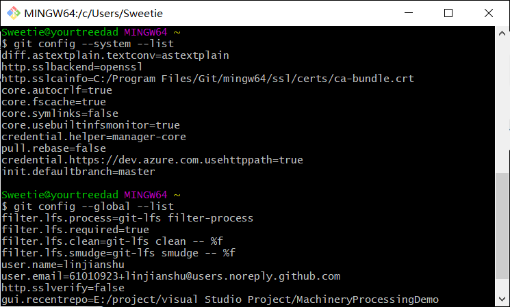


用户名是必须要有的

git相关的配置文件

1. git\etc\gitconfig: git 安装目录下的gitconfig --system系统级
2. users\administrator\.gitconfig 只适用于当前登陆用户的配置 --global全局 这里可以直接编辑配置文件，通过命令设置后会响应到这里


> 设置用户名与邮箱（用户标识、必要）

git config --global user.name "linjianshu"

git config --global user.email 1018814650@qq.com


### Git基本理论（核心）

> 工作区域

git本地有三个工作区域：工作目录（working directory）、暂存区（stage/index）、资源库（repository或Git Directory）。如果在加上远程的git仓库（Remote Directory）就可以分为四个工作区域。文件在这四个区域质检的转换关系如下：

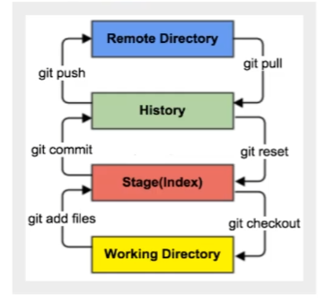

-  workspace：工作区，就是你平时存放项目代码的地方
- stage：暂存区，用于临时存放你的改动，事实上它只是一个文件，保存即将提交到文件列表信息
- history：仓库区（或本地仓库），就是安全存放数据的位置，这里面有你提交的所有版本的数据。其中HEAD指向最新放入的版本
- remote：远程仓库，托管代码的服务器，可以简单的认为是你项目组中的一台电脑用于远程数据交换本地的三个区域确切的说应该是git中HEAD指向的版本

master 主分支

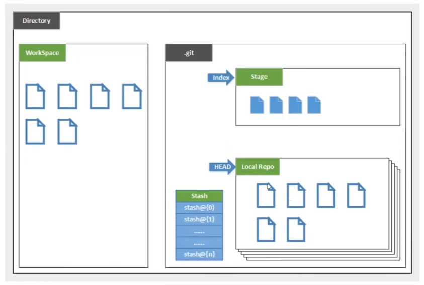

- directory ： 使用git管理的一个目录，也就是一个仓库，包含我们的工作空间和git的管理空间。
- workspace：需要通过git进行版本控制的目录和文件，这些目录和文件组成了工作空间
- .git： 存放git管理信息的目录，初始化仓库的时候自动创建
- index/stage： 暂存区，或者叫待提交更新区，在提交进入repo之前，我们可以把所有的更新放在暂存区。
- local repo：本地仓库，一个存放在本地的版本库；HEAD会只是当前的开发分支(branch)
- Stash：隐藏，是一个工作状态保存栈，用于保存/恢复 WorkSpace中的临时状态。


> 工作流程

git的工作流程一般是这样的:

1. 在工作目录中添加、修改文件；
2. 将需要进行版本管理的文件放入暂存区域；
3. 将暂存区域的文件提交到git仓库

因此，git管理的文件有三种状态：已修改(modified) , 已暂存(staged) , 已提交(committed)

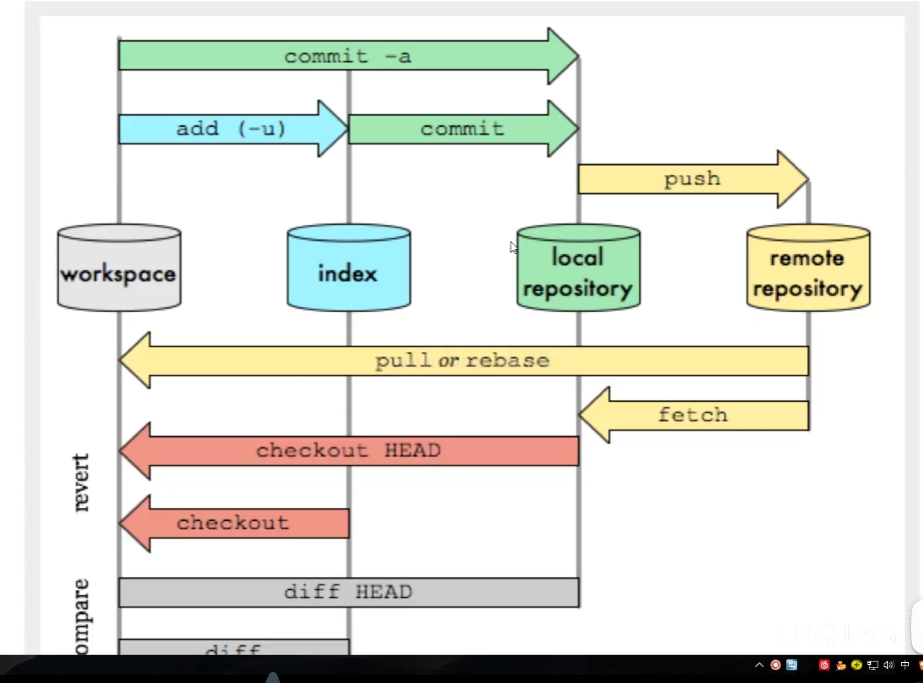

git add .

git commit 

git push

### git项目搭建

> 创建工作目录与常用指令

工作目录（workspace）一般就是你希望git帮助你管理的文件夹，可以是你项目的目录，也可以是一个空目录，建议不要有中文。

日常使用只要记住下图6个命令：

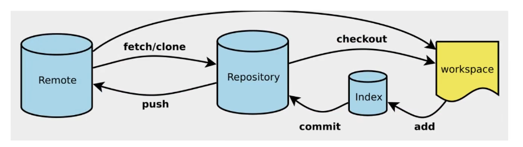

> 本地仓库搭建

创建本地仓库的方法有两种：一种是创建全新的仓库，另一种是克隆远程仓库

1.创建全新的仓库，需要用git管理的项目的根目录执行：

```shell
# 在当前目录新建一个git代码库
$ git init
```

2.执行后可以看到，仅仅在项目目录多出了一个.git目录，关于版本等的所有信息都在这个目录里面。

> 克隆远程仓库

1.另一种方式是克隆远程目录，由于是将远程服务器上的仓库完全镜像一份至本地！

```shell
# 克隆一个项目和它的整个代码历史（版本信息）
 git clone [url]
```

2.去gitee或者github上克隆一个试试看

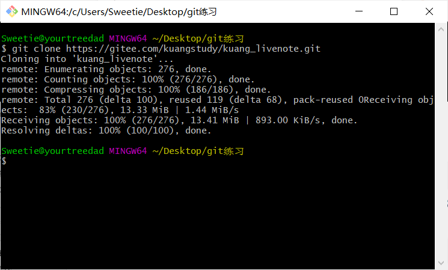

### git文件操作

> 文件4种状态

版本控制就是对文件的版本控制，要对文件进行修改、提交等操作，首先要知道文件当前在什么状态，不然可能会提交了现在还不想提交的文件，或者提交的文件没提交上。

- untracked：未跟踪，此文件在文件夹中，但并没有加入到git库，不参与版本控制，通过 git add 状态变为staged
- unmodify：文件已经入库，未修改，即版本库中的文件快照内容与文件夹中完全一致，这种类型的文件有两种去处，如果它被修改，而变为modified ， 如果使用 git rm 移出版本库，则成为untracked文件
- modified：文件已修改，仅仅是修改，并没有进行其他的操作，这个文件也有两个去处，通过git add 可进入暂存stagged状态，使用git checkout 则丢弃修改过，返回到unmodifiy状态，这个git checkout即从库中取出文件，覆盖当前修改！
- staged：暂存状态， 执行git commit，则将修改同步到数据库中，这时库中的文件和本地文件又变为一致，文件为unmodify状态，执行git reset HEAD filename取消暂存，文件状态为modified


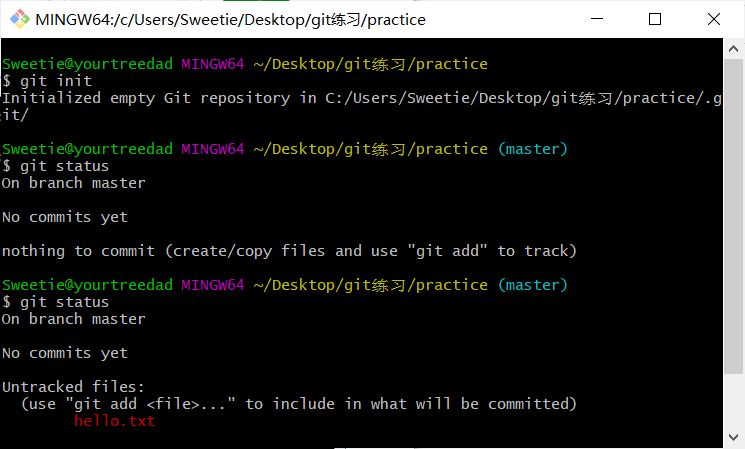


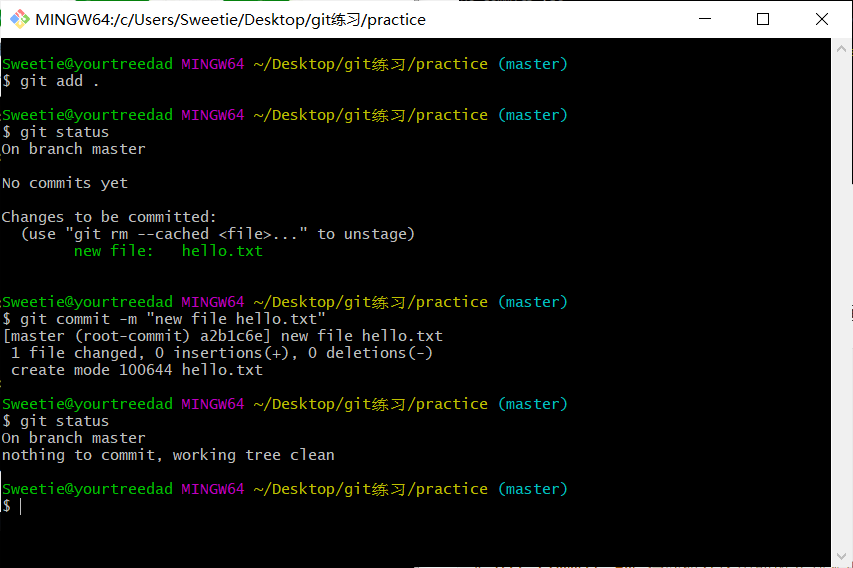


> 查看文件状态

上面说文件有四种状态，通过如下命令可以查看到文件的状态：

```shell
# 查看指定文件状态
git status [filename]

# 查看所有文件状态
git status 

# git add . 添加所有文件到暂存区
# git commit -m 提交暂存区中的内容到本地仓库 -m 提交信息
```


> 忽略文件

有些时候我们不想吧某些文件纳入进版本控制中，比如数据库文件，临时文件，设计文件等

在主目录下建立.gitignore文件 ， 此文件有如下规则：

1.忽略文件中的空行或以#号开始的行将会被忽略

2.可以使用linux通配符。例如星号*代表任意多个字符，问号？代表一个字符，方括号[abc]代表可选字符范围，大括号({string1},{string2})代表可选的字符串等

3.如果名称的最前面有一个感叹号！，表示例外规则，将不被忽略

4.如果名称的最前面是一个路径分隔符/，表示要忽略的此文件在此目录下，而子目录中的文件不忽略。

5.如果名称的最后面是一个路径分隔符/，表示要忽略的是此目录下该名称的子目录，而非文件（默认文件或目录都忽略）


```shell
# 为注释
*.txt  #忽略所有 .txt 结尾的文件，这样的话上传就不会被选中
!llib.txt #但lib.txt除外
/temp  #仅忽略项目根目录下的todo文件，不包括其他目录temp
build/ #仅忽略build/目录下的所有文件
doc/*.txt #会忽略 doc/notes.txt 但不包括doc/server/arch.txt
```


### 使用码云

> github是有墙的，比较慢，在国内的话，我们一般使用gitee，公司中有时候会搭建自己的gitlab服务器

1.注册登陆码云，完善个人信息

这个其实可以作为大家未来找工作的

2.设置本机绑定ssh公钥，实现免密码登陆！（免密码登陆，这一步挺重要的，码云是远程仓库，我们是平时工作在本地仓库！）

```shell
# 进入C:\Users\Sweetie\.ssh 目录
# 生成公钥
ssh-keygen
```

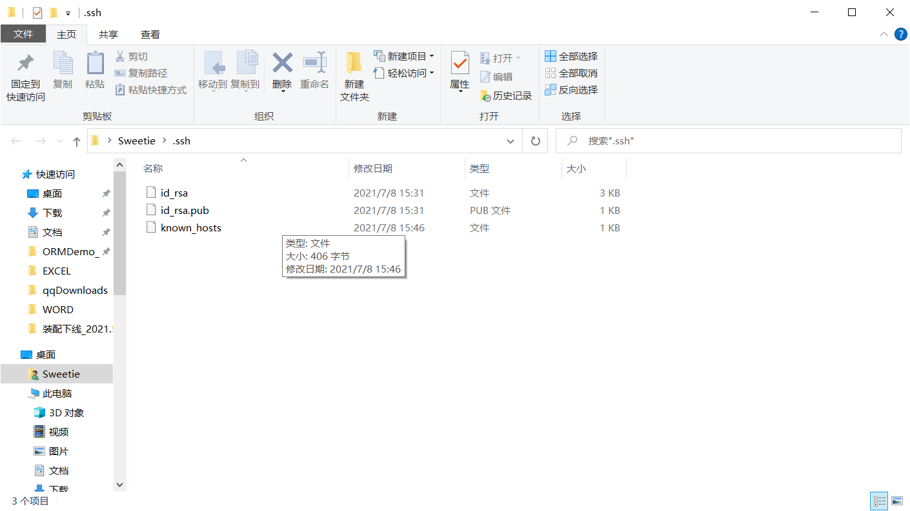


使用ssh-keygen -t rsa 命令

3.将公钥信息public key 添加到码云账户中即可！

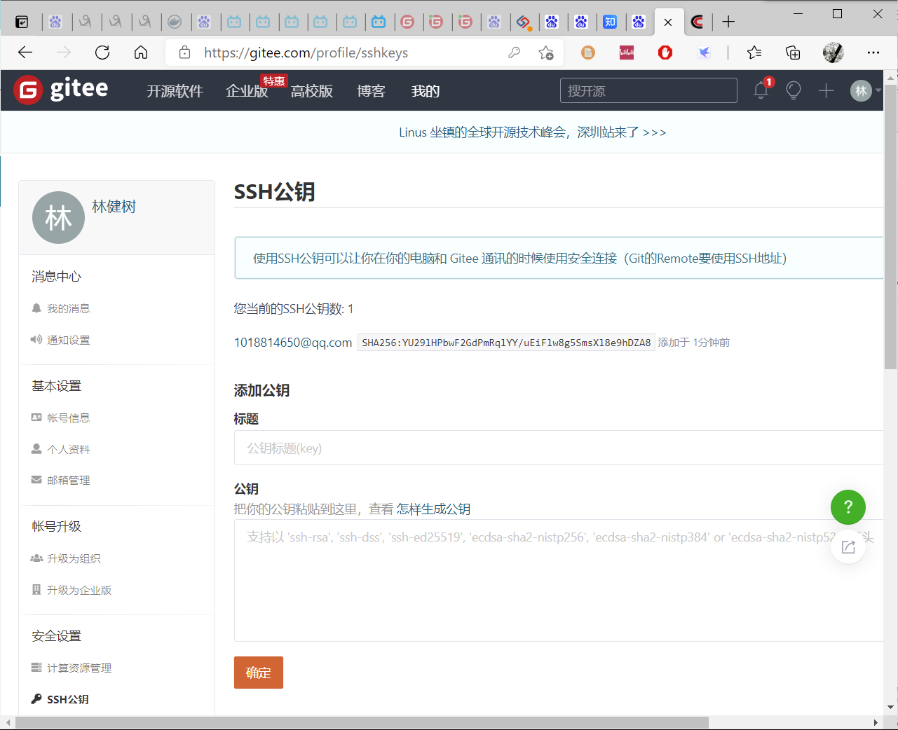

4.使用码云创建一个而自己的仓库

新建仓库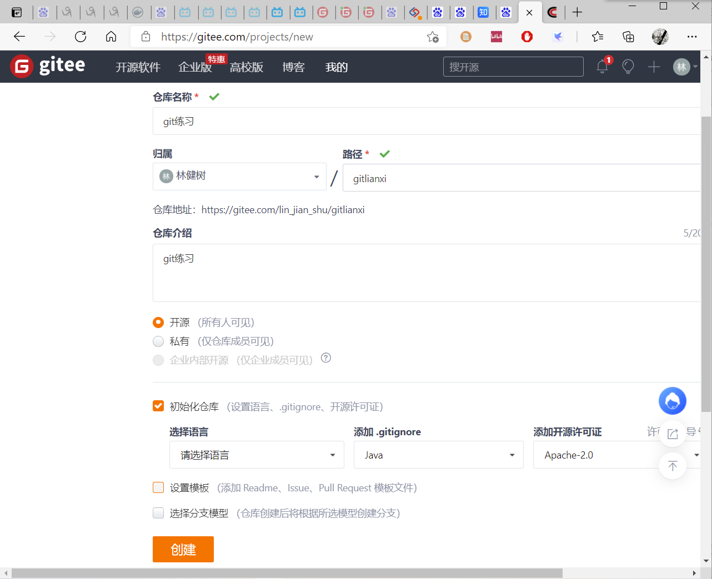

许可证：开源是否可以随意转载，开源但是不能商业使用，不能转载，...限制！

也就是在git上图形化界面上建立仓库，在本地通过git bash 克隆远程仓库

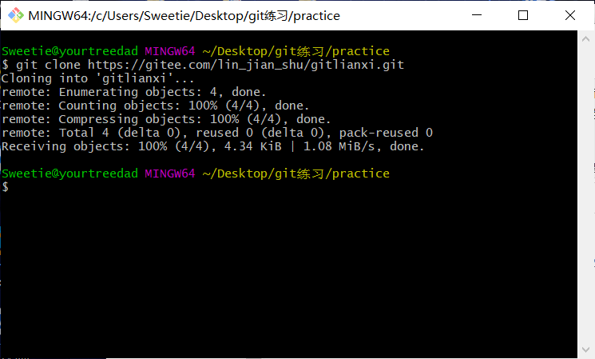


### IEDA中集成git

1. 新建项目，绑定git

   - 将我们远程的git文件目录拷贝到项目中即可！

   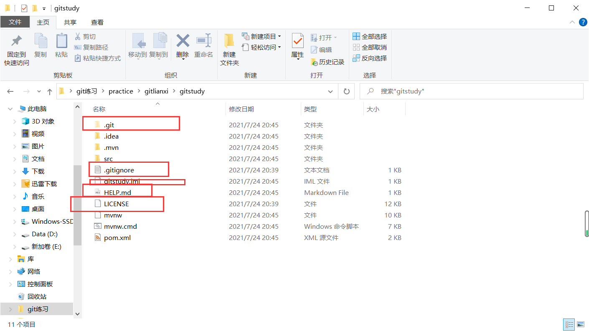

   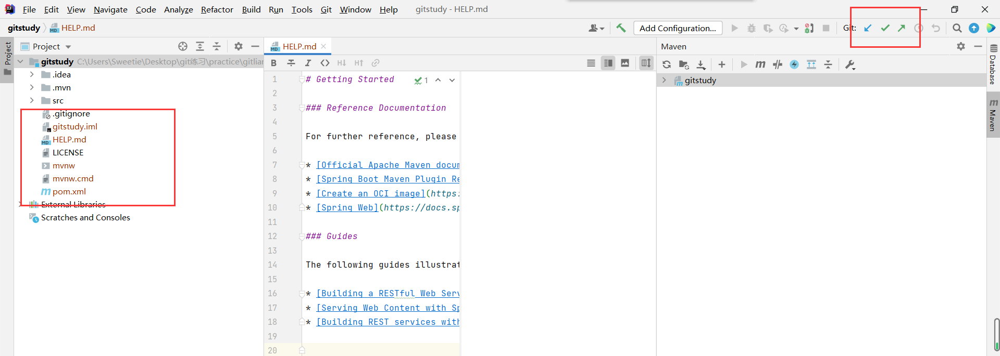

2. 修改文件，使用IDEA操作git

   一种方式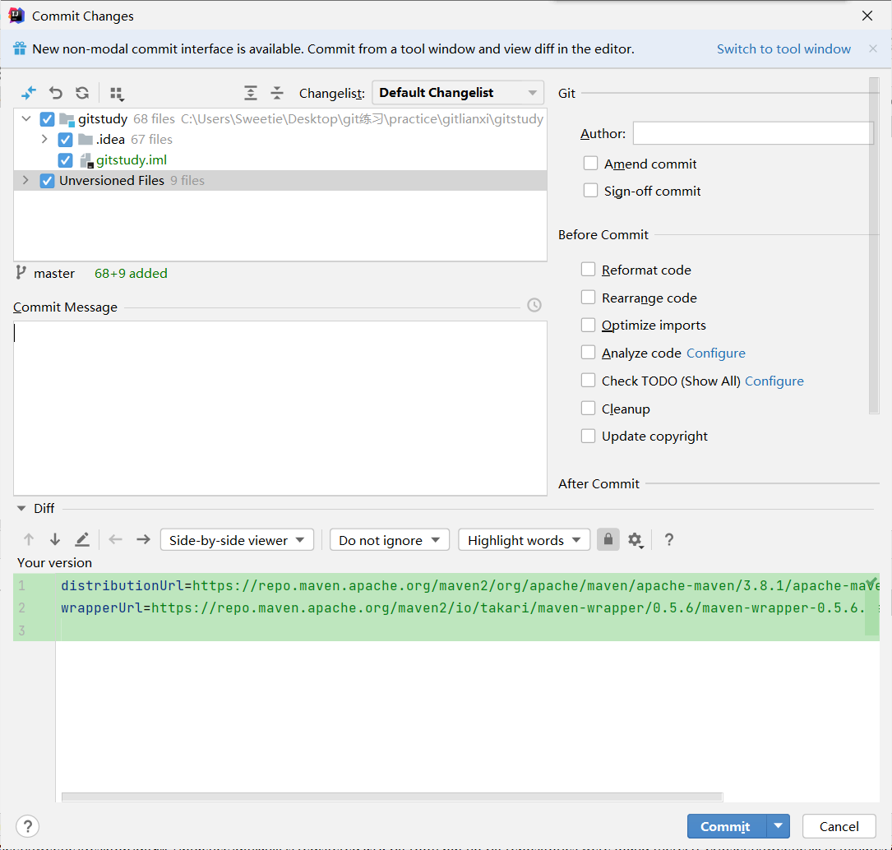

   第二种方式

   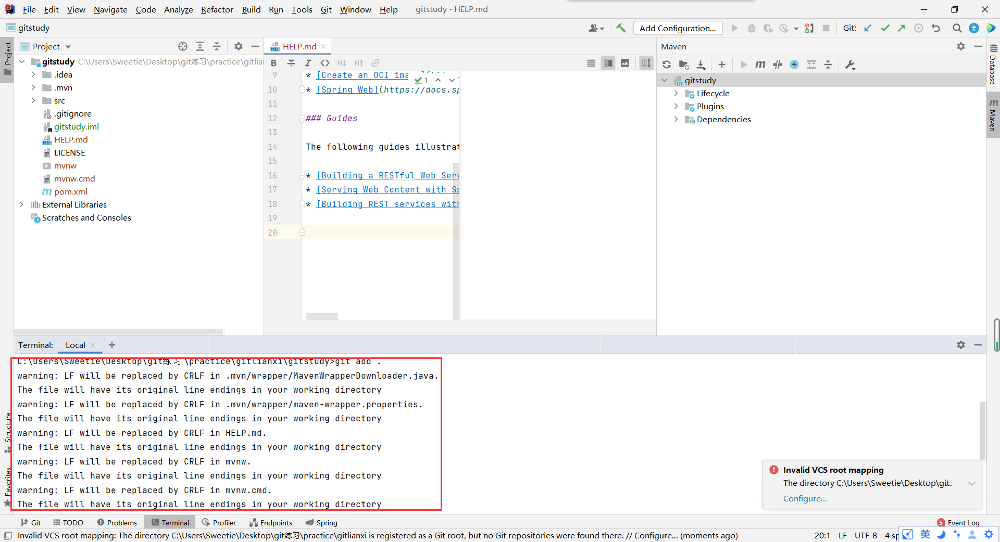

   第三种方式 对于单个文件的add

   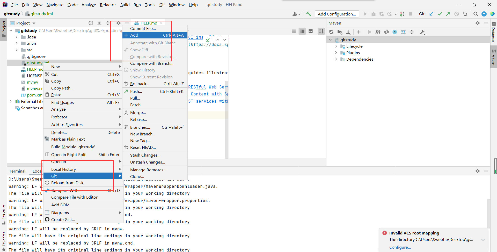

   

3. 提交测试

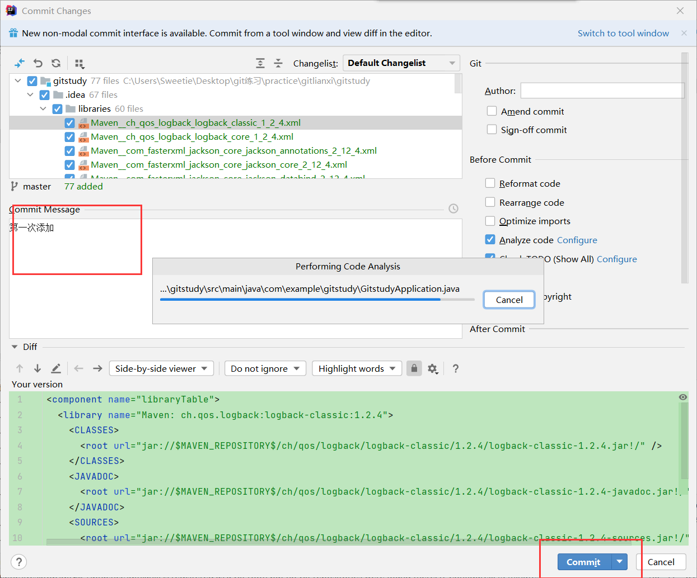

commit只是添加到本地仓库

push到远程仓库


git push 通过terminal或者可视化来搞

在log中可以看到每次的操作

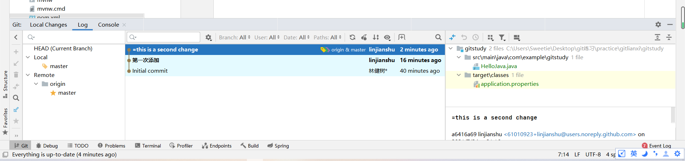


### 说明：git分支

分支在git中相对较难，分支就是科幻电影里的平行宇宙，如果两个平行宇宙互不干扰，哪对现在的你也没有影响。不过在某个时间点，两个平行宇宙合并了，我们就需要处理一下问题了

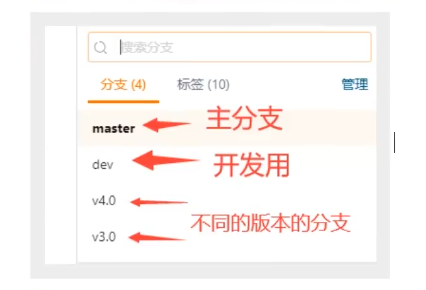

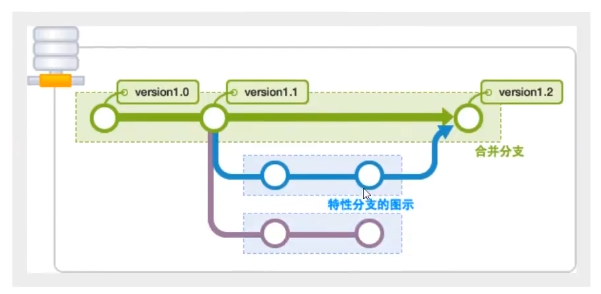

git分支中常用指令：

```shell
# 列出所有本地分支
git branch 

# 列出所有远程分支
git branch -r 

# 新建一个分支，但依然停留在当前分支
git branch [branch-name]

# 新建一个分支，并切换到该分支
git checkout -b [branch]

# 合并指定分支到当前分支
git merge [branch]

# 删除分支
git branch -d [branch-name]

# 删除远程分支
git push origin --delete [branch-name]
git branch -dr [remote/branch]
```

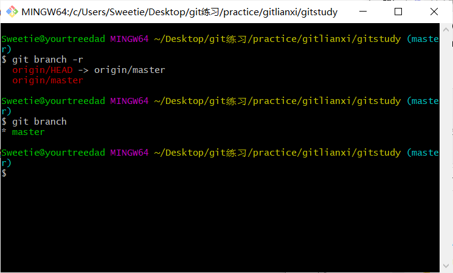


新建分支 git branch dev 但是停留在当前分支

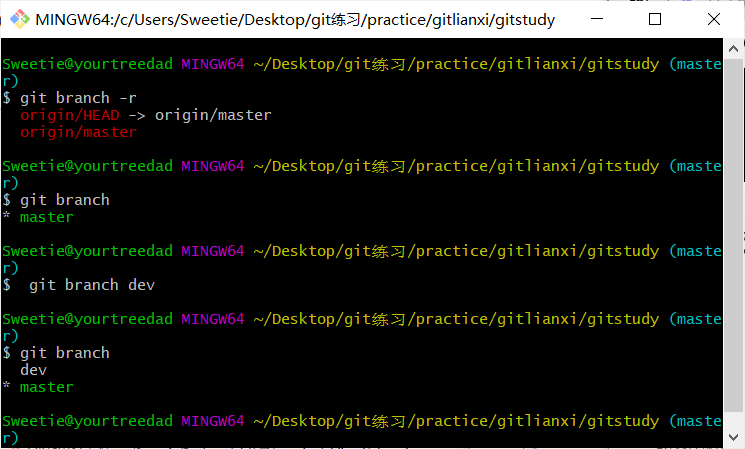

多个分支如果并行执行，就会导致我们代码不冲突，也就是同时存在多个版本！


如果同一个文件在合并分支时被修改了，则会引起冲突：解决的办法是我们可以修改冲突文件后重新提交！选择要保留他的代码还是你的代码！


master主分支应该非常稳定，用来发布新版本，一般情况下不允许在上面工作，工作一般情况下在新建的dev分支上工作，工作完成后，比如上要发布，或者说dev分支代码稳定后可以合并到朱分支master上来。


因此可以这样，在dev上做改动，改动完在dev上进行commit和push，这样dev就是相当于一个新的版本


