## IMS服务端

### IMS服务端搭建步骤文档

##### 1.利用逆向工程自动生成数据库中表的DbSet

右键添加——组件——数据——ADO.NET实体数据模型——CodeFirst——...

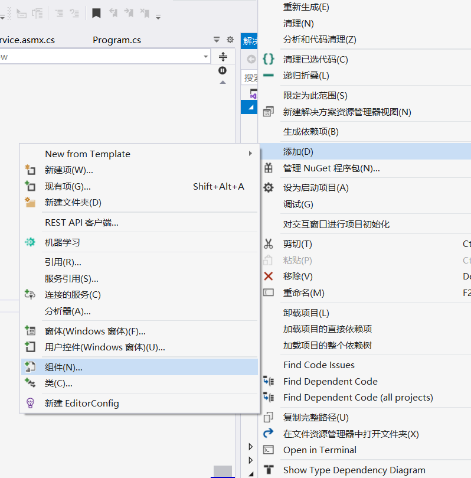

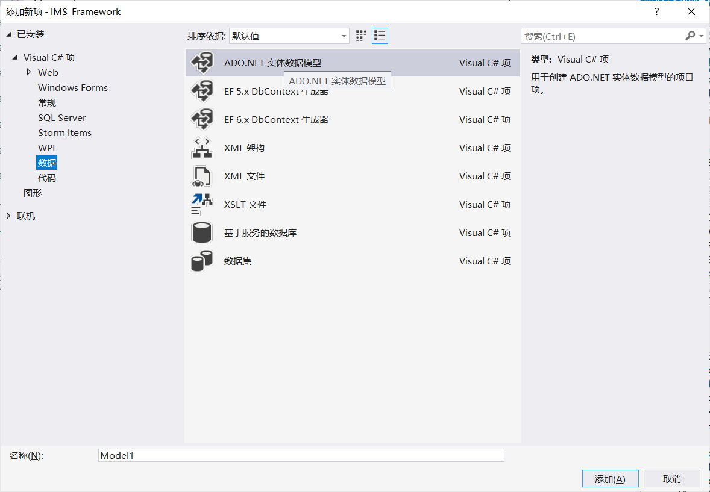

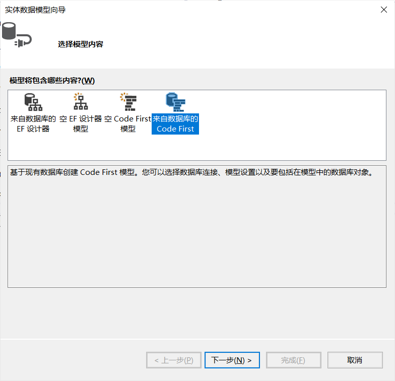

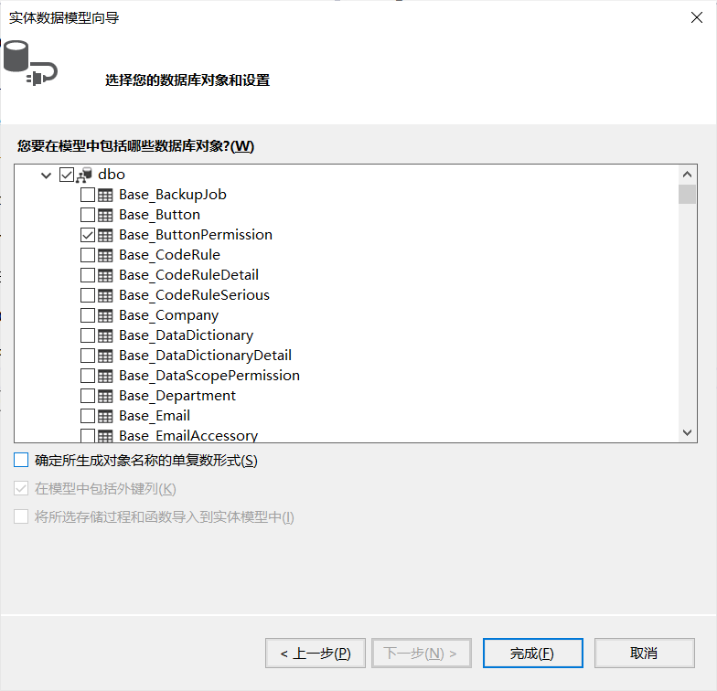

##### 2.整合进IMSDBContext，并注释掉重构的代码

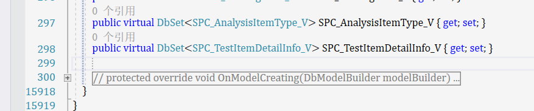

##### 3.搭建进度

目前安排：每个人一个服务端，方便即时调试与建表

计划安排：利用git团队管理共同使用一个服务端，方便不同dbset和特定服务的代码整合

目前完成：泛型

计划完成：异常分级、团队开发、批量操作、事务回滚

### IMS客户端使用步骤文档

##### 1.启动服务端webservice并复制网址

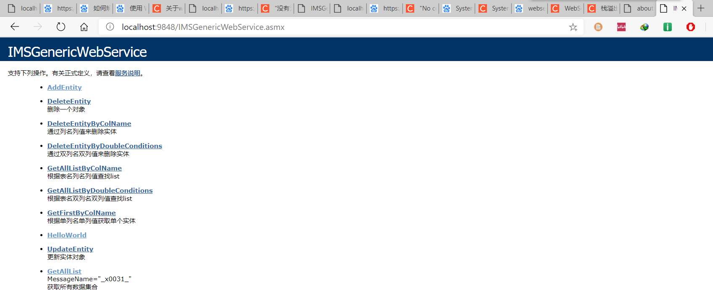

##### 2.在客户端添加服务引用

右键——添加服务引用——复制网址——转到——click——重命名

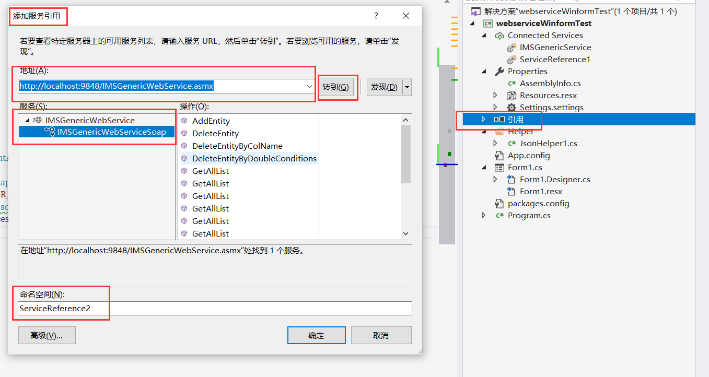

##### 3.服务端生成dll文件

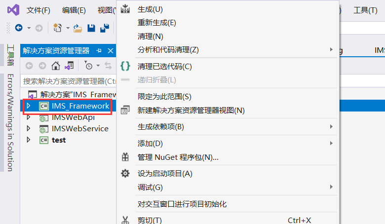

##### 2.拷贝dll文件地址

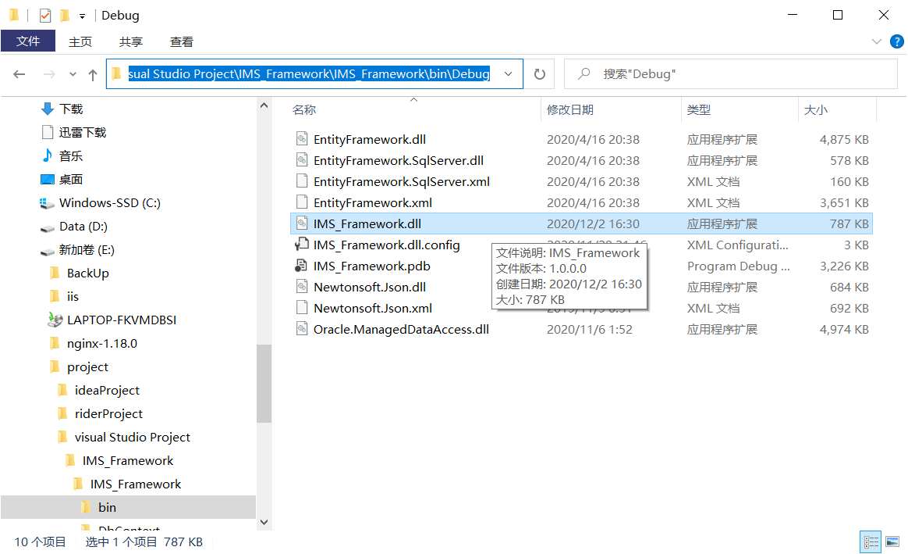

##### 3.在客户端引用dll文件

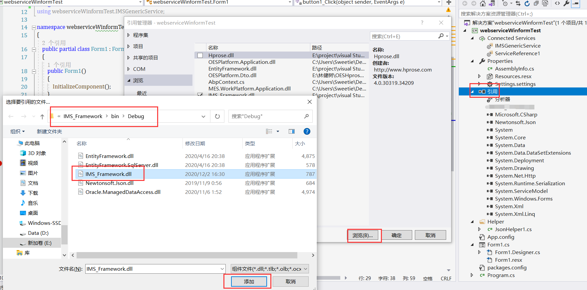

##### 4.导入帮助类

##### 5.编码使用

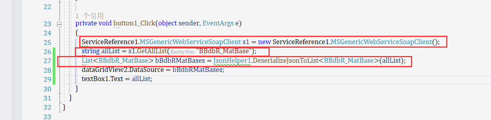