### Linux学习

**如果是阿里云记得配置安全组!!!**

**css js 静态文件都在wwwroot中,所以如果后台启动或者使用mvcTest.dll 的话会无法找到静态文件 因为静态文件的层级在她们上面一层 , 所以要cp一份wwwroot到存放dll那一层中 , 这样就可以看到样式了!!!**

windows倾向于GUI操作，windows下的命令到了linux下不一定能用

windows有扩展名，linux中可以没有扩展名

windows不区分大小写，linux区分大小写

linux不同版本使用方法配置文件变化很大，要反复查找和调试


linux内核和发行版

linux内核是由linus及开源社区维护，内核包含内存管理、存储管理、进程管理、网络通讯等基础模块。很多公司、开元组织基于linux内核打包出很多发行版，不同的发行版的内核版本可能不一致，包含的软件也不一致，界面差别较大，但是命令行操作时互通的，大部分程序也是互通的。

内核和发行版的关系就像android内核和小米手机系统、华为手机系统的关系一样。常用的发行版有redhat、centos、debian、ubuntu等等。这里我们用ubuntu，因为其内置的软件最适合程序员，其他发行版要自己装。


linux常见命令

windows有多根目录

linux是单根


常用目录

boot 存放用于系统引导时的各种文件

bin 存放二进制可执行文件 例如ls，cat，mkdir等等

sbin 存放二进制可执行文件，只有root用户才能访问

usr 用于存放系统应用程序，比较重要的目录/usr/local 本地管理员软件安装目录

opt 额外安装的可选应用程序包所放置的位置

dev用于存放设备文件

etc存放系统配置文件

home存放所有用户文件的根目录

lib存放跟文件系统中的程序运行所需要的共享库及内核模块

tmp 用于存放各种临时文件

var 用于存放运行时需要改变数据的文件

mnt 安装临时文件系统的安装点


常见命令

pwd 显示当前工作目录 print working directory

ls 目录 

cd 更改目录  cd .. 返回上级目录 cd / 返回根目录 cd 文件夹 进入文件夹

mkdir 创建目录

rmdir 目录名  删除非空目录

 rm-r 目录名 删除目录及其下目录与文件（递归删除）

mv 移动目录 mv test home/test

cp 复制文件 cp test test1

cat 查看文件内容

more 分页显示文件内容

find -name ‘lib*’  查找文件

ps 查看当前用于运行进程

ps -ef 所有进程

reboot 重启

shutdown-now 立即关机

exit 退出终端

clear 清屏

ctrl+L清屏

上下键可以查看历史命令

ctrl+C不要当前输入的指令了

使用tab可能可以自动补齐

tar 压缩文件

tar -c -f  name.tar t1 将t1压缩为name.tar的压缩包

tar -x -C 解压到指定目录 -f 压缩包 

man命令 命令帮助手册

-r --recursive 是一样的

linux管道指令，链式调用呗

与图形化界面相比，命令就可以粘合在一起

例如 ps-ef |more  先查看所有进程，然后分页显示

 grep 查找


sudo：基于安全考虑，一般不建议超级用户权限登陆linux，而是平时使用低权限用户访问，需要高权限的操作再用sudo后跟着指令。比如在/下无法创建文件夹，但是sudo mkdir a就可以，当然需要输入密码。su就是super user 的简写，sudo就是用超级用户权限执行命令


VI编辑器

esc + w + q 

上下移动的话首先要按esc 然后才能上下移动

vim是vi的加强版


i键 插入模式 x就是x ，d就是d ， 上下左右对应着ABCD的字符呢

按esc  命令模式 按h删掉一个字符，按dd删除一行，按上下左右就控制光标移动

末行模式 按： 进入末行模式  w写 q退出

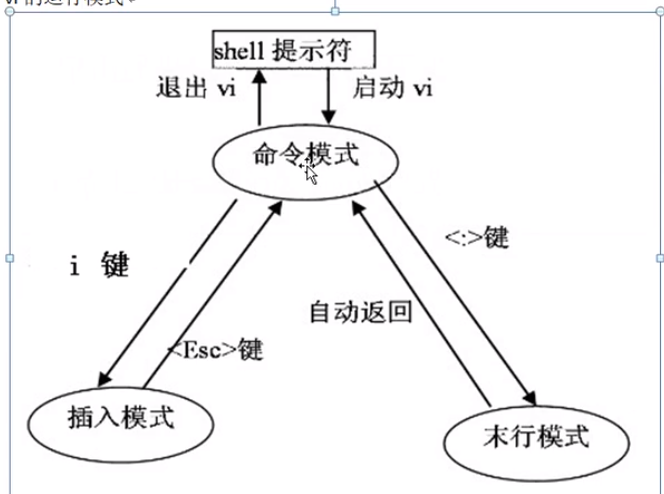


在末行模式中输入！指令 可以不离开vi执行指令

shift+^ 移动到行首

shift+$ 移动到行尾

正则表达式 ， 匹配行首就是^ 匹配行尾就是$

ctrl + b 滚屏 ctrl + f 向下滚屏

u就是撤销 undo

o就是在当前行下新增一行，并且自动进入插入模式

i和a都是插入模式，就是在前面在后面插入的区别而已

a就是append  i就是insert 


nano就是简化版的傻瓜式的文本编辑器

嘻嘻嘻


linux下很多软件都是自己下载源码、自己编译的，有点痛苦。很多发行版都有自己的安装包格式。比如redhat使用*.rpm文件，ubuntu中使用 *.deb文件。

自己查找、下载安装还是很麻烦的。因此很多发行版中都提供了类似于应用市场、nuget的东西。

ubuntu推荐使用apt进行下载、安装。会从ubuntu官网下载，如果下载速度慢的话，可以设置从其他镜像下载，具体搜索ubuntu atp-get 镜像

执行某些程序的时候，如果程序没有安装还会提示你，比如执行 vim tree等等

安装软件需要sudo执行。如：

1.安装 sudo apt-get install 程序名 

2.卸载  sudo apt-get remove 程序名


使用ifconfig

网络问题

虚拟机和主机之间组件了一个局域网，虚拟机通过主机上网。虚拟机的设置的网络可以设置不同的链接方式。主机可以通过ifconfig看到ip地址连接虚拟机的网络。

虚拟机的网络连接方式有很多种，最主要的有三种：hostonly、nat、桥接（bridge）。hostonly配置较麻烦，需要懂很多网络工程的东西；NAT是虚拟机借助于主机网卡访问网络，藏在主机后面，网络中其他设备不能连这个虚拟机，连主机都不能，但是虚拟机能连接主机的网络，能上外网；桥接模式则是把虚主机也暴露为网络中的一个设备，主机和虚拟主机在网络内是平等的，可以互相访问，但是要求网络中没有设备访问的限制，如果有限制要修改路由器的配置。因为咱们需要主机和虚拟机相互访问，除非网络有限制，否则最好配置为桥接，配置桥接要选择通过哪个网卡上外网，不能选错了，否则就无法访问外网了。后面我们都配置为桥接（bridge）。


ssh服务

讲运维人员是怎么远程连接到机房上的服务器的，很少使用图形界面（卡，无法自动化）

远程登陆有专门的通信协议telnet，telnet就是通过网络进行命令行操作服务器。只有服务器端开始了远程登陆服务，客户端才能通过telnet协议控制服务器端。

但telnet协议是使用明文传输数据，这会造成严重的安全性问题，所以现在几乎不推荐使用，而是替代协议的是ssh，ssh通讯数据是加密的。


安装openssh

ubuntu 默认只安装了客户端 openssh-client

安装服务器

sudo apt-get install openssh-server

ssh服务默认端口是22，可通过修改配置文件修改端口/etc/ssh/sshd_config

重启的话就是service ssh restart


putty下载后直接远程连接linux


使用mysql


安装sudo apt-get install mysql-server

根据提示设置root 用户的密码，测试的时候设置为root

sudo apt-get install mysql-client 安装管理客户端

mysql-uroot-proot 通过管理客户端连接mysql 不报错就ok

mysql 客户端中执行（不要直接在shell中直接执行）show databases; (不要丢了结尾的英文分号) 查看有那些数据库，执行一下 select now(); 正确执行。执行quit； 退出mysql 客户端

ps ： **记得打开服务**

service mysql start

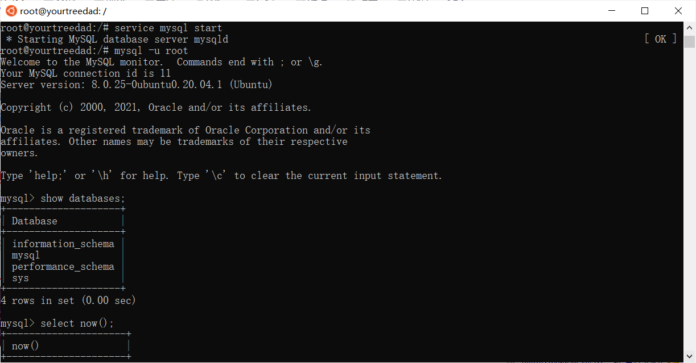

基于安全考虑，mysql默认只能本机连接，如果想通过其他电脑连接（比如主机访问虚拟机中的mysql），就需要配置，最好不要配置成任意电脑都可以连接，因为危险，要配置成只允许某些ip访问


配置mysql远程访问（需要网络配置为桥接网络）虚拟机情况的话


1. 编辑mysql的配置文件mysqld.cnf ， 由于mysql是系统服务，因此需要以su 运行vi , 才有权限，执行sudo vi /etc/mysql/mysql.conf.d/mysqld.cnf ， 由于不同mysql版本配置文件的位置可能不一样，因此最好的找路径的方式就是cd / dir 一级级的看看。linux下不同版本差异性很大，之前查资料都是改/etc/mysql/conf.d/mysql.cnf ，但是使用status；命令查询mysql版本之后搜索mysql5.7 远程访问，就可以找到正确的做法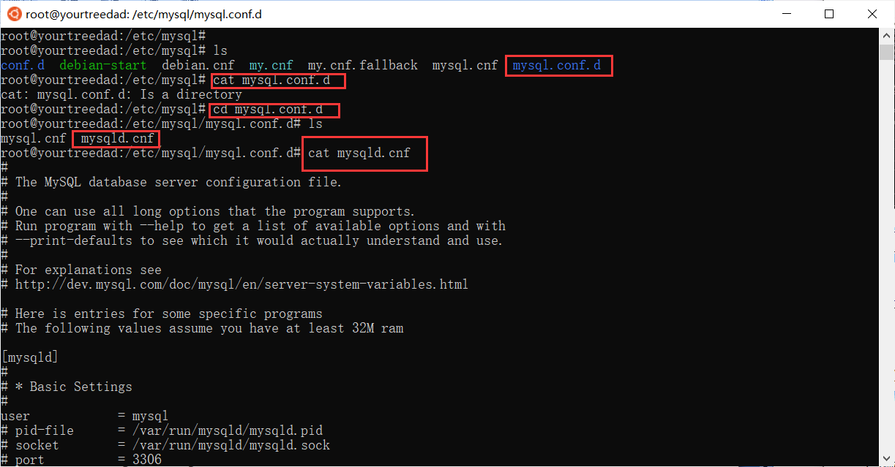
2. 把bind-address=127.0.0.1注释掉
3. 执行 sudo /etc/init.d/mysql restart 重启 mysql服务
4. 在主机上执行ipconfig，查看ip地址，加入是192.168.0.11，那么就执行grant all privileges on *** . *** to root@"192.168.0.11" identified by "这里换成密码" with grant option;    再执行 flush privileges; 
5. 外部数据库管理工具navicat连接虚拟机的ip，访问mysql
6. 主机上连接虚拟机内的mysql一定要连接虚拟机的ip，别连错了
7. 主机的ip如果变了就要重新配置


**在4之前，由于这个版本的mysql密码是空的，所以没办法呜呜呜，需要改个密码**

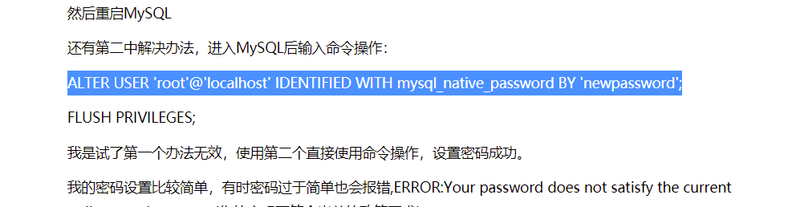

[MySQL 8.0 安装后修改root@localhost的默认空密码 - 汉家羽林郎 - 博客园 (cnblogs.com)](https://www.cnblogs.com/liuyakai/p/14341310.html)


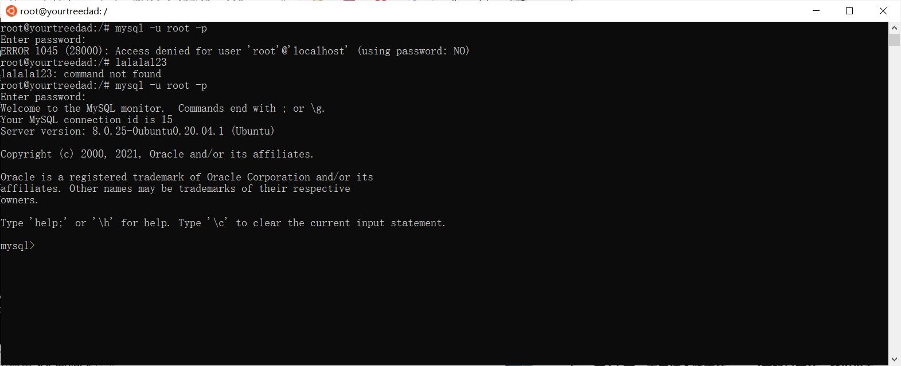


[解决mysql8 提示 ERROR 1410 (42000): You are not allowed to create a user with GRANT_zhouzhiwengang的专栏-CSDN博客](https://blog.csdn.net/zhouzhiwengang/article/details/102909298)

命令有点点不一样

mysql8.0之后必须要先创建用户，然后才能授权


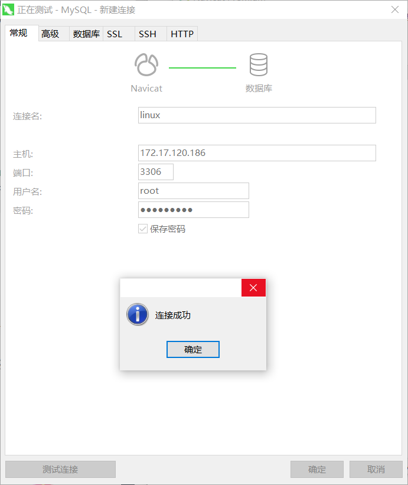

 

安装vsftp服务器

file transport protol


1. 什么是ftp 。通过ftp进行文件的上传下载
2. sudo apt-get install vsftpd
3. 这时候可以用linux用户登陆，能够访问/home/用户名下的文件夹。但是没有上传权限。需要 sudo vi /etc/vsftpd.conf 将write_enable=YES 前面的注释# 取消，然后执行 sudo /etc/init.d/vsftpd restart重启
4. 对于文件数量比较多的，可以先压缩成zip，然后在linux端使用 unzip 文件名 进行解压
5. 对于文件缩量比较多的，可以在linux端使用zip命令压缩，然后再windows端解压


.net core

历史

.net 设计之处就是考虑像java一样跨平台的，.net framework 是在windows下运行的，大部分类是可以兼容移植到linux下的，但是没人做这个工作。后来novell公司开发了mono，把大部分.net framework功能移植到了linux下。mono也成为xamarin（使用.net 开发Android、IOS app的技术）和unity3d （使用.Net 开发android /ios 游戏的技术）的基础。

.net core是微软开发的另一个可以跨linux、windows、mac等平台的.net 。

微软收购了mono的公司，xamarin。为什么还要搞.net core。因为mono完全兼容.net framework ,架构太陈旧，不利于现在云计算、集群等新的架构历年。因此微软推翻重写了.net core。

.net framework .net core mono的关系

.net framework .net core xamarin 有通用的类，也有特有的。为了保证代码通用。微软定义了公共的.net standard library (.net 标准库，像FileStream / List等这些)，按照.net standard library编写的代码可以在几个平台下通用。


大部分.net framework中的类在.net core中还有，方法也还有，只是namespace可能变了，有些方法也有不一样，部分api缺失（注册表等windows平台特有的api），后面会讲区别。

之前那些在.net framework 中调用的dll，不一定都能用在.net core (linux)中。如何判断


**在linux下需要安装.net core 的环境**

例如.net core sdk 和 .net core runtimes

https://docs.microsoft.com/zh-cn/dotnet/core/install/linux-ubuntu

安装完验证一下


使用linux 来创建.net core 控制台应用程序并运行

1. 创建控制台项目

   1. dotnet new console -o test1 在当前目录创建目录 test1 , 并且初始化控制台（console）类型的项目结构（第一次运行dotnet new 比较慢）。使用命令创建项目，是目前很流行的风格。
   2. 也可以手动创建test1目录，进入目录，再执行dotnet new console。也就相当于在当前目录下创建控制台项目。
   3. dotnet restore 通过nuget还原安装当前目录的项目用到的包，一定要cd 到项目根目录下执行. restore执行消息里给出了nuget下载目录的路径
   4. 改一下项目的代码
   5. dotnet run 编译并运行当前目录的项目,一定要在项目根目录下执行.如果编译报错就会根据报错信息该代码或者是忘了dotnet restore了。
   6. 注意.net core 下的控制台程序不是生成exe的,要通过dotnet 入口dll文件名 方式运行
   7. 三个步骤:new restore run

   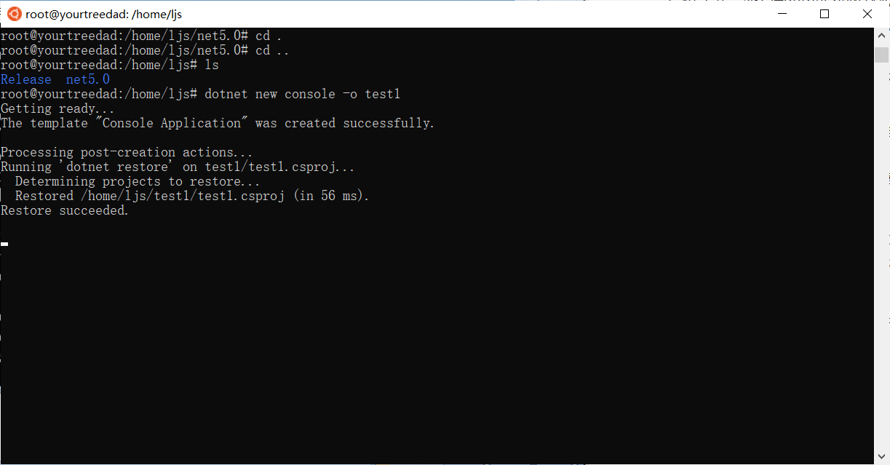

   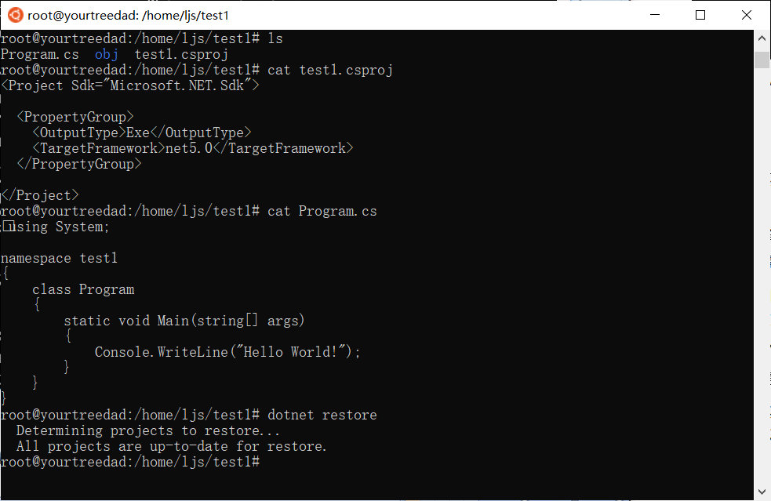

    也可以执行debug里的dll文件，linux没有exe哈，执行dll就可以了

   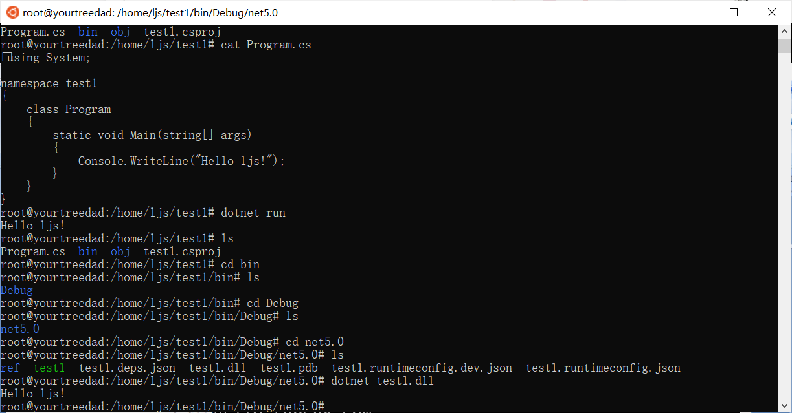

   

2. aps .net mvc core 项目

   1. dotnet new mvc -o test2 或者 dotnet new mvc

   2. dotnet restore

   3. 改一下项目的代码

   4. dotnet run web项目自带嵌入式服务器，测试阶段不用IIS等单独的服务器，部署阶段再部署到iis、nginx等上

   5. 再linux的服务器上的浏览器中打开http：//127.0.0.1:5000 (只能本机访问，后面讲通过nginx配置远程访问)

   6. ctrl+c 停止服务器

   7. 修改默认端口绑定的方法：再program.cs的build之前加入useurls("http://*.5001");

      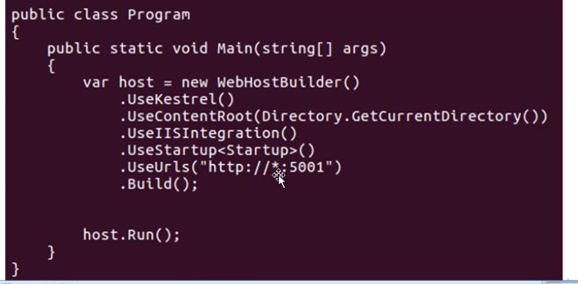

      新版有点区别

      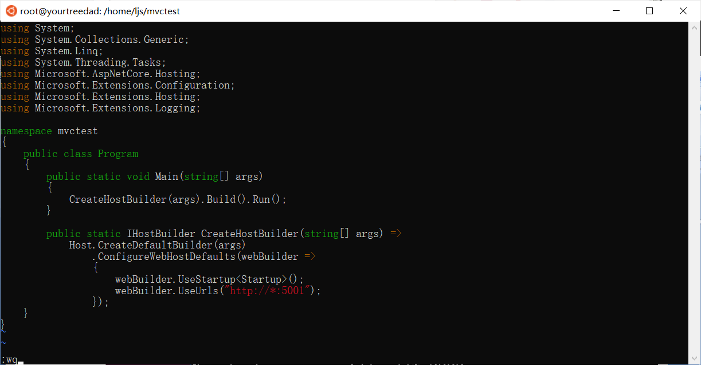

      https://blog.csdn.net/zxy13826134783/article/details/105908201/

      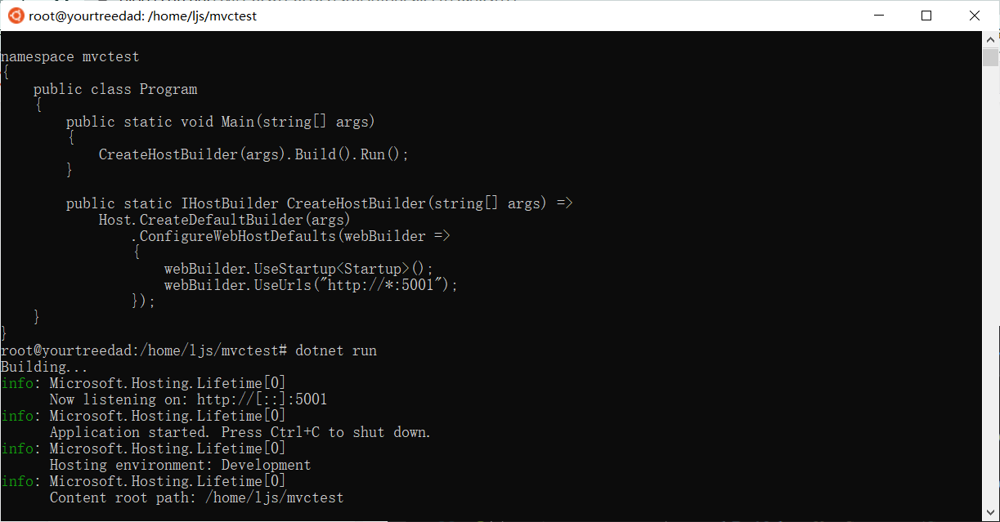

      ECS做到了呜呜呜

      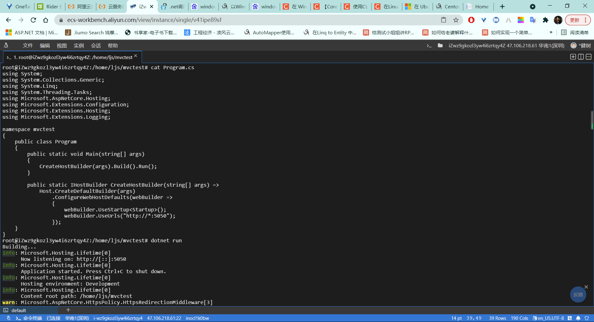

      插入个知识点，这里我们退出终端后外网就访问不了了，因此需要程序后台运行

      https://www.cnblogs.com/bjxxlbm/articles/14790054.html

      nohup dotnet mvctest.dll & 

      

      

      ps -ef |grep dotnet 查看dotnet项目

      kill -9 PID（进程id就行了）

      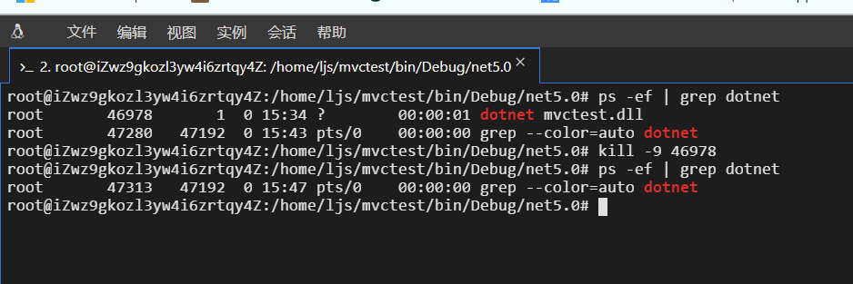
   
   8. wwwroot底下放的是静态文件 
   
   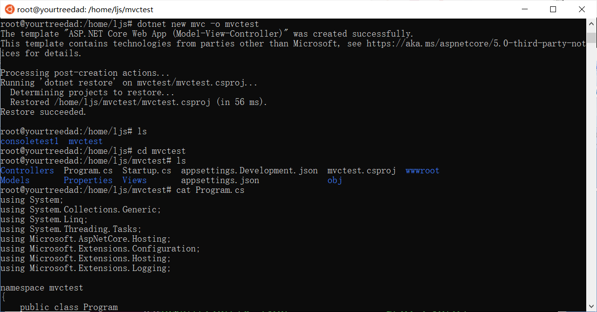

 

创建其他项目

.net core目前只支持控制台和aps .net mvc core 不知道winform和webform

可以创建类库、webapi、解决方案

新建类库

dotnet new classlib -o classlibtest

新建webapi

dotnet new webapi -o webapitest

新建解决方案（一个解决方案中包括多个项目）

dotnet new sln 

还有dotnet new --help


历史问题

旧版本.net core 曾经使用project.json做项目描述文件，后来又改回了project.csproj


.net core开发的两种方式

用vi编辑代码没有自动提示，开发麻烦，所以只是进行原理展示。不会真的用vi写代码

方式1：windows下用vs开发，然后部署到linux下部署运行

方式2：linux下使用vscode开发，然后linux下部署运行。vscode还是没有vs强大


windows下可以直接使用命令行来建立项目，就像linux下操作的一样

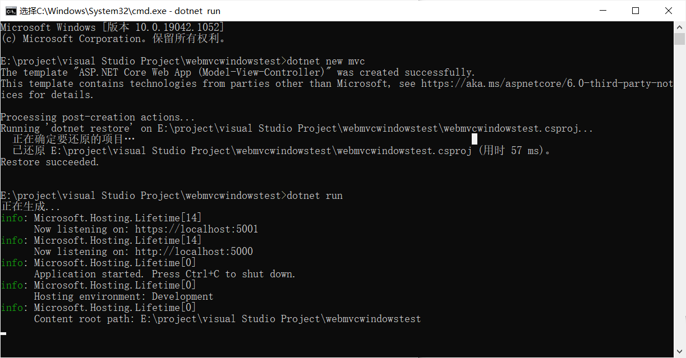

发布dotnet publish

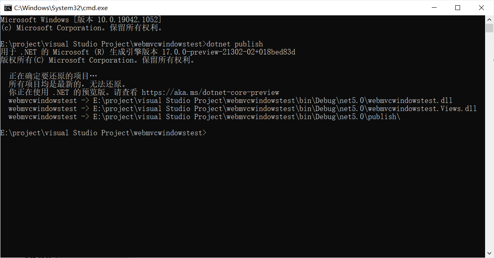

找到publish，并压缩成zip格式

然后通过filezilla 传输到linux上

linux通过 unzip 名字 解压缩

然后dotnet dll文件 就可以运行起来了呜呜呜


问题：给wsl windows sub子系统 linux 

我们的linux发行版 ubuntu 是wsl

需要给他安装一个图形化界面

[WSL2 Ubuntu GUI 图形用户界面_哔哩哔哩_bilibili](https://www.bilibili.com/video/BV1LA411n7BK/?spm_id_from=333.788.videocard.4)

远程桌面需要启动一下xrdp服务

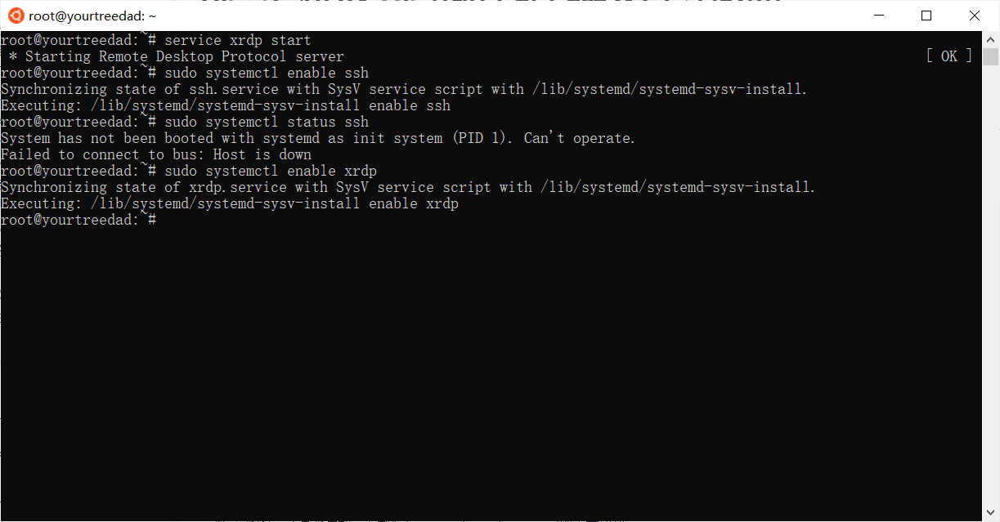


使用命令行添加解决方案和引用关系

1. 如何创建多个项目的解决方案
   1. 先创建解决方案文件夹rupengbbs,然后再其中dotnet new sln
   2. dotnet new mvc-o rupengbbs.web 说明：创建web项目
   3. dotnet new classlib -o rupengbbs.common 创建common项目
   4. dotnet new sln 说明：解决方案，解决方案名字默认是当前目录的名字
   5. dotnet sln rupengbbs.sln add rupengbbs.common / rupengbbs.common.csproj 说明L吧rupengbbs.common项目中的rupengbbs.common.csproj添加到解决方案文件中。注意最后一个参数在/ 前后不要加空格 这里指的是rupengbbs.common目录下的rupengbbs.common.csproj文件
   6. dotnet sln rupengbbs.sln add rupengbbs.web/rupengbbs.web.csproj 说明：把web项目添加到解决方案中
   7. dotnet  add rupengbbs.web/rupengbbs.web.csproj reference rupengbbs.common/rupengbbs.common.csproj  说明：rupengbbs.web.csproj 项目添加对rupengbbs.common.csproj项目的引用
   8. dotnet restore 说明：在解决方案下每个项目中执行dotnet restore 如果是在某个项目下执行 dotnet restore 则只是restore 某个项目
2. 查看一下csproj 和sln文件格式，知道如何手动修改
3. vscode打开解决方案文件夹即可。在common项目中建一个person.cs，写一个hello方法，然后在web项目中调用
4. （*）编译整个解决方案的方法，在解决方案文件夹下dotnet build rupengbbs.sln
5. 手动创建三层项目：web项目 、 model项目、dal项目、bll项目
6. 写一个创建三层解决方案的脚本，体现命令行的好处，脚本中的$1$2代表第1.2个参数的值

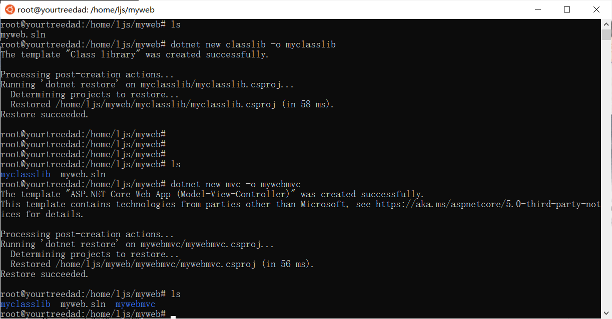


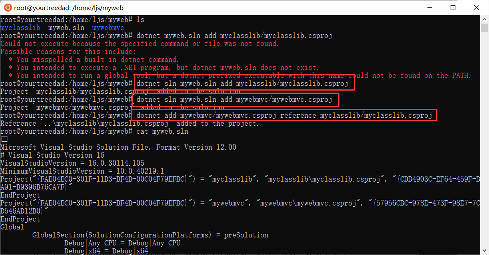

对着主项目运行

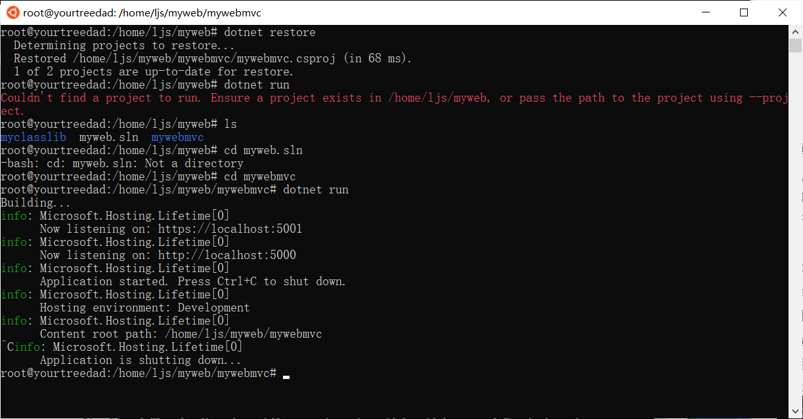


如果某一些操作需要反复执行，那么就可以写成脚本。

windows上

.bat 批处理命令

powershell 


linux上

shell脚本


写好sh脚本之后，执行bash ./ cjsc.sh RuPeng 会自动把项目和解决方案创建起来了

因为命令行所有脚本，因为脚本所以自动化。windows下的脚本语言有传统的bat以及新的powershell，windows10安装linux自系统后也可以使用bash

7.项目添加nugut引用的方法：在项目下执行dotnet add package newtonsoft.json 然后dotnet resotre 一下


dotnet add package 就等驾驭nuget 的install-package （*）还可以通过dotnet  addnew nugetconfig 创建一个nuget配置文件，指定源


dotnet core 无法在引用里引用自己家的标准程序集，.netframework 可以，.net core统一在nuget里安装


因此如果涉密的dll还得传到nugut上，通过nuget安装，可以考虑搭建nuget私服


6.控制台、web应用程序部署到linux等服务器上的统一方式：服务器上先安装.net core，然后再开发环境发布，然后吧发布包上传到服务器上，然后到目录下执行，dotnet 主程序 dll 即可


注：可以通过发布到FTP、FTPS服务器上的方式，来试试看，端口是21

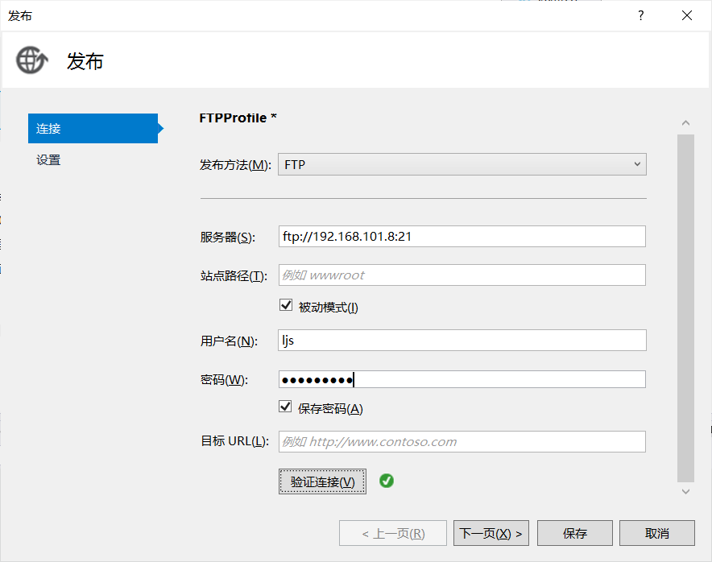

但是，需要给ljs用户授予777权限，然后给srv/ftp授予777权限

否则会出现无法发布www.root 和 config的问题


chmod -R 777 ljs
chmod -R 777 srv/ftp

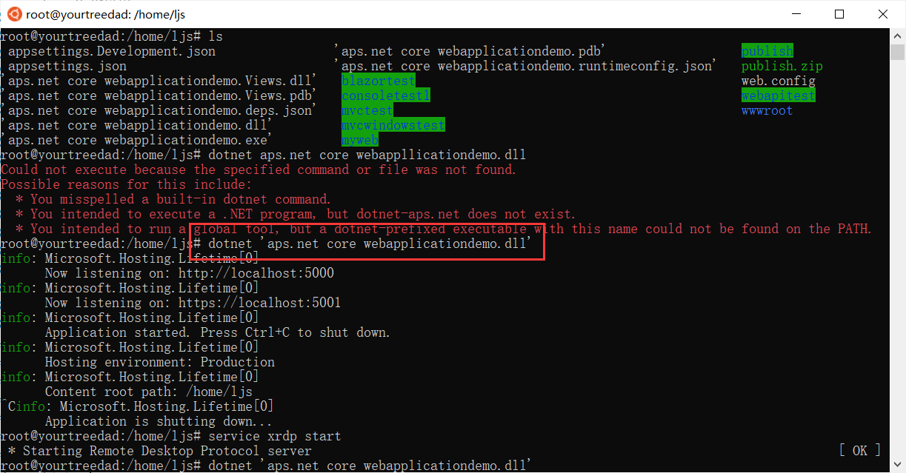


httpwebrequest、webclient不支持，必须使用异步的httpclient


反编译工具 JustDecompiler 反编译dll文件


.net core 中配置文件的解析

.net coer 的配置文件，不再是配置在web.config中了，而是单独的json配置文件


只要和合法的json格式，怎么写随意，怎么写就怎么解析

解析方法：

1.首先nuget安装：microsoft.extensions.configuration 和 microsoft.extensions.configutation.json 

2.然后引用命名空间

3.下面的代码就把logging下的loglevel下的default读出来了

```c#
var builder = new configurationbuilder().setbasepath(directory.getcurrentdirectory()).addJsonfile("appsettings.json")  ; 
//设置配置文件所在路径
var configRoot = builder.Build() ; 
var value = configRoot.GetSection("Logging").getSection("loglevel").getsection("default").value ; 
sys.console.writeline(value) ; 
```

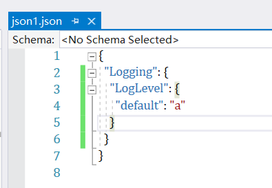


EFcore的使用

EfCore 是EF的.net core版本。EF core 对 sqlserver支持很好，也可以在linux下连接sqlserver。不过如果在linux下首选mysql，因此我们主要介绍mysql 中更实用efcore。sqlserver用法几乎一样，只是换一个Ef provider的nuget包而已。

EFcore的nuget： entityFrameworkcore


1.官方的mysql ef provider 

2.可以试试第三方的 eF core provider 

3.使用mysql efcore

​	把mysql数据库、表创建起来

​	install-package entityframeworkcore.mysql

​	编写person类

​	

通过usemysql这样的扩展方法来配置连接字符串，这是.net core的风格！可以把连接字符串写到配置文件中，然后再读取。


EF core 和EF的区别

要使用 AsNoTracking 、 Include 等要using microsoft.entityframeworkdcore ，不能使用 System.Data.Entity 

目前还不支持lazyload，需要显式的include

没有内置entitytypeconfiguration（要么手动注册config类，复习一下；要么后续课程会给大家提供一个）

一对多关系配置从builder.hasrequired(e=>e.author).withmany() ; 改成了：builder.hasone(e=>e.author).withmany().hasforeignkey(e=>e.authorid).isrequired();

或者builder.hasoptionnal(e=>e.author).withMyan();改成：builder.HasOne(e=>e.author).withmany().hasforeignkey(e=>e.antuorid)  ;   

不要中间实体的多对多还不支持，要自己拆成用中间实体的两对一对多

只要吧配置文件放到ui项目中即可，不再需要在Ui项目中在安装EF


aps.net core mvc

selfhost

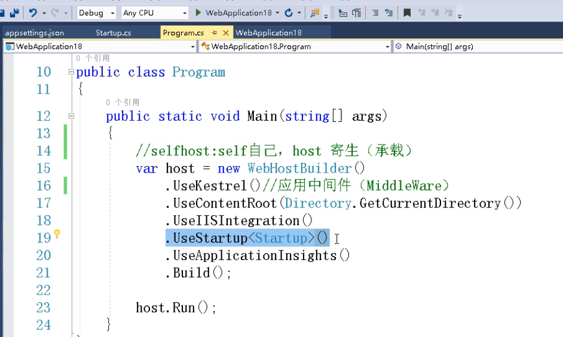


asp.net core ioc

1.asp.net mvc coer 内置了ioc容器，不在需要autofac等等，当然autofac 也是支持.net core 的 ， 内置ioc是通过构造函数注入，而不是属性注入。

2.在startup 的configureservices中进行注入的准备工作

3.在内置的ioc有三种生命周期

 transient : transient 服务在每次被请求的时候都会被创建。这种生命周期比较适用于轻量级的无状态服务。

scoped：scoped生命周期的服务是每次web请求被创建

singleton：singleton生命周期服务在第一次被请求时创建，在后续的每个请求都会使用同一个实例。如果你的应用需要单例服务，推荐的做法是交给服务容器来负责单例的创建和生命周期管理，而不是自己来走这些事情。

调用方法 services.addsingleton(typeof(imyservice),new myservice())； 来进行注册

但是最好 services.addsingleton (typeof(imyservice),typeof(myeservice)) ; 

因为这样的话可以在myservcice中通过构造函数注入其他服务

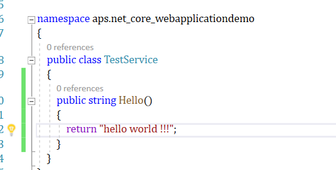


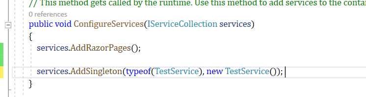


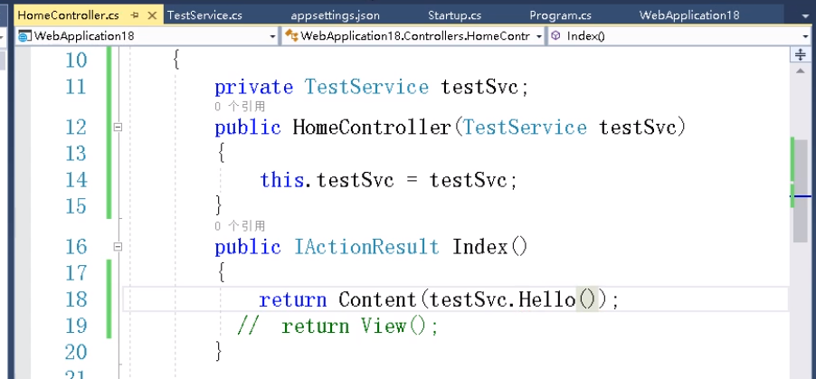


 4.controller注入

 

**这里引入一个问题，之前publish的都不行，原因是为什么呢！！！**

就恨他吗离谱 ， 注意运行时 ，不能选择可移植

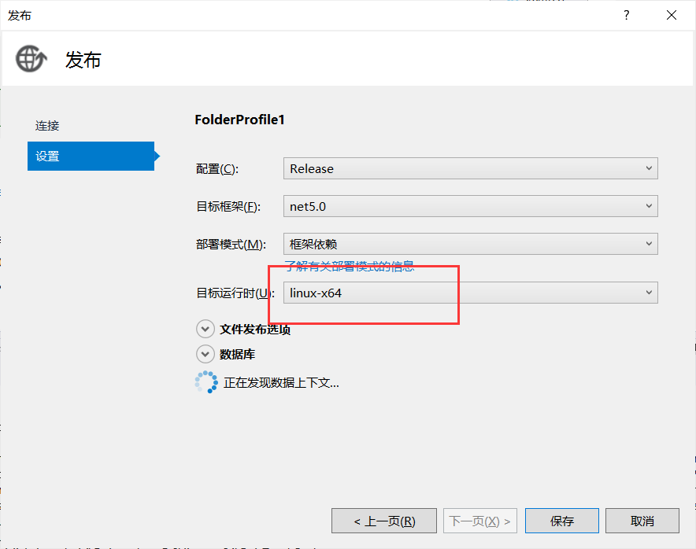


dotnet test.dll --urls http://*:5005

手动指定端口

**单元测试**


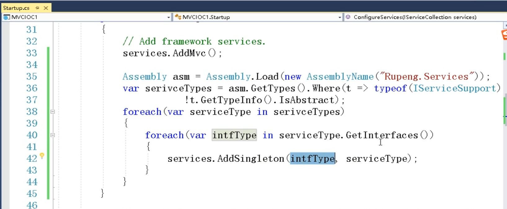


