### RabbiMQ学习文档

rabbitMQ是遵循amqp协议的一个erlang实现。

amqp协议：高级消息队列协议

http协议：request、response

telnet协议：经常用来查看某一台ip上的指定端口是否是ping通的【远程登陆协议】

AMQP 0-9-1 complete Reference Guide rabbitmq 实现的amqp协议的版本号

- connection =>open , use , close [open-ok , close , une-ok]
- channel =>open, flow , close , [构建在connection之上，在amqp中常作为长连接]
- exchange =>
- queue
- basic =>发布和获取 message中的一些设置
- tx =>事务处理
- confirm =>发布确认机制

详细设计书一样


延时处理，拉长时间

以更长的时间来换取堆积的业务逻辑

异步处理：响应很快，增加服务器承载能力

流量削峰：

扩展性：UI和业务的解耦，可以独立演化

高可用：处理器发生故障以后，不会影响可用性


缺陷：

即时性降低，降低了用户体验---无法避免；业务上来屈服；

复杂性提高

vhost：避免命名冲突

exchange：

- direct
- headers
- topic
- fanout

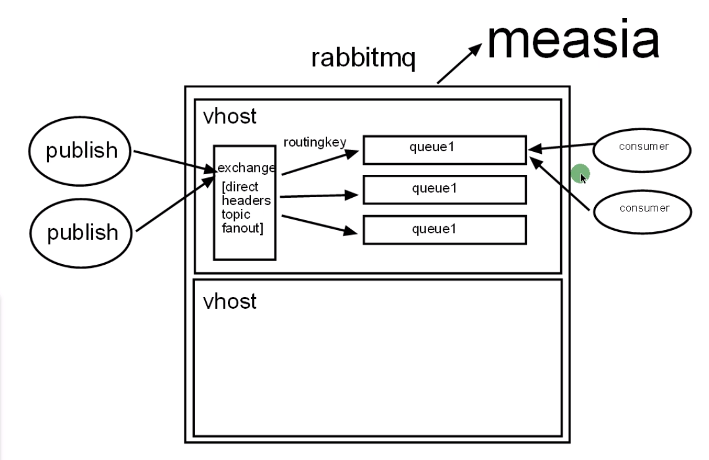

在windows上是一个服务

UI工具可以查看rabbitmq的事实状况，http api的方式也可以查看

http://127.0.0.1:15672/#/

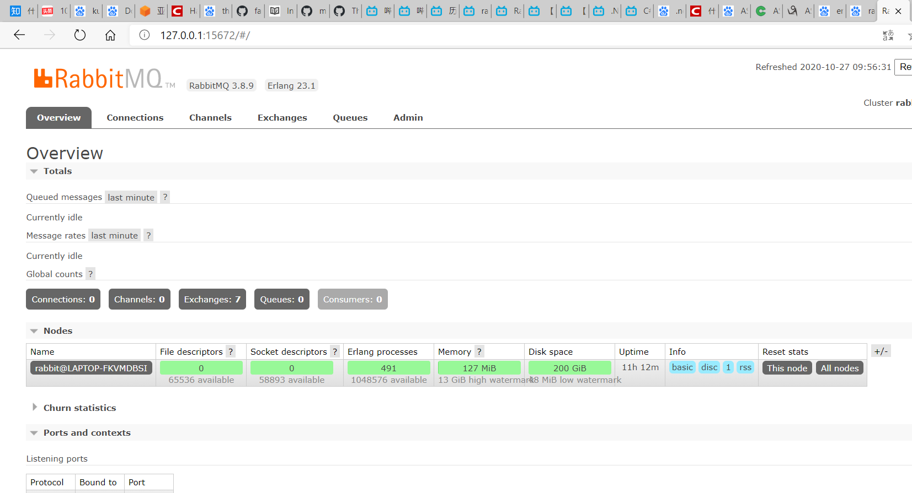

ui和命令行的区别：ui只是命令行的子集

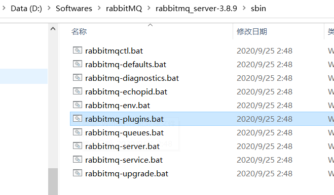

- 应用层序和集群的管理 application and Cluster Management 

  - stop 
  - stop_app 
  - start_app
  - reset    [格式化的功能]
  - force reset   [无条件设置]

- 集群配置 Cluster management:ram和disk

  - purge_queue {queue名} 用于清空某一个队列

- 用户管理  userManagement 

  - add_user {username} {password} [设置users的角色]
  - set_user_tags {username} {tag ...}  [设置用户的角色]
  - authenticate_user {username} {password} 验证用户名，密码是否正确
  - list_users  展示所有users

- 访问控制 access Control

  - set_permissions [-p vhost] {user} {conf} {write} {read}
  - clear_permissions {user}

- 参数管理  parameter management 【第三方插件比较多】

- 政策管理  policy management 对queue 的全局设置用得上这个政策管理，队列镜像也是用的这个命令

- 服务器状态

  - list_queues {name} {pid} {durable}
  - list_exchanges [-p vhost] [exchangeinfoitem]
  - list_bindings [-p vhost] [bindinginfoitem]
  - list_connections [connectioninfoitem]
  - list_channels [channelinfoitem]

  connections =>channels 建立connections是长连接，channels是挂在connection之上的

  - status
  - environment 
  - Miscellaneous  混合命令


erlang和rabbitmq的区别

一个是语言环境，一个是应用程序

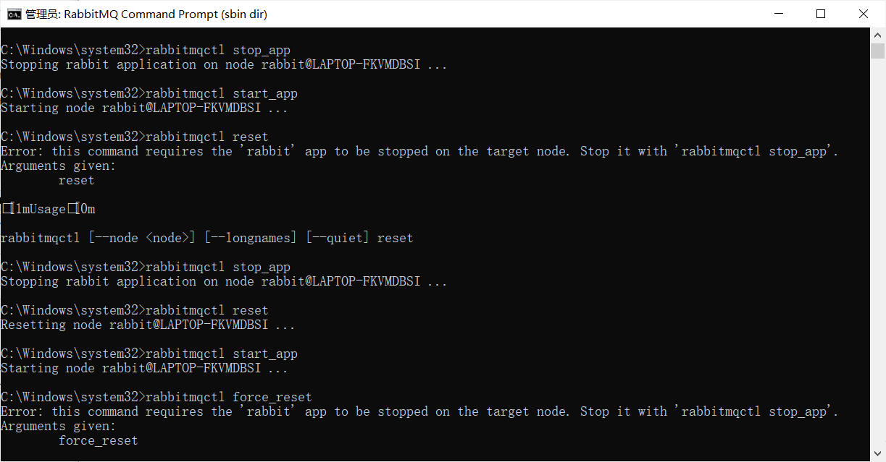

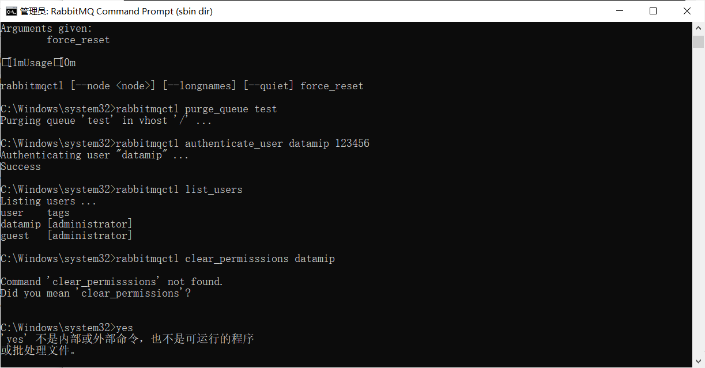

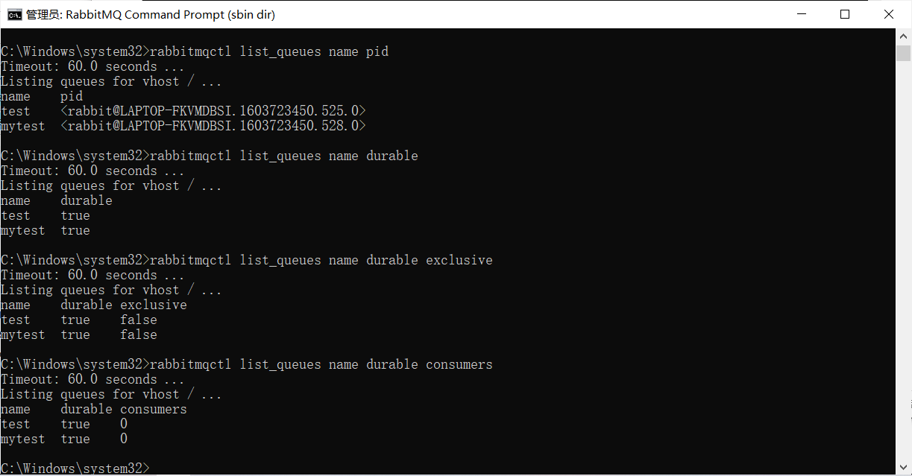

环境配置文件：measia【erlang的分布式数据库】， config配置文件，log日志的存放路径的设置

config文件。。mongodb , redis

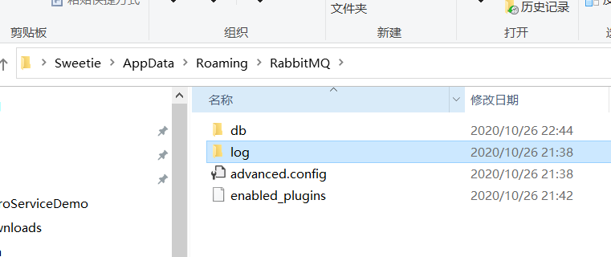

知道端口：5673

log信息  默认打出来的是info格式

{log_levels,[{connection,info},{channel,info}]}

这样日志特别大，对磁盘的压力就很大

{vm_memory_high_watermark,0.4}

指定ram占内存百分比上限，connection达到阀值会阻塞blocked【报警】 让管道流变小

{disk_free_limit,5000000} 也是会触发报警机制，让管道流变小


#### 使用C#连接rabbitmq

.Net Client

1.api文档 类似msdn

2.下载方式有两种： 1）通过官网下载  2）通过nuget下载


- connectiong to a Broker

服务器配置，guest不可以被外网访问，在生产环境中，默认都是新增用户的

这是生产者代码：

```c#
using System;
using System.Net.Http;
using System.Text;
using RabbitMQ.Client;

namespace RabbitmqDemo
{
    class Program
    {
        static void Main(string[] args)
        {
            ConnectionFactory factory = new ConnectionFactory()
            {
                HostName = "127.0.0.1",
                UserName = "datamip",
                Password = "123456"
            };
            //第一步：创建connection
            var connection = factory.CreateConnection();
            
            //第二步：创建channel
            var channel = connection.CreateModel();
            //第三步：声明交换机（因为rabbitmq已经有了自定义的amqp default exchange ，所以这里不声明也能自动创建）
            
            //第四步：创建一个队列（queue）
            channel.QueueDeclare("mytest", true, false, false);

            var msg = Encoding.UTF8.GetBytes("你好"); 
            //第五步：发布消息
            channel.BasicPublish(string.Empty,"mytest",basicProperties:null,body:msg);

            // using...
            // connection.Dispose();
            // channel.Dispose();
            Console.WriteLine("Hello World!");
        }
    }
}

```

这是消费者代码：

```c#
using System;
using System.Text;
using RabbitMQ.Client;

namespace RabbitmqConsumer
{
    class Program
    {
        static void Main(string[] args)
        {
            ConnectionFactory factory = new ConnectionFactory()
            {
                HostName = "127.0.0.1",
                UserName = "datamip",
                Password = "123456"
            };
            //第一步：创建connection
            var connection = factory.CreateConnection();

            //第二步：创建channel
            var channel = connection.CreateModel();
            //第三步：声明交换机（因为rabbitmq已经有了自定义的amqp default exchange ，所以这里不声明也能自动创建）

            //第四步：获取消息
            BasicGetResult basicGetResult = channel.BasicGet("mytest", true);
            ReadOnlyMemory<byte> msg = basicGetResult.Body;

            Console.WriteLine("Hello World!");
        }
    }
}

```

##### 交换机机制：exchange:direct/fanout/headers/topic

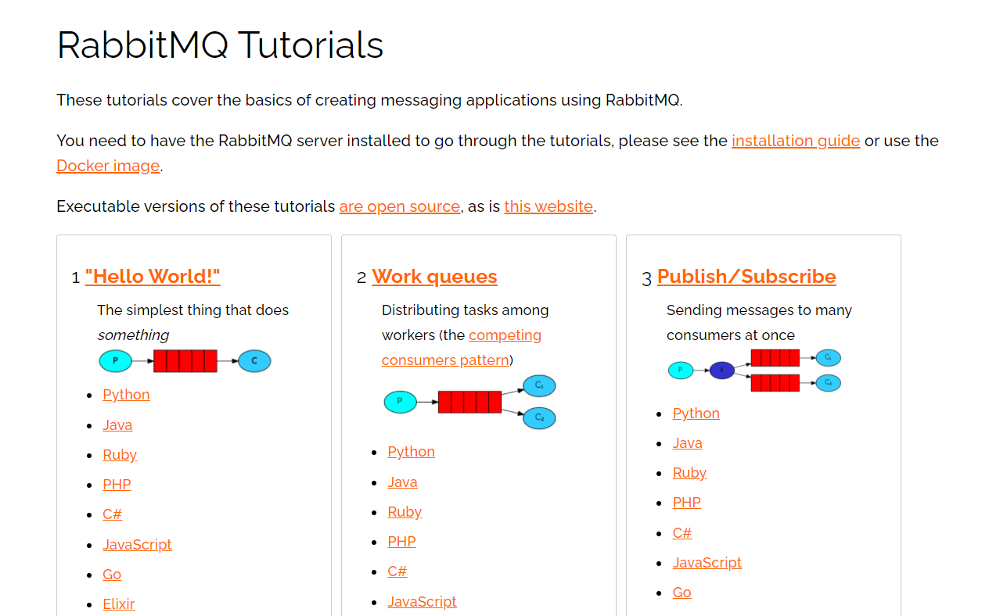

Demo中用到的**BasicGet**是主动的去拉取，subscribe和publish是发布订阅的模式

**workqueue**方式

EventingBasicConsumer:多个consumer可以分摊我们的cpu计算压力

如果申明自定义交换机，一定要手动绑定

```c#
//第三步：声明交换机（因为rabbitmq已经有了自定义的amqp default exchange ，所以这里不声明也能自动创建）可选
            channel.ExchangeDeclare("myexchange",ExchangeType.Direct,true,false,null);

            //第四步：创建一个队列（queue）
            channel.QueueDeclare("mytest", true, false, false);
            channel.QueueBind("mytest", "myexchange", "mytest", null);

            for (int i = 0; i < 100; i++)
            {
                 var msg = Encoding.UTF8.GetBytes(string.Format("{0}:{1}",i,"你好"));
                //第五步：发布消息
                // channel.BasicPublish(string.Empty, "mytest", basicProperties: null, body: msg);
                channel.BasicPublish("myexchange", "mytest", basicProperties: null, body: msg);

            }
```

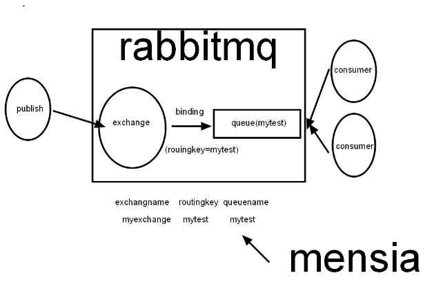

##### Routing模式

做一个日志处理分发，将日志级别不同的存到不同的队列里去，info/debug/warn存到log_else队列中，等待消费者消费；将error存到log_error队列中，等待消费者消费；在这里注意，我们可以在生产者/消费者任意一端构建交换机、队列，因此最合适的方式是，将不同级别队列的构建放在消费者一端，在生产者端，将消息的存进不同的路由中（routekey中）

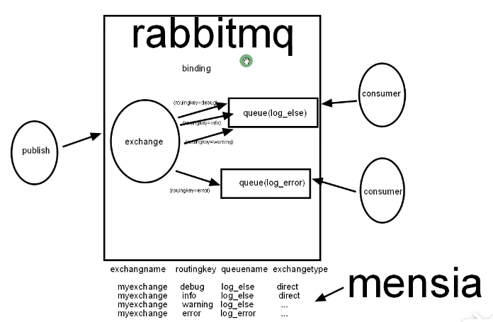

生产者：

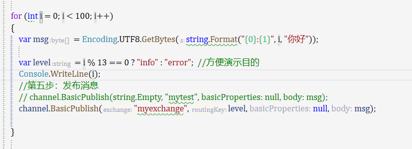

消费者：

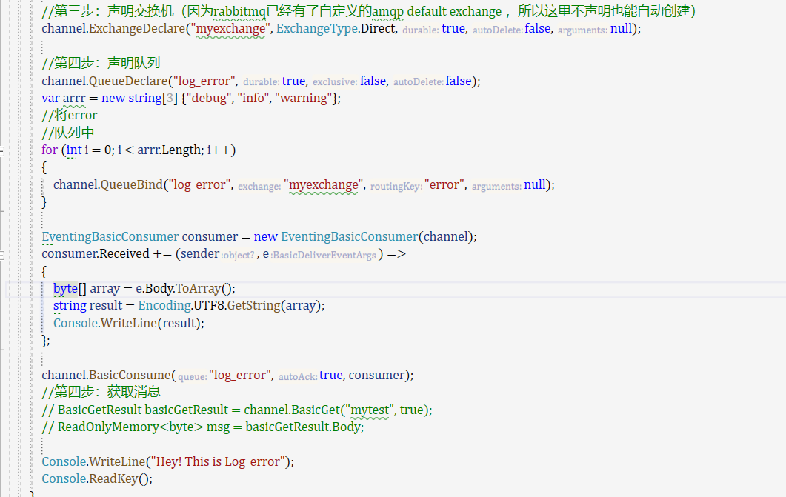

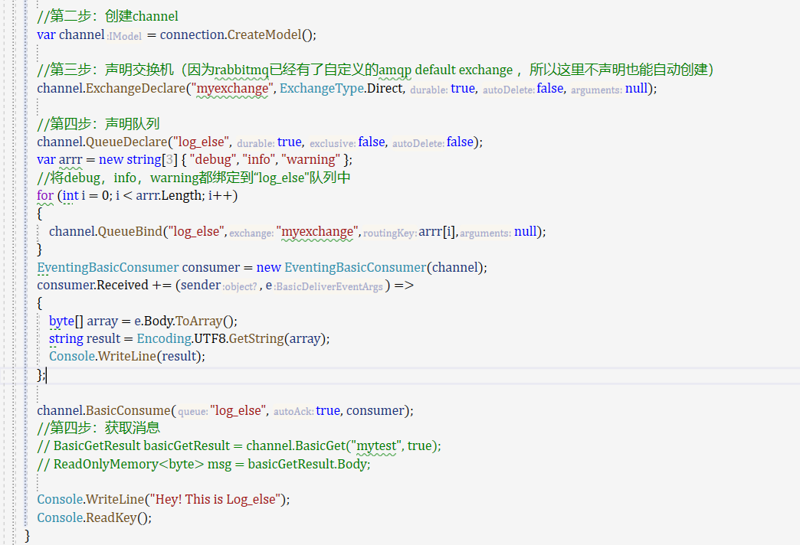

##### fanout：exchange多播的现象

应用场景相当多

1.下订单流程：如果订单提交，同时发送短信和推送

2.cs软件弹出消息，普通情况下，我们是轮询的方式，我们在cs中绑定fanout exchange，这时候服务器有消息的话，可以及时推送

3.客户关怀千人千面

淘宝=>催付、付款后提醒、发货提醒、签收提醒

​		=>给用户关联推荐、彩信和邮件、短信给用户推荐关联推荐