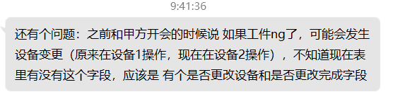
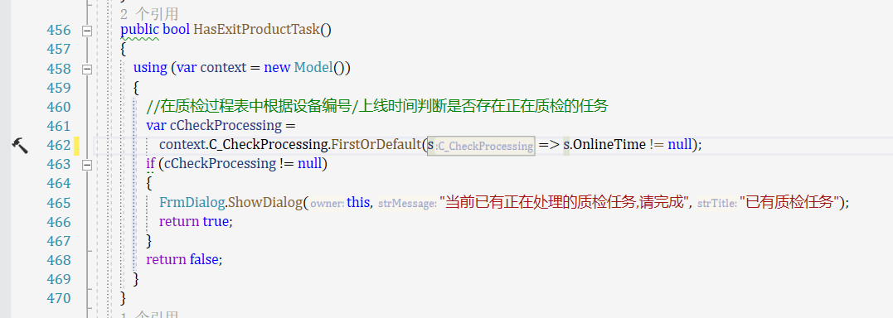

内置颜色

导航菜单

分割线标签

有标题的面板

图标

积累窗体

提示窗体

确定取消窗体

多输入窗体

气泡提示窗体

等待窗体

A_fa_wrench

E_icon_tools


产品基本信息表在哪里

产品编号和产品id有什么区别


具体用code 还是id 其实都可以 ；这个code 和id 应该放在xml或者配置文件里 ，方便修改(已完成)

- 工序任务明细表的产品出生证字段有问题的(已完成)

- 开会的时候 标注下表 说下 字段有问题

还有 葛老师说 存 时间（比如登录登出时间）得从数据库里查找，而不是用本机时间（本机时间可能造成时间不一致）(已完成)


工序任务明细表 是你的是你的上级给你拍发的任务,但任务状态需要底层更新,还有那个另一个工序任务表 也要更新状态(已完成)


- 之前讨论齐套，再工序基础表里有是齐套程序和是否齐套材料2个字段；还有一点就是 可能工序任务明细表缺少工序类型这个字段，有这个字段的话，你才可以区分什么是机加工工序，什么是工装工序（之前我想的包括写的文档是用出生证区分，这个可以再会上问下），以及后面可能需要的 热压和钳工工序（这两个比机加工简单很多，基本上是复制，但也要做成单独的一个程序）(已完成)

不加 你不好判断 （因为现在你只有机加工程序，之后还有热压、钳工程序）,但改表格需要开会说下 并给出记录(已完成)


- 但这个 等级 规则还没定,现在他们的 等级和混乱,先用一个函数 比如 IsHighLevel() 代替 现在直接return true；之后直接给改这个函数就行了***(>=)***(已完成)


- 这个 暂时没法做,因为 他们要主管 审核 才能上线,也就是 底层 没法直接上线 必须管理员审核通过
  才能上线,目前 没有这个字段,     目前:如果不是推荐顺序,就不予上线***(规定admin账户)***(已完成)


- 工量具的生产是不需要首件判断和齐套校核吗,先不判断,这个她们没说,还得和他们问清楚 工装号 和产品出生证 有没有区别***(不用首件判断和齐套校核)***


- **师兄这个里面提到的文件路径规则 , 这个他们还没定我们先怎么做 , 这个也开会问下吧 文件管理 也是后来加的**


**还有些潜在的注意点：1.必填项放在前面 2.自检项目很多 他们说可能有30条 排版注意下**（已完成）


双击任务队列获取产品出生证(单击 , 已完成)


messagebox风格改成hzhcontrol***(已完成)***


程序文件和作业指导在主窗体放一起***(已完成)***


**群里的自检模版**

**数字 / 打勾**


**数据库改动的发一下**


控制点变更会有冗余数据留在过程表中(已完成)


转档之后结束时间要改(已完成)

过程表中所有的数据在转档之后一并带到档案表中才对(已完成)


控制点过程表中应该加一个开始时间才对(不考虑)


记得更新状态  例如产品加工过程表中的结束时间/状态(已完成)

自检项颜色 以及 控制点(已完成)


控制点starttime没有同步过来(已完成)

上线成功没弹出来(已完成)

规定只能打开一个(已完成)

并且应该打开后禁用(已完成)


产品下线一触发,控制点就要开始了理应(已完成)


**让已经被赋值的textbox不能有光标**(没做到)


如果是首件的话要首件记录,并且同时要改一下任务明细表中的状态,如果抽检为1,那么又是首件,应该就要吧送检标为1,方便后续判断是否要送去质量检验(在产品下线部分已完成)


不良原因往哪里录啊(已完成)

productprocessing静态字段记得按上线时间排个序取最后一个,因为可能是返修的(应该没事儿,过程表里应该不会同时出现两个产品出生证相同的数据)


下线成功 颜色变一下(已完成)

补充信息(已完成)

并且转档(已完成)


**产品加工过程表中的上线类型逻辑要修改一下  , 如何判断是正常上线还是返修上线**(已完成)


首件记录表也要转档 ， 状态也需要修改(已完成)

上线的时候工序任务明细表中的状态要改成2(已完成)

ishighlevel需要改动（已完成）

产品下线控制点还没有转档(已完成)


计划产品信息里的状态要改的上线就改成1(已完成)

下线就改成2（已完成）


记得考虑二次上线的问题 , 例如返修呀什么的(已完成)


自检项录入完后,在下线的时候,把里面的下线人员啥的都给填充好咯(已完成)


在提取_cprocessing的时候是否需要加入工序编号来限制一下(不需要)

返修上线的话状态要标识一下(已完成)


送检频率记得判断一下,如果在生产初期取不到那么多,要另作判断(已完成)

下线之后清空 , 并且刷新已完成任务那边的东西(已完成)

如果是首件,那么是否送检也要修改一下(这个好像在下线的逻辑上判断过了)


如果是某道工序的最后一件了, 要在工序任务表里修改状态,并且填充完成时间 , 还有哥完成百分比,实际上需要动态修改的啦阿拉啦啦案例啊啊(已完成)


上线判断优先顺序的时候,要根据是否完成剔除掉一点东西 哦哦哦哦哦(已完成)


**如何判断上线类型**(已完成)


生成抽检任务的时候最好吧最后修改时间也加进去(已完成)


ModifierID好像有点离谱（已完成 , 但是没有修改数据结构)


下线之后要清空控件里的数据,你没有清空(已完成)

上线成功提示没弹出来(已完成)


**如果工序编号每个都不同,那么去工序基础表查的时候要不要做一些操作,例如substring**

在获取待加工或者已经加工完成的那个的时候,最好再按照时间排个序,得到更精确的排序方式(已完成)


**工量具是不是也要放在这里面高 ，我好像漏掉了**（已完成）


**所以在质检之后一定要更新首件记录表里的状态 , 在产品上线的时候会根据首件状态来判定是否要将第二件也作为首件**(已完成)


下线成功没有刷新啊(已完成)


调试初始化:

涉及到的表

登陆过程表/登陆档案表/控制点基础信息表/控制点过程表/控制点档案表/首件记录过程表/首件记录档案表/产品加工过程表/产品加工档案表/aps工序任务表/aps工序任务明细表/产品质量数据表/计划产品出生证表/工序基础表/产品工序基础表/检验任务表/物料齐套校核表/刀具齐套校核表/工序自检项配置表


拥有基础数据的表:

控制点基础信息表

aps工序任务表(缺少结束时间/百分比/任务状态/修改人员/修改时间)

aps工序任务明细表(缺少是否送检/任务状态/修改人员/修改时间)

计划产品出生证表(缺少任务状态/修改人员/修改时间)

工序基础表

产品工序基础表

物料齐套校核表

刀具齐套校核表

工序自检项配置表


**产品上线:**

判断是否已有加工任务=>(校验产品出生证正确性)=>校验有无加工任务=>校验任务是否已经完成=>校验是否为推荐生产顺序=>添加逻辑控制点=>首件判断=>齐套确认(程序/物料/刀具)=>操作人员确认=>(首件记录)=>生成产品加工过程表数据=>完善工序任务明细表数据=>完善计划产品出生证表数据=>逻辑控制点转档


**自检项录入:**

获取已录入数据=>产品是否已上线=>添加逻辑控制点=>数据格式校验=>更新/插入产品质量数据


**产品下线:**

1.自检项控制点转档

2.添加产品下线控制点

1. 判断紧前产品是否送检  送检结果是否生成(**质检还没做所以要手动修改产品质量数据表里的字段**)
2. 判断是否机加工末道工序  生成手检/三坐标任务以及标注送检**(除强制下线外且标注抽检的)**
3. 判断是否抽检
4. 判断是否不良下机以及抽检  生成三坐标任务以及标注送检
5. 判断是否首件以及抽检 生成三坐标任务以及标注送检以及首件记录转档(**质检还没做所以要手动修改转档后的首件记录状态**)
6. 判断是否返修 生成三坐标任务以及标注送检
7. 判断紧前产品送检结果是否NG以及抽检 生成三坐标任务以及标注送检
8. 判断是否达到抽检频率以及抽检 生成三坐标任务以及标注送检
9. 修改aps工序任务明细表状态等等
10. 逻辑控制点转档
11. 完善产品质量数据表
12. 完善aps工序任务表执行进度/状态等等
13. 产品加工过程表转档
14. **判断是否除了质检外的末道工序 产品档案表添加记录**


强制下线:

产品下线里的:12  9.10.11.12.13

14.如果被收录进首件记录表, 则需要删掉 , 毕竟首件记录是在上线的时候做的,上线的时候并不知道它会被可怜的强制下线


**产品A类型的所有工序都做完了才代表着结束(这个到很后面才能做)**


**然而录入进去的东西却带着工序号, 是否不妥???**（已完成）


**产品质量数据表的上线和下线是需要在机加工模块来填写的嘛???**





在首道工序上线之后,要在产品档案表中添加上线信息  当完成末道工序后, 要在产品档案表中添加下线信息（已完成）


末道工序的判断需要加上机加和工装的区分(已完成吧 ,虽然看不懂什么意思)


强制下线之后 依然的要清空 , 刷新(已完成)


记得检查强制下线后的某产品的末道工序是否会生成产品加工档案表 , 理论上应该要有的


填充数据的时候发现文本框可以被修改 , 需要搞一搞(已完成)


考虑没达到抽检频率的时候中间发生了不良或者强制下机

考虑首件的同时不良下机了

或者考虑首件的同时强制下机了

如果是机加最后一道工序,不良下机会被覆盖


**状态栏大一点**（已完成）


**送检底色修改**


强制下线自检项不允许录入（已完成）


**机加环节要给质检任务指定那个什么玩意儿 , 指定那个操作人员,这样质检才能判断是不是规定人员在搞搞搞呢**（已完成）


**产品质量数据表里的上线人员和下线人员指的是机加模块的还是质检模块的**

**检验任务表里的equipmentid是机加工生成的, 检验任务表=>检验过程表转档 的时候 equipmentid要不要改变**（要的，已完成）


**利用automapper的时候, 记得可能会出现把上线人员带过来的情况 , 那么要结合逻辑进行修改 , 一定要记住了**


op01字体类型记得修改（已完成）


枚举类完善(已完成)


下线后, 再点第二个控制点流程会出问题, 注意一下(已完成)


记得分配人员（已完成）


ishighlevel需要修改（已完成）

手动分配人员需要修改（已完成）


**缺一个刷新按钮**


同一产品出生证的产品op01质检还没做op02就可以上机了,很不合理(已完成)


**如果首件记录里有ng的话, 得判断是否主管是否要转移加工设备这个下午需要修改**


登陆进来报告上传就判断为绿色这个需要修改（已完成）


不能按两次label的上线事件（已完成）


已完成, 不只是为了一台设备质检




热压前需要判断质检是否都做完了吗, 热压有齐套确认和操作人员确认吗,不需要判断,**没有齐套确认和操作人员确认不需要**


如果热压不良下机了,要送检,第二件可以继续上吗, 另外送检后,这件产品可以直接送去钳工吗,还是需要等到热压的送检结果出来


**产品档案表转档的时候要考虑报废的情况**


枚举类每个程序里不一致,记得统一(已完成)


检验过程表需要加入工序类型字段吗 目前来说是不必的 但是确实是增加了上线类型这个字段 要的(已完成)


**人员分配/外协工序/钳工工序/**


**不需要操作的, 显示几秒就隐藏**

**背景颜色**

```sql
USE master; 
GO 
DECLARE @SQL VARCHAR(3000);
SET @SQL = '';
SELECT @SQL = @SQL+'; KILL ' + RTRIM(SPID)
FROM [sys].[sysprocesses] AS sps
WHERE [sps].[dbid] = DB_ID('SHINGEN_MES'); 
SET @SQL = SUBSTRING(@SQL, 2, LEN(@SQL));
EXEC(@SQL);
GO
```


返修一直忘记考虑了(已完成)

自检项配置格式问题(已完成)

扫描枪状态检测忘记做了

工装环节上线的时候工装名称记得要带上（已完成）

时间记得改成服务器上的时间（已完成）

推送消息部分需要修改(已完成)

ishighlevel这边需要搞一个规则,比规定的人员等级高就可以生产,否则不予生产(已完成)

机加产品下线环节计划产品信息状态修改方法遗失,需要补充上(已完成)

**工量具加工环节如何判断是工具还是量具**

质检人员分配(已完成)

productQualityData.CheckStaffCode

**热压要扫码登陆**

工量具工具类型不能用int类型(已完成)

人员基础信息表里的reserve1改一下类型(已完成)


在其他环节记得修改一下


**钉钉获取消息是否已读,是否有这个接口**(已完成)

**产品图片（已完成）**

**文件上传**(已完成部分)

**分页**(已完成)

**工装--5（已完成）**

**返修**(已完成机加工和热压)

枚举类状态修改了

aps工序任务表在mainpanel获取todo队列的时候需要修改

aps状态修改了如果第一个该产品类型的该产品工序要上的话需要修改成在执行中


保存修改的状态、优先生产顺序也是需要修改该判断条件

不管是强制上线环节还是正常上线环节


热压那边也要修改


桂康师兄那边的逻辑应该也挺复杂,如何判断是二次返修品


1143193256

dingafwnsvds7udjpeq1

d2W6FhB0vr6bmzc5vZUbkXeXKuEZu5okAW-Cnqt60Sm6YgY6nKyrNgm81ttjWbFC

​	"access_token":"2ae3fb8406ba3035a2b461e4c1d0f01d",


userid:manager4287

坤坤userid:0120645668001202387


CorpId:

ding0f0745b8d5ee3d80ee0f45d8e4f7c288


"chatId":"chatf4e50109d10f52a63b229a3e26a8b35b"


"cid":"97e262a9b20a3a5ebe23bfd4157479df"

a0fd9eeb28443382b825f120ac012c7f

cid在变化


员工UserID：

106437094627494803


这里都要改


枚举类对一对/**如果工序编号每个都不同,那么去工序基础表查的时候要不要做一些操作,例如substring**/状态栏大一点

程序文件/指导文件/齐套校核的int(已完成)/服务器状态变更其他几个程序没写(已完成)/不显示全屏/至少要露出任务栏/产品类型防错判断(已完成)


20210319
会审结果为返修：更改工序任务明细表 、 工序任务表 任务状态 以及任务进度 
乐乐有关（对其 是否有影响）：会审结果为报废： 更改产品档案表、 工序任务明细表 删除该产品出生证的后续任务、更新 工序任务表 数量 状态
乐乐有关：计划重排 判断 工序任务基础表有无执行中，若有 等待已完成（或者强制下机）才能发布 ：

工序 返修 走三方会审 到 底层
工序大返修（改制）走 工艺路线下发，如果 需要大量改制，则必须先把待改制任务强制下机，在重排下发
给出返修结果后，要选择更改设备 ，无论该不该设备， 在工序任务表 插入一条数据，并插入一条工序任务明细表 数据 ，工序任务表之前的计划数量-1

子任务 marks =2 IndentLevel=1
删除原来的工序任务明细表的任务

20210325
1.底层 质检 下机类型添加返修（需要生成 返修任务等）
2.aps 最好能做一个 插单功能（非重排，仅仅是插单）
3.三方会审 逻辑

1.工艺分类问题，排除调试调顺/检验；设备+人员资源（机加类）；设备（热压类）；无资源约束（外协类） 其他类（只考虑人员的）

钳工 可能在机加（我们流程不考虑） 机加完必然 有钳工 

机加工最后一道工序 生成：三坐标 钳工任务 手动检验任务

切断 （热压） 单独类型 只有正常下机

钳工只有正常下机

改制 区分为 客户改制 ，内部改制

1.内部改制 计划数量-1 计划产品出生证表 新增 项目计划基础表信息
2.返修 需要在 计划产品出生证表 和 计划表插入数据（首次返修）


**项目计划信息基本表中的状态需要底层来改吗**

产品工序基础表中需要添加新添加的计划号的元组(已弃用)


**选择正确的下机类型, 然后undo或者返回默认**

钳工后在手检吗,还是钳工前手检,还是钳工前手检任务生成但是可以不做


记得修改其他的程序里的转档(已完成)


增加修改人和修改时间(已完成)


**返修件质量上传报告会把原来的覆盖掉?**


**手检是不是也会生成返修任务,并且还要指定返修的工序什么的这样的?**

**工装环节的返修和二次返修**


**返修要有返修的不良原因吗**


返修的时候要吧原来的apsdetail工序明细任务的有效性置为false

isavaialble去掉了


强制上机理论上是可以上的


||特别注意 , 全他妈修改回来啊艹


自检项录入的时候鼠标聚焦


热压模块的转档记得修改一下


productid 是空的 产品基础信息表是空的 

planid在 计划产品出生证表中是空的

LOGO换一下

SHINDENlogo居中

工序状态字体改变

程序文件和作业指导

文件名字规则 我们不定 


强制下机之后还可以上机

强制下机不能算在生产顺序里面


冻结状态添加按钮

跳过约束

管理员上线


**钳工多人上线**

边框样式以及允许最小不允许最大

**钳工归为外协类** 


#### 培训事宜

EF框架

Dapper框架

dbhelper

codefirst

b站大佬 你真的会c#吗

事件删掉之后ui显示不出来

静态变量慎用

多线程/异步调用

委托

程序包管理控制台

automapper

转档

resharper

github账号

工大邮箱

自定义组件


产品下线

推荐书籍以及推荐b站视频

dbhelper和ef框架的差异和优劣

不同的框架差异 例如.net core .net 5.0 .netframework 4.6.1


