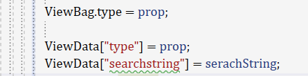
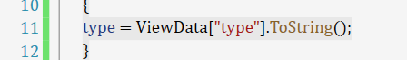
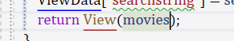
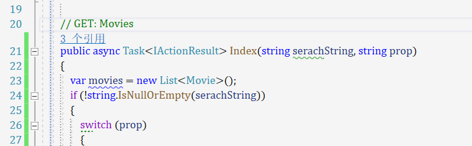
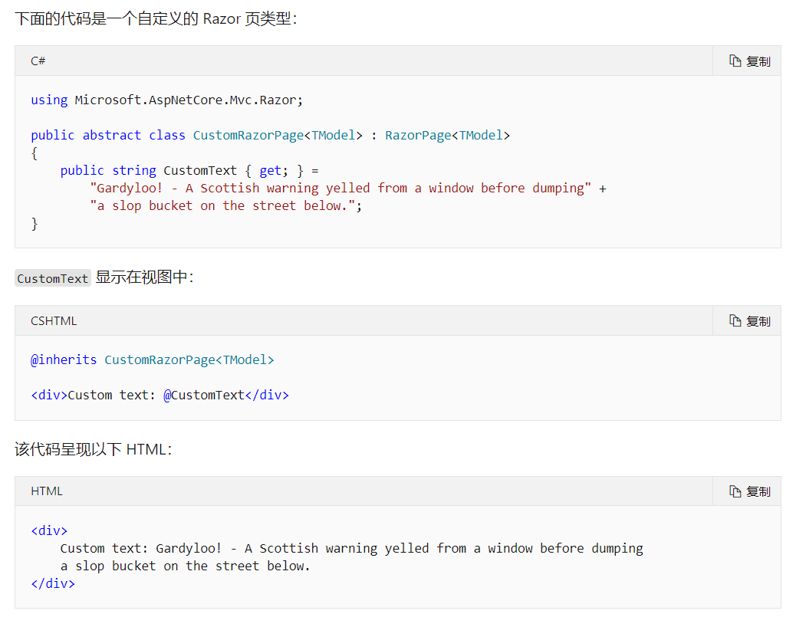

## asp .net core mvc 学习文档

#### 控制器向界面传值

通过viewbag/viewdata 来进行弱传递

controller中:



index中:



通过model进行强类型传递

controller中:



index中:

```html
@model IEnumerable<webmvcdemo.Models.Movie>
<form asp-controller="Movies" asp-action="Index" >
    <p>
        <select name="prop" required="">
            @foreach (var item in typeof(Movie).GetProperties())
            {
                    <option value=@item.Name>@item.Name</option>
            }
        </select>
        <input type="text" name="SerachString"/>
        <input type="submit">
    </p> 
</form>
```


#### 界面向控制器传参

通过name来准确传递

index:

```html
        <select name="prop" required="">
        <input type="text" name="SerachString"/>
```

控制器中:



通过定位点标记帮助程序

https://docs.microsoft.com/zh-cn/aspnet/core/mvc/views/tag-helpers/built-in/anchor-tag-helper?view=aspnetcore-5.0#asp-route-value


### Razor语法

##### 使用@符号将c#转化为html代码提供展示

##### 显式/隐式razor表达式

##### razor代码块

​	Razor 代码块以开头 `@` ，并由括起来 `{}` 。 代码块内的 C# 代码不会呈现，这点与表达式不同。 一个视图中的代码块和表达式共享相同的作用域并按顺序进行定义

##### 控制结构`@if, else if, else, and @switch`

##### 循环结构`@for, @foreach, @while, and @do while`

##### 复合语句`@using, @try, catch, finally`

##### `@attribute` 指令将给定的属性添加到生成的页或视图的类中。 以下示例添加 `[Authorize]` 属性：

```html
@attribute [Authorize]
```


##### @code和@functions

`@code`块使[ Razor 组件](https://docs.microsoft.com/zh-cn/aspnet/core/blazor/components/?view=aspnetcore-5.0)可以将 c # 成员添加 () 到组件的字段、属性和方法

`@functions` 指令允许将 C# 成员（字段、属性和方法）添加到生成的类中


在razor组件中,我们使用@code 来代替js所做的操作和运算

在razor页面中,我们使用@functions 来代替js所做的操作和运算


```html
@functions {
    public string GetHello()
    {
        return "Hello";
    }
}

<div>From method: @GetHello()</div>
```


##### `@implements` 指令为生成的类实现接口。

##### `@inherits` 指令对视图继承的类提供完全控制：



`@model` 和 `@inherits` 可在同一视图中使用。

`@inject`指令使 Razor 页面可以将服务从[服务容器](https://docs.microsoft.com/zh-cn/aspnet/core/fundamentals/dependency-injection?view=aspnetcore-5.0)注入到视图。 有关详细信息，请参阅[视图中的依赖关系注入](https://docs.microsoft.com/zh-cn/aspnet/core/mvc/views/dependency-injection?view=aspnetcore-5.0)。

`@model` 指令指定传递到视图或页面的模型类型

`@namespace` 指令：

- 设置生成的 Razor 页、MVC 视图或组件的类的命名空间 Razor 。
- 在目录树中最近的导入文件中设置页面、视图或组件类的根派生命名空间， *_ViewImports*) 或 *_Imports razor* (组件) (视图或页面。 Razor

`@page` 指令具有不同的效果，具体取决于其所在文件的类型。 指令：

- 在 *cshtml* 文件中，指示该文件是一个 Razor 页面。 有关详细信息，请参阅[自定义路由](https://docs.microsoft.com/zh-cn/aspnet/core/razor-pages/?view=aspnetcore-5.0#custom-routes)和 [ASP.NET Core 中的 Razor Pages 介绍](https://docs.microsoft.com/zh-cn/aspnet/core/razor-pages/?view=aspnetcore-5.0)。
- 指定 Razor 组件应直接处理请求。 有关详细信息，请参阅 [ASP.NET Core Blazor 路由](https://docs.microsoft.com/zh-cn/aspnet/core/blazor/fundamentals/routing?view=aspnetcore-5.0)。

`@using` 指令用于向生成的视图添加 C# `using` 指令：

```cshtml
@using System.IO
@{
    var dir = Directory.GetCurrentDirectory();
}
<p>@dir</p>
```


```c#
public class Instructor
{
    public int ID { get; set; }

    [FromQuery(Name = "Note")]
    public string NoteFromQueryString { get; set; }
```


##### 表单标记帮助程序

