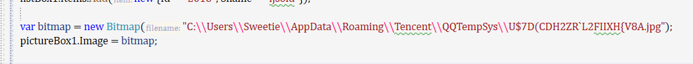
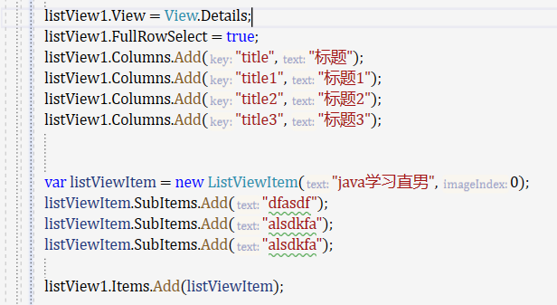

### winform学习

项目结构介绍

自定义窗口:自定义类继承form并展示小标题

拖拽控件

designer的代码和作用 initializecomponent

代码控件(button) 设置size location text等属性

窗口坐标的常识

```c#
Controls.Add(button);
```

事件处理 , 添加事件 ,写上方法  双击操作 自动生成 可以使用cw但是单步调试才能有输出

手动事件处理添加

控件属性修改

控件的布局 使用布局器来布局


窗口自适应问题 onlayout事件 clientsize

Anchor属性 可以设置居中呀什么的

panel控件 

Dock 停靠 

Flowlayoutpanel 流式布局 

控件选择 右键控件

tablelayoutpanel 表格布局 三种布局样式

label

textbox 属性 name multiline passwordchar readonly 需要的时候再来找一下就好了 事件keypress

显示隐藏密码

checkbox 属性 change事件 passwordchar属性 '\0'

combobox 属性 items.add 代码增加下来项 selecteditem selectindex 事件随便选选 代码确定初始化选中项


item可以是object 所以可以传对象

listbox  事件selectedindexchanged 属性 单选多选 items selectionmode selectedindex selecteditems 实际上调用列表的时候会使用tostring方法来显示

image图片 bitmap位图 



picturebox的图片属性 sizemode设定 或者直接设置image


资源文件 resoureces.resx 往里面添加资源重命名然后使用


自定义控件 复合控件 扩展控件 自定义控件 需要和tablelayout等布局格式/anchor或者docker配合使用并自定义事件和属性


modifiers属性 关乎控件的隐秘性


自定义控件属性

```c#
 public partial class SerachBox : UserControl
    {
        public SerachBox()
        {
            InitializeComponent();
        }

        private void pictureBox1_Click(object sender, EventArgs e)
        {
            MessageBox.Show($"正在搜索{textBox1.Text}...");
        }

        public string  Xyz { get; set; }

        public string SearchText
        {
            get => textBox1.Text.Trim();
            set => textBox1.Text = value;
        }
    }
```


注解[Browsable(false)]


甚至是通过重写text来操作


自定义事件

 

使用自定义事件


系统自带对话框

openfiledialog

savefiledialog

folderbrowserdialog

colordialog

fontdialog


自定义图片查看器

菜单栏menustrip

menustrip设置分割线,textbox,combobox,二级菜单,并设置属性,click,text,image

推荐网站阿里巴巴矢量图标库 iconfont.com

工具栏toolstrip

工具栏和菜单栏选择同一个回调函数或者委托或者事件处理机制

右键菜单contextmenutrip

菜单项命名格式


直接给控件赋右键菜单属性


或者根据鼠标的位置判断是否点中了某一项


ListView 列表控件

视图模式:

- detail
- list
- largeicon
- smallicon

模式切换|多字段显示|设置图标|标签编辑|单独排序



表格datagridview 属性columns columnheadersvisible rowheadersvisible allowusertoaddrows

基本操作 : grid.rows.add()  grid[col,row] grid.rows[].cells[]  gird.rows.removeat() grid.rows.remove()

表格的编辑 通过readonly来指定特定的列可以编辑

回车后应该触发验证事件来判断  cellvalidating


高级篇

工作线程与UI线程

异步操作 

hzhcontrol 