小程序组件

view标签 类比p便签

text标签 类比span标签

 selecttable :文档是否可选

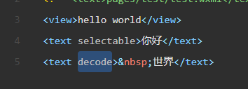

decode标签 :选中＆ｎｂｓｐ；/lt/gt/amp.apos/ensp/emsp这样的可以识别出来

button标签:

​		type: primary / default / warn 

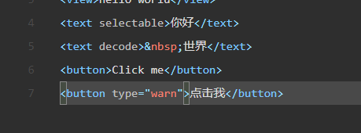

​		form-type="submit"/reset

​		open-type   getuserinfo/getphonenumber/contact

 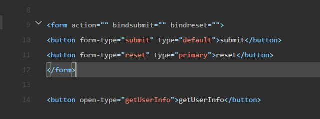

checkbox 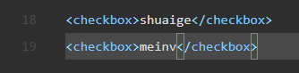

开闭标签,可以在开闭标签内写上复选文字内容

value可以填入真实的值

checkboxgroup

radio单选按钮 

开闭标签 , value可以填入真实的值  , 实现单选需要配合实现radiogroup

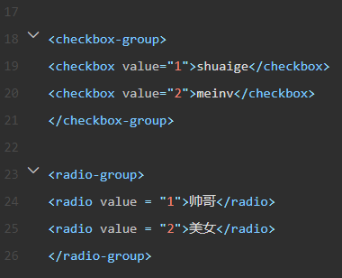

block标签

​	标签块  , 其本身不会被渲染到页面中 , 只有内部的标签会被渲染进html页面

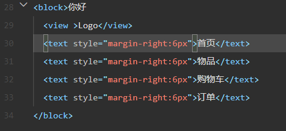

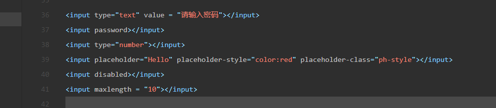

绑定事件+编写js方法

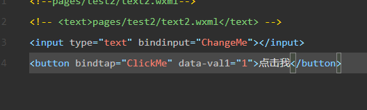

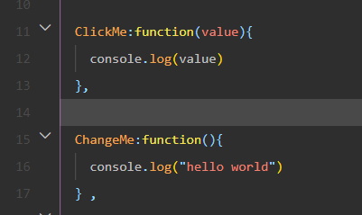

data的数据绑定以及数据更新

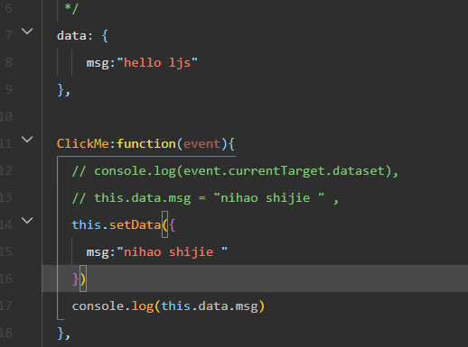

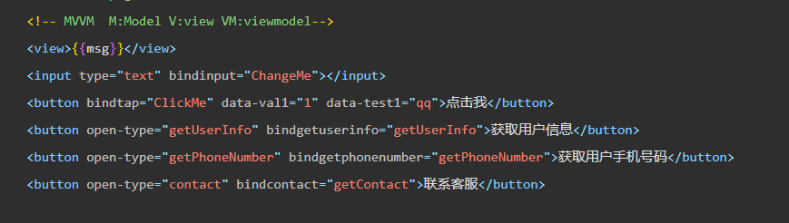

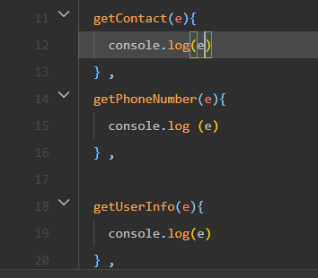

富文本识别展示

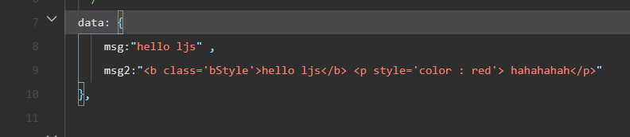

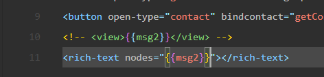

可以携带css样式结构

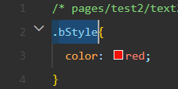

弹出窗体

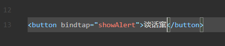

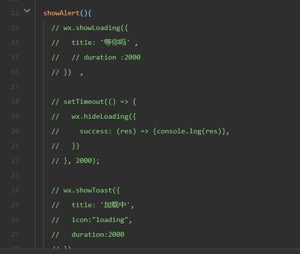

加载窗体 , 等待时间 , 图标 成功的事件

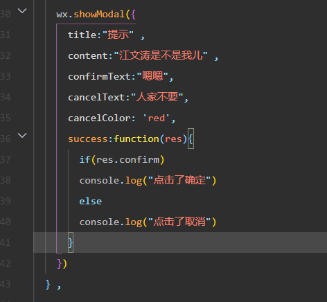

弹出确定/取消按钮

click事件判定

页面跳转事件并且传参

两种方式

1.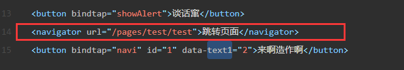

2.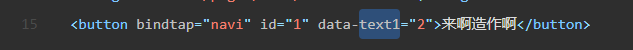

携带数据

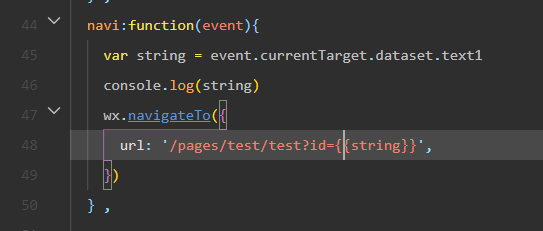

js中处理

通过webapi获取后端数据

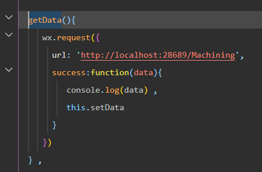

xy+5x/2+20y/2 = (5+y)(20+x)/2

100 + 5x + 20 y +xy = 2xy + 5x + 20y 

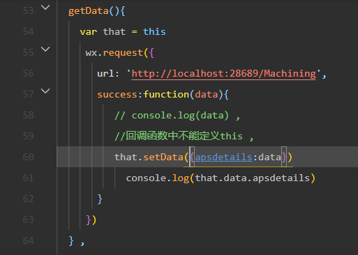

webapi采用的是.net 5.0 使用efcore , 所以和原来的略有不同呢 亲爱的 , 例如使用依赖诸如, appconnectionstring得写在不同的地方,在静默管道里添加sqlserver服务,并且指定特定的dbcontext,以及重构一下dbcontext的构造函数等等,此外还需要额外添加efsqlserver的nuget包

video标签 以及填充样式

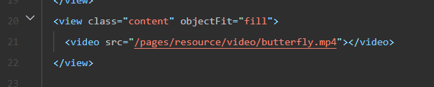

image标签以及宽度修正样式

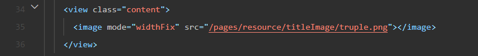

数值回传以及样式绑定

在data里绑定静态数据 

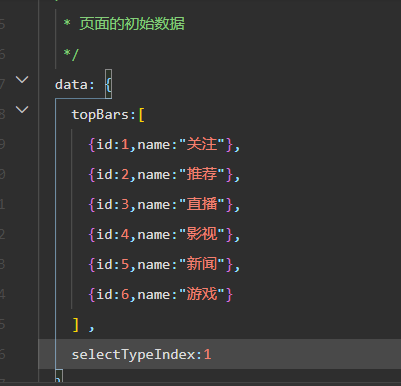

在wxml里利用wx:for来遍历data中的静态数据

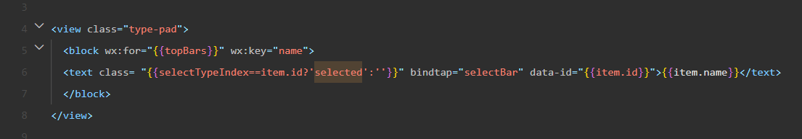

通过插值判断是否页签被选中,以及页签颜色样式修正

data-id传值

selectbar方法处理

传值处都要用插值法包裹 实际上很像java的模版引擎

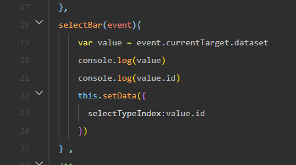

携带id值过来,处理data中的静态typeindex

使用wx:if wx:else wx:for配合block来进行内容展示

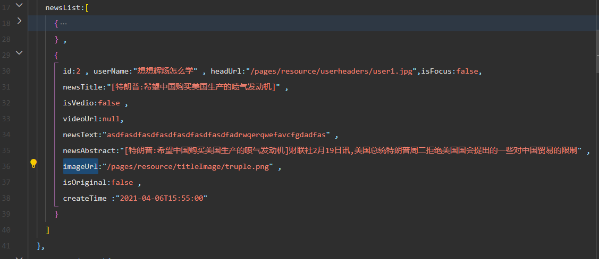

data中展示新闻的content

view界面中使用wx：for来遍历newslist

使用插值法取数据

使用wx:if和else配合使用

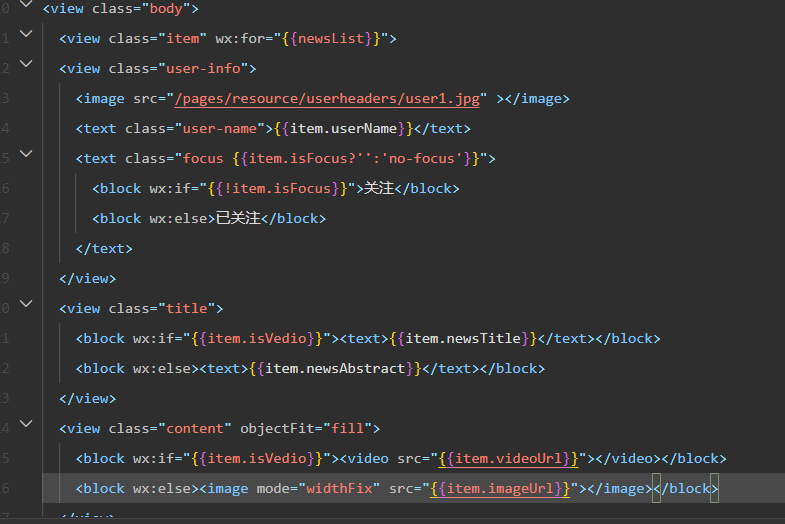

模拟后端接收数据,onload操作

并且存入data中

并且在前端将data中的值取出来展示

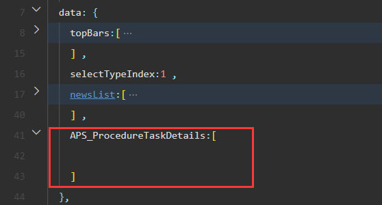

通过wx：request方法获取，通过success回调函数来将值存入data中

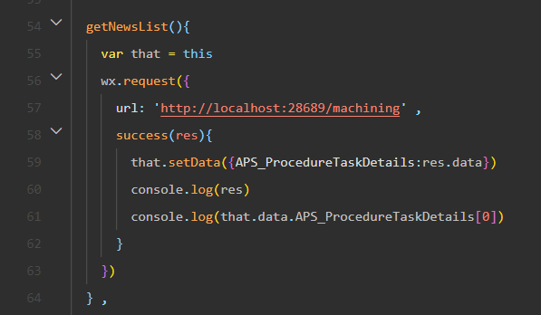

接着就是前端的wxml去取数据啦

wx:for 需要配合wx:key 使用以提高性能

否则默认将以index为检索

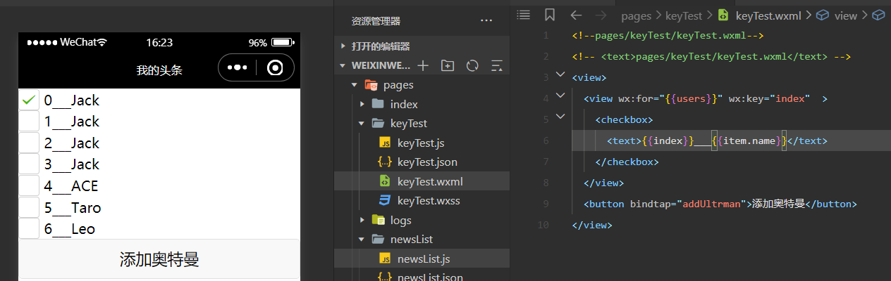

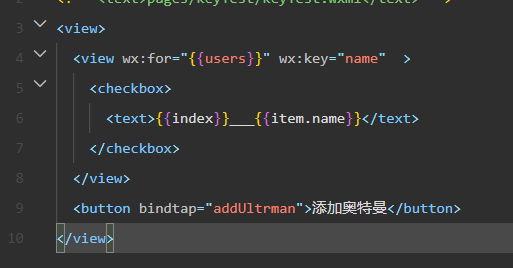

