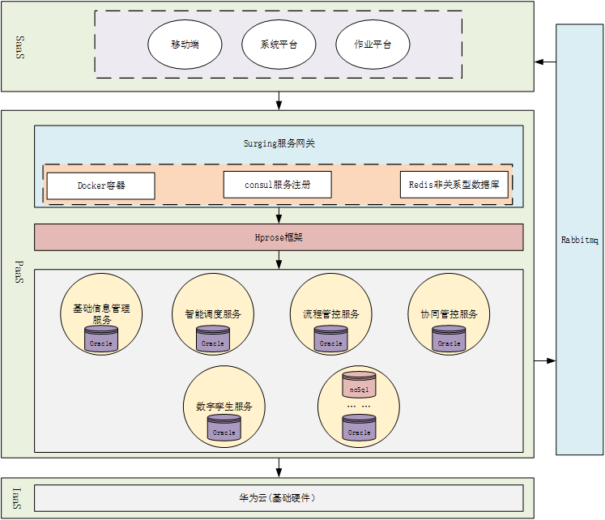
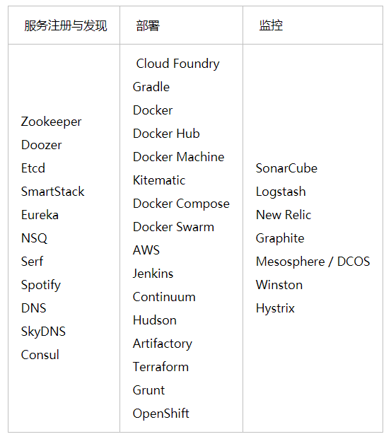
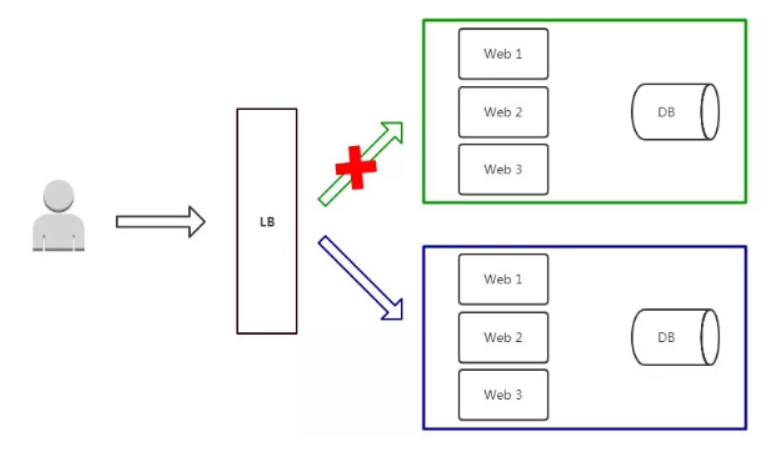
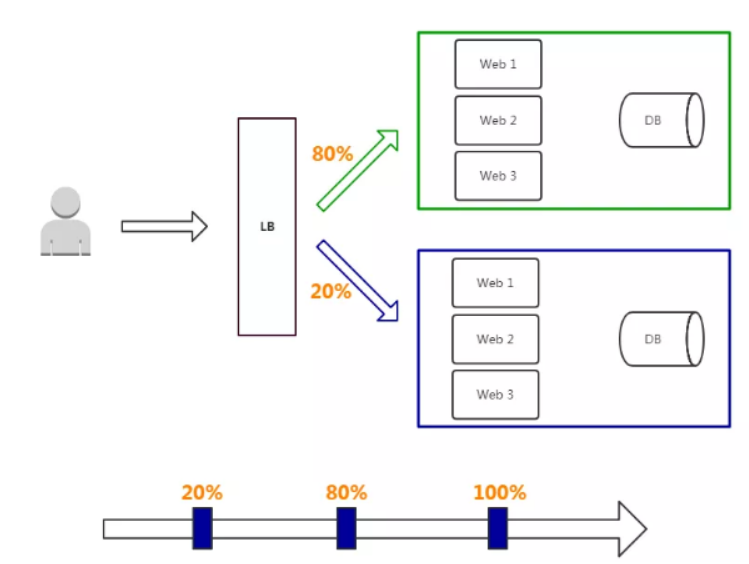
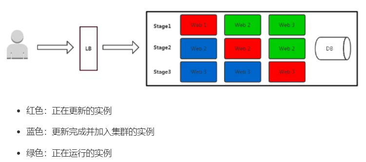

### 微服务架构学习文档

Netflix流媒体播放平台微服务架构：

oes目前设想：

##### 微服务架构特性：

- 单一职责
- 轻量级通信（通过http、rpc协议下的xml、json格式，无关语言、平台）
- 独立开发、测试、部署（并行工程）

##### 分布式--集群--微服务

分布式：不同服务器部署不同业务（应用）

集群：不同服务器部署同一套业务（应用）

微服务：同一台服务器可能部署多个微应用

##### 问题：

1. 单体应用

优点：便于开发、测试、部署

缺点：维护成本高、交付周期长、扩展性差

- 作业平台、移动端、系统平台有功能相同或者重复的代码，相同业务逻辑的代码，修改维护很不方便
- 数据有时候通过数据库共享，有时候通过接口调用传输。接口调用关系杂乱。
- 单个应用为了给其他应用提供接口，渐渐地越改越大，包含了很多本来就不属于它的逻辑。应用边界模糊，功能归属混乱。
- 加入数据分析、深度学习等相关功能后出现性能瓶颈，影响了其他应用。
- 数据库表结构被多个应用依赖，无法重构和优化。
- 所有应用都在一个数据库上操作，数据库出现性能瓶颈。
- 开发、测试、部署、维护愈发困难。即使只改动一个小功能，也需要整个应用一起发布。有时候发布会不小心带上了一些未经测试的代码，或者修改了一个功能后，另一个意想不到的地方出错了。
- 团队出现推诿扯皮现象。关于一些公用的功能应该建设在哪个应用上的问题常常要争论很久，最后要么干脆各做各的，或者随便放个地方但是都不维护。

**紧迫且繁重的任务容易使人陷入局部、短浅的思维方式，从而做出妥协式的决策**。**在这种架构中，每个人都只关注在自己的一亩三分地，缺乏全局的、长远的设计。长此以往，系统建设将会越来越困难，甚至陷入不断推翻、重建的循环。**

*要做改造，首先你需要有足够的精力和资源。如果你的需求方（业务人员、项目经理、上司等）很强势地一心追求需求进度，以致于你无法挪出额外的精力和资源的话，那么你可能无法做任何事……*

**整理了业务逻辑，抽象出公用的业务能力，做成几个公共服务**

各个应用后台只需从这些服务获取所需的数据，从而删去了大量冗余的代码，就剩个轻薄的控制层和前端。这一阶段的架构如下：

数据库依然是共用的，所以一些烟囱式系统的缺点仍然存在：

- 数据库逐渐成为了性能瓶颈

- 可能会有一个服务从数据库中读取另一个服务的现象发生

- 数据库表结构可能被多个服务依赖，导致很难调整

  

  持久化层相互隔离，由各个服务自己负责。另外，为了提高系统的实时性，加入了消息队列机制。架构如下：

  

数据分析和深度学习可以做数据库持久化层，一些常用的访问可以做memcache缓存机制，大文件非结构化文本可以采用nosql非关系型数据库，例如mongodb、redis

> **还有一种抽象出公共逻辑的方法是把这些公共逻辑做成公共的框架库。这种方法可以减少服务调用的性能损耗。但是这种方法的管理成本非常高昂，很难保证所有应用版本的一致性。
> 数据库拆分也有一些问题和挑战：比如说跨库级联的需求，通过服务查询数据颗粒度的粗细问题等。但是这些问题可以通过合理的设计来解决。总体来说，数据库拆分是一个利大于弊的。**

- 微服务架构的优点还在于其使得整个系统的分工更为明确，责任更加清晰；单体应用公共部分可能大家都实现了一遍，公共的业务功能没有明确的归属
- 微服务架构的缺点：容易产生雪崩效应，即一个服务挂了，另一个服务直接或者间接地调用该服务，导致这个服务也跟着宕机了；此外，整个应用被拆分为了多个服务，定位故障点也十分困难

问题是解决了，但谁也无法保证不会再发生类似的其他问题。微服务架构虽然逻辑设计上看是完美的，但就像积木搭建的华丽宫殿一样，经不起风吹草动。微服务架构虽然解决了旧问题，也引入了**新的问题**：

- 微服务架构整个应用分散成多个服务，定位故障点非常困难。

- 稳定性下降。服务数量变多导致其中一个服务出现故障的概率增大，并且一个服务故障可能导致整个系统挂掉。事实上，在大访问量的生产场景下，故障总是会出现的。

- 服务数量非常多，部署、管理的工作量很大。

- 开发方面：如何保证各个服务在持续开发的情况下仍然保持协同合作。

- 测试方面：服务拆分后，几乎所有功能都会涉及多个服务。原本单个程序的测试变为服务间调用的测试。测试变得更加复杂。

**如何解决**：

- 引入监控（微服务监控系统）：使用开源组件获取各接口查看各状态，利用指标采集器来做监控界面和告警处理

  - redis要监控占用内存值，网络流量；

  - 数据库要监控磁盘空间、数据库连接数

  - 业务服务要监控错误率，并发数，响应延迟

    

- 定位故障

Dapper

- 服务容错
  - 熔断处理：服务异常或者大量延时就主动熔断，直接返回；不继续调用服务防止雪崩效应导致服务器宕机，隔离一段时间后，允许放行少量请求进入半熔断状态，如果仍然调用失败或超时异常，继续熔断，否则关闭熔断模式
  - 线程隔离（一种隔离模式）不同服务使用不同线程池，即时服务出现故障耗尽线程池资源也不会让其他服务受到影响
  - 回退操作
  - 限流处理：对并发量访问量进行控制，超出部分拒绝请求

- 动态配置

  动态修改配置参数，解决方案之一是存放在git私有仓库里，通过docker从git服务器中动态读取，本地仓库发生代码变化时，通过push操作推送到git仓库，git服务器通过消息队列通知配置中心刷新对应的配置文件

- dubbo（阿里）

  分布式服务框架，基于java RPC协议，核心组件：有RPC（远程过程调用）、负载均衡、服务发现与注册、容错、服务监控，由于集成了众多功能组件，显得框架较重，但经历了阿里电商的考验，是一个值得研究和使用的框架。Netty（基础通信组件）Zookeeper（服务注册与发现）dubbo-monitor（服务监控中心）

  角色定义：consumer/provider/registry/monitor/container

- spring cloud

  与dubbo不同，其采用http（超文本传输协议）协议restful风格，核心组件：服务发现与注册、服务监控。enruka（服务注册与发现）springboot admin（服务监控中心）

**在高并发环境下，线程数量可能会创建太多，操作系统的任务调度压力大，系统负载也会比较高。那怎么办呢？**

- Zuul

  spring cloud下微服务api网关，集成ribbon负载均衡、鉴权、限流、熔断、提供动态路由、监控、安全认证、负载卸载等功能。网关就可以对外暴露聚合API，屏蔽内部微服务的微小变动，保持整个系统的稳定性。

- Eureka

  服务注册与发现中心

  1.服务注册：生产者（provider）在提供服务实例的时候注册并存进注册表中

  2.提供注册表：消费者（consumer)在调用服务的时候查询注册表里可用的服务，调用其方法，通常会缓存注册表，并定期想注册中心索取注册表信息

  3.信息同步、服务续约：服务实例通过心跳机制定期向注册中心报告该实例的健康状态，注册中心未检测到就将其从注册表上剔除

  4.服务下线：服务实例下线的时候，注册中心将其剔除

  5.负载均衡：内置Ribbon，多个服务实例时，根据ribbion请求请求分法自动进行负载均衡

  6.自我保护：当检测不到心跳机制时，大量服务从注册中心剔除，有可能是网络问题，这时停止剔除，防止误杀服务；在此期间能够进行服务注册和查询，网络稳定将新的服务实例同步到其他节点中

  7.集群部署：所有eureka节点会定时自动同步微服务的注册信息

- Nginx

  负载均衡工具（Linux），优秀的反向代理服务器，（正向代理就是替客户端做代理，去请求服务器，例如科学上网，反向代理就是替服务端做代理，将客户端请求分发到真实的服务器上，进而实现负载均衡。）还可以做web服务、web缓存，优点：高并发、低消耗、ip限速、限制连接数、

  

- Ribbon

  负载均衡工具，被封装在springcloud内，自动将基于http的restful模版转换成客户端的负载均衡的服务调用。负载均衡是对系统的高可用、网络压力的缓解和处理能力扩容的重要手段之一。

- Dapper

  谷歌旗下分布式架构跟踪系统，低消耗高拓展，提供链路定位跟踪

- Mock

  单元测试、生成数据，对不容易获取、构造的对象，创建一个mock对象来模仿对象的行为

- 完美RPC（让远程调用像调用本地方法一样简单，解决分布式系统服务间调用的问题）

  服务注册中心（Zk，负责服务发现、注册与治理）、负载均衡（多种负载均衡算法如轮询、压力最小，请求分发，）、缓存机制（缓存注册表）、异步调用、故障定位、告警和监控、

- 轮询、长连接和心跳机制

  轮询耗资源，每次轮询就要建立连接，间隔时间定义，长连接低消耗，心跳更低，轮询和长连接用来请求数据，获取响应，心跳用来保持连接即可

- kubernetes

- Docker

  微服务以镜像的形式，运行在Docker容器中。使用Docker容器技术，我们只需要将所需的基础镜像（jdk等）和微服务生成一个新的镜像，将这个最终的镜像部署在Docker容器中运行，这种方式简单、高效，能够快速部署服务。每个Docker容器中可以运行多个微服务，Docker容器以集群的方式部署，使用Docker Swarm对这些容器进行管理。我们创建一个镜像仓库用来存放所有的基础镜像以及生成的最终交付镜像，在镜像仓库中对所有镜像进行管理。

- 自动化测试+发布

  - 蓝绿发布

    把A组剥离出LB进行升级，升级完了再重新部署进LB中，没问题的话把B组剥离出LB进行升级，升级完了再重新部署进LB中。

    

    优点：发布平滑/有问题及时回滚/出问题影响范围比较大/策略简单

    缺点：将AB分别剥离出LB，就需要两倍数量的服务器提供支持，否则容易导致因请求量过大服务器意外宕机，短时间内浪费一定资源成本，例如云资源或硬件资源

  - 灰度发布

    升级部分服务，让一部分用户继续使用老版本，一部分使用新版本，当新版本无问题客户无反馈，就逐步扩大服务升级范围，至全部升级完毕。（形似公测和内测）从LB中去掉灰度服务器，对灰度服务器进行升级，升级后进行测试，灰度服务器测试成功就升级剩余服务器。

    

    优点：逐步保证稳定性，一有问题就可以及时发现，影响的范围相对可控，用户无感知，平滑过渡

    缺点：自动化要求比较高

  - 滚动发布

    一次升级一个或多个服务，直到全部服务都升级；

    

    优点：节约资源/平滑过渡

    缺点：不易回滚/发布策略复杂/自动化要求高
    - 蓝绿发布：两套环境交替升级，旧版本保留一定时间便于回滚。
    - 灰度发布：根据比例将老版本升级，例如80%用户访问是老版本，20%用户访问是新版本。
    - 滚动发布：按批次停止老版本实例，启动新版本实例。