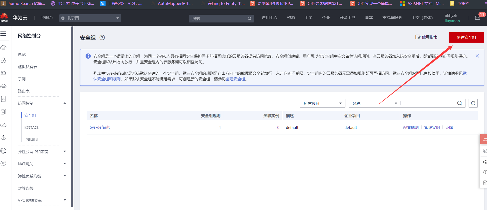

### 服务器学习文档

> 为什么程序员需要一个自己的服务器

1.作为一个程序员，必须要发布自己的网站和项目！

2.练习linux操作

3.自己的远程仓库、远程数据库、远程tomcat....搭建在服务器上

4.练习，linux进行任意的环境部署操作！！window下开发，不熟悉linux

5.。。。。

> 服务器如何购买

如果学生，可以购买学生机，100多块钱一年

香港服务器可以避免备案，但是尽量不要自己挂vpn会被封

> 买完服务器之后该做什么

服务器就是一个远程Linux

1.在阿里云购买的，需要开通安全组设置，端口映射

安全组用开启端口映射，否则外部无法访问

2.获取服务器的公网ip地址；修改实例名称和密码，第一次修改需要重启，使用xshell远程连接

170.11.11.11

> 连接到服务器之后，我们需要搭建环境

1.傻瓜式

宝塔面板安装教学

2.原生