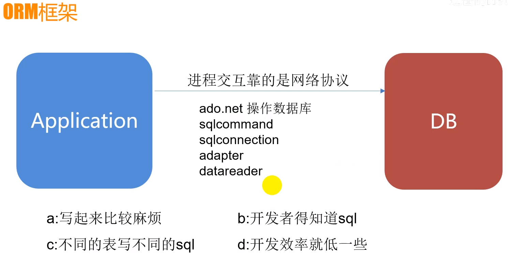
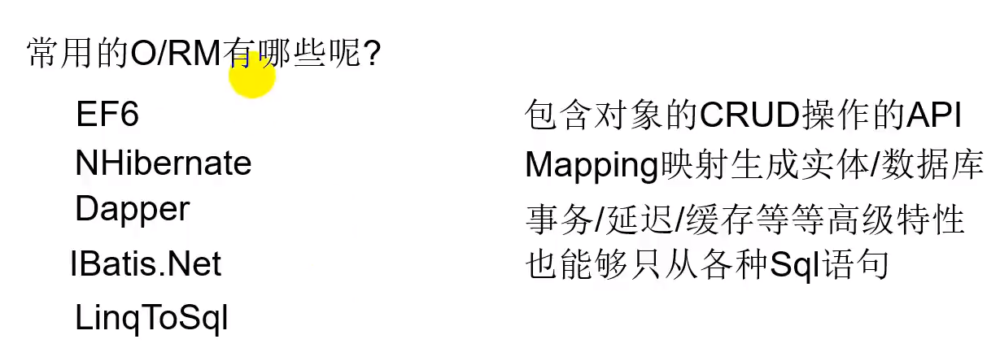
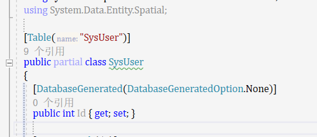

## 朝夕教育_ORM框架详解（EnfityFramework6详解）学习文档

没有orm框架



orm是一个封装，是一个代理


可以防止sql注入鸭



sql--反射生成sql--自动执行--反射绑定结果

大量的反射, 性能影响---缓存一下---占内存---启动慢执行不影响

开发快捷,降低学习SQL的成本

sql固定生成, 但是僵化,对索引利用不够好, 分页算法就不够好, 在复杂的情况下难以应对, orm工具一般也可以支持写sql

orm一般还能适应不同数据库的迁移

orm只是一个工具,去完成他擅长的事儿,也有的事儿是它做不好的,也只能去结合别的工具来协作完成的,orm实际上是一种面向对象的做法,是一种思想上的近不,这个进步是有代价的,会影响一定的性能


Entity-Framework6 

支持各种版本的数据库 , 数据库存储过程, 函数

都是微软提供,跟vs结合的完美在.net core年代对应的有一个EF Core


EF有三种方式:

DBFirst / CodeFirst / CodeFirstFromDB , ModelFirst

DBFirst:

数据库先行,先建立好数据库,然后通过数据库映射数据库映射实体,edmx文件,然后就可以直接使用Context查询数据 ;

find如果查过了 那么firstordefault将不会继续查询,直接从缓存里查询这些东西

sqlserver profiler必须要调试起来才能看到sql 语句

或者通过context输出控制台sql语句

CodeFirstFromDB



为了映射,防止因为数据库的表名和实体名称出现不一致的时候的查询出错

并且利于实体名称的修改

映射:

**1.在实体里通过注解的方式写映射**

特性映射 Table("数据库表名称"),[Column("Name")]

**2.直接在modelbuilder里写实体的映射**

modelBuilder.Entity<类名称>().ToTable(表名称).Property(c=>c.属性名称).HasColumnName<数据库字段名称>

**3.构建一个mapping的类用来专门写映射,形似abp中的entityframework层级的mapping**

```c#
public class SysLogMapping:EntityTypeCopnfiguration<SysLogShow>

{

public SysLogMapping()

{

this.ToTable("SysLog")

}

}
```

框架进阶

复杂查询&直接执行sql

EF状态追踪,本地增删改查实现

context生命周期,多种事务

EF延迟查询/导航属性加载&增加&删除

##### EF封装类库

- 封装类库
- 调用方引用
- 引用EF相关包
- Copy配置文件


