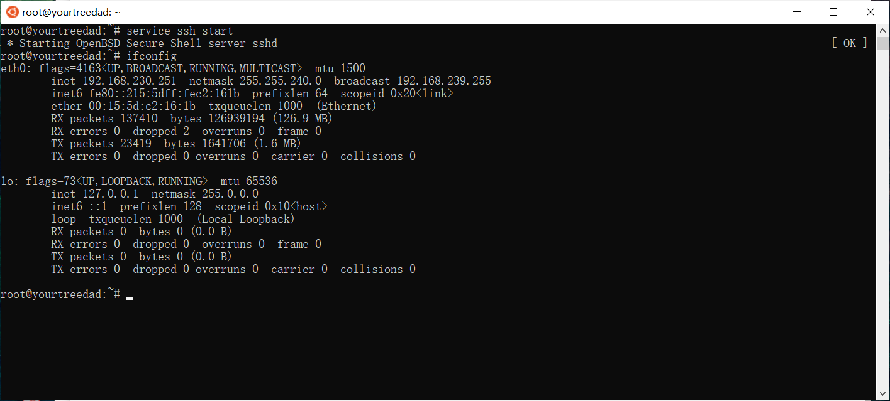
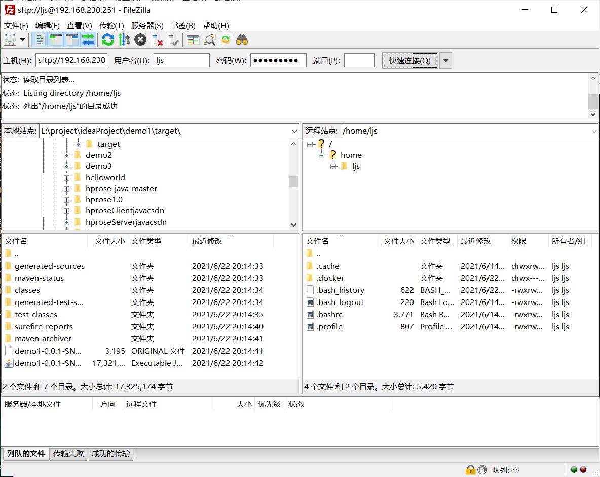

环境支持

首先肯定要有apt-get install

apt-get upgrade

还要有支持ssh的服务

查看ubuntu版本

lsb_release -a 

# 在 Ubuntu 上安装 .NET SDK 或 .NET 运行时

https://docs.microsoft.com/zh-cn/dotnet/core/install/linux-ubuntu#2004-

安装后查看版本

dotnet --list-sdks

dotnet --list-runtimes

service ssh start 开启ssh服务

ifconfig  查看ip地址

连接传输文件

