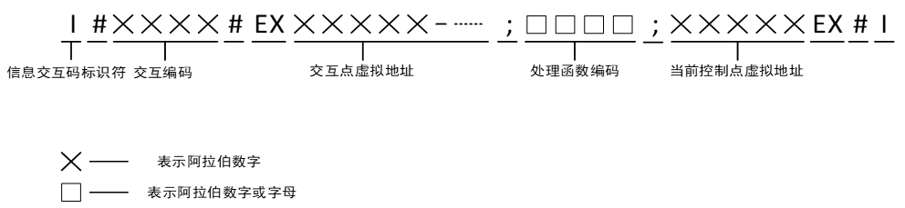

### 物联码学习文档

信息载体，包含信息交互所需要的所有信息，实时更新，触发一系列业务流程，并在推进的过程中采集特征数据。

包括：基本信息、调度信息、前后任务的交互信息、异常信息、资源约束信息、辅线任务信息、数据采集规则。

物联码相应子码：基本码、调度码、信息交互码、资源约束码、异常码、辅助码、采集码。

##### 1.基本码：人机料法环能唯一标识。

B#20170302001#P234589P_M23458901M# \u738b\u5fb7\u534e_M_ inpatient _ 004 _ 002 #B

##### 2.任务调度码：调度码、决策码、当前作业、当前作业环境、下游作业、下游作业环境。

任务调度码生成后，下发到指定的作业终端。

通过实时更新任务调度码，各个作业平台进行交互。

D#S2017030200101S#COP04;prepare001C#SOP05;operation001S#10#D

##### 3.辅助任务调度码：主线=>任务调度码 辅线=>辅助任务调度码

SD#S201703020290102S#CAW02;Equipment001C#MOP05;operation001M#10#SD

##### 4.异常码

E#S201711240001S#O2017112402704_D01O#T20171124173223T#LOPROOM001L#CPPAT001C#RPPAT001R001R#S10S#E

##### 异常处理步骤码

EHS#S20171124000101S#FOPROOM01/192.168.1.16_N001/192.168.1.80F#HN001/192.189.1.80H#OWW001_W002_W050OW#SWW050SW#T20171124150921T#S20S#EHS

##### 5.系统活动码

ESA#S2017112400010101S#MPWorkPlatForm\WorkPlatForm\OES.BASICCLASS\OESDisplay%WorkPlatForm\WorkPlatForm\OES.CLASSLIBRARY\OES.IOTCodeClassLibrary\IOTCodeBasicClassMP#MT_Status_Color/StaffStatusTurnToDisplay%Split_IOTCode/Intercept_IOTCodeM#Pstring T_Status/string Status%string IOTCode/string Code|int StartLocation|int Intercept_LengthP#PV“30”/“1”%“D#S2017022703004S#COP01;192.168.1.1C#SOP02;192.168.1.2S#10#D”/””|1|5PV#T20171124150832T#S20S#ESA

##### 6.资源约束码

\#2017030200101 #R111000R#

##### 7.信息交互码

I#0001#EX00010；001；00020EX#I