## C#5.0+学习文档

特点：

- 通用性语言
- 类型安全
- 面向对象

目标：生产力

- 简洁性
- 表达力
- 高性能

平台中立，与平台无关

封装、继承、多态

统一的类型系统：

- 类型
- 共同的基类

类和接口

- class
- interface

属性property、方法method和事件event

- 唯一一种函数成员(Function Member):方法(method)
- 方法还包括：属性(Property)和事件(Event)还有其他的
- 属性
- 事件


- C#主要是一种面向对象的语言，但是也借用了不少函数式编程的特性
- 函数可以当做值来对待
  - 委托Delegate
- 支持纯(purity)模式
  - 避免使用值可变的变量


类型安全

- c#主要来说是类型安全的
-  静态类型 static typing
- 动态类型 dynamic 
- 强类型 strongly typed language


内存管理

- 依赖于运行时来执行自动内存管理
- CLR:Common Language Runtime (公共语言运行时)
  - GC： Garbage Collector (垃圾收集器)
- c#没有消灭指针
  - 通常情况下不需要使用指针
  - unsafe


平台支持

- 原来c#主要是在window上面运行
- 现在可以在所有的平台上运行
  - windows
  - macs
  - linux
  - ios
  - android
  - ...
- .Net Core


- .Net/.Net Core 的核心就是CLR: Comman Language Runtime
- CLR和语言无关
- c#是一种托管语言
  - 会被编译成托管代码(IL : Intermediate Language)
  - CLR把IL转化成机器的原生代码
  - JIT(Just in time)编译
  - Ahead-of-time编译
- 托管代码的容器：Assembly 或portable Executable
  - .exe 或dll
  - 包含IL 和类型信息(metadata) 
- IIdasm


支持c#的框架

- .net framework
- .net core
- unity
- xamarin
- uwp
- winrt
- windows phone
- xna
- silverlight
- .net micro framework
- mono
- sql server


.net Core

#### 编译

- c#编译器把.cs结尾的源码文件编译成Assembly
- assembly是.net core里包装和部署的单元
- assembly可以是应用程序，也可以是库
  - .exe
  - .dll


#### 构造函数和实例化

- 数据是通过实例化一个类型来创建的
- 预定义的类型直接写literal就可以被实例化了
- 而自定义类型则通过new操作符来创建实例

#### 实例成员vs静态成员

- 操作于实例类型的数据成员和函数成员都叫做实例成员
- 操作于类型而不是类型实例的数据成员和函数成员叫做静态成员
  - static
- 静态类static class 的所有成员都是静态的
  - 静态类不可以创建实例。 例如console ，他在整个程序里就一个


public

- public关键字可以把成员暴露给其他的类
- 如果没有public关键字的话就是private
  - 无法暴露给其他类


#### 值类型与引用类型

- 值类型包括所有的内置类型（数值、字符、bool）和自定义的struct和enum

- 引用类型包含所有的class，数组，delegate，interface类型。包括字符串

- 他们的根本区别在于处理内存的方式

#### 值类型

1. 值类型变量/常量的内容就是一个值
2. 使用struct关键字就可以自定义创建值类型

```c#
       Point p = new Point() ; 
            p.x = 7 ; 
            Point p1 = p ; 
            System.Console.WriteLine(p.x);
            System.Console.WriteLine(p1.x);
            p1.x = 9 ; 
            System.Console.WriteLine(p1.x);
            System.Console.WriteLine(p.x);

        }

        public struct Point
        {
            public int x ; 
            public int y ; 
        }
```

值类型的赋值

- 值类型实例的赋值动作总是复制了该实例

#### 引用类型

引用类型比值类型复杂

分为两个部分：1.一个对象2.到该对象的引用

引用类型的变量/常量的内容就是到一个含有值的对象的引用

##### 引用类型赋值

给引用类型的变量赋值：复制引用， 而不是对象实例

允许多个变量引用同一个对象（值类型就没有这种可能）

相当于指向内存里的同一个地址块

```c#
Point1 p2 = new Point1() ; 
            p2.x = 7 ; 
            Point1 p3 = p2 ; 
            System.Console.WriteLine(p2.x);
            System.Console.WriteLine(p3.x);
            p3.x = 9 ; 
            System.Console.WriteLine(p3.x);
            System.Console.WriteLine(p2.x);
        }
        public class Point1
        {
            public int x ; 
            public int y ; 
        }
```

#### NULL

null是一个literal

可以把null赋值给引用， 表示该引用不指向任何一个对象

null.property会抛出nullreferenceException也就是空指针异常

普通的值类型不可以为null

c#有一种可空类型（nullable types）来表示值类型的null

#### 存储开销

值类型的实例所占内存= 他的字段需要内存的总和

clr会把类型内的字段大小设置为该字段实际大小的整数倍

引用类型需要为引用和对象单独分配内存

对象所占内存= 其字段所占内存总和+额外的管理开销（最少8字节）

每个对象的引用还需要额外的4或8个字节，（根据平台是32位还是64位的）

#### 内置类型的分类

##### 值类型：sybte /short / int / long / byte / ushort / uint / ulong / folat / double / decimal / bool / char 

##### 引用类型：string / object / 


##### *c#7.0引入了可以使用下划线来增加可读性*

使用二进制、十进制、十六进制、指数来表示数

```c#
 int a = 1_000_000  ; 
            var b = 0b10101_10101 ; 
            double c  = 1.5 ; 
            double million = 1E06 ;  
            int a1 = 0xf00000 ; 
            float e = 1.0f ; 
            decimal d= -1.23m ; 
```

##### 数值literal的类型推断

- 默认情况下，编译器会推断一个数值literal是double还是整数类型：
  - 如果包含小数点，或以指数形式展现，那么就是double类型
  - 否则literal的类型就是下面列表里的第一个能容纳该数值的类型：int , uint , long , ulong , 

##### 数值的后缀

- F和M比较有用，当指定float或decimal的literal的时候，应该加上

##### 数值转换

- 当浮点型转为整型时，小数部分是被截断的，没有舍入。
- 把一个很大的整数隐式的转换为浮点类型之后，会保证量级不变，但是偶尔会丢失精度。 这是因为浮点类型有很更多的量级，而精度可能不足。

##### *overflowChecked操作符*

检查是否会超出类型极限，进而抛出异常

对++、--、+、-。*、/起作用

可以用于表达式或语句

checked对float、double不起作用，因为他们有无限值

```c#
 int a = 10000000 ; 
            int b = 10000000 ; 
            int c = checked(a*b) ; 
            checked{
                int d = a*b ; 
            }

            float min = float.NegativeInfinity ; 
            double max = double.PositiveInfinity ; 
int f = unchecked(a*b) ; 
            unchecked{
                int e = a*b ; 
            }
```

##### 按位操作符

~取反

&与

|或

^异或

<<左移

<      >>右移


double适用于科学计算，例如计算坐标

decimal适用于财务计算，或者是人造数据

double和decimal不能标识循环数据

bool无法和数值类型进行转换

||和&&有短路机制，为了避免空指针异常

&和|没有短路机制

当使用于数值的时候，&和|**执行的是按位操作**

@做前缀，在双引号外边，就不支持转义字符了，且支持多行输出

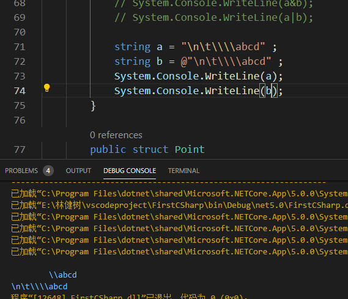

字符串插值：加上${}就行了

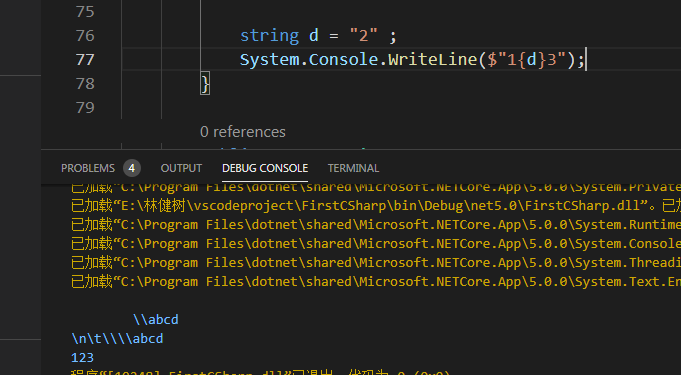

string的比较，不支持><等等比较操作符，需要使用comparerto方法

数组的长度固定不可改变，但是system.collection和其子命名空间提供了更高级的数据结构，包括可变长度的数组和字典

创建数组时，所有的元素都会被初始化，其值为该类型的默认值

类型的默认值就是内存按位归零的结果

值类型和引用类型的性能有区别

值类型：每个元素都作为数组的一部分进行分配内存

引用类型：创建数组时就是创建了一堆null引用，因此如果为空的时候可能会抛异常

- 建议对元素是引用类型的数组初始化后对元素都进行初始化

#### 边界检查

所有数组的索引都会被运行时检查的

如果使用了不合理的索引，会抛出indexoutofrangeexception ， 索引越界异常

通常边界检查对性能的影响很小，jit编译器可执行一些优化，例如在进入循环前预先对所有的索引进行安全检查，避免在迭代中检查

c#还提供了unsafe代码，可以绕过边界检查

#### stack栈和heap堆

- stack一块内存存储本地变量和参数
- 随着函数的进入和退出，stack也会随之增大和缩小
- heap一块内存，对象所在的地方（引用类型的实例）
- 当新的对象被创建之后，他就会被分配在heap上，到该对象的一个引用被返回
- 程序执行时，随着新对象的不断建立，heap会慢慢被填满。运行时的gc会周期性的把对象从heap上面释放出来，所以不会导致内存耗尽
- 一旦一个对象不再被任何存活的东西所引用，那么它就可以被释放了

#### static字段

在heap上，它们会存活到应用程序域停止为止


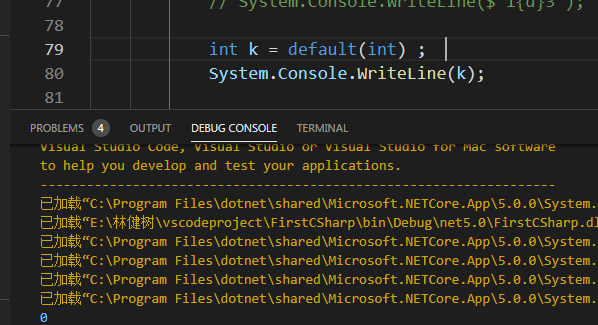

参数传递：值传递、ref传递、out传递

值传递：

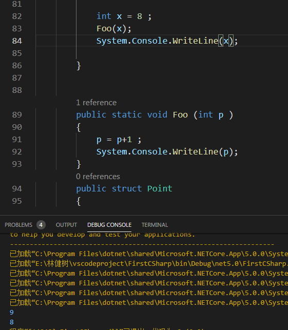

ref传递：复制的是引用而不是值

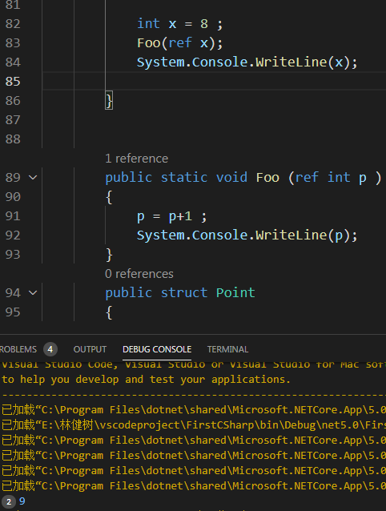

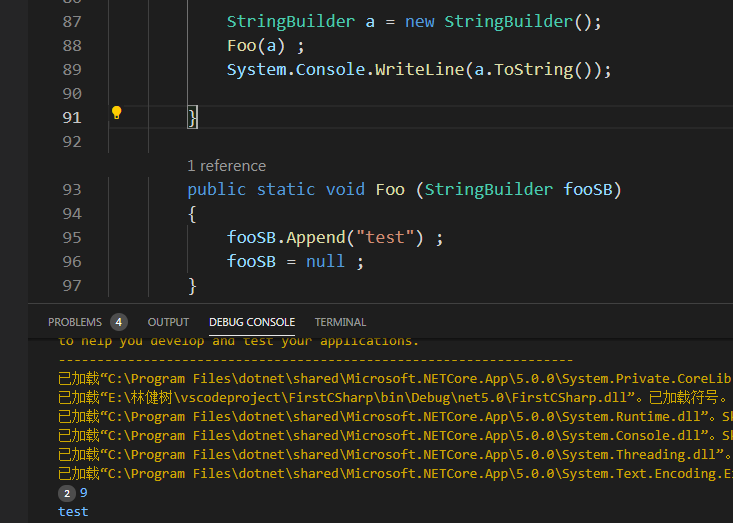

##### *按引用传递out*

和ref差不多，除了

- 进入函数前不需要被赋值
- 离开函数前必须被赋值

*通常用来从方法中返回多个值*

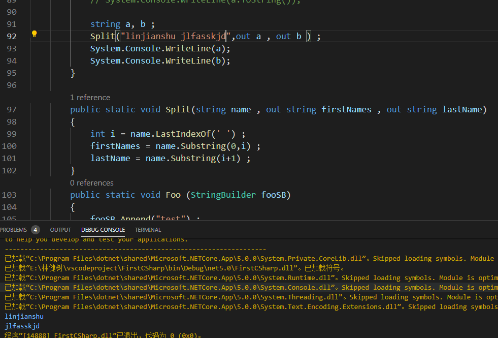

***从c#7开始，调用方法适，可以使用out临时声明变量***

当调用的方法有多个out参数时，你不需要其中一些out参数，***可以使用下划线_来discard弃用他们***

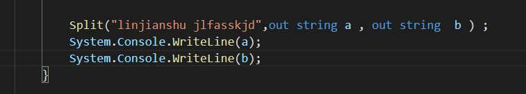

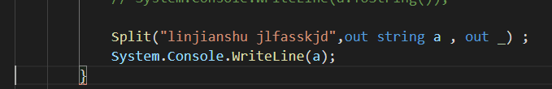

##### *params修饰符*

***可以在方法的最后一个参数使用params参数修饰符***

***可以接受任意数量的该类型的参数***

参数（parameters）类型必须是数组

也可以使用数组作为arguments

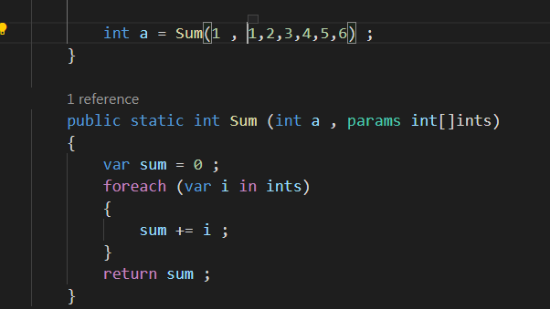

##### *可选参数*

从c#4.0开始，方法、构造函数、索引器都可以声明可选参数

***可选参数需要在声明的时候提供默认值***

调用的时候不可以填写可选的parameters

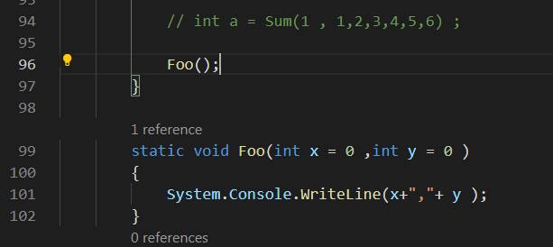

往public方法里添加可选参数，若该方法被其他的assembly调用，那么两个assemblies都需要重新编译，就和添加了一个必填参数是一样的

可选参数的默认值是常量表达式或拥有无参构造函数的值类型

***可选参数不可以使用ref和out***

***必填参数必须在可选参数前面（方法声明时和方法调用时）***

例外是：params的参数仍然放在最后边

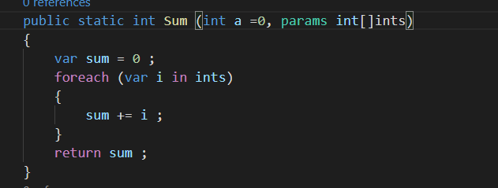

##### *定位参数，根据位置来判断，不要求输入的顺序和定位的顺序保持一致*

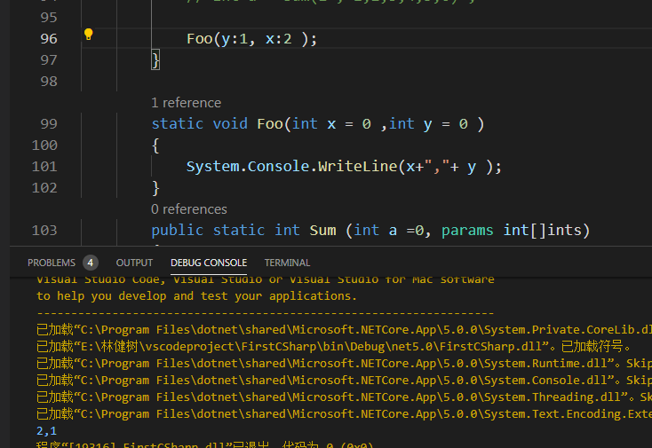

#### var

隐式强类型本地变量

声明和初始化变量通常一步完成，如果编译器能从初始化表达式推断出类型，就可以使用var

但是会降低代码的可读性

右结合的操作符

赋值、lambda、null合并和条件操作符是右结合的

从右向左估算

x=y=3

#### *null操作符*

c#提供了两种操作符，他们可以更容易的处理null

- null合并操作符 ？？ 如果操作数不是null，就把左边的给我，如果操作数是null，就把右边的给我
- null条件操作符 ？.方法

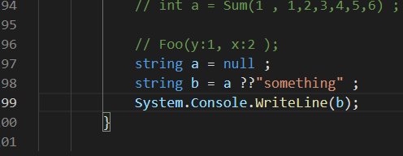

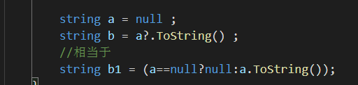

合在一起用哦哦哦哦


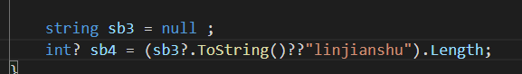

#### switch语句

当指定常量的时候，只能使用内置的整数类型、bool、char、enum和string类型

每个case子句的结尾，必须使用跳转语句来表名下一步往哪里执行

- break 跳转到switch语句的结尾
- **goto case x 跳转到其他的case**
- **goto default 跳转到default子句**
- 其他的跳转语句 return , throw ,continue , goto label 
- 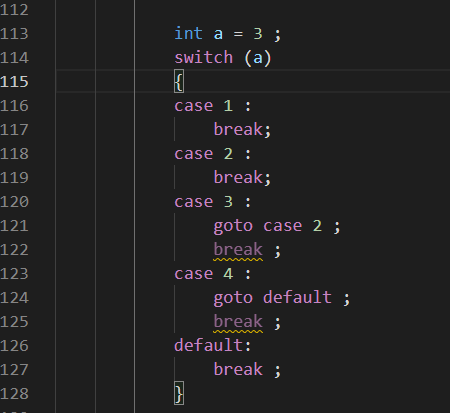

#### *switch with patterns c#7* 

- object类型允许任何类型的变量
- 每个case子句指定一个类型，如果变量的类型与该类型一样，那么就匹配成功
- 可以使用when来断言一个case
- case子句的顺序是有关系的
- 可以是case null

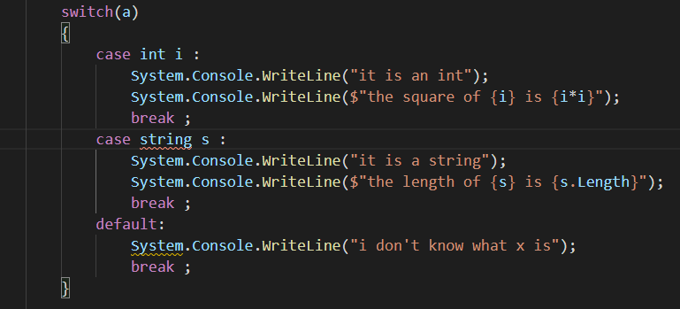

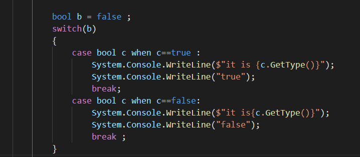

#### 复习一下：有用的

- ref和out关键字，一个赋值的是引用的地址块，一个是作为不用传入的参数，传出多个参数使用，后者可以使用传入时定义临时变量来，并且不需要传出参数的时候可以使用下划线来discard他们
- 数字为了区分可读性，可以使用下划线1_000_000这样
- @“.......”这样可以不拆解转义字符
- parameter格式定义的是数组，且是数量可变的，但必须作为方法的最后一个参数传入
- 可以构造可选的参数方式，在构造方法的时候预先传入参数默认值，且放在方法的最后边 如int sum (int x =1, int y = 0 ) ...
- null的合并操作符和条件操作符，防止空指针异常
- switch case的新操作:判断类型和使用when进一步判断 以及 goto case , goto default ...
- 按位操作 ，||和&&的短路机制 ， ${s}插值
- checked ， unchecked ， overflowcheck操作符 ， default（int）
- *params修饰符*  以及定位修饰符


##### 跳转语句

break ； 结束迭代或switch语句的代码体

continue ;  放弃当前迭代中剩余的语句执行， 直接从下一次迭代开始

***goto ;  把执行跳转到另一个label的语句块 ， goto语句label*** ， 当用于switch语句内时，goto case

3（只能用于常量） ， label相当于是一个代码块的占位符， ***放在语句前边，使用冒号：做后缀***

return ; 退出方法，并返回一个表达式，类型和方法的返回类型一致，如果是void就return； return可以放在任何地方，除了finally里

 throw ; 抛出异常 ， 相当于输出了错误

tyr catch finally 

不可以从finally块里面跳转到外边，除了throw

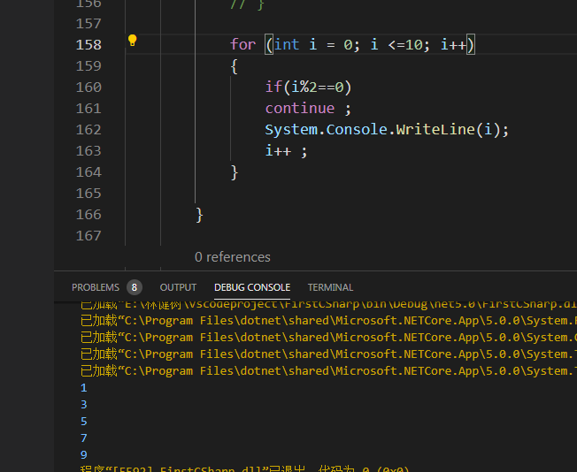

```c#
 int i = 1 ; 
           gotoloop:
           if(i <=5)
           System.Console.WriteLine(i);
           i++ ; 
           goto gotoloop ;
```

#### *using static*

从c# 6开始， 不仅可以引入命名空间，还可以引入具体的类型，这就需要使用using static

***被引入类型的所有静态成员可被直接使用， 无需使用类名***

所有可访问的静态成员都会被引入，字段、属性、嵌套类型

也可用于enum ， 这样的话它的成员就被引入了

如果多个static引入存在歧义的话，将会发生错误

#### 命名空间

可以使用重复的命名空间，只要类型不相互干扰

***给命名空间起别名，防止他和其他命名空间下的其他类型相互干扰***

```c#
using System;
using static System.Console ; 
using  P = System.Reflection ; 

namespace FirstCSharp
{
    class Program
    {
        static void Main(string[] args)
        {
            WriteLine("你搞笑呢");
        }

        class a
        {
            private P.PropertyInfo p; 
        }
    }
```

***extern alias 命名空间，解决两个程序集内部命名空间和类型完全一致的问题， 实际上就是给他们在添加一层最外层的用于区分***

命名空间别名限定符

内层命名空间的类型名会把外层命名空间下的类型名隐藏， 有时即使使用全名也无法解决冲突

***1.使用global命名空间：也就是   ::***

```c#
namespace FirstCSharp
{
    class Program
    {

        public class A
        {
            public class B { }

            private static void Main(string[] args)
            {
                new global::A.B();
            }
        }
    }
}

namespace A
{
    class B
    {
    }
}
```

#### *可空值null类型*

nullable<T>

例如 nullable<Bool> 不仅可以表示 true； false； 还可以表示null ； 

```c#
  static void Main(string[] args)
        {
                     string str = "sdfhasdfkjsaf";
            Nullable<int> indexOf = null;
            //或者用这种来表达
            int? lalala = str.IndexOf('m');
            Nullable<DateTime> lastLogDateTime = null;
            DateTime? lasTime = null; 

            Console.WriteLine(indexOf?.ToString());
            Console.ReadKey(); 
        }
```

#### null 和 空， 空白 string

- string name = "Nick"
- string name = null 
- string name =""
- string name = "     "

##### 判断

- if(name == null )  ...
- if(string.isNullOrEmpty(name))  ...
- ***if(string.isNullOrWhiteSpace(name))  ...***

#### nullable<T>的常用属性和方法

- hasvalue
- .value
- ***.getvalueordefault（）***
- ***.getvalueordefault(默认值)***

```c#
int? num = 3;
            Console.WriteLine(num.HasValue);
            Console.WriteLine(num.Value);

            int? number = null;
            Console.WriteLine(number.HasValue);
            Console.WriteLine(number.GetValueOrDefault());
            Console.WriteLine(number.GetValueOrDefault(1997));
```

#### nullable<T>和T的转换

```c#
 int? i = 3;
            int j;
            j = (int)i;
            Console.WriteLine(j);


            int m = 3; 
            int? k;
            k = m;
            Console.WriteLine(k);
```

##### ***防止可空索引应该有的做法***

```c#
  			string[] a = null;
            string b = a?[0].Trim(); 
```

### 第三章

#### class

#### field：是class和struct的成员，他是一个变量

#### readonly修饰符

- readonly修饰符防止字段在构造之后被改变
- ***readonly字段只能在声明的时候被赋值，或在构造函数里被赋值***

#### 字段初始化

- 字段可以可选初始化
- 未初始化的字段有一个默认值
- 字段的初始化在构造函数之前运行

- 同时声明多个字段，用逗号隔开

#### 方法

- 执行某个动作
- 参数
- 返回类型
- void
- ref/out作为数据的返回格式

#### 方法的签名

- 类型内方法的签名必须唯一
- 签名：方法名、参数类型（含顺序，但与参数名称和返回类型无关）

#### Expression-bodied方法:仅适用于单表达式的方法

```c#
        void foo() => Console.WriteLine("hello world");
            foo();
```

#### 方法的重载

- 类型里的方法可以进行重载（允许多个同名的方法同时存在），只要这些方法的签名不同就行

- 参数按值传递和按引用传递，也可以进行方法重载

#### 本地方法  C#7

- 方法里有方法

```c#
   void zhendeyoufooma()
            {
                void foo() => Console.WriteLine("hello world");
                foo();
            }
            zhendeyoufooma();
```

***本地方法适用于其他类呀方法里不需要使用的，也就是这个方法只为这个类服务的，另外可以在构造函数里写， 可以在属性的选择器里写***

- ***不需要写static关键字***

#### 构造函数

- 运行class或struct的初始化代码
- 和方法差不多，方法名和类型一致，返回类型也和类型一致，但不写了

- c# 7 ，允许单语句的构造函数写成 expression-bodied成员的形式

```c#
        public class panda
        {
            public panda(string n) => name = n; 

            private string name; 
        }
```

#### 构造函数重载

- 在class和struct里可以重载构造函数
- 调用重载构造函数时使用this
- 当同一个类型下的构造函数A调用构造函数B的时候，B先执行

```c#
 public class panda
        {
            public panda(string n) => name = n;

            public panda(string n, int age):this(n)
            {
                this.age = age; 
            }
            private string name;
            private int age; 
        }
```

#### 构造函数和字段的初始化顺序

- 字段的初始化发生在构造函数执行之前
- 字段按照声明的先后顺序进行初始化

构造类似单例模式:让类返回最多一个实例

```c#
var instance = Wine.CreateInstance();
       

        public class Wine{
             Wine()
            {
                
            }
             public static Wine CreateInstance()
             {
                 return new Wine(); 
             }
    }
```

#### 析构函数 c# 7 deconstructor

- c# 7 引入了deconstructor模式
- 作用基本和构造函数相反， 他会把字段反赋给一堆变量
- 方法名必须是deconstructor ，有一个或者多个out参数
- deconstructor可以被重载

- ***deconstructor这个方法可以是扩展方法***

```c#
    var rectangle = new Rectangle(3,4);
            rectangle.Deconstruct(out var a , out var b );
            var (c, d) = rectangle; 
            rectangle.Deconstruct(out var e,out var f);
            Extensions.Deconstruct(rectangle,out var k , out var m );
            Console.WriteLine(a);
            Console.WriteLine(b);
            Console.WriteLine(c);
            Console.WriteLine(d);

  public Rectangle(int W, int H)
        {
            width = W;
            height = H;
        }

        public void Deconstruct(out int outWidth, out int outHeight)
        {
            outWidth = width;
            outHeight = height;
        }

        public void Deconstruct(out int outWidth)
        {
            outWidth = width;
        }

  public static class Extensions
    {
        public static void Deconstruct(this Rectangle rect, out int width, out int height)
        {
            width = rect.width;
            height = rect.height;
        }
    }
```

#### 属性

- 属性的声明和字段的声明很像，但多了一个get set快

##### 只读和计算的属性

- 如果属性只有get访问器，那么他就是只读的
- 如果只有set访问器，那么他就是只写的
- 属性通常拥有一个专用的幕后字段 ， 这个幕后字段用来存储数据

##### 属性初始化器

- ***从c#6开始，你可以为自动属性添加属性初始化器***
- 只读的自动属性也可以使用（也可以在构造函数里被赋值）

```c#
  public class panda
        {
            public panda(string n) => name = n;

            public string sex
            {
                get => sex;
                set => sex=value; 
            }
            //相当于
            public string sex1 { get; set;  }
            public string sex2 { get; set; } = "linjianshu"; 

            public panda(string n, int age):this(n)
            {
                this.age = age;
                Console.WriteLine(2);
            }
            private string name;
            private int age; 
        }
```

#### 静态构造函数

- ***静态构造函数，每个类型执行一次***
- ***非静态构造函数，每个实例执行一次***
- 一个类型只能定义一个静态构造函数
  - 必须无参
  - 方法名与类型一致

##### 初始化顺序

​	静态字段的初始化器在静态都早函数被调用之前的一瞬间运行

#### 静态类

- 类也可以是静态的
- 其成员必须全是静态的
- 不可以有子类

#### finalizer终结器

- finalizer是class专有的一种方法
- 在gc回收未引用对象的内存之前运行
- 其实就是对object的finalize（）方法重写的一种语法

```c#
class a {
    ~class a{
        
    }
}
```

#### ***partial type***

- 每个分布的类都必须使用partial来声明
- 每个分布类的成员不能冲突，不能有同样参数的构造函数
- 各分布类完全靠编译器来进行解析：每个分布类在编译时必须可用，且在同一个assembly里

- 如果有父类，可以在一个或多个分布类上指明，但必须一致

#### *partial method*

- 由两部分构成：定义和实现
- 定义部分通常是生成的
- 实现部分通常是手动编写的
- ***如果partial method 只有定义，没有实现，那么编译的时候该方法定义就没有了，调用该方法的代码也没有了。这就允许自动生成的代码可以自由的提供钩子，不用担心代码膨胀***
- partial method 必须是void，并且隐式private的

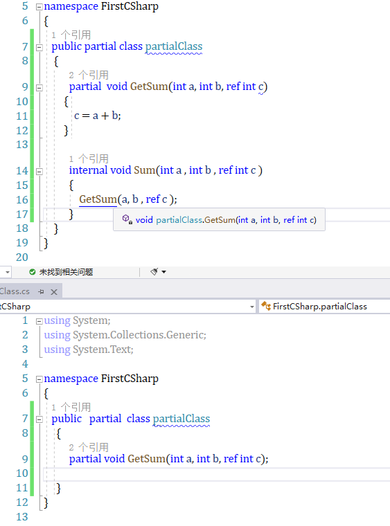

#### nameof 操作符

string name = nameof (count)

#### 继承

##### 多态

- 引用是多态的，类型为x的变量可以引用子类的对象
- 因为子类具有父类的全部功能特性，所以参数可以是子类
- 反过来则不行

##### 引用转换

- 一个对象的引用可以隐式的转换到其父类的引用（向上转换）
- 想转换到子类的引用则需要显示转换（向下转换）
- 引用转换： 创建了一个新的引用，他也指向同一个对象
- 向下转换可能会失败，如果失败了就会抛出invalidCastException异常

##### *As操作符*

- ***as操作符会执行向下转换，如果转换失败，不会抛出异常，值会变为null***

- as操作符无法做自定义转换

##### ***is操作符***

- ***is操作符会检验引用的转换是否成功。换句话说，判断对象是否派生于某个类（或者实现了某个接口）***
- 通常用于向下转换前的验证
- 如果拆箱转换可以成功的话，那么使用is操作符的结果会是true

##### ***is操作符合模式变量***

- ***在c#7 里， 使用is操作符的时候，可以引入一个变量***
- 引入的变量可以立即消费

```c#
  var person = new Person();
            var student = new Student();
            //隐式转换
            Person p = student;
            //显示转换 可能会发生类型转换错误
            Student s = (Student)p;
            //如果异常s1就是null
            Student s1 = p as Student;
            
            if (s1 is Student)
            {
                //判断
            }

            //判断并引入变量
            if (s1 is Student s2)
            {
                s2.StuId = "2020170281";
            }
```

#### *virtual函数成员*

- 标记为virtual的函数可以被子类重写，包括属性、方法、索引器、事件等等
- 使用override修饰符，子类可以重写父类的函数

##### *override*

- virtual方法和重写方法的签名、返回类型、可访问程度必须是一样的
- ***重写方法里使用base关键字可以调用父类的实现***

```c#
var person = new Person();
            var student = new Student();
            student.jobbb = "student";
            Console.WriteLine(person.job);
            Console.WriteLine(student.job);
            Person p = student;
            Console.WriteLine(p.job);
        }


        public class Person
        {
            public string Name { get; set;  }
            public virtual string job => "person"; 
        }

        public class Student : Person
        {
            public string StuId { get; set;  }
            public override string job => jobbb; 
            public string jobbb { get; set;  }
        }
```

#### 抽象类和抽象成员

- 使用abstract声明的类是抽象类
- 抽象类不可以被实例化，只有其具体的子类才可以被实例化
- 抽象类可以定义抽象成员
- ***抽象成员和virtual成员很像，但是不提供具体的实现。子类必须提供实现，除非子类也是抽象的***

```c#
   public abstract  class Person1
        {
            public abstract string Name { get;  } 
        }

        public class Student1:Person1
        {
            public  override  string Name => job;  
            public string job { get; set;  }
        }
```

##### *new 和 override的区别*

- ***用new的话， 编译时对A的引用就会绑定到A的字段上***

```c#
//new 和 override 的区别
            var b = new B();
            A a1 = b;
            b.lalala(); 
            a1.lalala();

            var c = new C();
            A a2 = c; 
            c.lalala();
            a2.lalala();
        }

        public class A
        {
            public virtual void lalala()
            {
                Console.WriteLine("AAAAAA");
            }
        }

        public class B : A
        {
            public override void lalala()
            {
                Console.WriteLine("BBBBBB");
            }
        }

        public class C:A
        {
            public new void lalala()
            {
                Console.WriteLine("CCCCC");
            }
        }
```

#### *sealed*

- ***针对重写的成员，可以使用sealed关键字把它密封起来， 防止它被其他子类重写***
- ***也可以sealed类本身，就隐式的sealed所有的virtual函数了***

```c#
        public class Student1 : Person1
        {
            //使用sealed的话，就无法在其他子类重写了
            public sealed override string Name => job;
            public string job { get; set; }
        }
```

#### *base关键字*

- ***base和this很像，base主要用于***
  - ***从子类访问父类里被重写的函数***
  - ***调用父类的构造函数***
- 这种写法可以保证，访问的一定是asset的liability属性，无论该属性是呗重写了还是被隐藏了

#### *构造函数和继承*

- 子类必须声明自己的构造函数
- ***从子类可访问父类的构造函数，但不是自动继承的***
- 子类必须重新定义他想要暴露的构造函数

- ***调用父类的构造函数需要使用base关键字***
- 父类的构造函数肯定会先执行
- ***如果子类的构造函数里没有使用base关键字，那么父类的无参构造函数就会被隐式的调用***
- 如果父类没有无参构造函数，那么子类就必须在构造函数里使用base关键字

```c#
            new Tiget(
                "lalala");
            new Tiget("lalala", "lulullu"); 

        }

        public class Animial
        {
            public Animial(string @class)
            {
                Console.WriteLine(@class);
            }
        }

        public class Tiget : Animial
        {
            public Tiget(string @class) : base(@class)
            {
                Console.WriteLine("tiger");
            }

            public Tiget(string @class ,string b):base(@class)
            {
                Console.WriteLine(b);
            }
        }
```

#### object

- object是引用类型
- 但值类型可以转化为object，反之亦然（类型统一）
- 在值类型和object之间转换的时候，clr必须执行一些特殊的工作，以弥补值类型和引用类型之间语义上的一些差异，这个过程就叫做装箱和拆箱

##### 装箱

- ***装箱就是把值类型的实例转换为引用类型的实例的动作***
- 目标引用类型可以是object，也可以是某个接口

##### 拆箱

- ***拆箱正好相反，把那个对象转换成原来的值类型***
- 拆箱需要显示的转换

- 数组和泛型只支持引用转换，不支持装箱

##### ***装箱和拆箱的复制***

- ***装箱会把值类型的实例复制到一个新的对象***
- ***拆箱会把这个对象的内容再赋值给一个值类型的实例***

#### 静态和运行时类型检查

- C#的程序既会做静态的类型检查（编译时），也会做运行时的类型检查（CLR）
- 静态检查：不运行程序的情况下，让编译器保证程序的正确性
- 运行时的类型检查，是由CLR执行，发生在向下的引用转换或拆箱的时候
- 运行时检查之所以可行是因为：每个在heap上的对象内部都存储了一个类型token 。 这个token可以通过调用object的gettype（）方法来获取

#### *tostring方法*

- ***可以在自定义的类型上重写tostring方法***
- ***如果你不重写该方法，那就会返回该类型的名称***

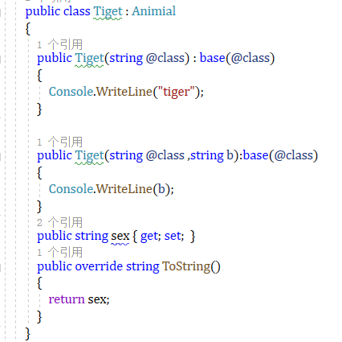

#### struct

- struct和class差不多，但是有一些不同
  - struct是值类型，class是引用类型
  - ***struct不支持继承（除了隐式的继承了object）***
- ***class能有的成员，struct也可以有， 但是一下几个不行***
  - 无参构造函数不行
  - 字段初始化器不行
  - 终结器不行
  - virtual和protected成员不可以
- struct的构建
  - 有一个无参构造函数，但是不能对其进行重写，他会对字段进行按位归零操作
  - 当定义struct构造函数的时候，必须显式的为每个字段赋值
  - 不可以有字段初始化器

#### 访问修饰符

- public ，完全可访问，enum和interface的成员默认都是这个级别
- internal ， 当前assembly或者朋友assembly可访问， 非嵌套类的默认访问级别
- private， 本类可以访问， class 和struct 的成员的默认访问级别 
- protected ， 本类或其子类可以访问
- protected internal ， 联合了protected 和internal 的访问级别

#### 朋友程序集assembly

- 通过添加system.runtime.compilerservices.internalsvisibleto这个assembly的属性 ， 并指定朋友assembly的名字，就可以把internal的成员暴露给朋友assembly

[assembyy:internalsvisibleto("friend")]

- 如果朋友assembly 有strong name ， 那么就必须指定其完整的160字节的public key

[assembyy :internalsvisibleto("strongfriend,publickey=0024f0000448c...")]

#### 访问修饰符的限制

- 当重写父类的函数时，重写后的函数和被重写的函数的访问级别必须一致
- 有一个例外：当在其他的assembly重写protected internal的方法时， 重写后的方法必须是protected 

#### 接口简介

- 接口只为成员提供规格，没有实现
- 接口成员都是隐式抽象的
- 一个class或者struct都可以实现多个接口

##### 接口的实现

- 接口的成员都是隐式public的，不可以声明访问修饰符
- 实现接口对她的所有成员进行public的实现

##### 接口和对象的相互转换

##### 接口的扩展

- 接口可以继承其他接口

##### 显示的接口实现

- 实现多个接口的时候可能会造成各成员签名的冲突。通过显式实现接口成员可以解决这个问题

#### 枚举

- 枚举时一个特殊的值类型，它可以让你指定一组命名的数值常量
- 每个枚举都对应一个底层的整型数值，默认是int类型
- ***也可以指定其他的类型作为枚举的整数类型，例如byte***
- 可以单独指定枚举成员的整数值
- 也可以指定其中某些成员的数值，未被赋值的成员将接着他前面的已赋值成员的值递增

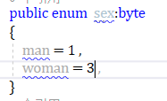

- 枚举可以显式的和其底层的数值相互转换

#### flags enum

- 可以对枚举的成员进行组合
- 为了避免歧义，枚举成员的需要显示的赋值，典型的使用2的乘幂
- 按约定，如果枚举成员可以组合的话，flags属性就应该引用在枚举类型上
  - 如果声明了这样的枚举却没有使用flags属性，你仍然可以组合枚举的成员，但是调用枚举实例的tostring（）方法时，输出的将是一个数值而不是一组名称
- 按约定，可以组合枚举的名称应该是复数的

```c#
      var b = sex.top | sex.bottom | sex.right;
            Console.WriteLine(b);
        }

        [Flags]
        public enum  sex
        {
            top = 1 , 
            right = 2 ,
            bottom = 4 , 
            left  = 8
        }
```

#### 枚举支持的操作符

= == != < > <= >= + - ^ & | - += -= -- sizeof

- 其中按位的、比较的、算术的操作符返回的都是处理底层值后得到的结果
- 加法操作符只允许一个枚举和一个整型数值相加，两个枚举相加是不可以的

#### 嵌套类型的特性

- 可访问封闭类型的私有成员，以及任何封闭类型能访问的东西
- 可以使用所有的访问修饰符来声明，不仅仅是public和internal
- 嵌套类型的默认访问级别是private而不是internal
- 从封闭类型外边访问嵌套类型需要使用到封闭类型的名称

### 复习一下

- ***分部类、命名空间global::、external alias、virtual、override和new的区别、abstract、继承构造函数的base关键字、***
- ***goto label  、 using static 、 string.isnullorwhitespace、getvalueordefault、is修饰符、as修饰符、本地方法、deconstructor、 属性自动初始化器、构造函数支持expression body形式、nameof修饰符、分布方法提供钩子、is修饰符提供变量、sealed、子类继承父类构造函数问题、***
- ***装箱拆箱是复制、tostring自定义类型得重写不然、deconstructor支持扩展方法***

### 第三章 泛型部分

#### 泛型的作用

- 跨类型可复用的代码：继承和泛型
- 继承=>基类
- 泛型=>带有类型占位符的模板

#### 泛型类型  generic types

- 泛型会声明类型参数---泛型的消费者需要提供类型参数（argument）来吧占位符类型填充上

##### open type & closed type

- stack<T> open type 开放类型
- stack<int> closed type 封闭类型
- 在运行时，所有的泛型类型实例都是封闭的（占位符类型已经被填充了）

##### 泛型方法

- 泛型方法在方法的签名内也可以声明类型参数
- 在泛型类型里面的方法，除非也引入了类型参数，否则是不会归为泛型方法的
- 只有类型和方法可以引入类型参数，属性、索引器、事件、字段、构造函数、操作符等都不可以声明类型参数、但是他们可以使用他们所在的泛型类型的参数

##### 声明类型参数

- 在声明class / struct / interface / delegate 的时候可以引入类型参数(type parameters)
- 其他的例如属性， 就不可以引入类型参数，但是可以使用类型参数
- 引入就是使用<T>形式， 使用就是直接使用T的形式
- 泛型类型/泛型方法的名称可以被重载，条件是参数类型的个数不同

##### typeof 与 未绑定的泛型类型

- 开方的泛型类型在编译后就变成了封闭的泛型类型
- 但是如果作为type对象， 那么未绑定的泛型类型在运行时是可以存在的， 只能通过typeof操作符来实现
- 使用default关键字来获取泛型的默认值

#### 泛型的约束

- 默认情况下，泛型的类型参数(parameter)可以是任何类型的
- 如果只允许使用特定的类型参数(argument) ， 就可以指定约束

```c#
where T:base-class
	where T:class
		where T:interface
    		where T:struct
        		where U:T 
            		where T:new ()   //保证无参构造函数
```

- 泛型的约束可以作用于类型或方法的定义

##### 泛型类型的子类

- 泛型class可以有子类， 在子类里，可以继续让父类的类型参数保持开放
- 在子类里，也可以使用具体的类型来关闭（封闭）父类的类型参数
- 子类型也可以引入新的类型参数

##### 静态数据

- 针对每一个封闭类型， 静态数据都是唯一的

```c#
     Console.WriteLine(Bob<int>.Count++);        //0
            Console.WriteLine(Bob<int>.Count++);   //1
            Console.WriteLine(Bob<object>.Count++);  //0
        

        class  Bob<T>
        {
            public static int Count; 
        }
```

##### 参数类型和转换

- 使用 arg as int这样的操作符
- 或者使用 (int)(object) x 操作符

### 第四章 委托、事件、lambda表达式

#### delegate委托

- 委托是一个对象，他知道如何调用一个方法
- 委托类型定义了委托实例可以调用的那类方法，具体来说，委托类型定义了方法的返回类型和参数

```c#
class Program
{
    static void Main(string[] args)
    {
        //第一种推荐
            Transformer transformer1 = Square;
            var i = transformer1(3);


            //第二种，自己琢磨出来的不推荐
            Transformer transformer = new Transformer(Square);
            var invoke = transformer.Invoke(2);
            Console.WriteLine(invoke);
    }

    delegate int Transformer(int x);

    static int Square(int x) => x * x; 
```

#### 委托实例

- 委托的实例其实就是调用者的委托：调用者调用委托，然后委托调用目标方法
- 间接的吧调用者和目标方法解耦了

#### 编写插件式的方法

- 方法是在运行时才赋值给委托变量的

```c#
           var transformer = new Transformer(Square);
            var ints = new int[]{1,2,3};
            Util.Transform(ints, transformer);
            foreach (var i in ints)
            {
                Console.WriteLine(i);
            }
            
    }

        public delegate int Transformer(int x);

        class Util
        {
            public static void Transform(int[] values, Transformer t)
            {
                for (int i = 0; i < values.Length; i++)
                {
                    values[i] = t(values[i]); 
                }
            }
        }

    static int Square(int x) => x * x; 
}
```

***实现解绑，是在编写程序的时候，才决定我要给这个委托实例一个可供调用的方法，这个方法可以是square平方，也可以是三次方，这取决于需求方，因此解耦之后你可以编写插件式的方法，最后让需求实现者自己来决定要实例化何种方法委托***

#### 多播委托

- 所有的委托实例都具有多播的能力。一个委托实例可以引用一组目标方法。
- 使用+和+=操作符可以合并委托实例

```c#
delegateDemo1 delegateDemo = null;
            delegateDemo += Square1;
            delegateDemo += Cube1;
            delegateDemo(3);
            delegateDemo -= Cube1;
            delegateDemo(3);


 static void Square1(int x) => Console.WriteLine(x * x);

        static void Cube1(int x) => Console.WriteLine(x *x* x);

        delegate void delegateDemo1(int i); 
```

- 调用d就会调用你添加进去的1和2方法，委托的调用顺序与他们定义的顺序是一致的

- 用-和-=会把右边的委托从左边的委托里移除
- 委托变量使用+或+=操作符时，其操作数可以是null。就相当于把一个新的值赋给了委托变量。
- 对于单个目标方法的委托变量使用-=操作符时，就相当于把null值赋给了委托变量

```c#
 var transformer = new Transformer(Square);
            transformer += Cube; 
            var ints = new int[]{1,2,3};
            Util.Transform(ints, transformer);
            foreach (var i in ints)
            {
                Console.WriteLine(i);
            }
            
    }

        public delegate int Transformer(int x);

        class Util
        {
            public static void Transform(int[] values, Transformer t)
            {
                for (int i = 0; i < values.Length; i++)
                {
                    values[i] = t(values[i]); 
                }
            }
        }

    static int Square(int x) => x * x;

    static int Cube(int x) => x * x * x; 
```

- 委托是不可变的
- 使用+=或-=操作符时，实际上是创建了新的委托实例，并把它赋给当前的委托变量
- 如果多播委托的返回值类型不是void，那么调用者从最后一个被调用的方法来接收返回值。前面的方法仍然会被调用，但是其返回值就被弃用了。

#### 委托

- 所有的委托类型都派生于system.multicastdelegate，而它又派生于system.delegate
- c#会把作用于委托的+、-、+=、-+操作编译成使用system.delegate的combine和remove两个静态方法

```c#
    public static void HardWork(A a)
    {
        for (int i = 0; i < 10; i++)
        {
            a(i*10+10+"%");
        }
    }

    public static void WriteFile(string b)
    {
        System.IO.File.WriteAllText("progress.txt",b);
    }
    public static void console(string b)
    {
        Console.WriteLine(b);
    }
}

  public   delegate void A(string b);


  A a = Class1.console;
            a += Class1.WriteFile;
            Class1.HardWork(a);
```

#### 实例方法目标和静态方法目标 target

- 当一个实例方法被赋值给委托对象的时候，这个委托对象不仅要保留着对方法的引用，还要保留着对方法所属实例的引用
- system.delegate的target属性就代表着这个实例
- 如果引用的是静态方法，那么target属性就是null

#### 泛型委托类型

- 委托类型可以包含泛型类型参数
  - public delegate T transformer<T> (T arg)

```c#
 class Program
    {
        static void Main(string[] args)
        {
            Transformer<int> transformer = Square;
            int[] a =  {1, 2, 3}; 
            Transform(a,transformer);
            foreach (var i in a)
            {
                Console.WriteLine(i);
            }

            Transformer<string> transformer1 = Cw;
            string[] b = {"1", "2", "3"};
            Transform(b, transformer1);
            foreach (var s in b)
            {
                Console.WriteLine(s);
            }
        }

        public delegate T Transformer<T>(T t);

        public static void Transform<T>(T[] values, Transformer<T> t)
        {
            for (int i = 0; i < values.Length; i++)
            {
                values[i]=t(values[i]);
            }
        }

        static int Square(int a) => a * a;
        static string Cw(string a) => (a+"CW");
    }
 
```

#### *Func和Action委托*

- 使用泛型委托，就可以写出这样一组委托类型，他们可以调用的方法可以拥有任意的返回类型和任意（合理）数量的参数
- System命名空间

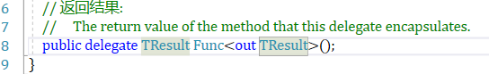

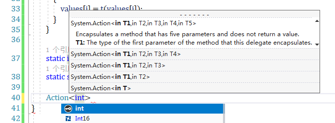

***Func<>可以有多个输入参数，0个也行，一个输出参数***

```c#
    class Program
    {
        static void Main(string[] args)
        {
            // Transformer<int> transformer = Square;
            int[] a = {1, 2, 3};
            Transform(a, Square);
            foreach (var i in a)
            {
                Console.WriteLine(i);
            }

            // Transformer<string> transformer1 = Cw;
            string[] b = {"1", "2", "3"};
            Transform(b, Cw);
            foreach (var s in b)
            {
                Console.WriteLine(s);
            }
        }

        // public delegate T Transformer<T>(T t);

        public static void Transform<T>(T[] values, Func<T,T> t)
        {
            for (int i = 0; i < values.Length; i++)
            {
                values[i] = t(values[i]);
            }
        }

        static int Square(int a) => a * a;
        static string Cw(string a) => (a + "CW");

}
```

***个人理解：委托就是把方法作为参数来调用，传来传去呀什么的思密达***

***Action<>可以有多个输入参数，0个也行，但是没有输出参数***

```c#
class Program
    {
        static void Main(string[] args)
        {
            int[] a = new int[] {1, 2, 3};
            Transform(a, Square);

            string[] b = { "1", "2" , "3"};
            Transform(b,Cw);
        }

        static void Transform<T>(T[] values, Action<T> tAction)
        {
            for (int i = 0; i < values.Length; i++)
            {
                tAction(values[i]); 
            }
        }

        static void Square(int a) => Console.WriteLine(a*a);
        static void Cw(string b) => Console.WriteLine(b + "CW");

    }
```

#### 委托Vs接口

- 委托可以解决的问题，接口都可以解决
- 什么情况下更适合用委托而不是接口呢？当下列条件之一满足时：
  - 接口只能定义一个方法
  - 需要多播能力
  - 订阅者需要多次实现接口

***没想到接口居然能作为一个方法的传入参数，我震惊***

```c#
    class  Util
    {
       public static void TransformAll(int[] values, Interface1 a)
        {
            for (int i = 0; i < values.Length; i++)
            {
                values[i] = a.Transform(values[i]);
                Console.WriteLine(values[i]);
            }
        }
    }

    class  Cube:Interface1
    {
        public int Transform(int x) => x * x * x;
    }

  public interface Interface1
    {
        int Transform(int x);
    }

            Util.TransformAll(new []{1,2,3},new Cube());
```

#### 委托的兼容性–委托类型

- 委托类型之间互不相容，即使方法签名一样

#### 委托的兼容性–委托实例

- 如果委托实例拥有相同的方法目标，那么委托实例就认为是相等的

#### 委托的兼容性–参数

- 当你调用一个方法时，你提供的参数argument可以比防范的参数parameter定义更具体
- 委托可以接受比他的方法目标更具体的参数类型，这个叫contravariance

#### 委托的兼容性–返回类型

- 调用方法时，你可以得到一个比请求的类型更具体的类型的返回结果
- 委托的目标方法可以返回比委托描述里更具体的类型的返回结果covariance

#### Event事件

- 使用委托的时候，通常会出现两个角色，一个广播者，一个订阅者

#### 广播和订阅

- 使用委托的时候，通常会出现两个角色，一个广播者，一个订阅者
- ***广播者这个类型包含一个委托字段，广播者通过调用委托来决定什么时候进行广播***
- 订阅者是这个方法目标的接收者，订阅者可以决定何时开始或结束监听
- 一个订阅者不知道和不干扰其他的订阅者

#### Event事件

- 事件就是将上述模式正式化的一个语言特性
- 事件是一种结构，为了实现广播者/订阅者模型，他只暴露了所需的委托特性的部分子集
- 事件的主要目的就是防止订阅者之间相互干扰

#### 声明事件

- ***最简单的声明事件的方式就是在委托前面加上event关键字***

#### 标准的事件模式

- 为编写事件，.net定义了一个标准的模式
- system.eventargs， 一个预定义的框架类，除了静态的empty属性之外，他没有其他成员
- eventargs是为事件传递信息的类的基类

#### 为事件选择或定义委托

- 返回类型是void
- ***接收两个参数，第一个参数类型是object，第二个参数类型是eventagrs的子类。第一个参数表示事件的广播者，第二个参数包含需要传递的信息***
- 名称必须以eventhandler结尾

#### 复习

```c#
  delegate int D1(int x, int y);

        static void Main(string[] args)
        {
            D1 x = Sum;
            var i = x(1, 2);
            Console.WriteLine(i);

            var operation = Operation(1, 2, Sum);
            Console.WriteLine(operation);

            var operation1 = Operation(1, 2, new Func<int, int, int>((i1, i2) => i1 + i2));
            Console.WriteLine(operation1);

        }

        static int Sum(int x, int y) => x + y;
        static int Multiply(int x, int y) => x * y;

        static int Operation(int x, int y, Func<int, int, int> aFunc)
        {
            var func = aFunc(x, y);
            return func;
        }
```

#### 针对选择的委托定义事件

- 在多线程场景下，你需要在测试或调用前，把委托赋给一个临时变量，来避免线程安全相关的错误
  - var temp = pricechanged ; 
  - if(temp!=null)   temp (this , e)
- 在c# 6.0之后，可以这样写：
  - priceChanged?.Invoke(this,e)

#### 非泛型的eventhandler

- 当事件不携带多余信息的时候，可以使用非泛型的eventhandler委托
- eventargs.empty属性

```c#
class Program
    {
        public class PriceChangedEventArgs : EventArgs
        {
            public readonly decimal LastPrice;
            public readonly decimal NewPrice;

            public PriceChangedEventArgs(decimal lastPrice, decimal newPrice)
            {
                this.LastPrice = lastPrice;
                this.NewPrice = newPrice; 
            }
        }

        public class Stock
        {
            private string symbol;
            private decimal price;

            public Stock(string symbol)
            {
                this.symbol = symbol; 
            }

            public event EventHandler<PriceChangedEventArgs> PriceChanged;

            protected virtual void OnPriceChanged(PriceChangedEventArgs e)
            {
                PriceChanged?.Invoke(this,e);
            }

            public decimal Price
            {
                get => price;
                set
                {
                    if (price==value)
                    {
                        return; 
                    }

                    decimal oldPrice = price;
                    price = value; 
                    OnPriceChanged(new PriceChangedEventArgs(oldPrice , price));
                }
            }

        }
        static void Main(string[] args)
        {
            var stock = new Stock("microsoft");
            stock.Price = 120;
            stock.PriceChanged += stock_PriceChanged;
            stock.Price = 135; 
        }

        static void stock_PriceChanged(object sender, PriceChangedEventArgs e)
        {
            if ((e.NewPrice-e.LastPrice)/e.LastPrice>0.1M)
            {
                Console.WriteLine("Alert , 10% stock price increase ! ");
            }
        }
    }
```

#### lambda表达式

- lambda表达式其实就是一个用来代替委托实例的未命名的方法
- 编译器会把lambda表达式转化为以下二者之一：
  - 一个委托实例
  - 一个表达式树（expression tree） ， 类型是expression<TDelegate>，他表示了可遍历的对象模型中lambda表达式里面的代码。他允许lambda表达式延迟到运行时再被解释

```c#
 class Program
    {
        static void Main(string[] args)
        {
            D1 d1 = x=>x*x;
            var i = d1(3);
            Console.WriteLine(i);

            var operation = Operation(3, Multiply);
            Console.WriteLine(operation);

            Console.ReadKey();
        }

        static int Operation(int x, Func<int, int> func) => func(x);

        delegate int D1(int a);
        static int Multiply(int x) => x * x; 
    }
```

#### lambda表达式的形式

- (parameters)=>expression -or- statement -block
- ***（参数）=>表达式或语句块***
- 其中如果只有一个参数并且类型可以推断的话，那么参数的小括号可以省略

#### lambda表达式与委托

- 每个lambda表达式的参数对应委托的参数
- 表达式的类型对应委托的返回类型

```c#
 class Program
    {
        static void Main(string[] args)
        {
            D1 d1 = x=>x*x;
            var i = d1(3);
            Console.WriteLine(i);

            var operation = Operation(3, Multiply);
            Console.WriteLine(operation);

            Func<int, int> func = (a) => a * a;
            func(1);

            Func<string, string, int> function = (str1, str2) => { return str1.Length + str2.Length; };
            Func<string, string, int> function1 = (str1, str2) => str1.Length + str2.Length;
           
            Console.WriteLine( function("hello", "world"));
            Console.WriteLine( function1("hello", "world"));
        }

        static int Operation(int x, Func<int, int> func) => func(x);

        delegate int D1(int a);
        static int Multiply(int x) => x * x; 
    }
```

***如果不用{}那么就不需要return关键字 ，如果用了{}那么就要使用return关键字，且内部还要加封号；*** 

#### 显式指定lambda表达式的参数类型

#### 捕获外部变量

- lambda表达式可以引用本地的变量和所在方法的参数
- 被lambda表达式引用的外部变量叫做被捕获的变量（captured variables）
- 捕获了外部变量的lambda表达式叫做闭包
- 被捕获的变量是在委托被实际调用的时候才被计算，而不是在捕获的时候

```c#
 int factor = 2;
        Func<int, int> func = x => x * factor;
        factor = 10;
        var i = func(3);
        Console.WriteLine(i);
```
- 被捕获的变量的生命周期会被延长到和委托一样

#### lambda表达式内的本地变量

- 在lambda表达式内实例化的本地变量对于委托实例的每次调用来说都是唯一的

#### lambda表达式vs本地方法

- 本地方式是c#7的新特性 。 他和lambda表达式在功能上有很多重复之处，但他又三个优点：
  - 简单明了进行递归
  - 无需指定委托类型
  - 性能开销略低一点
- 本地方法效率更高是因为它避免了委托的间接调用。本地方法也可以访问所在方法的本地变量，而且无需编译器把被捕获的变量hoist到隐藏的类

#### 匿名方法vslambda表达式

- 匿名方法和lambda表达式很像，但是缺少以下三个特性
  - 隐式类型参数
  - 表达式语法（只能是语句块）
  - 编译表达式树的能力，通过赋值给expression<T>

### 第五章 进阶特性

#### try-catch-finnally

- catch可以设置捕获不同类型的异常，如果没有异常类型匹配的，可能就程序报错了
- 如果你希望有一个兜底的catch可以捕获任何类型的异常，那么你需要把待定类型的异常捕获放在靠前的位置
- 从c#6 开始，你可以在catch子句中添加一个when子句来指定一个异常过滤器

```c#
 try
            {

            }
            catch (Exception e)when(e.StackTrace=="")
            {
                Console.WriteLine(e);
                throw;
            }
```

#### finally块

- finally块永远都会被执行，无论是否跑出异常
- 唯一可以让他不执行就是无限执行，或者中断

#### using语句

- 很多类都封装了非托管资源，都实现了disposable接口，这个接口定义了一个无参的dispose方法来清理这些资源
- using语句提供了一个优雅的语法来在finally块里调用实现了idisposable接口对象上的dispose方法

#### 抛出异常

- c# 7 中，throw new Exception 可以作为expression-bodied functions里的一个表达式出现
- 也可以出现在三元条件表达式里

#### 重新抛出异常

- 如果使用rhrow ex代替throw的话，程序仍然可以运行
- 其他常见的情景是抛出一个更为具体的异常类型
- 如果把原异常的ex传入第二个异常类型作为参数，利于调试，但可能出现信息泄露

#### System.exception 的关键属性

- stacktrace
  - 他是一个字符串，展现了从异常发生地到catch块所有的被调用的方法
- message
  - 关于错误的描述信息
- innerexception
  - 引起外层异常的内层异常（如果存在的话）而且innerException本身还有可能含有innerexception

#### 常见的异常类型

- system.argumentexception 
- system.argumentnullexception
- system.argumentoutofrangeexception
- system.invalidoperationexception
- system.notsuppostedexception
- system.notimplementedexception
- system.oubjecdisposedexception
- nullreferenceexception
  - 你也可以直接throw null ，来抛出此类型异常

#### try xxx模式

- 如果解析失败 ， parse方法会抛出异常，而tryparse方法会返回false

#### 枚举器

- 枚举器是一个只读的，作用于一序列值的、只能向前的游标
- 枚举器是一个实现了下列任意一个接口的对象：
  - system.collections.ienumrator
  - system.collections.generic.IEnumerator<T>
- 技术上来说，任何一个含有名为movenext方法和名为current的属性的对象，都会被当做枚举器来对待
- foreach语句会迭代可枚举的对象enumerable object 。可枚举的对象是一序列值的逻辑标识。它本身不是游标，它是一个可以基于本身产生的游标的对象。

#### 可枚举对象 enumerable object

- 一个可枚举对象可以是（下列任意一个）
  - 实现了ienumerable或者ienumerable<T>的对象
  - 有一个名为getenumerator的方法，并且该方法返回一个枚举器emunerator
- IEumrator和IEnumerable是定义在system.collections命名空间下的
- IEnumerator<T>和IEnumerable<T>是定义在system.collections.generic命名空间下的 

#### 集合初始化器

- 要求可枚举对象实现了system.collections.ienumerable接口，并且他还有一个可接受适当参数的add方法

#### 迭代器iterators

- foreach是枚举器（enumerator）的消费者，而迭代器（iterators）是枚举器的生产者

```c#
  foreach (var VARIABLE in Foo())
            {
                Console.WriteLine(VARIABLE);
            }

            static IEnumerable<string> Foo()
            {
                yield return "one";
                yield return "two";
                yield return "Three"; 
            }
```

#### yield break

- yield break 语句表示迭代器块会提前退出，不在返回更多的元素
- return语句在迭代器块里面是非法的，你必须使用yield break代替

```c#
var enumerable = Foo(false);
            foreach (var VARIABLE in enumerable)
            {
                Console.WriteLine(VARIABLE);
            }

            static IEnumerable<string> Foo(bool breakEarly)
            {
                yield return "one";
                yield return "two";

                if (breakEarly)
                {
                    yield break;
                }

                yield return "Three"; 
            }
```

#### 迭代器和try/catch/finally块

- yield return 语句不可以出现在含有catch子句的try里面
- yield return 也不能出现在catch或者finally块里面
- 但是yield return 可以出现在只含有finally块的try块里面
- 当消费者的枚举器到达序列终点或被disposed的时候，finally块里面的代码会被执行
- 如果你提前进行了break，那么foreach语句也会dispose掉枚举器，所以用起来很安全

```c#
var enumerator = Foo(false).GetEnumerator();
            if (enumerator.MoveNext())
            {
            var enumeratorCurrent = enumerator.Current;
            }

            while (enumerator.MoveNext())
            {
                Console.WriteLine(enumerator.Current);
            }

            static IEnumerable<string> Foo(bool breakEarly)
            {
                yield return "one";
                yield return "two";

                if (breakEarly)
                {
                    yield break;
                }

                yield return "Three"; 
            }
```

通过movenext的true或false确定是否可以枚举到下一个，如果可以，通过拿到current，进而拿到里面的值，如果用foreach就可以忽略什么current，movenext操作，因为他是一种高阶的写法

#### 可空值类型 nullable

#### 可空结构体<T> struct

- hasvalue
- getvalueordefault() 和 getvalueordefault(T defaultvalue)
- object里面定义的equal（object）和gethashcode（）这两个方法也被响应的重写了，首先会比较hasvalue属性的值，如果两个被比较对象的hasvalue属性都是true ， 那么然后就会比较value属性的相等性

#### 可空类型的装箱和拆箱boxing and unboxing nullable values

- 当T？被装箱后，在堆内存上被装箱的值会包含T，而不是T？ 因为被装箱之后的值本身就是一个引用类型，而引用 类型是可以表示null值的
- c#也允许对可空类型进行拆箱操作，这里就需要使用as运算符。如果拆箱转换失败，那么得到的结果就是null，不会抛出异常

#### null对于可空值类型的定义

- null有两种含义
  - null引用
  - 可空值类型hasvalue为false时的值
- 下面这两种写法是等价的

#### 运算符提升

- 就是可以比较两个可空值类型的><==
- 前提都是hasvalue为true时才开始判断，否则返回的结果要不是null就是false

#### ？？

在可空值类型上使用？？运算符，就相当于调用了getvalueordefault方法，并且为这个方法提供了显式的默认值作为参数。当然，有一点不同是：如果变量不是null，那么默认值那部分的表达式就不会被执行

```c#
 int? b = null; 
            int a = b ?? 4;
            Console.WriteLine(a);
```

#### 可空类型和as运算符

as转化不了的话返回null

#### 扩展方法

- 扩展方法允许我们使用新的方法来扩展现有的类型，而且无需修改原有的类型的定义
- 扩展方法是静态类的一个静态方法，在静态方法里的第一个参数使用this修饰符，第一个参数的类型就是要被扩展的类型

```c#
 static class StringHelper
    {
        public static bool IsCapitalized(this string s)
        {
            if (string.IsNullOrEmpty(s))
            {
                return false;
            }

            return char.IsUpper(s[0]);
        }
    }

 string stra = "Ok";
            var isCapitalized = stra.IsCapitalized();
            Console.WriteLine(isCapitalized);
```

#### 接口也可以被扩展

#### 扩展方法链

- 扩展方法和实例方法一样，也提供了一种整洁的方式来进行链式调用
  - 前提是他们返回值类型和另一个的传入参数的类型是一致的

#### 歧义和解析  命名空间 

- 只有所在类处于作用范围内的扩展方法才可以被访问， 典型的做法是引入命名空间
- 如果这里不引入，编译时就会报错

#### 歧义和解析  扩展方法vs实例方法

- 兼容的实例方法的优先级总是高于扩展方法的
- 这种情况下，唯一能调用扩展方法的心事就是使用静态调用的语法，也就是类名.方法

#### 歧义和解析  扩展方法vs扩展方法

- 如果两个扩展方法拥有相同的签名，那么扩展方法必须像常规静态方法那样调用以避免歧义，而如果其中一个扩展方法的参数类型更具体，那么这个方法的优先级就会更高
- 注意：类和结构体被认为比接口更加具体

#### 什么是匿名类型

- 匿名类型就是由编译器及时创建的一个class ， 它用来存储一组数据
- 创建匿名类型：new + object 初始化器，并指定属性及其值

```c#
      static void Main(string[] args)
        {
            string name = "ljs";
            int age = 23;
            string school = "hfut";

            var foo = new {name , age , school};
            Console.WriteLine(foo.name);
        }
```

- 使用var关键字来引用匿名类，因为匿名类型没有名字
- 匿名类型的名称可以通过本身就是标识符/以标识符结尾的表达式推断出来
- 在同一个assembly下声明的两个匿名类实例，如果他们的元素名和类型都完全一致，那么他们的基础类型underlying type 就是一样的
- equals方法被重写来进行相等性比较  比较值是否相等
- 可以创建匿名类型数组
- 方法不可以返回匿名类型的对象，必须使用dynamic或者object ，调用时依赖动态绑定，并且会损失静态类型的安全性

```c#
         dynamic foo1 = new[]
            {
                new {Name = "ljs" , Age = 23  } , 
                new {Name = "jwt" , Age = 23} ,
            };
```

- 匿名类型主要用来写linq查询

```c#
            var foo1 = new[]
            {
                new {Name = "ljs" , Age = 23  } , 
                new {Name = "jwt" , Age = 23} ,
            };
            foreach (var VARIABLE in foo1)
            {
                Console.WriteLine(VARIABLE.Name);
            }
```

#### Tuple的意义

- tuple提供了简单的方式来存储一组数据
- 使用tuple的主要目的是从方法安全的返回多个值，而且无序使用out参数
- c# 7 的tuple主要依赖于一组支撑他的struct

#### 创建tuple

- 创建tuple字面值最简单的方式就是在小括号里列出所有的值
- 通过xx.item1和xx.item2来引用tuple里面的未命名元素

```c#
static void Main(string[] args)
        {
            var tuple = ("ljs", 20);
            Console.WriteLine(tuple.Item1);

            var tuple1 = tuple;
            tuple1.Item1 = "sbjwt";

            Console.WriteLine(tuple);
            Console.WriteLine(tuple1);
        }
```

- tuple是值类型， 其元素是可变的可读写
- 你可以明确的指定tuple的类型
  - 只需要在小括号里面列出每个元素的类型即可
- 可以从方法里返回tuple类型

```c#
static void Main(string[] args)
        {
            var tuple = ("ljs", 20);
            Console.WriteLine(tuple.Item1);

            var tuple1 = tuple;
            tuple1.Item1 = "sbjwt";

            Console.WriteLine(tuple);
            Console.WriteLine(tuple1);

            (int, string) tuple2 = (23, "hfut");

            CWtupleByDelegate(23,"hfut",sum);

            void CWtupleByDelegate(int a , string b , Action<int ,string > func) => func(a, b);

            CWtupleByDelegate1(new Tuple<int, string>(23,"htuf"), sumTuple);
            void CWtupleByDelegate1(Tuple<int,string> aTuple , Action<Tuple<int,string>> func) => func(aTuple);
        }
        static void sum(int a, string b) => Console.WriteLine(a + b);

        static void sumTuple(Tuple<int, string> tuple) => Console.WriteLine(tuple.Item1+tuple.Item2);
    }
```

- tuple可以和泛型很好的共存

  ```c#
          Task<(string, int)> a;
          Dictionary<(string, int),bool> b;
          IEnumerable<(int id, string name)> c; 
  ```

#### 给tuple元素命名

- 在创建tuple字面值的时候，你可以给元素起一个有意义的名字

```c#
            var t1 = (name: "ljs", age: 23);
            Console.WriteLine(t1.name);
            Console.WriteLine(t1.age);

            (string Name, int Age) t2 = ("jwt", 12);
            Console.WriteLine(t2.Name);
            Console.WriteLine(t2.Age);
```

- 在指定tuple类型的时候，也可以给元素起名
- 仍然可以通过item1，item来引用元素
- 如果两个tuple元素类型、顺序都一直，那么两个tuple的类型就是兼容的

#### valuetuple.create

- 可以使用valueTuple(非泛型)类型上的工厂方法来创建tuple
- 命名元素不可以通过这种方式创建，因为元素命名依赖于编译器的一些骚操作

```c#
            var valueTuple = ValueTuple.Create("Bob",23);
            (string,int) bobTuple = ValueTuple.Create("Bob",23);
```

#### Deconstructing Tuples

- tuple隐式的支持deconstructing模式，你可以很简单的将tuple deconstruct为多个变量

```c#
var valueTuple = ValueTuple.Create("Bob",23);
            (string, int) bobTuple = ValueTuple.Create("Bob", 23);

            (string name, int age) = valueTuple;
            (string name1, int age1) = ("Bob", 23); 
            Console.WriteLine(name);
            Console.WriteLine(age);
            Console.WriteLine(name1);
            Console.WriteLine(age1);
```

#### 相等性比较

- valuetuple<>也重写了equals方法，让比较更有意义
- 通过例子可以看出，tuple可以作为dictionary的key
- tuple也实现了icomparable接口，所以tuple也可以作为排序的key

#### Attribute

- attribute是一种扩展机制，他可以为代码元素添加自定义的信息
  - assembly ，类型、成员、返回值、参数、泛型参数
- 一个很好的应用场景就是序列化
  - 把任意一个对象转化为特定格式/从特定格式转化过来

#### Attribute Class

- 一个attribute是通过一个继承了system.attribute的类来定义的
- 好像就是注解 ，应用于代码元素
- 按约定，所有的attribute都应该以attribute都应该以attribute这个单词结尾，但是c#会识别这个后缀，并且允许你附加attribute的时候忽略这个后缀

#### 命名和位置attribute参数

- attrubute可以有参数
- attribute的参数可以分为两类：位置的和命名的
  - 位置参数对应attribute类型的公共构造函数的参数
  - 命名参数对应attribute类型的公共字段或公共属性
- 当指定attribute的时候，必须包含与attribute相应构造函数所对应的位置参数，而命名参数是可选的

#### Attribute的目标

- 没有明确指定的情况下，attribute的目标就是紧随他的代码元素，通常是一个类型或类型的成员
- 也可以把attribute附加到一个assembly，这就需要显式指定attribute的目标

#### 指定多个attribute

- 对一个代码元素可以指定多个attribute。每个attribute可以列在同一个中括号内（使用逗号分开） ， 也可以独占一个中括号

#### Caller Info Attribute

- 从c# 5.0开始，你可以使用下列三个caller info attributes 之一对可选参数进行标记
  - [callermembername] 标识调用者成员的名称
  - [callerfilepath] 表示调用者源代码的路径
  - [callerLineNumber] 表示调用者在源码文件里面的行号

```c#
    class Program
    {
        static void Main(string[] args) => Foo();

        static void Foo(
            [CallerMemberName] string memberName = null , 
            [CallerFilePath] string filePath = null , 
            [CallerLineNumber] int lineNumber = 0  
            )
        {
            Console.WriteLine(memberName);
            Console.WriteLine(filePath);
            Console.WriteLine(lineNumber);
        }
    }
```

#### 动态绑定 dynamic binding

#### 静态绑定vs动态绑定

- 静态绑定：通常来讲，引用在编译时就可以解析出来
- 动态绑定：把解析类型、成员、操作的过程从编译时延迟到运行时
  - 通常用于：你知道某个函数、成员、操作存在，但是编译器不知道

#### dynamic类型

- dynamic类型使用上下文关键字dynamic来声明
- 因为d是dynamic的，编译器就会把quack方法绑定到d的这个动作延迟到运行时

#### 静态绑定

- 编译器在duck上寻找一个名叫quack的无参方法
- 否则就扩大搜索范围，含有可选参数的quack方法
- 父类上的方法
- 扩展方法

#### dynamic

- dynamic类型和object类型很像，但是它允许你使用在编译时还不知道的方式来操作
- dynamic类型在运行时基于运行时的类型进行绑定，而不是编译时的类型
- 在运行时：
  - 如果dynamic对象实现了idynamicmetaobjectprovider,那么该接口就用来执行绑定。这叫做自定义绑定
  - 否则，绑定发生的方式和编译器已经知道dynamic对象运行时类型一样，这叫做语言绑定

#### 动态绑定

- 动态绑定确实规避了静态的类型检查，但是没有规避运行时的类型检查
- 与反射不一样，使用动态绑定，你无法规避成员的访问规则
- 动态绑定也会引起心更能问题
  - 但是重复调用同样的动态表达式是有优化的

#### RunTimeBinderException

- 如果成员无法进行绑定，那么就会抛出runtimebinderException

#### 动态转换

- dynamic类型可以隐式的从其他类型转换过来，也可以隐式的转换到其他类型

#### var  vs  dynamic

- var：让编译器编译时推断出类型
- dynamic：让运行时推断出类型

#### 动态表达式

- 字段、属性、方法、事件、构造函数、索引器、运算符和转换都可以动态的调用
- 使用void返回类型来消费动态表达式的结果是不可以的，这点和静态的表达式一样
  - 区别是，这个错误会发生在运行时
- 涉及动态运算对象的表达式就是动态表达式，缺失类型信息是有级联效果的

#### 无法动态调用的函数

- 有一些函数不可以被动态调用
  - 扩展方法
  - 接口的成员
  - 被子类隐藏的基类成员
- 因为动态绑定需要两方面的信息
  - 被调用函数的名字
  - 调用函数的对象
- 这三种情况，都需要额外的类型，并且他只是在编译时知晓了，运行时就丢失了

#### 运算符重载

- 运算符可以被重载，可以为自定义类型提供更自然的语法
- 使用implict explicit 关键字 隐式/显式转换

#### 运算符函数

- 通过声明运算符函数，就可以对运算符进行重载
- 运算符函数有一下规则
  - 函数名：使用operator关键字，后边跟着运算符的符号
  - 必须是static和public
  - 函数的参数代表着运算符的运算数
  - 函数的结果代表表达式的结果
  - 至少有一个运算数的类型必须是函数所声明的类型

```c#
class Program
{
    static void Main(string[] args)
    {
        var B = new Note(2);
        var CShrap = B + 2;
        Console.WriteLine(CShrap.value);
    }
        public struct Note
        {
            public int value;

            public Note(int semitonesFormA)
            {
                value = semitonesFormA; 
            }

            public static Note operator +(Note x, int semitones)=>new Note(x.value+semitones);
        }
}
```

####  重载相等性和比较运算符

- 重载相等性和比较运算符的时候有一些规则
  - 成对重载
  - equals和gethashcode
    - 大多数情况下，如果你重载了！=和== ， 你通常需要重载equals和gethashcode这两个方法，这样才能得到比较有意义的行为
    - 如果你不这样做，会给一个警告
  - icomparable和icomparable<T>
    - 如果你重载了<>和<= >=运算符，那么你就应该事先icomparable和icomparable<T>这两个接口

#### 自定义隐式和显式转换

- 隐式和显示转换是可重载的运算符
- 自定义转换会被as和is运算符忽略

```c#
class Program
{
    static void Main(string[] args)
    {
        var B = new Note(2);
        var CShrap = B + 2;
            Console.WriteLine(CShrap.value);

        var cShrap = (double)CShrap;
            Console.WriteLine(cShrap);

            int a = 4;
            var note = (Note)a;
            Console.WriteLine(note.value);
    }
        public struct Note
        {
            public int value;

            public Note(int semitonesFormA)
            {
                value = semitonesFormA; 
            }

            public static Note operator +(Note x, int semitones) => new Note(x.value + semitones);
            public static implicit operator double(Note x) => x.value; 
            public static explicit operator Note (double x)=>new Note((int)x);
        }
}
```

#### 重载true和false

不安全代码

fixed语句


### 第六章 异步编程

#### 什么是线程 thread

- 线程是一个可执行路径，他可以独立于其他线程执行
- 每个线程都在操作系统的进程process内执行，而操作系统进程提供了程序运行的独立环境
- 单线程应用，在进程的独立环境里只跑一个线程，所以该线程拥有独占权
- 多线程应用， 单个进程中会跑多个线程，它们会共享当前的执行环境（尤其是内存）
  - 例如，一个线程在后台读取数据，另一个线程在数据到达后进行展示
  - 这个数据就被称作共享的状态

例子

- 在单核计算机中 ， 操作系统必须为每个线程分配“时间片”（在windows中通常为20ms）来模拟并发，从而导致重复的x块和y块
- 在多核或多处理器计算机上，这两个线程可以真正地并行执行（可能受到计算机上其他活动进程的竞争）
  - 在本例中，由于控制台处理并发请求的机制的微妙性，仍然会得到重复的x块和y块

```c#
    static void Main(string[] args)
    {
        Thread t = new Thread(WriteY);      //开辟了一个新的线程 thread
        t.Name = "Y Thread ...";
        t.Start();        //运行 writeY
```


```c#
        //同时主线程也做一些工作
        for (int i = 0; i < 1000; i++)
        {
            Console.Write("x");
        }
    }

    static void WriteY()
    {
        for (int i = 0; i < 1000; i++)
        {
            Console.Write("y");
        }
    }
}
```
##### 术语：线程被抢占了

- 线程在这个时候就可以称之为被抢占了：
  - 他的执行与另一个线程上代码的执行交织的那一点

##### 线程的一些属性

- 一旦开始执行，isalive就是true，线程结束就是false
- 线程结束的条件就是：线程构造函数传入的委托结束了执行
- 线程一旦结束，就无法再重启了
- 每个线程都有个name属性，通常用于调试
  - 线程name只能设置一次，以后更改就会抛出异常
- 静态的thread.currentthread属性，会返回当前执行的线程

#### join and sleep 

- 调用join方法，就可以等待另一个线程结束
- 例子

```c#
private static Thread thread1, thread2;
        static void Main(string[] args)
        {
            thread1 = new Thread(ThreadProc);
            thread1.Name = "Thread1"; 
            thread1.Start();

            thread2 = new Thread(ThreadProc);
            thread2.Name = "Thread2";
            thread2.Start(); 
        }

        private static void ThreadProc()
        {
            Console.WriteLine("\n Current thread :{0}" , Thread.CurrentThread.Name);
            if (Thread.CurrentThread.Name=="Thread1"&&thread2.ThreadState!=ThreadState.Unstarted)
            {
                thread2.Join();
            }
            Thread.Sleep(4000);
            Console.WriteLine("\n current Thread :{0}", Thread.CurrentThread.Name);
            Console.WriteLine("Thread1: {0}",thread1.ThreadState);
            Console.WriteLine("Thread2: {0}\n",thread2.ThreadState);
        }
```

#### 添加超时

- 调用join的时候，可以设置一个超时，用毫秒或者timespan都可以
  - 如果返回true就是ok了，如果false就是超时了

```c#
static TimeSpan waitTime = new TimeSpan(0,0,1);
        static void Main(string[] args)
        {
            var newThread = new Thread(Work);
            newThread.Start();
            if (newThread.Join(waitTime/2))
            {
                Console.WriteLine("New Thread terminated");
            }
            else
            {
                Console.WriteLine("Join timed out");
            }
        }

        static void Work()
        {
            Thread.Sleep(waitTime);
        }
```

- thread.sleep()方法会暂停当前的线程，并等待一段时间

#### 注意

- thread.sleep(0)这样调用会导致线程立即放弃本身当前的时间片，自动将cup移交给其他线程
- thread.yield()做同样的事情，但是它只会把执行交给同一个处理器上的其他线程
- 当等待sleep或join的时候，线程处于阻塞状态

#### 阻塞

- 如果线程的执行由于某种原因导致暂停，那么就认为该线程被阻塞了。
  - 例如在sleep或者通过join等待其他线程结束
- 被阻塞的线程会立即将其处理器的时间片生成给其他线程 ，从此就不在消耗处理器时间，直到满足其阻塞线程条件为止
- 可以通过threadstate这个属性来判断线程是否处于被阻塞的状态

#### threadstate

- 但是它大部分的枚举值都没什么用，下面的代码将threadstate剥离成四个最有用的值之一：unstarted / running / waitsleepingjoin / stopped 

#### 解除阻塞 unblocking

- 当遇到下列四种情况的时候，就会解除阻塞
  - 阻塞条件被满足
  - 操作超时（如果设置超时的话）
  - 通过thread.Interrupt()进行打断
  - 通过thread.abort()进行中止

#### 上下文切换

- 当线程阻塞或解除阻塞的时，操作系统将执行上下文切换。这会产生少量开销，通常为1-2微妙

#### i/o-bound 和 compute-bound 

- 一个花费大部分时间等待某事发生的操作成为i/o bound
  - i/o绑定操作通常涉及输入或输出， 但这不是硬性要求：thread.sleep()也被视为 i /o -bound
- 相反，一个花费大部分时间执行cpu密集型工作的操作称为compute-bound

#### 阻塞 vs 忙等待（自旋）  blocking vs spinning

- i/o - bound 操作的工作方式有两种
  - 在当前线程上同步的等待
    - console.readline() , thread.sleep() , thread.join()
  - 异步的操作， 在稍后操作完成时触发一个回调动作
- 同步等待的i/o-bound 操作将大部分时间花在阻塞线程上

#### 本地和共享的状态

- local本地独立
  - clr为每个线程分配自己的内存栈，以便使本地变量保持独立

```c#
  new Thread(Go1).Start();
        Go1();
        }

        private static void Go1()
        {
            for (int cycle = 0; cycle < 5; cycle++)
            {
                Console.WriteLine("?");
            }
        }
```


- shared 共享

  - 如果多个线程都引用同一个对象的实例，那么他们就共享了数据

  ```c#
  var threadTest = new ThreadTest();
          var thread = new Thread(threadTest.Go);
          thread.Name = "new thread";
          thread.Start(); 
          Console.WriteLine(Thread.CurrentThread.Name);
          threadTest.Go();
          Console.WriteLine(Thread.CurrentThread.Name);
  
          public class ThreadTest
          {
              public bool _done=false;
  
              public void Go()
              {
                  if (!_done)
                  {
                      _done = true;
                      Console.WriteLine("Done");
                  }
              }
          }
  ```

  - 被lambda表达式或匿名委托所捕获的本地变量， 会被编译器转化成字段field， 所以也会被共享.

  ```c#
    bool done = false;
          //这里是声明了方法
          ThreadStart action = () =>
          {
              if (!done)
              {
                  done = true;
                  Console.WriteLine("Done");
              }
          };
          new Thread(action).Start();
          action(); 
  ```

  - 静态字段也会在线程间共享数据field

- 上述情况就可能导致线程的不安全：即可能相同的操作被执行了多次

#### 线程安全 thread safety

- 尽可能避免使用共享状态

#### 锁定与线程安全 简介 locking & thread safety

- 在读取和写入共享数据的时候，通过使用一个互斥锁exclusive lock，就可以修复前面的问题
- c# 使用lock语句来加锁
- 当两个线程同时竞争一个锁的时候（锁可以基于任何引用类型对象），一个线程会等待或阻塞，直到锁变成可用状态
- lock不是线程安全的银弹， 很容易忘记对字段加锁，lock也会引起一些问题（死锁）

```c#
 class ThreadSafe
    {
        private static bool _done; 
        static readonly  object _locker = new object();

        static void Main()
        {
            new Thread(Go).Start();
            Go();
        }

        static void Go()
        {
            lock (_locker)
            {
                if (!_done)
                {
                    Console.WriteLine("done");
                    _done = true; 
                }
            }
        }
    }
```
#### 向线程传递数据

- 如果你想往线程的启动方法里传递数据，最简单的方式是使用lambda表达式，在里面使用参数调用方法

```c#
   static void Main(string[] args)
    {
        new Thread(() => Print("hello asyncprogramming")).Start();

        Print("hello ljs");
    }

    static void Print(string message)
    {
        Console.WriteLine(message);
    }
```
- 甚至可以把整个逻辑都放在lambda里

```c#
static void Main(string[] args)
        {
            // new Thread(() => Print("hello asyncprogramming")).Start();
            //
            // Print("hello ljs");
new Thread(() =>
        {
            Console.WriteLine("i am a good man");
            var o = new object();
            o = "i am a good man";
            switch (o)
            {
                case string s:
                    Console.WriteLine("yoo this is a string");
                    break;
                case int i:
                    Console.WriteLine("yoo ! this is an int");
                    break;
                default:
                    Console.WriteLine("yoo i don't know ");
                    break;
            }
        }).Start();
        Console.WriteLine("this is main thread");
    }
```
#### 异常处理

- 创建线程时在作用范围内的try/catch/finally块，在线程开始执行后就与线程无关了
  - 解决方案，在方法内部设置异常捕获策略

```c#
 new Thread(()=>Go()).Start();

            static void Go()
            {
                try
                {
                    throw null;
                }
                catch (Exception e)
                {
                    Console.WriteLine(e);
                    throw;
                }
            }
```


- 在wpf、winform里，可以订阅全局异常处理事件
  - application.dispatcherunhandledException
  - application.threadexception
  - 在通过消息循环调用的程序的任何部分发生未处理的异常（这相当于应用程序处于活动状态时在主线程上运行的所有代码）后，将触发这些异常
  - 但是非ui线程上的未处理异常，并不会触发它
- 任何线程有任何未处理的异常都会触发
  - appdomain.currentdomain.unhandledexception

#### 前台线程和后台线程 foreground vs vackground threads

- 默认情况下，你手动创建的线程就是前台线程
- 只要有前台线程在运行，那么应用程序就会一直处于活动状态
  - 但是后台线程却不行
  - 一旦所有的前台线程停止，那么应用程序就停止了
  - 任何的后台线程也会突然停止
  - 注意：线程的前台、后台状态与他的优先级无关（所分配的执行时间）

```c#
  var thread = new Thread(() =>
            {
                Console.ReadLine();
            });
            if (args.Length>0)
            {
                thread.IsBackground = true; 
            }
            thread.Start();
```

- 进程以这种形式终止的时候，后台线程执行栈中的finally块就不会被执行了
  - 如果想让她执行，可以在退出程序时使用join来等待后台线程，如果是你自己创建的线程的话，或者使用signal construct ， 如果是线程池的话
- 应用程序无法正常退出的一个常见原因是还有活跃的前台线程

#### 线程优先级

- 线程的优先级Thread的priority属性，他决定了相对于操作系统中其他活跃线程所占的执行时间
- 优先级分为
  - enum threadpriority {lowest , belownormal , normal , abovenormal , highest}

#### 提升线程优先级

- 提升线程优先级的时候需要特别注意，因为它可能“饿死”其他线程

- 如果想让某线程thread的优先级比其他进程process中的线程thread高的话，那就必须提升进程process的优先级

  - 使用system.diagnostics下的process类

  - ```c#
    using(process p = process.getcurrentprocess())
        p.priorityclass = processpriorityclass.high ;
    ```

- 这可以很好的用于只做少量工作且需要较低延迟的非ui线程

- 对于需要大量计算的应用程序，尤其是有ui的应用程序，提高进程优先级可能会使其他进程饿死，从而降低整个计算机的速度

#### 信号  sinaling

- 有时候，你需要让某线程一直处于等待状态，直至接收到其他线程发来的通知。这就叫做signaling发送信号
- 最简单的信号结构就是manualresetevent
  - 调用它上面的waitone方法会阻塞当前的线程，直到另一个线程通过调用set方法开启信号
  - 我们可以调用reset方法将其再次关闭

```c#
var signal = new ManualResetEvent(false);
            new Thread(() =>
            {
                Console.WriteLine("waiting for signal ...");
                signal.WaitOne();
               
                Console.WriteLine("got sinal ");
                Thread.Sleep(1000);
                Console.WriteLine("wo zai xie le"); 
                signal.Dispose();
            }).Start();

            Thread.Sleep(3000);
            Console.WriteLine("准备打开信号了哦");
            Thread.Sleep(1000);
            signal.Set();//打开了信号
            Thread.Sleep(500);
            signal.Reset();
            Console.WriteLine("我有准备打开了");
            Thread.Sleep(1000);
```

#### 富客户端应用程序的线程

- 在wpf、uwp、winform等类型的程序中，如果在主线程执行耗时的操作，就会导致整个程序无响应。因为主线程同时还要处理消息循环，而渲染和鼠标键盘事件处理等工作都是消息循环来执行的
- 针对这种耗时的操作，一种流行的做法是启用一个worker线程
  - 执行完操作后，再更新到UI
- 富客户端应用的线程模型通常是：
  - ***ui元素和控件只能从创建它们的线程来进行访问（通常是主ui线程）***
  - 当想从worker线程更新到ui的时候，你必须把请求交给ui线程
- 比较底层的实现是：
  - 在wpf，在元素的dispatcher对象上调用begininvoke或invoke
  - 在winform，调用控件的begininvoke或invoke
  - 在uwp中， 调用dispatcher对象上的runasync或invoke
- 所有这些方法都接收一个委托
- begininvoke或runasync通过将委托排队到ui线程的消息队列在执行工作
- invoke执行相同的操作，但随后会进行阻塞，直到ui线程读取并处理消息。
  - 因此，invoke允许您从方法中获取返回值
  - 如果不需要返回值，begininvoke/runasync更可取，因为他们不会阻塞调用方，也不会引入死锁的可能性

```c#
   private void Button_Click(object sender, RoutedEventArgs e)
        {
            Work();//这样用直接卡了5s整个界面
            // new Thread(Work).Start();//这样用又会直接报错呜呜呜
        }

        void Work()
        {
            Thread.Sleep(5000);
            textbox.Text = "The answer"; 
        }
```

demo wpf

```c#
        private void Button_Click(object sender, RoutedEventArgs e)
        {
            // Work();//这样用直接卡了5s整个界面
            new Thread(Work).Start();//这样用又会直接报错呜呜呜
        }

        void Work()
        {
            Thread.Sleep(5000);//实际上是为了模拟好多好多奇奇怪怪占用时间的逻辑操作
            // textbox.Text = "The answer"; 
            UpdateMessage("The Answer is me...");
        }

        void UpdateMessage(string message)
        {
            Action action = () =>
            {
                textbox.Text = message; 
            };

            Dispatcher.BeginInvoke(action); 

        }
```

winform demo

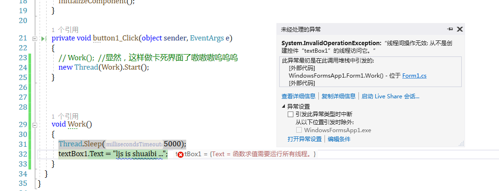

```c#
   private void button1_Click(object sender, EventArgs e)
        {
            // Work();  //显然，这样做卡死界面了嗷嗷嗷呜呜呜
            new Thread(Work).Start();
        }

        void Work()
        {
            Thread.Sleep(5000);
            UpdateUIMessage("ljs is shuaibi ...");
        }

        void UpdateUIMessage(string message)
        {
            Action action = () =>
            {
                textBox1.Text = message;
            }; 
            BeginInvoke(action); 
        }
```

#### 同步上下文 synchronization contexts

- 在system.componentmodel 下有一个抽象类：synchronizationcontext ，它使得thread marshaling 的得到泛化  啥意思嘞 就是将一个线程里数据的所有权交给另一个线程，就是把数据移交过去呗还能有啥意思啊

- 针对移动、桌面（wpf、uwp、winforms）等富客户端应用的api，他们都定义和实例化了synchronizationcontext的子类

  - 可以通过静态属性synchronizationcontext.current来获得（当运行在ui线程时）
  - 捕获该属性让你可以在稍后的时候从worker线程向ui线程发送数据

  ```c#
   public SynchronizationContext _SynchronizationContext;
          private void button1_Click(object sender, EventArgs e)
          {
              //为当前ui线程捕获 synchronization context
              _SynchronizationContext =SynchronizationContext.Current;
                  // Work();  //显然，这样做卡死界面了嗷嗷嗷呜呜呜
                  new Thread(Work).Start();
          }
  
          void Work()
          {
              Thread.Sleep(5000);//模拟耗时操作
              UpdateUIMessageMethod1("ljs is a shuaibi ");
              // UpdateUIMessage("ljs is shuaibi ...");
          }
  
          void UpdateUIMessageMethod1(string message)
          {
              //把委托 marshal 给 ui 线程
              _SynchronizationContext.Post(s => textBox1.Text = message, null);
  
              //调用post 就相当于 dispatcher或 control 上的 begininvoke 方法
          }
  ```

  - 调用post方法就相当于调用dispatch或control上面的begininvoke方法
  - 还有一个send方法，就等价于invoke方法

  #### 线程池 thread pool

  - 当开始一个线程的时候，将花费几百微妙来组织类似以下内容
    - 一个新的局部变量栈stack
  - 线程池就可以节省这种开销
    - 通过预先创建一个可循环使用线程的池来减少这一开销
  - 线程池对于高效的并行编程和细粒度并发是必不可少的
  - 他允许在不被线程启动的开销淹没的情况下运行短期操作

  #### 使用线程池线程需要注意一下几点

  - 不可以设置池线程的名称name
  - ***池线程都是后台线程***
  - 阻塞池线程可使性能降级
  - 你可以自由的更改池线程的优先级
    - 当他释放回池的时候优先级将还原为正常状态
  - 可以通过thread.currentthread.isthreadpoolthread属性来判断是否执行在池线程上

  #### 进入线程池

  - 最简单的、显式的在池线程运行代码的方式就是使用task.run

  ```c#
          Task.Run(() =>
          {
              Thread.Sleep(1000);
              Console.WriteLine("this is a threadpool ...");
          });
          Console.WriteLine("hey boy! i am a cowboy !");
          // Console.ReadKey(); 
          Thread.Sleep(1000);
  ```

#### 谁使用了线程池

- wcf/remoting / asp.net / asmx web services 应用服务器
- system.timers.times  /  system.threading .timer
- 并行编程结构
- backgroundworkder类 (现在很多余)
- 异步委托(现在很多余)

#### 线程池中的整洁

- 线程池提供了另一个功能，即确保临时超出 计算-bound 的工作不会导致cpu超额订阅
- cpu超额订阅：活跃的线程超过cpu的核数，操作系统就需要对线程进行时间切片
- 超额订阅对性能的影响很大，时间切片需要昂贵的上下文切换，并且可能使cpu缓存失效，而cpu缓存对于现代处理器的性能至关重要

#### clr的策略

- clr通过对任务排队并对其启动进行节流限制来避免线程池中的超额订阅
- 他首先运行尽可能多的并发任务（只要还有cpu核），然后通过爬山算法调整并发级别，并在特定方向上不断调整工作负载
  - 如果吞吐量提高，它将继续朝同一个方向（否则将反转）
- 这确保他始终追随最佳性能曲线，即时面对计算机上竞争的进程活动时也是如此
- 如果下面两点能够满足，那么clr的策略将发挥出最佳效果
  - 工作项大多是短时间运行的，（<250ms，或者理想情况下<100ms）因此clr有很多机会可进行测量和调整
  - 大部分时间都被阻塞的工作项不会主宰线程池

#### thread的问题

- 线程thread是用来创建并发concurrency的一种低级别工具，他有一些限制，尤其是
  - 虽然开始线程的时候可以方便的传入数据，但是当join的时候，很难从线程获得返回值。
    - 可能需要设置一些共享字段
    - 如果操作抛出异常，捕获和传播改异常都很麻烦
  - 无法告诉线程在结束时开始做另外的工作，你必须进行join操作（在进程中阻塞当前的线程）
- 很难使用较小的并发concurrent来组建大型的并发
- 导致了对手动同步的更大依赖以及随之而来的问题

#### Task class

- task可以很好的解决上述的问题
- task是一个相对高级的抽象，他代表了一个并发的操作concurrent
  - 该操作可能有thread支持，可能不由thread支持
- task是可组合的（可使用continuation把他们串成链）
  - task可以使用线程池来减少启动延迟
  - 使用taskcompletionsource，tasks可以利用回调的方式，在等待I/O绑定操作时完全避免线程

#### 开始一个task task.run

- 开启一个task最简单的办法就是使用task.run这个静态方法
  - 传入一个action委托即可
- ***task默认使用线程池，也就是后台线程***
  - 当主线程结束的时候，你创建的所有的tasks都会结束
- task.run返回一个task对象，可以使用他来监视其过程
  - ***在task.run之后，我们没有调用start，因为该方法创建的是热任务 hot task*** 
    - 可以通过task的构造函数创建冷任务 cold task ， 但是很少这么做
- 可以通过task的status属性来跟踪task的执行状态

#### Wait 等待

- ***调用task的wait方法会进行阻塞直到操作完成***
  - 相当于调用thread上的join方法

- ***实际上，task.wait我觉得就是让主线程，或者前台线程等待我们创建出来的这个task后台线程继续执行，在这个过程中，阻塞了线程，直至task完成任务***

```c#
        Action action = () =>
        {
            Thread.Sleep(3000);
            Console.WriteLine("Foo");
        };
        var task = Task.Run(action);
        Console.WriteLine(task.IsCompleted);
        task.Wait();
        Console.WriteLine(task.IsCompleted);
```
- wait也可以让你指定一个超时时间和一个取消令牌来提前结束等待

#### long-running tasks 长时间运行的任务

- 默认情况下，clr在线程池中运行task，这非常适合短时间运行的compute-bound类工作
- ***针对长时间运行的任务或者阻塞操作，你可以不采用线程池***

```c#
 var startNew = Task.Factory.StartNew(() =>
            {
                Thread.Sleep(3000);
                Console.WriteLine("Foo");
            },TaskCreationOptions.LongRunning);
            Console.ReadKey();
            Console.WriteLine(startNew.Status);
```

- ***如果同时运行多个long-running tasks 尤其是其中有处于阻塞状态的，那么性能将会受到很大的影响，这时有比taskcreationoptions.longrunning更好的方法***
  - ***如果任务是io-bound ，taskcompletionsource和异步函数可以让你用毁掉coninuations代替线程来实现并发***
  - ***如果任务是compute-bound,生产者/消费者队列允许你对任务的并发性进行限流，避免把其他线程和进程饿死***

#### task的返回值

- task有一个泛型子类叫做task<Tresult>，他允许发出一个返回值

- 使用func<Tresult>委托或兼容的lambda表达式来调用task.run就可以得到task<Tresult>

- ***随后，可以通过result属性来获得返回的结果***

  - 如果这个task还没有完成操作，访问result属性会阻塞该线程直到该task完成操作

  ```c#
    var task = Task.Run(() =>
              {
                  Console.WriteLine("Foo");
                  return 3; 
              });
              int result = task.Result;
              Console.WriteLine(result);
  ```

- task<Tresult>可以看作是一种所谓的“未来/许诺” future 、promise ，在它里面包裹着一个result ， 在稍后的时候就会变得可用

- 在ctp版本，task<Tresult>实际上叫做future<Tresult>

#### task的异常

- 与thread不一样，task可以很方便的传播异常
  - 如果你的task里面抛出了一个未处理的异常（故障）， 那么该异常就会重新被抛出给
    - 调用了wait的地方
    - 访问了task<TResult>的result属性的地方
- CLR将异常包裹在aggregateException里，以便在并行编程场景中发挥很好的作用
- 无需重新抛出异常，通过task的isfaulted和iscancled属性也可以检测出task是否发生了故障
  - 如果两个属性都返回了false，那么就是没有错误发生
  - 如果iscancled为true，那就说明一个operationCanceledException为该task抛出了
  - 如果isfaulted为true，那就说明另一个类型的异常被抛出了，而Exception属性也将指明错误

#### 异常与自治的task

- 自治的，设置完就不管了的task。就是指不通过调用wait（）方法、result属性或者continuation进行会合的任务
- 针对自治的task，需要像thread一样，显式的处理异常，避免发生“悄无声息”的故障
- 自治task上未处理的异常称为未观察到的异常

#### 未观察到的异常 

- 可以通过全局的taskscheduler.unobservedtaskexception来订阅未观察到的异常
- 关于什么是未观察到的异常，有一些细微的差别

#### Continuation

- ***一个continuation会对task说  ： 当你结束的时候，继续再做点其他的事***
- ***continuation通常是通过回调的方式实现的***
  - ***当操作一结束，就开始执行***

- ***在task上调用getawaiter会返回一个awaiter对象***
  - 他的oncompleted方法会告诉之前的task：当你结束/发生故障的时候要执行委托
- 可以将continuation附加到已经结束的task上面，此时continuation将会被安排立即执行

```c#
static void Main(string[] args)
        {
            Task<int> task = Task.Run(() =>
                Enumerable.Range(2, 3000000)
                    .Count(n => Enumerable.Range(2, (int)Math.Sqrt(n) - 1).All(i => n % i > 0)));

            var awaiter = task.GetAwaiter();
            awaiter.OnCompleted(() =>
            {
                Console.WriteLine(awaiter.GetResult());
            });

            Console.ReadKey(); 
        }
```

***实际上，我们是否可以通过这个方式作为不阻塞主线程并最后为ui更新数据的方式呢***

#### awaiter

- 任何可以暴露下列两个方法和一个属性的对象就是awaiter
  - oncompleted 
  - getresult
  - iscompleted 的bool属性
- 没有接口或者父类来统一这些成员
- 其中oncompleted是inotifycompletion的一部分

```c#
    private void button1_Click(object sender, EventArgs e)
        {
            Task<int> task = Task.Run(() =>
                Enumerable.Range(2, 3000000)
                    .Count(n => Enumerable.Range(2, (int)Math.Sqrt(n) - 1).All(i => n % i > 0)));
        
            var awaiter = task.GetAwaiter();
            awaiter.OnCompleted(() =>
            {
                textBox1.Text = awaiter.GetResult().ToString(); 
            });
```

#### 如果发生故障

- 如果之前的任务发生故障，那么当continuation代码调用awaiter.getresult的时候，异常就会被重新抛出
- 无需调用getresult，我们可以直接访问task的result属性
- 但调用getresult的好处是，如果task是发生故障了，那么异常会被直接抛出，而不是包裹在aggregateexception里面，这样的话catch块就简洁很多了

#### 非泛型 task

- 针对非泛型的task，getresult方法有一个void返回值，他就是用来重新抛出异常的

#### 同步上下文

- ***如果同步上下文出现了，那么oncompleted会自动捕获它，并将continuation提交到这个上下文中。这一点在富客户端应用中非常有用，因为他会把continuation放回到ui线程中***
- 如果编写的是一个库，则不希望出现上述行为，因为开销较大的ui线程切换应该在程序运行离开库的时候只发生一次，而不是出现在方法调用之间。所以，我们可以使用configureawait方法来避免这种行为

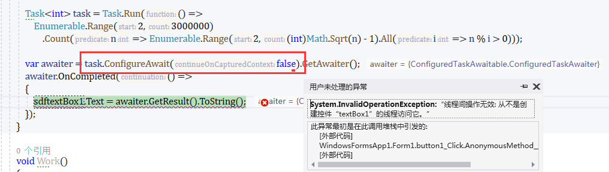

- 如果没有同步上下文出现，或者你使用的是configureawait(false)，那么continuation会运行在先前task的同一个线程上，从而避免不必要的开销

#### *ContinueWith*

- ***另一种附加continuation的方式是调用task的continuewith方法***

```c#
Task<int> task = Task.Run(() =>
                Enumerable.Range(2, 3000000)
                    .Count(n => Enumerable.Range(2, (int)Math.Sqrt(n) - 1).All(i => n % i > 0)));

            task.ContinueWith(task =>
            {
                int? result = task.Result;
                Console.WriteLine(result);
            });

            Console.ReadKey(); 
```

- continuewith本身返回一个task，他可以用他来附加更多的continuation

- 但是，必须直接处理aggregateexception

  - ***如果task发生故障，需要写额外的代码来吧continuation给封装（marshal）到ui应用上***

  ```c#
  Task<int> task = Task.Run(() =>
                  Enumerable.Range(2, 3000000)
                      .Count(n => Enumerable.Range(2, (int)Math.Sqrt(n) - 1).All(i => n % i > 0)));
              task.ContinueWith(a =>
              {
                  Console.WriteLine(a.Result);
                  UpdateUIMessageMethod1(a.Result.ToString());//marshal过程
              } );
  ```

  - 在非ui上下文中，若想让continuation和task执行在同一个线程上，必须指定taskcontinuationoptions.executesynchronously,否则他将弹回线程池

- continuewith对于并行编程来说非常有用

####  taskCompletionSource

- task.run 创建task
- 另一种方式就是用taskcompletionsource来创建task
- taskcompletionsource让你在稍后开始和结束的任意操作中创建task
  - 他会为你提供一个可手动执行的从属task
    - 指示操作何时结束或发生故障
- 他对io-bound类工作比较理想
  - 可以获得所有task的好处（传播值、异常、continuation）
  - 不需要在操作时阻塞线程

#### 使用taskcompletionsource

- 初始化一个实例即可
- 他有一个task属性可以返回一个task
- 该task完全由taskcompletionsource对象控制
- 调用任意一个方法都会给task发信号：
  - 完成、故障、取消
- 这些方法只能调用一次，如果再次调用
  - set会抛出异常
  - try会返回false

```c#
        static void Main(string[] args)
        {
            var taskCompletionSource = new TaskCompletionSource<int>();
            new Thread(() =>
            {
                Thread.Sleep(5000);
                taskCompletionSource.SetResult(42);
            })
            {
                IsBackground = true
            }.Start();

            var task = taskCompletionSource.Task;
            Console.WriteLine(task.Result);
        }
```

#### Taskcompletionsource真正魔力

- 它创建task，但并不占用线程

#### task.delay

- 相当于异步版本的thread.sleep

```c#
      static void Main(string[] args)
        {
            Task.Delay(5000).GetAwaiter().OnCompleted(()=>Console.WriteLine(42));
            Console.WriteLine(1);
            Task.Delay(5000).ContinueWith(task => Console.WriteLine(42));
            Console.ReadKey(); 
        }
```

#### 同步vs异步

- 同步操作会返回调用者之前完成它的工作
- 异步操作会返回调用者之后去做他的工作（大部分的）
  - 异步的方法更为少见，会启用并发，因为它的工作会与调用者并行执行
  - 异步方法通常很快就会返回到调用者，因此又叫非阻塞方法
- 目前见到的大部分的一部方法都是通用目的的
  - thread.start
  - task.run
  - 可以将continuation 附加到task的方法

### 异步编程

- 异步编程的原则是将长时间运行的函数写成异步的
- ***传统的做法是将长时间运行的函数写成同步的，然后从新的线程或task进行调用，从而按需引入并发***
- ***上述异步方式的不同之处在于，它是从长时间运行函数的内部启动并发。这有两点好处：***
  - io-bound 并发可不使用线程来实现。可提高可扩展性和执行效率
  - ***富客户端在worker线程会使用更少的代码，简化了线程安全性***

#### 异步编程的两种用途

- 编写高效处理大量并发io的应用程序（典型的：服务端应用程序）
  - 挑战并不是线程安全（因为共享状态通常是最小化的），而是执行效率
    - 特别的，每个网络请求并不会消耗一个线程
- 调用图 call graph
- ***在富客户端应用里简化线程安全***
  - 如果调用图中任何一个操作都是长时间运行的，那么整个call graph 必须运行在worker线程上，以保证ui的响应
    - 得到一个横跨多个方法的单一并发操作（粗粒度）
    - 需要为call graph 中的每个方法考虑线程安全
  - 异步的call graph，直到需要才开启一个线程，通常较浅（io-bound操作完全不需要）
    - ***其他的方法可以在ui线程执行，线程安全得到简化***
    - 并发的粒度适中
      - ***一连串小的并发操作，操作之间会弹回到ui线程***

#### 经验之谈

- 为了获得上述好处，建议下列操作使用异步编写：
  - io-bound和compute-bound操作
  - 执行超过50ms的操作
- 另一方面过细的粒度会损害性能，因为异步操作也有开销

#### 异步编程和continuation

- task非常适合异步编程，因为他们支持continuation（它对异步非常重要）
  - taskcompletionsource是实现底层io-bound异步方法的一种标准方式
- 对于compute-bound方法，task.run会初始化绑定线程的并发
  - 把task返回调用者，创建异步方法
  - 异步编程的区别：目标是在调用图较低的位置来这样做
    - ***富客户端应用中，高级方法可以保留在ui线程和访问控制以及共享状态上，不会出现线程安全问题***

```c#
        // static void Main(string[] args)
        // {
        //     // DisplayPrimeCounts();//同步写法
        //     Task.Run(DisplayPrimeCounts);//粗粒度异步写法
        //     Thread.Sleep(500);
        //     Console.WriteLine("lalala");
        //     Console.ReadKey();
        // }

        static void Main(string[] args)
        {
            Task.Run(DisplayPrimeCountsAsync);
            Console.ReadKey();
        }
        static void DisplayPrimeCounts()
        {
            for (int i = 0; i < 10; i++)
            {
                Console.WriteLine(GetPrimesCount(i * 1000000 + 2, 1000000) + "primes between " + (i + 1000000) + "and"+
                                  ((i+1)*1000000-1));
            }
            Console.WriteLine("done!");
        }
        
        static void DisplayPrimeCountsAsync()
        {
            for (int i = 0; i < 10; i++)
            {
                var taskAwaiter = GetPrimesCountAsync(i * 1000000 + 2, 1000000).GetAwaiter();
                taskAwaiter.OnCompleted(() =>
                {
                    Console.WriteLine(taskAwaiter.GetResult()+ "primes between " + (i + 1000000) + "and" +
                                      ((i + 1) * 1000000 - 1));
                });
            }
            Console.WriteLine("done!");
        }
        static int GetPrimesCount(int start, int count)
        {
            return ParallelEnumerable.Range(start, count)
                .Count(n => Enumerable.Range(2, (int) Math.Sqrt(n) - 1).All(i => n % i > 0));
        }

        static Task<int> GetPrimesCountAsync(int start, int count)
        {
            return Task.FromResult(ParallelEnumerable.Range(start, count)
                .Count(n => Enumerable.Range(2, (int)Math.Sqrt(n) - 1).All(i => n % i > 0)));
        }
```

#### 语言对异步的支持非常重要

- 需要对task的执行序列化
  - ***例如task b 依赖于 task a 的执行结果***
  - 为此，必须在continuation内部触发下一次循环

- 很麻烦 因为我们决定引入 async 和await关键字
  - 对于不想复杂的实现异步非常重要
- 命令式循环结构不要和continuation混合在一起，因为他们依赖于当前本地状态
- 另一个实现，函数式写法（linq查询）, 他也是响应式编程（Rx）的基础

#### 异步函数

- async和await关键字可以让你写出和同步代码一样简洁且结构相同的异步代码

#### await

- ***await关键字简化了附加continuation的过程***
- 他的作用相当于 

```c#
var awaiter = expression.GetAwaiter() ; 
awaiter.OnCompleted(()=>
                    {
                        var result = awaiter.GetResult() ; 
                        statement(s) ; 
                    })
```

#### async修饰符

- async修饰符会让编译器把await当做关键字而不是标识符（c# 5 以前可能会使用await作为标识符）
- async修饰符智能应用于方法（包括lambda表达式）
  - 该方法可以返回void / task / task<TResult>
- ***async修饰符对方法的签名或public元数据没有影响（和uisafe一样），他只会影响方法内部***
  - 在接口里使用async是没有意义的
  - 使用async来重载非async方法确实合法的
- ***使用async修饰符的方法就是异步函数***

```c#
  static async Task Main(string[] args)
        {
            await DisplayPrimeCountsAsync(); 
        }

        static async Task DisplayPrimeCountsAsync()
        {
            for (int i = 0; i < 10; i++)
            {
                Console.WriteLine(await GetPrimesCountAsync(i * 1000000 + 2, 1000000) + "primes between " + (i + 1000000) + "and" +
                                                                             ((i + 1) * 1000000 - 1));
            }
            Console.WriteLine("Done!");
        }

        static async Task<int> GetPrimesCountAsync(int start , int count)
        {
            return await Task.FromResult(ParallelEnumerable.Range(start, count)
                .Count(n => Enumerable.Range(2, (int)Math.Sqrt(n) - 1).All(i => n % i > 0)));
        }
```


#### 异步方法如何执行

- 遇到await表达式，执行（正常情况下）会返回调用者
  - 就像iterator里面的yield return
  - 在返回前，运行时会附加一个continuation到await的task
    - 为保证task结束时，执行会跳回原方法，从停止的地方继续执行
  - 如果发生故障，那么异常会被重新抛出
  - 如果一切正常，那么他的返回值就会赋给await表达式   —实际上就是跟那个awaiter 和 awaiter.oncompleted 是一样的，执行完的得到返回值继续向下执行

#### 可以await什么

- await的表达式通常是一个task
- 也可以满足以下条件的任意对象
  - 有getawaiter方法，返回一个awaiter
  - 返回适当类型的getresult方法
  - 一个bool类型的iscompleted属性

#### 捕获本地状态

- await表达式最牛的地方在于他几乎可以出现在任何地方
- 特别的，在异步方法内，await表达式可以替换任何表达式
  - 除了lock表达式和unsafe上下文

#### await之后在哪个线程上执行

- 在await表达式之后，编译器依赖于continuation（通过awaiter模式）来继续执行
- ***如果在富客户端应用的ui线程上，同步上下文会保证后续是在原线程上执行***
- 否则，就会在task结束的线程上继续执行

```c#
  private void button2_Click(object sender, EventArgs e)
        {
            // Go();
            GoAsync();
        }

        async void GoAsync()
        {
            button2.Enabled = false;
            for (int i = 1; i < 5; i++)
            {
                textBox2.Text += await GetPrimesCountAsync(i * 1000000, 1000000) + " primes between " + " and " +
                                 ((i + 1) * 1000000 - 1) +
                                 Environment.NewLine;
            }
            button2.Enabled = true; 
        }

         Task<int> GetPrimesCountAsync(int start, int count)
        {
            return  Task.Run(() =>
                ParallelEnumerable.Range(start, count)
                    .Count(n => Enumerable.Range(2, (int) Math.Sqrt(n) - 1).All(i => n % i > 0)));
        }
```

#### ***UI 上的await***

- ***只有getprimescountasync是在worker线程上运行的***
- go中的代码会“租用”ui线程上的时间
- 可以说：Go是在消息循环中伪并发的执行
  - ***也就是说：它和ui线程处理的其他时间是穿插执行的***
  - 因为这种伪并发，唯一可能发生抢占的时刻就是在await期间
    - 这其实简化了线程安全，防止重新进入即可
- 这种并发发生在调用栈比较浅的地方（rask.run调用的代码里）
- 为了从该模型中获益，真正的并发代码要避免访问共享状态或ui控件

```c#
   private void button2_Click(object sender, EventArgs e)
        {
            // Go();
            GoAsync();
        }

        async void GoAsync()
        {
            button2.Enabled = false;
            for (int i = 1; i < 5; i++)
            {
                textBox2.Text += await GetPrimesCountAsync(i * 1000000, 1000000) + " primes between " + " and " +
                                 ((i + 1) * 1000000 - 1) +
                                 Environment.NewLine;
            }
            button2.Enabled = true; 
        }

         Task<int> GetPrimesCountAsync(int start, int count)
        {
            return  Task.Run(() =>
                ParallelEnumerable.Range(start, count)
                    .Count(n => Enumerable.Range(2, (int) Math.Sqrt(n) - 1).All(i => n % i > 0)));
        }
```

- ***因为在ui线程上await ， continuation将发送到同步上下文中，该同步上下文通过消息循环执行，来保证整个go方法伪并发的在ui线程上运行***

#### 和粗粒度的并发相比

- 整个同步调用图都在worker线程上
- 必须在代码中到处使用dispatcher.begininvoke 
- 引入了race condition
- 循环本省在worker线程上
- 若实现取消或者过程报告，会使得线程安全问题更容易发生，在方法中新添加任何代码也是同样的效果

#### 编写异步函数

- 对于任何异步函数，你可以使用task代替void作为返回类型，让该方法称为更有效的异步（可以进行await）

```c#
  static async Task Main(string[] args)
        {
            // PrintAnswerToLife();  //如果不使用异步关键字，会导致并行执行  ， 又由于是task线程池，是后台进程，前台进程执行完毕就关了，所以程序还没输出42就停了
            await PrintAnswerToLife(); 
        }

        static async Task PrintAnswerToLife()
        {
            await Task.Delay(5000);
            int answer = 21 * 2;
            Console.WriteLine(answer); 
        }
```

- 并不需要在方法体中显式的返回task。编译器会生成一个task（当方法完成或者发生异常时），这使得创建异步的调用链非常方便啊
- 编译器会返回task的异步函数来进行扩展，使其成为当发送信号或发生故障时使用taskcompletionsource来创建task代码
- 因此，当返回task的异步方法结束的时候，执行就会跳回到对它进行await的地方（通过continuation）

#### 编写异步函数在富客户端场景下

- 富客户端场景下，执行在此刻会跳回到ui线程（如果目前不在ui线程的话）
- 否则，就在continuation返回的任意线程上继续运行
- 这意味着，在异步调用图中向上冒泡的时候，不会发生延迟成本，除非是ui线程启动的第一次反弹

#### 返回task<Tresult>

- 如果方法体返回tresult ， 那么异步方法就可以返回task<Tresult>
- 其原理就是给taskcompletionsource发送的信号带有值，而不是null
- 与同步编程很相似，是故意这样设计的

#### *C#中如何设计异步函数*

- 以同步的方式编写函数
- 使用异步调用来代替同步调用，并且进行await
- 除了顶层方法外（UI控件的event handler），把你的方法的返回类型升级为task或task<TResult>,这样他们就可以进行await了

#### 编译器能对异步函数生成task意味着什么

- 大多数情况下，你只需要在初始化io-bound并发的底层方法里显式的初始化taskcompletionsource，这种情况很少见
- 针对初始化compute-bound的并发方法，你可以使用task.run来创建task

```c#
 class Program
    {
        static async Task Main(string[] args)
        {
            await Go(); 
        }

        static async Task Go()
        {
            var printAnswerToLife = PrintAnswerToLife();
            await printAnswerToLife;
            Console.WriteLine("Done!");
        }

        static async Task PrintAnswerToLife()
        {
            var answerToLife = GetAnswerToLife();
            var toLife = await answerToLife;
            Console.WriteLine(toLife);
        }

        static async Task<int> GetAnswerToLife()
        {
            var delay = Task.Delay(5000);
            await delay;
            int answer = 21 * 2;
            return answer; 
        }
    }
```

#### 异步调用图执行

- 整个执行与同步例子中调用图的顺序一样，因为我们对每个异步函数的调用都进行了await
- 在调用图中创建了一个没有并行和重叠的连续流
- 每个await在执行中都创建了一个间隙，在间隙后，程序可以从中断处恢复执行

```c#
private void button3_Click(object sender, EventArgs e)
        {
            Go1();
        }

         async void Go1()
        {
            var printAnswerToLife = PrintAnswerToLife();
            await printAnswerToLife;
            textBox3.Text = "Done!"; 
        }

         async Task PrintAnswerToLife()
        {
            var answerToLife = GetAnswerToLife();
            var toLife = await answerToLife;
            textBox3.Text = toLife.ToString(); 
        }

         async Task<int> GetAnswerToLife()
        {
            var delay = Task.Delay(5000);
            await delay;
            int answer = 21 * 2;
            return answer;
        }
```

#### 并行Parallelism

- 不适用await来调用异步函数会导致并行执行的发生
  - 确实也能满足保持ui响应的并发要求
- 同样，可以并行跑两个操作

#### 异步lambda表达式

- 匿名方法（包括lambda表达式），通过使用async也可以变成异步方法

```c#
   static async  Task Main(string[] args)
        {
            Func<Task> func = async () =>
            {
                await Task.Delay(1000);
                Console.WriteLine("Foo");
            };

            await NamedMethod();
            await func();
        }

        static async Task NamedMethod()
        {
            await Task.Delay(1000);
            Console.WriteLine("Foo1");
        }
```

- 调用方式也是一样样的
- 附加 event handler 的时候也可以使用异步lambda表达式

```c#
    // this.button3.Click += async (sender,args) =>
            // {
            //     await Task.Delay(1000);
            //     button3.Text = "comeon baby"; 
            // };
```

- 也可以返回task<TResult>

```c#
   Func<Task<int>> func = async () =>
            {
                await Task.Delay(1000);
                Console.WriteLine("Foo");
                return 123; 
            };
```

#### 发布异常

- 富客户端应用通常依赖于集中的异常处理事件来处理ui线程上未捕获的异常
  - 例如wpf中的application.dispatcherunhandledexception
  - asp.net core 中定制 exceptionfilterattribute也是差不多的效果
- 其内部原理就是：通过在它们自己的try/catch块来调用ui事件（在asp.net core里就是页面处理方法的管道）
- 顶层的异步方法会使事情更加复杂 顶层的异步方法由于已经没有方法让他进行await了，所以他会使用void 而不是task作为返回类型 
- 在抛出异常后无法被消息循环中的catch捕获
- 为了缓解该问题，asyncvoidmethodbuilder会捕获未处理的异常（在返回void的异步方法里） ， 并把他们发布到同步上下文（如果出现的话），以确保全局异常处理事件能够触发

#### 注意

- 编译器只会把上述逻辑应用于返回类型为void的一部方法
- 如果buttonclick的返回类型是task，那么未处理的异常将导致结果task出错，然后task将无处可去（导致为观察到的异常）

- 无论在await前面还是后面跑出异常，都没有区别

- 如果出现同步上下文，返回值为void的异常会被发布到同步上下文中，如果没有出现，异常将会在线程池上传播，从而导致终止应用程序

#### operationstarted 和 operationcompleted

- 如果存在同步上下文，返回void的异步函数也会进入函数时调用其operationstarted方法，在函数完成时调用其operationcompleted方法

#### 优化同步完成

- 异步函数可以在await之前就返回

```c#
        static async  Task Main(string[] args)
        {
            Console.WriteLine(await GetWebPageAsync("http://oreilly.com"));
        }

        static Dictionary<string ,string > _cache = new Dictionary<string, string>();
        private static async Task<string> GetWebPageAsync(string uri)
        {
            string html;
            if (_cache.TryGetValue(uri,out html))
            {
                return html;
            }
            return _cache[uri] = await new WebClient().DownloadStringTaskAsync(uri); 
        }
```

- 编译器是通过检查awaiter上的iscompleted属性来实现这个优化的，也就是说，无论何时await收到时候，都会检查
- 如果是同步完成了，编译器就会释放可短路的continuation代码

- 编写完全没有await的异步方法也是合法的，但是编译器会发出警告
- 这类方法可以用于重载virtual/abstract方法
- 另一种可以达到相同结果的方式是，使用task.fromresult，他会返回一个已经设置好信号的task
- 如果从ui线程上调用，那么getwebpageasync方法是隐式线程安全的。可以连续多次调用它（从而启动多个并发下载），并且不需要lock来保护缓存
- 有一种简单的方法可以实现这一点，而不必求助于lock或信令结构。我们创建一个futures （task<string>）的缓存，而不是字符串的缓存，注意并没有async

#### 取消 cancellationToken 和 cancellationTokenSource

#### 获取cancellationToken

- 先实例化cancellationtokensource
  - var cancelsource = new cancellationTokensource() ; 
- 这回暴露一个token属性，他会返回一个cancellationtoken ，所以我们可以这样调用
  - task foo = Foo(cancelsource.token) … … cancelsource.cancel()

#### Delay

- clr里大部分异步方法都支持cancellationtoken ， 包括delay方法

#### 其他

- 事实上，可以在构造cancellationtokensource时指定一个时间间隔，以便在一段时间后启动取消。它对于实现超时非常有用，无论是同步还是异步
- cancellationtoken这个struct提供了一个register方法，他可以让你注册一个回调委托，这个委托会在取消时触发，它会返回一个对象，这个对象在取消注册时可以被dispose掉 

#### 进度报告

- 异步操作在运行当中反馈实时进度，解决办法是向异步方法中闯入一个action委托，当进度变化时触发方法调用

- iprogress<T> 和progress<T>
- progress<T>的一个构造函数可以接受action<T>类型的委托

#### Task组合器

- 异步函数有一个让其保持一致的协议（可以一致的返回task），让其保持良好的结果，可以使用以及编写task组合器，也就是可以组合task，但是不关心task具体做什么的函数
- CLR提供了两个task组合器：
  - task.whenany
  - task.whenall

#### WhenAny

- 当一组task中任何一个task完成时，task.whenany会返回完成的task
- 因为task.whenany本身就返回一个task，我们对他进行await，就会返回最先完成的task
- 事实上，whenany很适合为不支持超时或取消的操作添加这些功能

#### whenall

- 当传给他的所有的task都完成后，task.whenall会返回一个task

